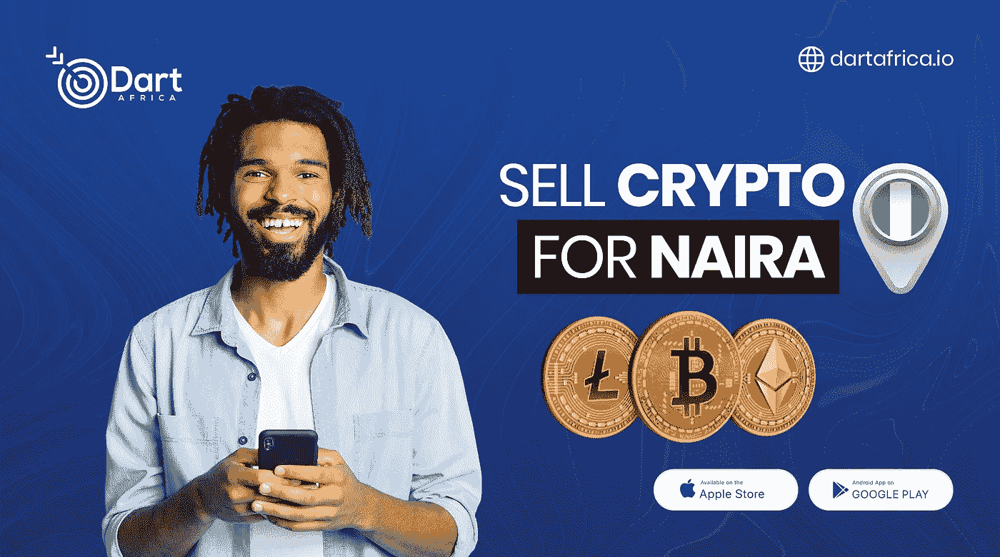

# 如何在币安把狗屎硬币换成 USDT

> 原文：<https://medium.com/coinmonks/how-to-swap-shitcoin-for-usdt-on-binance-8fb73a615367?source=collection_archive---------47----------------------->

什么是屎币？

Shitcoins 指的是几乎没有价值的加密货币，或者是像 meme coin 一样没有特定创作目的的加密硬币。它有时被用来描述比特币被主流接受后开发的替代货币或加密货币。

shitcoins 的低价值主要是由于低投资周转率，因为投资者知道硬币不是善意制造的，或者没有明确的野心或硬币旨在解决的问题，有时 shitcoins 的价格仅仅是基于投机，这样的投资者不准备将他们的资金托付给硬币。

如果你有一枚 Shitcoin，你想把它转换成一枚像 USDT 那样更稳定的硬币，如果 Shitcoin 在币安网络上上市并且可以交易，你可以很容易地在币安做到这一点。要把你的狗屎硬币换成币安的 USDT，你需要通过币安转换；币安网络上的一项服务，用户可以在几秒钟内将他们持有的加密货币转换成另一种货币，前提是这些货币在币安上市并可交易。您可以在网站和币安应用程序上访问币安转换。

需要四个简单的步骤来转换你的 shitcoins，所有这些都可以在几秒钟内完成。

# 如何转换

**步骤 1:** 通过币安网站导航至币安 Convert。进入首页左上方的*交易*，选择*转换*。

如果您正在使用币安应用程序，请选择屏幕底部中间的选项“ *Trade* ，然后点击手机屏幕左上角的“ *Convert* ”。

**第二步:**选择你拥有的 Shitcoin 和你想要购买的 token(USDT)。你可以输入你想使用的屎币的数量(在顶部)或者你想获得的 USDT 的数量(在底部)。

**第三步:**点击*预览转换*。将显示交易的报价。由于价格不断变化，您将有 5 秒的倒计时时间来批准显示的报价并继续交易，如果 5 秒到期，请单击“*刷新*按钮获取新报价。

**第四步:**点击*转换*。交易不到一秒钟，你就会在你的币安现货钱包里看到你买的密码(USDT)。

**飞镖非洲；Naira 和 Cedis 的最佳加密销售平台**

Dart Africa 是一个本地加密货币交易平台，允许您将加密资产兑换成本地货币现金。使用 Dart Africa 就像将您的商品出售给友好的社区商店以换取现金，您只需将您的加密货币发送给他们，他们就会根据商定的汇率向您发送资金。

Dart Africa 与大多数本地交易所不同，因为他们似乎总是在加密交易所市场提供最好的汇率，因此他们的客户总是从他们的加密销售中获得良好的回报。您可以通过检查他们平台上的费率计算器功能来亲自确认这一说法。

加上其有利的汇率，Dart Africa 还确保其客户在将加密货币发送到所提供的加密钱包的几分钟内收到加密货币销售的付款。Dart Africa 声称拥有一个自动化系统，可以快速交付付款。

注意；当您向 Dart Africa 出售加密货币时，您将根据您发送到他们钱包中的加密货币金额获得报酬，而不是您在交易描述中输入的金额，您发送的实际加密资产可能会更高或更低，这无关紧要。

**可以在 Dart Africa 兑换的加密货币**

*   比特币
*   以太坊
*   莱特币
*   Dogecoin
*   BUSD
*   泰达币
*   USDC 等

## **如何在 Dart Africa 上销售加密货币；**

–要在 Dart Africa 上销售，您需要拥有他们的帐户。[使用您正确的凭证创建一个账户](https://dartafrica.io/register)，或者[登录](https://dartafrica.io/login)您的账户(如果您已经有一个的话)。

–首次登录您的帐户时，系统会要求您创建一个 PIN。PIN 将用于验证从您的帐户提款。

–您会在屏幕左侧看到一个导航菜单，点击“出售硬币”并输入您想要出售的加密货币的详细信息。将显示加密的汇率。

–点击开始交易，系统将自动创建一个带有条形码的钱包地址，供您发送加密货币。

–在付款后，点击取款并添加您的帐户详细信息，作为您的 Dart Africa 帐户的支出，将资金发送到您的银行帐户。

> 加入 Coinmonks [Telegram group](https://t.me/joinchat/Trz8jaxd6xEsBI4p) 并了解加密交易和投资