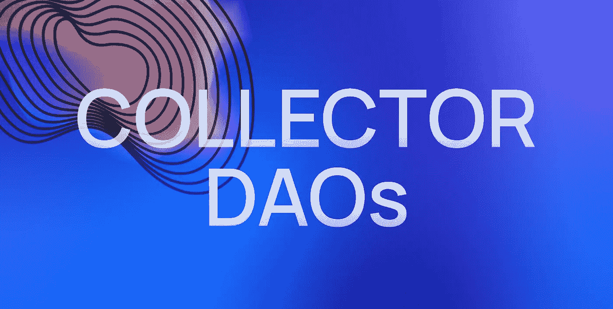
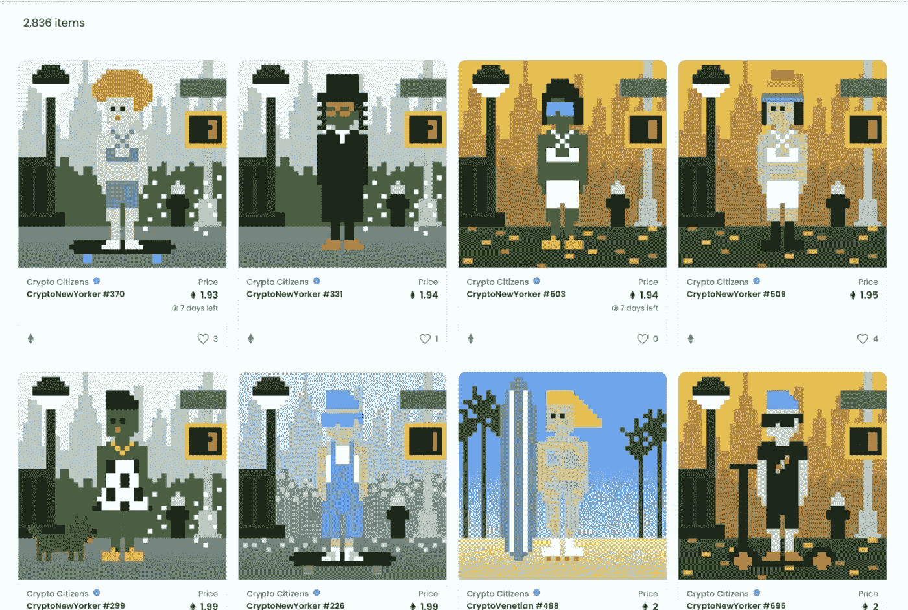
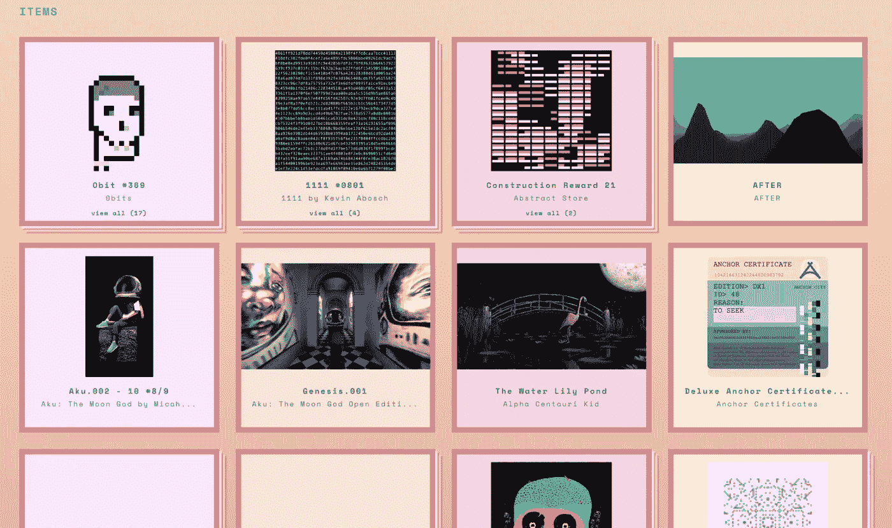
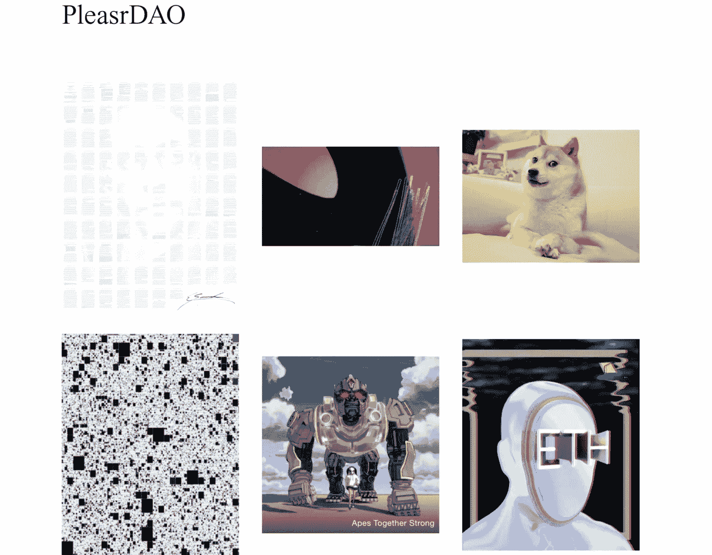
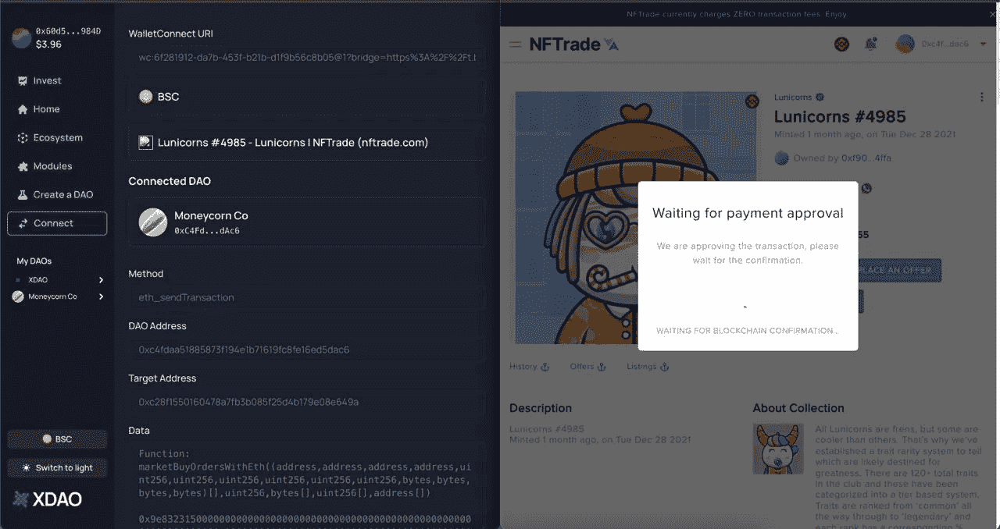

# 如何参加收藏家道运动

> 原文：<https://medium.com/coinmonks/how-to-take-part-in-the-collector-dao-movement-6bc540153c7f?source=collection_archive---------5----------------------->

收藏刀是收藏、出售和发行非正规金融工具的一种刀。随着 NFT 越来越受欢迎和被采用，它们已经成为加密投资领域的一大部分。顾名思义，收藏家 DAOs 的主要目标是从选定的收藏或艺术家那里获得 NFT。

本文将分为两个主要部分。第一部分将致力于现有的收藏家，以了解他们的使命和价值。在第二部分中，将描述创建自己的收集器 DAO 的过程。

TNFTs 和 DAOs 之间的联系是密码学中两个最流行的现象之间的联系。DAO 是数字空间中的一种社会组织形式，有助于分发加密资产，而 NFT 是加密社区中有大量需求的数字资产。此外，NFT 体现了价值，并将它们从现实生活转移到数字空间。

许多保守的经济学家认为 NFT 没有价值，但这是非常短视的。NFT 反映了在数字空间中拥有一些反映对人们来说重要的价值观的需求，并且是创意经济的一个非常方便的工具，允许创作者轻松地将他们的作品或著名的模因货币化，以及通过交易它们来赚钱。任何绘画、录音、视频或其他数字艺术都可以很容易地用 NFT 的形式来标记。DAO 允许您在其成员的广大受众之间共享 NFT 的所有权。

下面是几个最近几个月成立的收藏家道，在[coopahropora](https://coopahtroopa.mirror.xyz/_EDyn4cs9tDoOxNGZLfKL7JjLo5rGkkEfRa_a-6VEWw)的报道中被重点提及。其中一些 Dao，如 BAYC 和 Bright Moments，也被列入 Coopahtroopa 的社交 Dao 名单。这是因为 NFTs 的大量采用，鼓励一些收藏家 Dao 成为社会 Dao，因为他们有一个大的社区和可衡量的社会影响。让我们来看看四个藏刀案例:

*   [无聊猿游艇俱乐部](https://boredapeyachtclub.com/#/)
*   [亮时刻道](https://www.brightmoments.io/)(快速公交)
*   [火烈鸟](https://docs.flamingodao.xyz/)
*   [请讲](https://pleasr.org/) (PEEPS)

**无聊猿游艇俱乐部**是 NFTs 领域最受欢迎的项目之一。在过去的几个月里，该品牌成为顶级加密媒体的头条新闻，并以 NFT 的形式收集了 10，000 只猿作为基础。2021 年 9 月，由 BAYC 创作的 101 幅 NFT 在[苏富比拍卖行](https://www.coindesk.com/markets/2021/09/09/sothebys-auction-of-101-bored-ape-nfts-fetches-24m-smashing-estimates/)以 2440 万美元售出。该项目于 2021 年 4 月启动，1 枚 ape 的初始价格非常低——只有 0.08 ETH。BAYC 的成功不可避免地推动了基于动物的 NFT 的模仿收集。虽然 BAYC 不仅仅是一个 NFT 的集合，它是一个 DAO，在 BAYC 社区运作的地方有一个不和谐的频道。DAO 会员和 BAYC 持有人以 NFT 的形式获得额外的奖励，其中一些已经分发出去了。MAYC 收藏包括 20，000 只突变猿和 10，000 只狗。BAYC DAO 会员资格对变种人和 BAYC 持有者(但不是狗收藏的持有者)都有效，总共有 30，000 个可能的会员。这种会员货币化的主要渠道仍然是在市场上销售 NFT 和获得 drops 的能力。

**亮时刻刀**也在[coopahroopa](https://coopahtroopa.mirror.xyz/_EDyn4cs9tDoOxNGZLfKL7JjLo5rGkkEfRa_a-6VEWw)的报道中脱颖而出，作为一款社会刀跨界。根据其代表的评论,“光辉时刻”应该团结艺术家、开发商和道专家。这把刀在洛杉矶威尼斯海滩有自己的画廊。道的治理权属于 BRT 令牌持有者。40 个创始成员每人得到 25000 元人民币，这意味着 100 万元人民币属于道创始人。剩余的 900 万 BRT 将用于奖励 NFT 创作者和其他道成员的活动。这个道的成员都是名人，包括像史努比·道格和帕丽斯·希尔顿这样家喻户晓的名人，洛杉矶的画廊以塞斯·戈尔茨坦和路易·瑞安为创始人。这个 DAO 背后的愿景是创建一个线下画廊系统，展示 NFTs，并奖励 DAO 成员和与数字艺术相关的有用的社会活动。

Crypto Citizens collection by Bright Moments DAO

收藏刀成功的另一个案例是**火烈鸟刀**。该项目的想法是让其成员有能力在 NFT 投资领域轻松行事。根据火烈鸟网站上的[信息](https://docs.flamingodao.xyz/)，道会员可以将他们在的财产进行细分:“购买的非艺术作品可以被借出、持有、在数字艺术画廊展示，或者在其他 DeFi 平台上用作抵押品”。这个 DAO 的会员资格对美国认可的投资者开放，会员总数限制在 100 人以内。申请人必须购买 10 万到 90 万的火烈鸟单位；100，000 个 Flamingo 单位授予 1%的投票权。目前购买的火烈鸟总量价值 7,920 ETH。

Gallery of the Flamingo DAO

**Pleasr DAO** 始于 DeFi 夏季，由 Uniswap 社区成员创建，用于购买 Uniswap V3 [推广视频](https://twitter.com/Uniswap/status/1374069664297406467)的 NFT。NFT 是由艺术家@ pplpleasr1 创作的。DAO 有大约 74 名成员，其运作方式就像是 NFT 投资基金和制作工作室的结合体。它以拥有武堂帮专辑[【从前在少林】](https://cointelegraph.com/news/pleasrdao-adds-4m-og-nft-wu-tang-clan-album-to-its-collection)和 [Doge Meme NFT](https://nftevening.com/iconic-doge-meme-nft-smashes-record-sells-for-4-million/) 而闻名，并拥有 It 和密码领域的著名和成功成员，如 Alex Svanevik(南森)、Leighton Cusack (PoolTogether)、Andrew Kang(机制资本)、Tarun Chitra(挑战网络)、Leo Cheng(奶油金融)和 Calvin Liu(复合)。

Gallery of the PleasrDAO

当然，以上案例并不是唯一的收藏家道斯。这方面还有其他受欢迎的项目，包括[弯弯曲曲道](https://squiggledao.com/)、[指纹道](https://fingerprintsdao.xyz/)、[鲸鱼](https://whale.me/)、[博物馆](https://muse0.xyz/)、[赫斯托里道](https://foundation.app/@herstoryDAO)、[比茨道](https://www.beetsdao.com/)、[杰尼道](https://jennynft.io/)、[米比茨道](https://www.meebitsdao.world/)和小妖精。

尽管如此，通过观察这些 Dao，您可以了解收集器 Dao 做什么以及它们是如何工作的。根据参与人数的多少，按规模可以分为两种:有的是几十人的小组织，有的像 BAYC，Bright Moments DAO，都有上千人的参与。

每个收藏家 Dao 的成功都与社区和媒体曝光密切相关，后者在更大的社区中更广泛。这是一个大型社区，对知名品牌的吸引力和名人的参与确保了上述项目的成功。以这样或那样的方式，这些组织的工作结合了投资基金和制片厂的元素，投资基金将获得的利润分配给成员。

就 XDAO 向其用户提供的商业解决方案而言，我们建议考虑创建一个收藏家 DAO，特别是如果您的企业处于创意经济中，并且您已经有媒体报道、强大的社区或两者兼而有之。这一领域的现有法规已经允许通过 Dao 合法分配创作者活动的收入。

# 在 XDAO 上创建一个收集器 DAO

XDAO 允许你创建一个拥有无限参与者和投资者的 DAO。一旦你准备好了收集者的想法，例如，收集所有可爱的涂鸦 NFT，你可以去[https://xdao.app/](https://xdao.app/)，选择你的刀将购买 NFT 的区块链(XDAO 目前支持以太坊，多边形，BSC 和其他 7 个区块链)并创建一个刀。

为你的收藏家道筹集资金，创建一个 LP 代币，人们将购买以便有一个份额。所有购买 LP 代币的钱将在道中累积，并在以后用于获得想要的 NFT。

一旦你的刀有足够的钱购买 NFTs，就去 [Opensea](https://opensea.io/) 、 [Rarible](https://rarible.com/) 、[Looks Rarible](https://looksrare.org/)、[Super Rarible](https://superrare.com/)、 [Fandefi](https://app.fandefi.com/) 或任何其他 NFT 平台，通过 XDAO Connect 连接到你的刀，购买你的 NFTs！

NFT purchasing on behalf of a DAO

在您的提案成功通过并获得您的 NFT 后，所有 LP 持有人将有权获得与其在 DAO 中的份额相等的此 NFT。

如果你想卖掉这个 NFT，你需要采取和购买它完全一样的行动。当 NFT 被卖掉后，阿刀和所有的 LP 持有者都会从中获利！

要获得最新消息，请关注 XDAO:

[推特](https://twitter.com/xdaoapp) | [电报](https://t.me/xdao_eng) | [YouTube](https://youtube.com/channel/UCC58I-ghebVRepbwVsyJnCQ) | [不和](https://discord.gg/XAa64ABVd7) | [Instagram](https://www.instagram.com/xdaoapp/)

> 加入 Coinmonks [电报频道](https://t.me/coincodecap)和 [Youtube 频道](https://www.youtube.com/c/coinmonks/videos)了解加密交易和投资

## 另外，阅读

*   [买 PancakeSwap(蛋糕)](https://coincodecap.com/buy-pancakeswap)|[matrix export Review](https://coincodecap.com/matrixport-review)
*   [最佳免费加密信号](https://coincodecap.com/free-crypto-signals) | [YoBit 评论](/coinmonks/yobit-review-175464162c62) | [Bitbns 评论](/coinmonks/bitbns-review-38256a07e161)
*   [OKEx 审查](/coinmonks/okex-review-6b369304110f) | [Kucoin 交易机器人](/coinmonks/kucoin-trading-bot-automate-your-trades-8cf0ca2138e0) | [期货交易机器人](/coinmonks/futures-trading-bots-5a282ccee3f5)
*   [AscendEx Staking](https://coincodecap.com/ascendex-staking)|[Bot Ocean Review](https://coincodecap.com/bot-ocean-review)|[最佳比特币钱包](https://coincodecap.com/bitcoin-wallets-india)
*   [霍比审核](https://coincodecap.com/huobi-review) | [OKEx 保证金交易](https://coincodecap.com/okex-margin-trading) | [期货交易](https://coincodecap.com/futures-trading)
*   [比特币基地赌注](https://coincodecap.com/coinbase-staking) | [热点评论](/coinmonks/hotbit-review-cd5bec41dafb) | [库币评论](https://coincodecap.com/kucoin-review)
*   购买 Dogecoin 的 7 种最佳方式
*   [iTop VPN 审查](https://coincodecap.com/itop-vpn-review) | [曼陀罗交易所审查](https://coincodecap.com/mandala-exchange-review)
*   [比特币基地 vs 瓦济克斯](https://coincodecap.com/coinbase-vs-wazirx) | [比特鲁点评](https://coincodecap.com/bitrue-review) | [波洛涅克斯 vs 比特鲁](https://coincodecap.com/poloniex-vs-bittrex)
*   [美国最佳加密交易机器人](https://coincodecap.com/crypto-trading-bots-in-the-us) | [经常性评论](https://coincodecap.com/changelly-review)
*   [A-Ads 审查](https://coincodecap.com/a-ads-review) | [Bingbon 审查](https://coincodecap.com/bingbon-review) | [Mudrex 投资](https://coincodecap.com/mudrex-invest-review-the-best-way-to-invest-in-crypto)