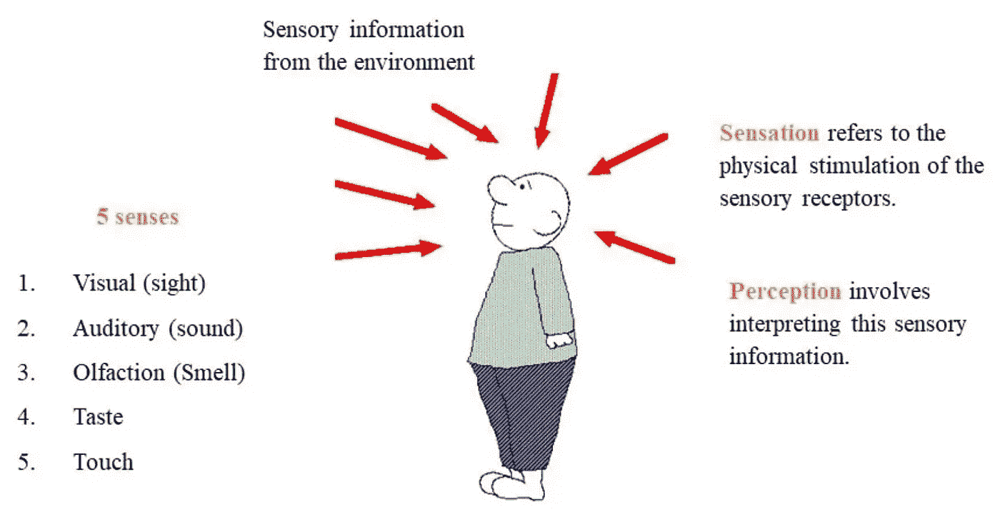
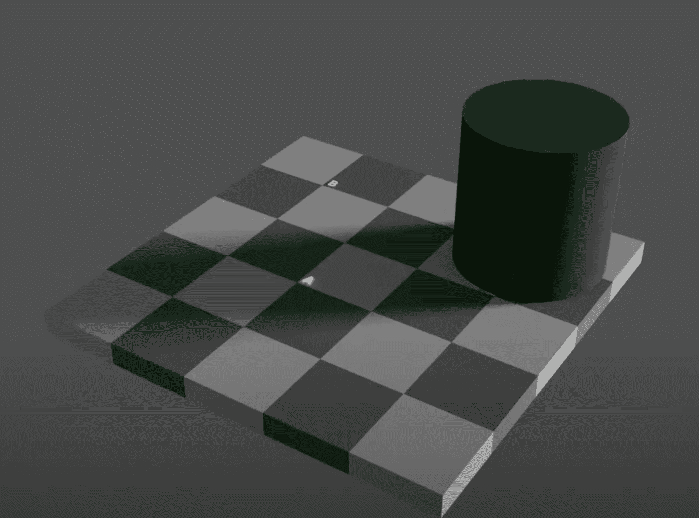
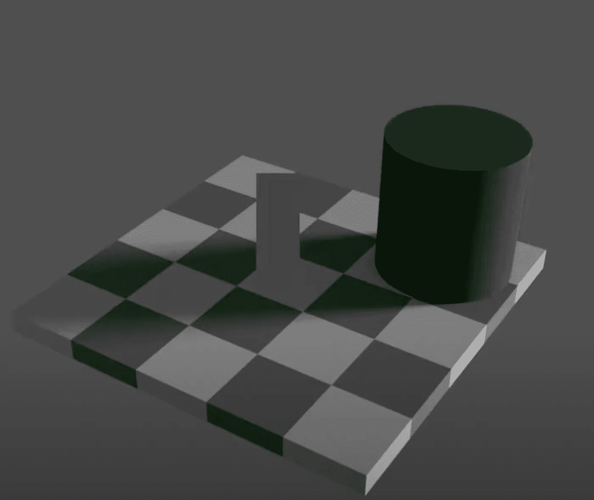
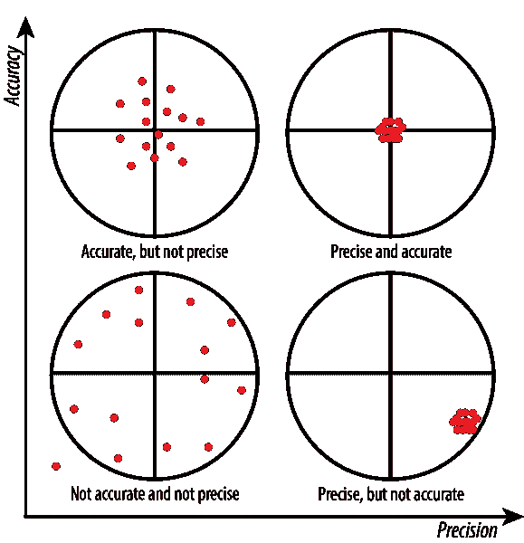
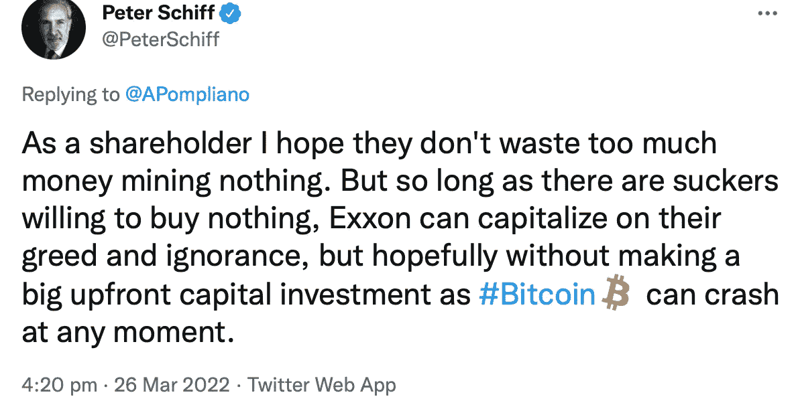

# 如何触摸一枚比特币

> 原文：<https://medium.com/coinmonks/how-to-touch-a-bitcoin-23daa8324b3b?source=collection_archive---------5----------------------->

当我听到那个穿着条纹睡衣的男孩的*感人*的故事时，我非常感动。我*感到*一种强烈的*联系——与*他。尽管如此，我还是*和*的感觉*搏斗*胸口*疼痛*当我的*心弦*被*占据*我的房间和*抓伤*我的支气管的纳粹污染空气*撕裂*。我无法*抓住*，也无法*抓住* *的把柄*上的*会推动*一个人类对*犯下*这样的暴行。运动 *-【离子】-* 对*理解*是一个*痒*我还没有*去挠。***

上面短语中的每个斜体词描述了一个物理事件，但没有一个是这样的。那么，为什么要使用物理词汇呢？好吧，让我们来定义‘身体’。

‘physical’一词来源于拉丁语*“physica”，*意为:对自然的研究。

“天然”源自拉丁语*“natura”*，意为:品质。

“质量”来源于拉丁语*“qualis”*，意思是:哪种/哪种/特定的**属性**或**特征**。

因此，每个物理单词都被设计成 ***的形式——你*** 的孤立属性或特性，完全没有它们通常的属性或特性。这是这个词最真实、最精确的词源意义上的孤立品质。

‘sign’来源于拉丁语*“signum”，*的意思是:**标记**或**标识**或 **re(-)呈现的东西；令牌**

In-' & 'On-'(前缀)(拉丁语)，意思是:进入，在，在，在

Con-' & 'Co-'(前缀)(拉丁语)，意思是:一起，与，相互

当短语“t*o grasp”*进入你的意识时，它会调用无意识思维来构思一个记忆复合**记号** ( *符号-* 性质)来将你的身体物理地*转化为一个物体。这个抓住的记号向你显现，并被解释为意义。根据人和短语的情绪强度，这将激活大脑中调节情绪刺激处理的 rACC 区域，这就是为什么你经常会经历与给定抽象概念相关的**符号**性质的情绪反应；你的潜意识正在用这个短语的意思来回应你对**队形**的要求。于是，话语成为那个形而上表征的象征性体现*；内存抽象组合的数据压缩抽象。这个令牌就是你从短语*“抓住”*中得到的*的意思*。**

*“meaning”一词来源于数学平均值“mean”。从一组数字中发现平均值听起来非常类似于从复合记忆中发现一个记号。类似于“均值”的数学含义，其中给定集合*的均值不是其条目的任何**，一组记忆的表征不是任何记忆。“要抓”≠抓。然而，“抓住”比任何一个拿杯子的记忆更好地描述了抓住的本质，这就是为什么它不仅可以用来描述身体动作。如果它像鸭子一样走路，它可能是海鸥(我来自英国)，但如果鸭子令牌被唤起，它可能是一只鸭子。这就是为什么人们把烦恼写在纸上，然后烧掉；这是对存在于你最外围视觉之外的形而上学怪物的一种宣泄式的反抗。这个*内化*的过程叫做**内化**——一个过程。因此，信息是一个同时充当属性、数据功能和抽象名词的过程。相当狂野。**

**正在阅读这篇文章的*你*是**生物过程器官机制的**功能**。"**有机体"来源于古希腊语"**器官**上"的意思，"仪器/工具/装置"和"- **ism** os "的意思，"实践/制度/主义"。所以，既然有机体是“实践中的工具”,那么让我们抛弃“人类”的概念，用“人类发生”来代替，把人类框定为**过程**年生的，而不是**本质上存在的**。我用‘发生’而不是‘做’,因为‘做’意味着单向熵的主体或执行者，他们与正在做的事情是分开的，这会很快变得混乱。所以，人类的事情现在不得不**做**…没有双关语的意思，哈哈…好吧，好吧，我不说了，我觉得这很有趣，好吧，去你的。无论如何…回到接触硬币或任何这篇文章是关于位。**

**两只狮子正在放松；没什么特别的事。他们一生都是朋友。突然，一只狮子决定杀死另一只。狮子为什么要杀死他的朋友？令人费解。现在，同样的假设，除了有两个人类。为什么人类要杀死他的朋友？好吧，在不啰嗦的情况下，我们只能假设一个朋友说了另一个朋友不爱听的话。人类发生的事情不仅仅因为语言而导致他们的同伴停止发生，有时我们甚至因为语言而导致自己停止发生。我们是唯一承诺自愿终止过程自我的物种…为什么？信息。**

**这个信息的过程，也就是有品质的头脑的形成，并不是一个严格限制在人类物种身上的特性……但是我们非常擅长这个。如此之好，以至于人类发生的结构-功能性质与头脑一起形成。我们变得有能力进行元认知，并发展了一种叫做“心理理论”的东西。动物不自杀的原因可能不是因为它们就像…活在当下，兄弟。这更有可能是因为要让沉默变得突出，你必须首先能够听到；对生命的了解是渴望死亡的先决条件。小孩子会闭着眼睛藏在显眼的地方，认为他们看不见意味着其他人也看不见。心理理论是随着理解诸如“知道”和“诡计”这样的词而发展起来的。**

**所以，是的，这整个“制造意义”的事情是人类思维的认知基础，因此它与宇宙的基础没有什么区别。据此行动。它是如此的有用，以至于你在特定时刻对这个词的物理感知是由体验的表征决定的。**

****

**这就是所谓的自上而下加工理论。它假设感官体验是预期和刺激之间的对话，而**现实**是**共同创造**。例如，读这个单词:**

> **hnapinpeg**

**这甚至不是一个词，对不对？现在怎么样:**

> **现在学校怎么样了？我不知道我有多喜欢他的电影。**

**通过添加信息，你的大脑能够过滤单词的大量潜在含义。通过信息，意义产生了。**

> **通过过程信息化，意义被唤起到意识中。**

**但这不仅仅是文字。看看这个:**

****

**哪个方块更暗？a 还是 B？**

**这在以下假设下应该是容易的:现实是客观的；主观性只适用于抽象的事物；思想、身体和现实是不一样的。**

****

**哦…它们是同样的颜色，但是我真的看到一个比另一个淡。因此，你的真实体验产生的**不等于你的真实体验**。换句话说:现实不是客观的。那么什么是真实的呢？如果现实不客观，让我们试试主观的:**

****

**两个方块是不同的颜色，这种感觉是真实的。事实证明它是一个不精确的感知，在这种情况下，并不能使它成为一个本质上精确的感知；如果你移动了投射阴影的物体，那么你的答案就是正确的:**

****

**当我们看到原始图像时，如果棋盘在阴影中，为什么我们看到的棋盘和我们看到的没有阴影的棋盘一样？因为我们正在从感官刺激中解读信息或意义，而不是质量或原始数据。好吧，那么如果看到的*是*景象本身，是什么导致景象发生？主体-客体范式在这里开始瓦解，因为**看到景象**而不是‘物理光’摆脱了她各自客体的主体。没有客观的对应物，主体只是没有海洋的波浪。**

****

**不是阴和阳互相依赖，而是它们的关系提供了它们的存在。一个杯子在有能力抓住它的东西进入房间之前是不可抓的。因此，如果抓握性不是杯子或手的一个品质，那么杯子和手一定是抓握性的品质。这个概念有一个术语，是认知科学家约翰·维尔瓦克创造的:“跨主体”。**

**这些是如何帮助我们实际接触比特币的呢？**

**比特币是信息，其他东西也是，甚至是彼得·希夫心爱的黄金。当你的脑海中形成比特币的概念时，你正在触摸它。**

**比特币不是一个客体或主体，它是一种由 T2 虚拟货币转换而来的客体。比特币是对纯粹的、孤立的品质的利用。那么，如果你仍然从石头和人的角度思考，并且没有发展出超越表面的抽象感知的元认知能力，会发生什么呢？你最后会发这样的微博:**

****

**当你说:“你应该把钱投入房地产市场。”你不是在告诉某人去寻找“房地产市场”并在其中储存大量现金。你是在告诉他们，把货币的孤立性质换成一种不同的形式。比特币是第一个从它通常被赋予的物理事物中提取这种品质的发明，并允许我们与物理标准脱钩。比特币是真实的……和任何体验一样真实。**

> **加入 Coinmonks [电报频道](https://t.me/coincodecap)和 [Youtube 频道](https://www.youtube.com/c/coinmonks/videos)了解加密交易和投资**

# **另外，阅读**

*   **[印度的加密交易所](/coinmonks/bitcoin-exchange-in-india-7f1fe79715c9) | [比特币储蓄账户](/coinmonks/bitcoin-savings-account-e65b13f92451)**
*   **[OKEx vs KuCoin](https://coincodecap.com/okex-kucoin) | [摄氏替代品](https://coincodecap.com/celsius-alternatives) | [如何购买 VeChain](https://coincodecap.com/buy-vechain)**
*   **[币安期货交易](https://coincodecap.com/binance-futures-trading)|[3 comas vs Mudrex vs eToro](https://coincodecap.com/mudrex-3commas-etoro)**
*   **[如何购买 Monero](https://coincodecap.com/buy-monero) | [IDEX 评论](https://coincodecap.com/idex-review) | [BitKan 交易机器人](https://coincodecap.com/bitkan-trading-bot)**
*   **[CoinDCX 评论](/coinmonks/coindcx-review-8444db3621a2) | [加密保证金交易交易所](https://coincodecap.com/crypto-margin-trading-exchanges)**