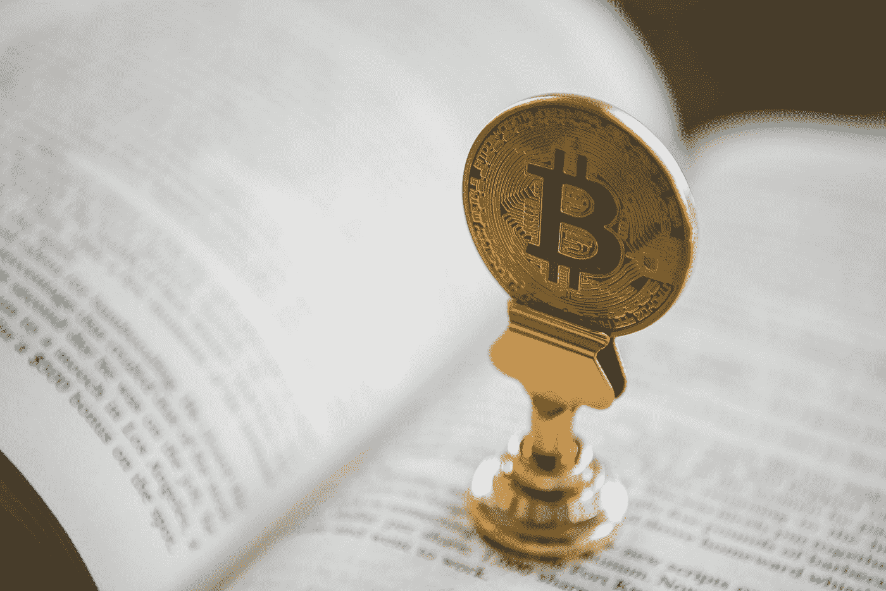
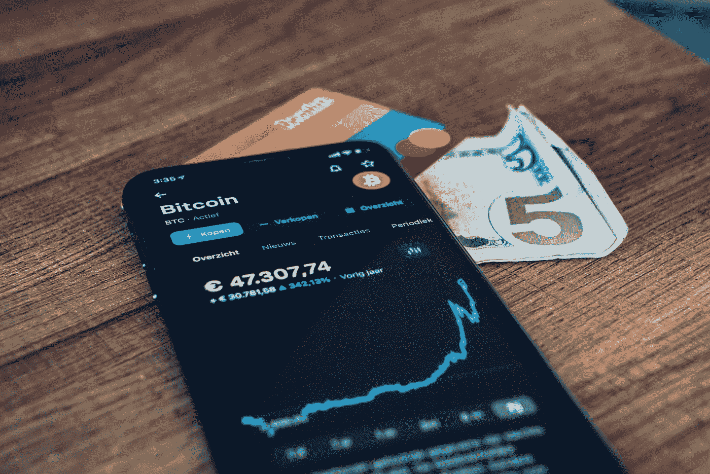

# 如何追踪被盗加密货币(2022)

> 原文：<https://medium.com/coinmonks/how-to-track-stolen-cryptocurrency-2022-6224b3bd9645?source=collection_archive---------11----------------------->

***追踪和找回被盗的加密货币可能是一项非常艰巨的任务，如果你不知道一旦这一悲惨事件发生后要联系的*** [***加密猎人***](https://donaldgallagherconsultants.com) ***。这篇文章让我们对这个*** 有了更好的了解

Photo by [André François McKenzie](https://unsplash.com/@silverhousehd?utm_source=medium&utm_medium=referral) on [Unsplash](https://unsplash.com?utm_source=medium&utm_medium=referral)

据数字货币网站 [CoinDesk](http://www.coindesk.com) 报道，随着比特币突破 42251 美元大关，金融专家正在权衡是否投资这种加密货币。

虽然有些人称这是一个彻头彻尾的骗局，但其他人建议现在是购买的时候了。

不管你站在哪一边，有一件事是肯定的:这些天把你的比特币放错地方是很不幸的。然而，一些不幸的人就这样做了。

他们并不孤单。事实上，据《新闻周刊》报道，自 2009 年这种加密货币问世以来，已经有大约 370 万枚比特币丢失。这几乎是今天的 600 亿美元。

Photo by [CardMapr](https://unsplash.com/@cardmapr?utm_source=medium&utm_medium=referral) on [Unsplash](https://unsplash.com?utm_source=medium&utm_medium=referral)

**结论**

分散金融是密码行业中一个快速增长的领域，旨在复制传统的金融产品，如贷款和交易，而无需任何中间人的参与。

虽然 DeFi 空间吸引了数十亿美元的投资，但也引发了新的黑客和诈骗。

你是加密货币骗局的[受害者](https://donaldgallagherconsultants.com)吗？如果是，请留下评论，告诉我们你自己的经历..

> 加入 Coinmonks [电报频道](https://t.me/coincodecap)和 [Youtube 频道](https://www.youtube.com/c/coinmonks/videos)了解加密交易和投资

# 另外，阅读

*   [麻雀交换评论](https://coincodecap.com/sparrow-exchange-review) | [纳什交换评论](https://coincodecap.com/nash-exchange-review)
*   [维护卡审核](https://coincodecap.com/uphold-card-review) | [信任钱包 vs 元掩码](https://coincodecap.com/trust-wallet-vs-metamask)
*   [Exness 回顾](https://coincodecap.com/exness-review)|[moon xbt Vs bit get Vs Bingbon](https://coincodecap.com/bingbon-vs-bitget-vs-moonxbt)
*   [如何开始用加密贷款赚取被动收入](https://coincodecap.com/passive-income-crypto-lending)
*   [加密货币储蓄账户](/coinmonks/cryptocurrency-savings-accounts-be3bc0feffbf) | [加密交易机器人](https://coincodecap.com/best-crypto-trading-bots)
*   [BigONE 交易所评论](/coinmonks/bigone-exchange-review-64705d85a1d4) | [CEX。IO 审查](https://coincodecap.com/cex-io-review) | [交换区审查](/coinmonks/swapzone-review-crypto-exchange-data-aggregator-e0ad78e55ed7)
*   [最佳比特币保证金交易](/coinmonks/bitcoin-margin-trading-exchange-bcbfcbf7b8e3) | [比特币保证金交易](https://coincodecap.com/bityard-margin-trading)
*   [加密保证金交易交易所](/coinmonks/crypto-margin-trading-exchanges-428b1f7ad108) | [赚取比特币](/coinmonks/earn-bitcoin-6e8bd3c592d9)
*   [WazirX vs CoinDCX vs bit bns](/coinmonks/wazirx-vs-coindcx-vs-bitbns-149f4f19a2f1)|[block fi vs coin loan vs Nexo](/coinmonks/blockfi-vs-coinloan-vs-nexo-cb624635230d)