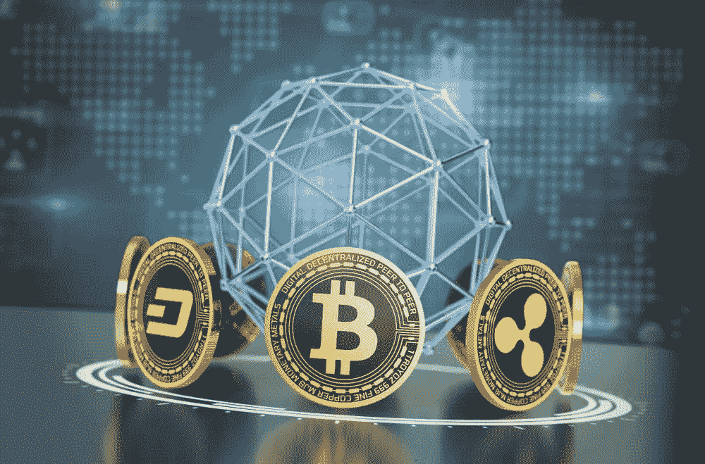
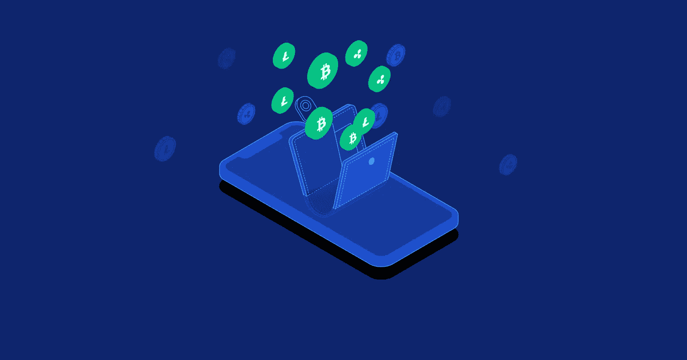
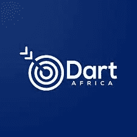
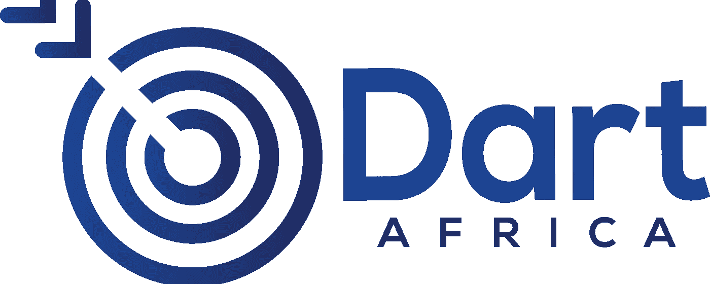

# 如何交易密码并立即获得报酬

> 原文：<https://medium.com/coinmonks/how-to-trade-crypto-and-get-paid-instantly-c9df3cf944ec?source=collection_archive---------56----------------------->

你知道现有超过 9500 种加密货币吗？

加密货币在 21 世纪被证明是一项利润丰厚的业务，也是一个受益的投资平台。加密货币始于购买披萨、咖啡、鞋子、电脑等物品。，直到被几个特大公司甚至国家采用。但是加密货币到底是什么，它是如何运作的？加密货币有哪些用途？更重要的是，你如何[交易加密货币并立即获得支付](https://dartafrica.io/)。请继续阅读本文，以获得这个重要加密问题的答案。

## **什么是加密货币**

与传统银行系统相比，加密货币是一种没有中央银行机构的数字货币。加密货币(Cryptocurrency)这个词是由两个词造出来的，即 ***密码学*** 和 ***货币*** 。密码学源自希腊语 ***Kryptos*** ，翻译过来就是隐藏。密码术是一种加密的交易形式，它仅对参与者可见，即发送者和接收者。它有助于实现交易的安全性。同时，货币是购买或交换商品和服务的普遍或公认的手段。与现金的实物和古老用途不同，加密货币不明显，但你可以用它进行数字支付。我们已经知道，随着技术进步和在线服务的出现，世界正在走向数字化；大多数情况下，支付都是通过加密货币确认的，因为它可靠、快速、安全。

有史以来第一种加密货币是比特币，于 2009 年向世界推出。它仍然是所有加密技术之父，也是最好的，因为它在高级支付和使用领域掀起了一场涟漪。

## **加密货币如何操作**

Crypto 在所有交易发生的区块链平台上运行。该平台以安全加密的方式记录所有交易，并确保双方所需的隐私。我敢肯定，许多人只购买他们的法定货币加密，但真正需要一个加密令牌。加密货币是通过每个加密网络批准的不同协议机制创建的:比特币、以太坊等。我们举个例子，比特币是借助挖矿发明的。这种挖掘过程结合了高计算能力和解决复杂问题，以形成节点和块，并增强其安全性。因此，这些矿工批准或验证任何与比特币相关的交易，但绝不能干预交易。

再比如以太坊。它的协议以前是工作证明，就像比特币一样，涉及采矿，但最近转向了股权证明，要求在网络上形成区块并确认交易。对于每个加密资产，私钥被委托给所有者。任何其他个人都不能访问它，因为它是加密的，并且只有在丢失或被盗的情况下才由所有者使用。与银行使用的纸币或硬币货币有何不同？它是去中心化的，即不被任何第三方(央行)持有或控制，也不存放在一家公共银行，而是存放在一家你所特有的银行，俗称 ***一个加密钱包*** 。两个接收者之间的交易提供了一个非常安全和可靠的交易，没有改变的迹象。加密货币的交易也很迅速，不像纸币那样需要很长时间和困难才能完成交易。此外，与可能致命的过度银行收费相比，收费相对较低。例如，与加密货币相比，把你的钱存在银行会产生很少甚至没有利率的成本，而且大多数时候会随着时间的推移而贬值，加密货币不会因为把你的加密资产放在钱包里而收取一分钱，而且还会随着时间的推移而增值。

## **加密货币的用途**

让我们来看看你可以用加密货币做什么。

● **投资**:很明显，大多数加密用户都是短期或长期投资者。在过去的几年里，加密货币已经被证明是一个很好的投资计划，多年来有数千个投资回报率，大多数时候取决于你有多大的耐心。想象一下，一枚售价低至 20 美元的比特币现在大幅增值至 4 万美元，并且仍在运行。难怪成千上万的人渴望得到这座金矿。

Trade Crypto Currency and get paid Instantly

● **参与快速、安全、低成本的交易:**我相信我已经给出了这是如何运作的启示；加密货币的交易快速、安全，而且几乎免费。加密交易是最安全的，因为它们不会被黑客攻击，不像法定货币交易所那样容易被黑客攻击。这是因为区块链平台无法解密加密交易。此外，想象一笔价值数百万或数十亿美元的交易。这将需要大量的时间来处理这样一个巨大的交易，并且需要更多的人来批准这样一个交易。这浪费了您的时间，增加了交易费用，并使您面临黑客攻击或中断，但使用加密货币，这在几分钟内就可以完成，而且费用大幅降低。

● **购买力:**加密货币已经发展到你几乎可以用它买任何东西的程度。无论是汽车(特斯拉)，家用设备，电子产品，在线交易，食品杂货，土地等。

这些是加密货币的主要用途，它并不止于此，只是让你知道加密货币市场可以提供什么。

## 用你的加密货币兑换现金

有了 Dart Africa，您的加密货币将以市场上最优惠的汇率兑换。网站上有一个[自动比率计算器](https://dartafrica.io/coincalculator),可以给出你想要出售的任何数量的密码的 Naira 和 Cedis 等价物，所有这些都是为了帮助客户的销售体验。

Dart Africa

Dart Africa 的一个突出特点是付款速度快。 [Dart Africa](https://dartafrica.io/) 设计用于在加密货币交易确认后立即自动进行支付认证。Dart Africa 的付款没有延迟时间，因为付款是自动完成的。当您向 Dart Africa 出售您的密码时，由于自动支付系统，付款在几分钟内完成。

**达特非洲适合你如果:**

*   你正在寻找快速支付你的密码
*   为您的密码提供优惠的交易价格
*   易于导航和使用的平台
*   你想要一个零概率骗你的平台
*   你还没有准备好应对 P2P 交易平台的技术性问题

> 加入 Coinmonks [电报频道](https://t.me/coincodecap)和 [Youtube 频道](https://www.youtube.com/c/coinmonks/videos)了解加密交易和投资

# 另外，阅读

*   [3 商业评论](/coinmonks/3commas-review-an-excellent-crypto-trading-bot-2020-1313a58bec92) | [Pionex 评论](https://coincodecap.com/pionex-review-exchange-with-crypto-trading-bot) | [Coinrule 评论](/coinmonks/coinrule-review-2021-a-beginner-friendly-crypto-trading-bot-daf0504848ba)
*   [莱杰 vs Ngrave](/coinmonks/ledger-vs-ngrave-zero-7e40f0c1d694) | [莱杰 nano s vs x](/coinmonks/ledger-nano-s-vs-x-battery-hardware-price-storage-59a6663fe3b0) | [币安评论](/coinmonks/binance-review-ee10d3bf3b6e)
*   [Bybit Exchange 审查](/coinmonks/bybit-exchange-review-dbd570019b71) | [Bityard 审查](https://coincodecap.com/bityard-reivew) | [Jet-Bot 审查](https://coincodecap.com/jet-bot-review)
*   [3 commas vs Cryptohopper](/coinmonks/3commas-vs-pionex-vs-cryptohopper-best-crypto-bot-6a98d2baa203)|[赚取加密利息](/coinmonks/earn-crypto-interest-b10b810fdda3)
*   最好的比特币[硬件钱包](/coinmonks/hardware-wallets-dfa1211730c6) | [BitBox02 回顾](/coinmonks/bitbox02-review-your-swiss-bitcoin-hardware-wallet-c36c88fff29)