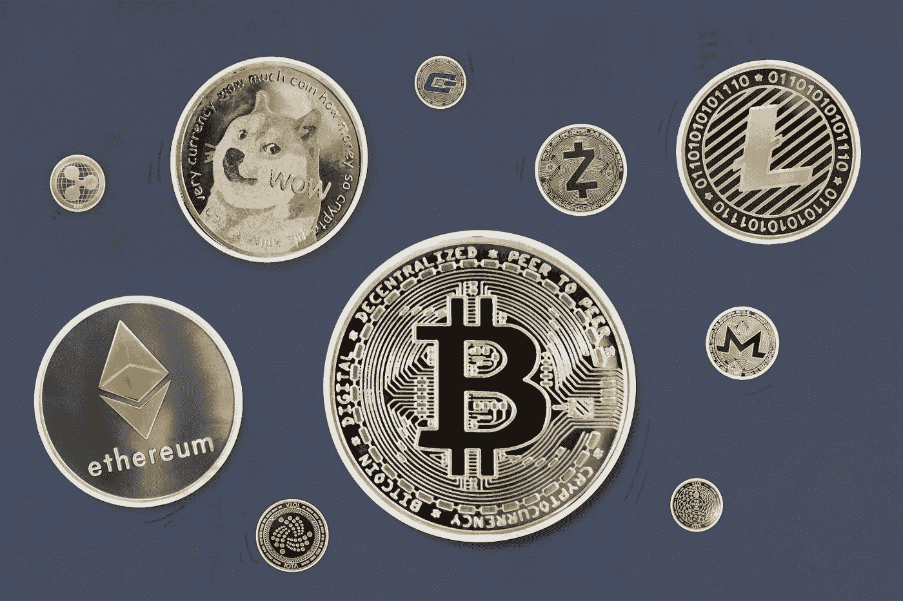

# 如何在尼日利亚将加密货币兑换成现金

> 原文：<https://medium.com/coinmonks/how-to-trade-cryptocurrencies-for-cash-ffac011dddf7?source=collection_archive---------72----------------------->

加密货币是一种数字资产，允许用户在数字环境中交换价值。数字资产，即加密货币，分布在一个网络(区块链)上，存储在大量计算机上。

# 为什么叫加密货币？

“加密货币”一词是密码学和货币的混合体。这是因为加密货币集成了加密技术的使用，以确保用户之间的交易安全。

**是什么让加密货币独一无二？**

许多原因将加密货币与其他形式的货币区分开来。与其他货币不同，加密货币的分散性质允许它在没有中央权力机构或政府控制的情况下存在。大多数加密货币的主要功能是充当不受任何政党或政府控制或拥有的数字现金。

网络参与者(节点)运行软件将他们与其他参与者连接起来，这样他们就可以在彼此之间共享信息，而不是从中央服务器接收信息。

加密货币的去中心化系统使它们强烈抵制审查或关闭。与传统的货币系统相比，要关闭或减慢系统，你只需要攻击主服务器或中央服务器。如果商业银行的数据库遭到黑客攻击，系统将很难正常运行，用户的账户余额可能会永远丢失。

另一方面，在加密货币中，数据库保存在节点上。每个人都有效地充当自己的服务器。一些节点可以脱机，但系统中的其他节点仍然能够作为一个系统正常工作，并从其他节点获取信息。

因此，加密货币一年 365 天，一天 24 小时都在运行。它们允许在全球任何地方转移价值，而无需中介的干预。

加密货币的去中心化性质导致了各国政府的绝对和隐性禁令。这些政府担心加密货币要么会扰乱他们的金融系统，要么会进一步帮助非法交易，因为没有人监督或控制它。(注意，加拿大、美国、英国和大多数欧盟国家已经制定了解决这些问题的政策)。

巴林、布隆迪、喀麦隆、中非共和国、加蓬、格鲁吉亚、加纳、圭亚那、科威特、莱索托、利比亚、澳门、马尔代夫、尼日利亚、越南、津巴布韦等国家已经对加密货币实施了隐性禁令。

尽管他们的政府已经禁止了密码货币，但是公民仍然对交易密码货币感兴趣，然而，他们不能从像 Bitconnect、Trust wallet、币安和 co 这样的大型密码钱包中获得现金，因为政府已经禁止商业银行与这些平台进行交易。这导致了各种密码货币交换平台的开发，以帮助密码交易者将他们的硬币兑换成当地货币的现金。例如，在尼日利亚和加纳，您可以通过非洲领先的密码交换平台 [Dart Africa](https://dartafrica.io/) 轻松地将您的密码货币兑换成奈拉和塞迪斯。

# 在哪里可以用加密货币兑换现金

Dart Africa 是一个交易平台，在这里您可以在几分钟内无缝地[用您的密码货币兑换现金](https://dartafrica.io/)。Dart Africa 是一个可靠的交流平台，客户满意度是该组织的目标之一。

他们的汇率是市场上最高的，所以当您与 Dart Africa 进行贸易时，利润最大化是有保证的。您可以使用 [Dart Africa 的汇率计算器](https://dartafrica.io/coincalculator)轻松查看您的密码货币的当前汇率。

付款是自动的，所以当您与 Dart Africa 进行贸易时，您会在将密码货币发送到提供的地址后几分钟内收到付款。有一个 24/7 客户支持系统来处理您在平台上遇到的任何问题。

# 如何在 Dart Africa 上交易您的密码货币

按照以下步骤交易您的密码货币:

*   进入他们的网站 [Dartafrica.io](http://dartafrica.io)
*   点击主页右上角的立即销售
*   如果您没有账户，点击[在这里注册](https://dartafrica.io/register)创建一个新账户。
*   在提供的栏中填写所有要求的详细信息。详细信息包括首选用户名、有效电子邮件地址和电话号码、密码和国籍。
*   阅读并同意我们的条款和条件。
*   点击创建帐户。
*   您单击“创建帐户”后，将立即收到 Dart Africa 针对所提供电子邮件的验证电子邮件。

既然你已经在他们那里有了账户；(请注意，如果您已经有了帐户，可以跳过上面的所有步骤)

*   使用您的凭据登录您的帐户。
*   单击工具栏图标(左上角有三条垂直直线)。您会在您的帐户仪表板上看到这一点。
*   点击出售硬币。
*   在硬币栏中选择您的首选硬币选项。
*   输入您要出售的硬币的体积，相应的美元、奈拉和塞迪斯金额将显示在列中。注意:你可以出售的任何加密货币的最低美元价格是 20 美元。
*   点击立即出售硬币。
*   将提供一个钱包地址和一个 QR 码。您可以通过手动输入地址或扫描二维码发送您在上述步骤中选择的加密货币金额。付款被确认后，你将立即被记入贷方。

网址:[https://dartafrica.io/](https://dartafrica.io/)

D [现在就下载 App](https://play.google.com/store/apps/details?id=com.dartafrica) ！

> 加入 Coinmonks [电报频道](https://t.me/coincodecap)和 [Youtube 频道](https://www.youtube.com/c/coinmonks/videos)了解加密交易和投资

# 另外，阅读

*   [3 商业评论](/coinmonks/3commas-review-an-excellent-crypto-trading-bot-2020-1313a58bec92) | [Pionex 评论](https://coincodecap.com/pionex-review-exchange-with-crypto-trading-bot) | [Coinrule 评论](/coinmonks/coinrule-review-2021-a-beginner-friendly-crypto-trading-bot-daf0504848ba)
*   [莱杰 vs n rave](/coinmonks/ledger-vs-ngrave-zero-7e40f0c1d694)|[莱杰 nano s vs x](/coinmonks/ledger-nano-s-vs-x-battery-hardware-price-storage-59a6663fe3b0) | [币安评论](/coinmonks/binance-review-ee10d3bf3b6e)
*   [Bybit Exchange 评论](/coinmonks/bybit-exchange-review-dbd570019b71) | [Bityard 评论](https://coincodecap.com/bityard-reivew) | [Jet-Bot 评论](https://coincodecap.com/jet-bot-review)
*   [3 commas vs crypto hopper](/coinmonks/3commas-vs-pionex-vs-cryptohopper-best-crypto-bot-6a98d2baa203)|[赚取秘密利息](/coinmonks/earn-crypto-interest-b10b810fdda3)
*   最好的比特币[硬件钱包](/coinmonks/hardware-wallets-dfa1211730c6) | [BitBox02 回顾](/coinmonks/bitbox02-review-your-swiss-bitcoin-hardware-wallet-c36c88fff29)