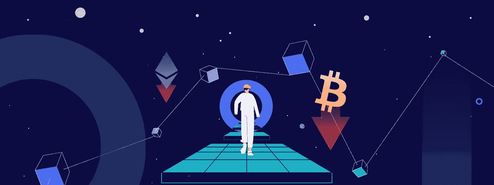

# 如何在加密熊市中交易？

> 原文：<https://medium.com/coinmonks/how-to-trade-in-a-crypto-bear-market-2c79ded009b0?source=collection_archive---------44----------------------->

How to Trade In a Crypto Bear Market?

随着比特币的(BTC)价格跌破 20，000 美元的里程碑，大多数加密货币的价格比峰值低 85%，加密的冬天正在到来。全球最大的密码交易所币安首席执行官赵昌鹏认为，“[的密码寒冬至少还会持续两年多在这篇文章中，我们将讨论如何在秘密熊市中交易的一些方法。](https://fortune.com/2022/06/16/binance-boss-cz-talks-about-crypto-downturn-plans-spending-spree/)

无论他对当前加密熊市长度的看法是对是错，我们都将分享度过加密寒冬的三个技巧。

> 交易新手？试试[密码交易机器人](/coinmonks/crypto-trading-bot-c2ffce8acb2a)或[复制交易](/coinmonks/top-10-crypto-copy-trading-platforms-for-beginners-d0c37c7d698c)

# 秘密熊市的历史

加密冬天对加密世界来说并不新鲜。自 2009 年问世以来，比特币经历了四次主要的加密熊市。第一次加密熊市发生在 2011 年 6 月至 11 月，当时比特币的价格从 32 美元跌至 2 美元。

从上面的图表可以看出，比特币的价格在 2011 年 11 月触底，在接下来的一年里反弹了近 3000%。第二次加密冬天发生在 2013 年 4 月，比特币的价格在短短几天内从 140 美元跌至 50 美元。第二次熊市过后，比特币的价格在随后的半年里暴涨了 1500%。

第三次熊市发生在 2013 年 12 月至 2015 年 1 月，当时比特币的价格从 1100 美元暴跌至 200 美元。第三次熊市之后，比特币的价格在随后的两年里飙升了 2000%。

第四次加密熊市发生在 2017 年 12 月至 2018 年 12 月期间，当时比特币的价格从 2 万美元暴跌至 3200 美元。

从上图可以看出，比特币的价格在 2018 年 12 月触底，在随后的两个月内反弹了 80%。至于目前的加密熊市，我们不能确定底部，但是，从目前的历史高点下跌 80%将使我们达到 14，000 美元左右。

正如你所看到的，每次主要的加密熊市后，比特币总是会反弹。

# 1 HODL

如果你是一个没有杠杆的投资者/交易者，度过加密冬天的最好方法是耐心地 [HODL](https://www.investopedia.com/terms/h/hodl.asp) 直到风暴过去。除此之外，你还可以用平均成本法来买入。如果历史可以提供某种指导，那么可以肯定地说，比特币总是会反弹的。

当加密价格回升并超过之前的峰值时，低价买入者将获得丰厚的利润。

在 [Cryptohopper](https://www.cryptohopper.com/) ，我们提供高级 [DCA](https://www.cryptohopper.com/features/dollar-cost-averaging) 设置，你可以添加到你的[自动交易机器人](https://www.cryptohopper.com/features/automatic-trading)中。这样就省去了计算何时使用平均成本的麻烦。

# 2 远离保证金交易

杠杆是一把双刃剑，尤其是在熊市，因为加密冬天的波动性。在糟糕的一天，加密价格下跌超过 20%的情况并不少见，这可能会在你接到追加保证金通知后轻易地抹去你的杠杆头寸。

# 3 对冲秘密风险

最后，聪明的投资者会采用对冲策略来减少你的加密投资组合的总体损失和波动性。最常见的对冲策略包括卖空，当资产价格下跌时获利。

# 结果

神秘的冬天并没有结束。它们是整个市场周期的一部分，因为没有哪种资产类别会永远下跌，同时也没有哪种资产会在没有调整的情况下上涨。因此，如果你打对了牌，你会在熊市中变得更强！

*原载于*[*https://www.cryptohopper.com*](https://www.cryptohopper.com/blog/7013-how-to-trade-in-a-crypto-bear-market)*。*

> *加入 Coinmonks* [*电报频道*](https://t.me/coincodecap) *和* [*Youtube 频道*](https://www.youtube.com/c/coinmonks/videos) *了解加密交易和投资*

# 另外，阅读

*   [Bookmap 评论](https://coincodecap.com/bookmap-review-2021-best-trading-software) | [美国 5 大最佳加密交易所](https://coincodecap.com/crypto-exchange-usa)
*   [加密交易机器人](/coinmonks/crypto-trading-bot-c2ffce8acb2a) | [造币评论](https://coincodecap.com/coingate-review)
*   最佳加密[硬件钱包](/coinmonks/hardware-wallets-dfa1211730c6) | [Bitbns 评论](/coinmonks/bitbns-review-38256a07e161)
*   [新加坡十大最佳加密交易所](https://coincodecap.com/crypto-exchange-in-singapore) | [收购 AXS](https://coincodecap.com/buy-axs-token)
*   [红狗赌场评论](https://coincodecap.com/red-dog-casino-review) | [Swyftx 评论](https://coincodecap.com/swyftx-review)
*   [投资印度的最佳密码](https://coincodecap.com/best-crypto-to-invest-in-india-in-2021)|[WazirX P2P](https://coincodecap.com/wazirx-p2p)|[Hi Dollar Review](https://coincodecap.com/hi-dollar-review)