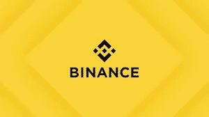

# 如何在币安 P2p 上交易

> 原文：<https://medium.com/coinmonks/how-to-trade-on-binance-p2p-ef5062c40010?source=collection_archive---------38----------------------->

就用户数量和交易量而言，币安交易所被认为是最好的加密货币交易所。币安也有一个 P2P 交易平台，允许用户用当地货币买卖各种加密货币。例如，如果你在尼日利亚，你可以使用银行账户中的资金直接支付购买加密货币的费用，并向你的银行账户支付出售加密货币的资金，而不会有银行账户被封的风险。

How to trade on Binance

这样做的好处是你不必支付任何交易费用。P2P 交易平台的发明允许用户以他们想要的价格和支付方式买卖他们的加密货币。你甚至可以将 P2P 钱包中的加密资产转移到你的币安钱包中，而不会产生任何额外的费用。由于该平台提供的零交易费用和托管服务，用户将会确信每个密码都会进入他们的钱包。

## 什么是托管服务？

托管服务是一种安排，其中第三方(币安)处理交易方之间的商品或资产(加密货币)交换，以确保安全和公平交易。币安托管服务确保 P2P 交易双方在获得支付之前履行自己的义务，消除了 P2P 交易中的欺诈风险。

作为买家，当你从特定卖家处下单购买 BTC 时，订购的 BTC 金额将从卖家的加密货币余额中扣除，并存入托管服务。加密货币将被保存在托管服务中(双方都无法访问它)，直到双方履行交易义务，你作为买家将钱发送到卖家的账户，卖家确认付款。

## **如何在币安 P2P 网站上购买加密货币**

要使用币安 P2P 交易平台，您需要一个经过验证的币安帐户才能使用交易平台。

**第一步:**登录你的币安账户，进入币安 P2P 页面。如果您没有币安帐户，请注册一个帐户并获得验证。

**第二步:**选择菜单栏中的*购买密码*，然后选择 *P2P 交易*。

**第三步:**点击您想要购买的加密硬币旁边的*购买*按钮。浏览下拉列表中不同的价格和支付方式后，选择您喜欢的选项，然后点击“*购买【加密货币】*”按钮。

**第三步:**输入您想购买的法币或加密货币数量，点击*购买*。

**第四步:**验证支付方式和总价。将显示一个倒计时，你必须在交易所给定的时间范围内付款(通常是 15 分钟)。付款后，点击*转账，下一步*，选择*确认*。

**第五步:**卖家向你发放加密货币，交易结束。您可以点击*转账至现货钱包*，将加密货币转入您的现货钱包。

您也可以点击“*查看我的账户*”查看您刚刚购买的加密货币。

点击*上诉*，点击*转账，下一步*后 15 分钟内未收到加密货币。

> 加入 coin monks[Telegram group](https://t.me/joinchat/Trz8jaxd6xEsBI4p)学习加密交易和投资

## **如何在币安 P2P 网站上销售加密货币**

**第一步:**选择顶部菜单栏中的*购买密码*，然后 *P2P 交易*。

**第二步:**选择你要出售的加密货币，选择你喜欢的买家，点击“*出售*”。在下拉菜单中过滤价格和付款方式后点击出售，

**第三步:**输入您想卖出的法币或加密货币数量，点击“*卖出*”。

**第四步:**交易现在会显示“*买方付款*”，并有 15 分钟的倒计时。

**第五步:**买家付款后，交易信息变为“*待发布*”。确认并再次确认你通过约定的支付渠道收到了买家的钱。

在你验证了买家的付款后，按下“*确认释放*”和“*确认*”将密码发送到买家账户。

**第六步:**买家会收到钱包里的硬币。您可以点击[查看我的账户]查看您的菲亚特余额。

您也可以点击*上诉*按钮解决任何可能已经到达董交易流程的问题。

请注意，在网上使用币安 P2P 销售和购买加密货币的步骤与移动应用程序类似，只是界面不同。

## [**达特非洲**](https://dartafrica.io/) **:用密码交易当地货币的最佳平台**

Dart Africa 是一个当地的加密货币交易平台，在这里您可以出售您的加密货币以换取现金。他们在尼日利亚和加纳开展业务，被认为是轻松销售加密货币的最佳本地兑换服务之一。

访问他们的[网站](https://dartafrica.io/)或[下载他们的移动应用](https://play.google.com/store/search?q=dart+africa&c=apps)以访问他们的服务