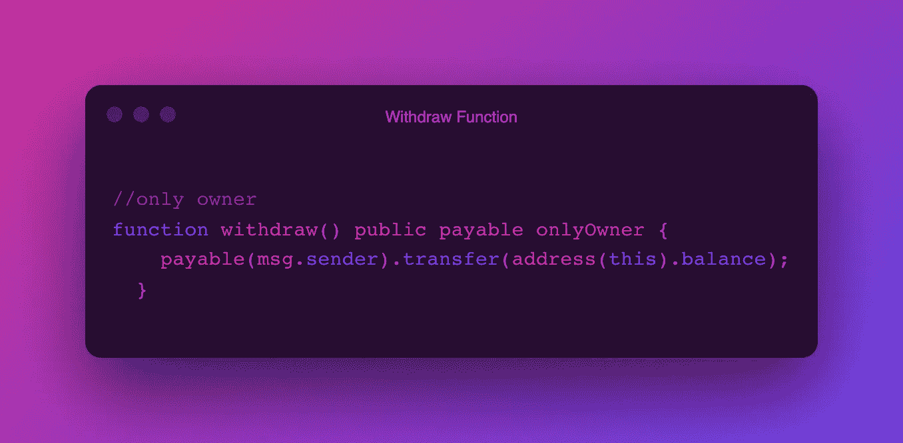
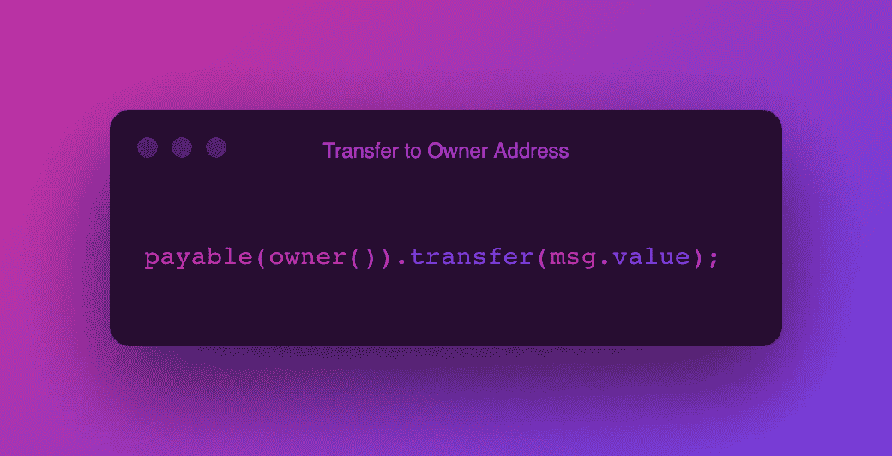
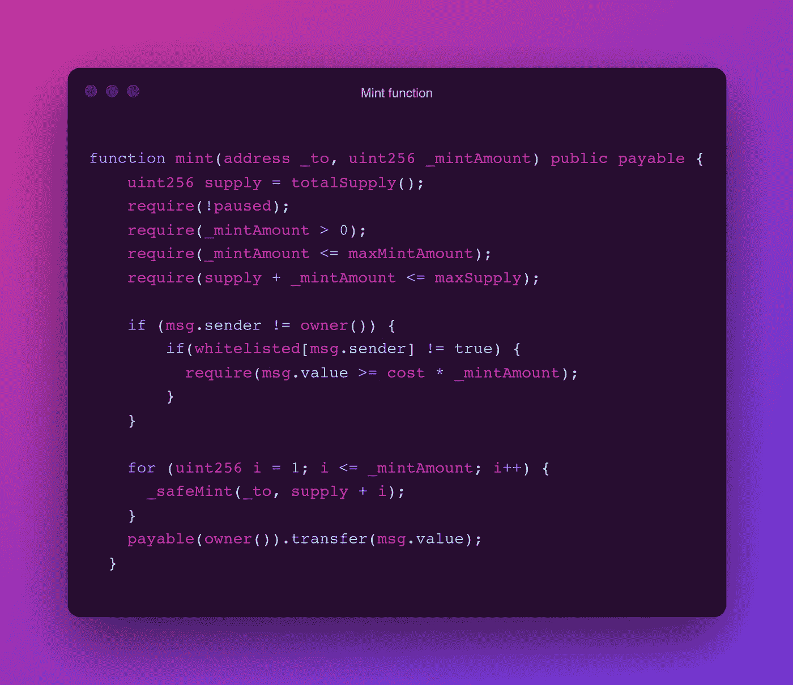

# 如何在 Solidity 中将令牌转移到所有者地址而不卡在合同地址？

> 原文：<https://medium.com/coinmonks/how-to-transfer-tokens-to-the-owner-address-and-not-stuck-in-contract-address-in-solidity-4fdd7f1f7575?source=collection_archive---------2----------------------->

我最近在用 react.js 和 smart contract(solidity)构建 Web DApp 时遇到了一个 bug。该项目是一个 NFT 铸造 Dapp，客户可以铸造 NFT 并拥有它们。

我确信一切都很好，直到我测试并注意到客户用来造币的钱没有进入所有者的钱包，而是进入了合同地址。

太奇怪了！销售非专利技术的目的是什么，你不能从你的或你能得到的地方得到钱。

这是一个非常奇怪的错误，在我们看到效果之前，我们可能不会注意到它。我了解到 CrytoPunk 也面临着同样的问题，这也是他们推出第二版 NFTs 的原因。

那么如何解决这个问题呢？

卡在合同地址的钱，如果有取款功能，允许机主退出合同，就可以取出。参见下面的代码。

该功能允许所有者通过使用区块链的扫描地址从合同地址中退出，如 [polygonscan](https://polygonscan.com/) 用于 Polygon，以及 [etherscan](https://etherscan.io/) 用于 Ethereum。

注意到代码中的唯一所有者意味着只有所有者可以撤销。如果取款功能不仅限于所有者，任何人都可以取款。

还要注意，要退出合同，你的钱包里必须有多于你想提取的金额。

但是，我们如何让它在客户创建 NFT 时，直接到达所有者的地址，而交易仍然显示在合同上？

在合同中的 mint 函数内，添加以下代码行；

owner()是智能协定上 Ownable 中的一个函数，它将用于部署协定的地址存储为所有者的地址。

完整的 mint 函数是这样的；

因此，当客户铸造他们的 NFT 以获得它们，并且他们被从 Metamask 收取铸造金额时，铸造函数中的最后一行代码将用于铸造的资金转移到所有者的地址，即合同的所有者。

这两个函数解决了令牌卡在契约地址无法访问或撤回的问题。

我希望这篇文章对你有所帮助。在[推特](https://twitter.com/GraceOmole3)上关注我，了解更多关于前端和区块链的技巧