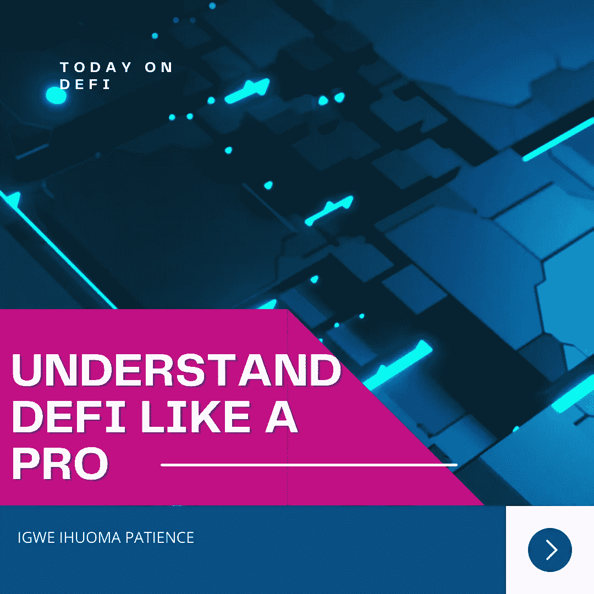
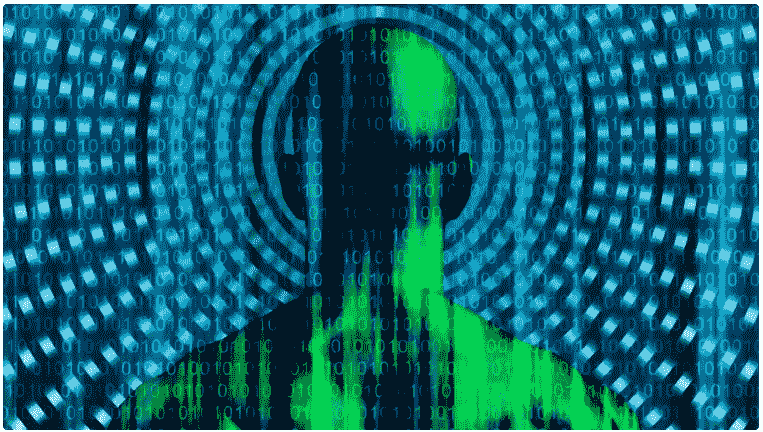

# 如何像专业人士一样理解 DEFI

> 原文：<https://medium.com/coinmonks/how-to-understand-defi-like-a-pro-1753ea2741f8?source=collection_archive---------20----------------------->

UNDERSTAND DEFI LIKE A PRO

# 介绍

传统金融平台依赖银行等机构作为其交易的中介，而分散金融是建立在区块链网络上的金融应用生态系统。这个平台允许用户完全控制他们的资产。它们不在单一权力机构的控制之下。因此，不要利用中间人或仲裁人。然而，我们不能在不提及分散应用的情况下开始谈论 DEFI，因为它们通过点对点和其他分散应用(d apps)与这个生态系统进行交互。那么，什么是去中心化 app 呢？

分散式应用程序(DApps)是使用智能合约在区块链计算机网络上运行的数字应用程序。一旦这些合同启动，就需要达成共识才能改变。点击[此处](/coinmonks/smart-contracts-simplified-1c20bc55a4f)了解更多关于智能合约的信息。

分散式应用程序(Dapps)更像区块链的万维网(www ),而 DeFi 就是建立在 DApps 之上的。它们有时可以互换使用，但它们并不相同。然而，由于所有的过程都是绝对自动化的，所以它几乎是一个不间断的、不可妥协的系统单元。

## 定义的分类

正如我们在集中式金融中有各种类型的银行交易一样，也存在各种类型的分散式金融应用程序。用户的选择取决于用户想要什么。一般来说，我们有以下几类 defi:

1.  借贷定义应用程序
2.  保险赤字
3.  支付 DApps
4.  导数定义
5.  预测市场定义
6.  钱包 DApps 等。

现在，我们已经概述了一些最重要的 Defi 应用，有必要简单解释一下，它们的用途和其他我们在这个阶段应该知道的重要特性。

## DEFI 应用程序的用途和特点

*   **借贷赤字**

分散的借贷平台提供了一个分享和借贷的机会，这是以太坊钱包的必备条件。DeFi lending 允许投资者和贷款人通过分散的应用系统发放贷款或存款以获取利息。这个平台的独特之处在于，各方的身份仍然受到保护。

其中一些平台是 Aave、MakerDAO、Compound、PhoenixDAO、Venus 等。

*   **保险定义**

在 DeFi 中，协议可能失败，智能合同可能被破坏，系统可能被黑客攻击。为了防止这种可能的经济损失，用户可以购买保险。

一些著名的保险 DApps 是 Unslashed 金融，风险港，Nexus 相互等。他们的最终目标是，如果区块链用户在对区块链生态系统的投资或活动中遭受损失，他们将得到赔偿。

*   **支付 Dapps**

加密货币支付网关允许加密货币交易作为来自客户的支付，以换取商品或服务。无论用户身在何处，这些系统都允许他们使用加密货币进行交易和支付。支付 DApps 的例子有比特币基地商务、电子货币、BitPayCircle、Coinomi、CoinGate、Cryptopay 等。

*   **导数定义**

衍生 defi 应用程序是金融应用程序，能够对冲未来价格变化的可能性。例如 hegic、dYdX、UMA、镜像协议、OPYN 等。

*   **预测市场赤字**

预测市场定义应用程序允许用户将他们准确预测未来事件的能力货币化。这些预测市场为用户提供了直接押注他们认为有价值的信息的机会。它们允许交易者交易事件的结果，不管他们在哪里。例如 TotemFi、Augur、finance.vote、OprionRoom 等。

*   **钱包 Dapps**

钱包 DApps 是一种软件程序，它持有公钥和私钥，可以在不同的区块链上成功工作，允许用户相互兑换货币，并跟踪他们拥有的货币余额。

数字钱包可以存储、发送和接收不同的数字货币。例如比特币基地钱包、Metamask、ZenGo、Exodus、Trezor 钱包、Trust 钱包、Ambire 钱包、StakedWallet。点击[此处](/coinmonks/a-complete-guide-on-getting-the-best-crypto-wallet-5c63b1560c27)了解如何选择最佳加密钱包的更多信息。

## 结论

正如我们在上面所看到的，分散金融(也称为 DeFi)是建立在区块链网络上的金融应用生态系统。这个平台允许用户完全控制他们的资产。这个平台具有集中财务模块的所有特征，但是，DeFi 更快，更容易管理，最重要的是，用户拥有对经济的最终控制权，因为它是完全分散的。用户的身份是未知的，因此绝对保密，但非常安全。

DeFi 是现代金融世界所需要的一切，而且它将一直存在。你今天要做哪个 DeFi 项目？

# 关于作者

Igwe Ihuoma Patience 是一名自学成才的创意和特定行业内容作家，也是一名加密货币爱好者，拥有 2 年多的经验和不断发展的区块链空间的知识。

我擅长内容创作、文案撰写、字幕管理、视频编辑和手机图形设计，我教其他人如何在加密货币和区块链领域起步，我的目标是让区块链的学习和更新易于任何人理解。

> 加入 Coinmonks [电报频道](https://t.me/coincodecap)和 [Youtube 频道](https://www.youtube.com/c/coinmonks/videos)了解加密交易和投资

# 另外，阅读

*   [5 款最佳加密交易终端](https://coincodecap.com/crypto-trading-terminals) | [最佳 DeFi 应用](https://coincodecap.com/best-defi-apps)
*   [最佳网上赌场](https://coincodecap.com/best-online-casinos) | [币安评论](/coinmonks/binance-review-ee10d3bf3b6e) | [BitMEX 评论](https://coincodecap.com/bitmex-review)
*   [麻雀交换评论](https://coincodecap.com/sparrow-exchange-review) | [纳什交换评论](https://coincodecap.com/nash-exchange-review)
*   [美国最佳加密交易机器人](https://coincodecap.com/crypto-trading-bots-in-the-us) | [变化回顾](https://coincodecap.com/changelly-review)
*   [在印度利用加密套利赚取被动收入](https://coincodecap.com/crypto-arbitrage-in-india)
*   [Godex.io 审核](/coinmonks/godex-io-review-7366086519fb) | [邀请审核](/coinmonks/invity-review-70f3030c0502) | [BitForex 审核](https://coincodecap.com/bitforex-review)