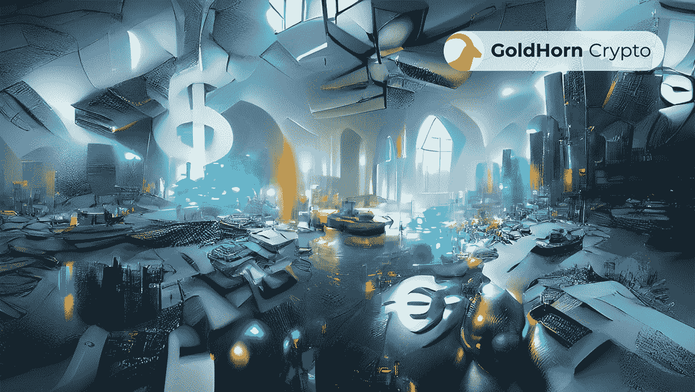
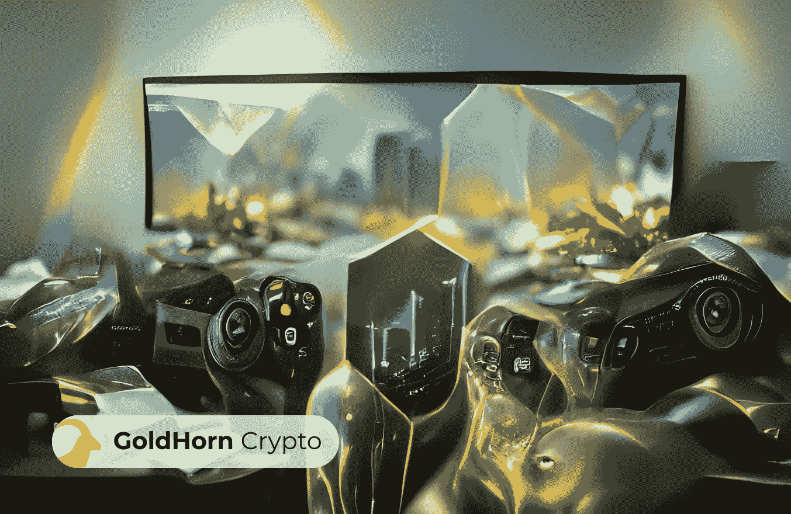
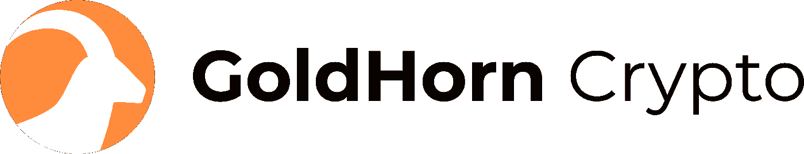

# 如何理解加密扇区

> 原文：<https://medium.com/coinmonks/how-to-understand-the-crypto-sectors-18c229d21caf?source=collection_archive---------29----------------------->

在过去的三年里，加密领域发生了巨大的变化。最值得注意的是，我们已经看到了分散金融(DeFi)、不可替代代币(NFTs)、游戏、元宇宙和 Web3 的发展。随着时间的推移，这些术语将成为主流术语的一部分，所以让我们花一些时间来理解它们，以及它们将如何影响我们的长期投资计划。

使用户能够在不依赖第三方的情况下创建和交易金融产品。这就消除了对中间商的需求，从而降低了成本，提高了市场效率。**NFT**是独特的数字资产，可以用来表示现实世界的物体。这为艺术、游戏、收藏品等开辟了新的可能性。在**的加密游戏**领域，Play2Earn 和 Move2Earn 模式已经产生了人们可以玩并在这个过程中赚钱的应用和游戏。Metaverses】已经存在了一段时间，但是区块链科技将他们的概念带到了一个新的高度。 **Web3** 是一个用来描述去中心化 Web 的术语。据设想，这将是一个用户可以控制他们的数据交互的空间，并且互联网商业模式不太依赖于服务器和服务提供商。

所有这些不同的加密领域之间的共同点基本上只是它们都是由区块链支持的。每个领域都有其独特的优势，在提出我们的建议之前，我们花时间仔细检查每一个领域是很重要的。

# NFTs

NFT 或不可替代的令牌是基于区块链的数字资产，代表独特的物品。不同于传统的加密货币，它们都是可互换的(即可替代的)，NFT 可以代表任何东西，从艺术品和收藏品到游戏中的物品和虚拟房地产。

因为 NFT 是不可替换的，所以每个都是唯一的，不能被另一个相同的令牌替换。这使得它们非常适合用来展示稀缺的有价值的物品，例如限量版艺术品或独一无二的游戏物品。NFT 的一个关键优势是，由于其与区块链的联系，它们可以很容易地被验证和认证。

如今，NFTs 的实现主要局限于图像，但是任何可以存储为数据的东西都可以存储为 NFT。例如，[臭名昭著的西海岸说唱歌手 Snoop Dogg](https://www.youtube.com/watch?v=n6uNcTFjTm4) ，刚刚与 [Clay Nation](https://www.claynation.io/) 合作，在卡尔达诺(ADA)区块链上发布了限量版的音高和音乐。由于 NFTs 可以在所有权转移时直接向艺术家分配版税，因此不难想象艺术家可以直接从他们的创作中获得报酬，无论是视频、音乐还是任何介于两者之间的东西。

今天，市场上最受欢迎的 NFT 平台可能是 [OpenSea](https://opensea.io/) 和新推出的 [CoinBase NFT 市场](https://nft.coinbase.com/)。要连接 OpenSea，只需在 [MetaMask](https://metamask.io/) 钱包中装入一些以太坊、多边形或 Solana，并开始探索它们的收藏。不过，要小心。艺术可以相当主观！

# 挑战

银行在任何时候都只需要持有实际存入银行的一小部分资本。剩下的钱可以借出去，然后存入生息投资中。DeFi 允许你成为分散银行的一部分。DeFi 应用程序通常托管在与区块链钱包通信的网站上。当用户使用给定的 DeFi 应用程序将资金存入智能合同时，它就像是与银行的合同，类似于支票或储蓄账户。不过，DeFi 应用程序可以提供比传统储蓄账户高得多的 APY。

例如，让我们在 DeFi 应用程序 [Raydium](https://raydium.io/) 上检查某人是否愿意使用他们在[虚拟钱包](https://phantom.app/)中的一些索拉纳(SOL)。让他们首先将 Phantom web wallet 连接到 Raydium 分散式应用程序(dapp)。连接到 dapp 后，他们会从本地 SOL 转移一小部分资金，以便在他们的钱包中也有 USDC(一种代表美元的稳定货币)。一旦他们的钱包里既有索尔又有 USDC，他们就可以把等量的(以美元计算)放入流动性池。现在，每次有人在索尔和 USDC 之间交换，他们都将在索尔和 USDC 赚取一部分转会费。

这只是 DeFi 的一个潜在应用。用户还可以在 [Uniswap](https://uniswap.org/) V3 上基于不同加密货币对之间的价内或价外进行期权交易，并因提供流动性而获得奖励。用户可以把他们的加密硬币押在像 T2 AAVE T3 这样的应用上，获得稳定的回报，也可以在任何时候用它们来借款。如果你有足够的资本，你可以把你的资本存入一个像 AAVE 这样的项目，并不断地进行投资，只在你需要的时候进行投资。通过这种方式，你将会因为把资金放在他们的平台上而获得高额回报。在像 yearn.finance 这样的应用程序上，人们可以自动将流动性分配到遍布整个加密生态系统的许多不同的池中。

# 赌博

GameFi 是一种新型游戏平台，允许用户玩游戏并以加密货币赚取奖励。这个概念很简单:玩家可以在热门游戏中挑战自己，并根据他们的表现获得积分。获得的密码数量因游戏和玩家技能而异，更有利可图的挑战会奖励更多有价值的奖品。玩家可以将他们的收入兑换成比特币、以太坊和其他加密货币。现在，你不仅可以玩你最喜欢的游戏，还可以一边玩一边赚加密货币！

玩赚指的是通过玩游戏获得奖励，而不是购买物品或能量。在 [Axie Infinity](https://axieinfinity.com/) 中，玩家可以通过在游戏中进行比赛和完成任务来获得奖励。这些奖励可以用来购买新的斧头、无限宝石和游戏中的其他物品。玩赚是玩家在游戏中进步的一个很好的方式，不需要在微交易上花钱。

加密货币行业最近最受欢迎的产品之一是 [Step'n](https://stepn.com/) ，这是一种在 move to earn 模型下运行的 dapp。在第 n 步中，用户下载一个应用程序，然后购买一个 NFT，它可以作为一双真正的鞋子的所有权。这些鞋子跟踪步行、慢跑或跑步的运动，并用绿色的 Satoshi 令牌或 GST 奖励玩家。这些商品及服务税可以像任何其他加密货币一样被下注或交换。

# 虚拟空间

元宇宙是一种提议的未来技术工具，它将允许用户在虚拟空间中与彼此和 3D 环境进行交互。这个术语是由科幻小说作家尼尔·斯蒂芬森在其开创性的作品《冰雪奇缘》中首次提出的。在书中，元宇宙是一个三维虚拟世界，与我们自己的物理世界平行存在，可以通过计算机网络访问。

对于未来的元宇宙会是什么样子，有各种各样的观点，但许多人认为它会与今天流行的网络世界“第二人生”有些相似。在第二人生中，用户创建虚拟角色(他们自己的虚拟表现)，并可以通过各种方式与其他虚拟角色和 3D 环境进行互动，如购买家具或房子，有一份工作，以及结识新的有趣的人。

今天，元宇宙可能对一些人来说显得笨重和无趣。但这只是在你无法想象技术将如何随时间发展的情况下。举个例子，如果是 1997 年，你会不会是一个会怀疑互联网的人，因为你不能因为拨号上网而同时在线和使用手机？像[分散的土地](https://decentraland.org/)、[沙盒](https://www.sandbox.game/)和[空间这样的元诗句。IO](https://spatial.io/) 在元宇宙领域处于领先地位。

# Web3

Web3 是一个经常用来描述第三次互联网浪潮的术语，它建立在分散协议之上。第一次互联网浪潮的特点是像 AOL 和 Prodigy 这样的集中式服务。第二次浪潮以网站的发展和浏览器的广泛使用为标志。第三次浪潮是由运行在区块链技术之上的分散式应用程序(dapps)的开发所推动的。

互联网的这一分散层属于类似于 [Polkadot](https://polkadot.network) 的 cryptos，它负责不同加密资产之间的互操作性； [Chainlink](https://chain.link) ，这是一个加密神谕，支持通用智能合约；以及 [Filecoin](https://filecoin.io) ，它使用区块链在一个分散的存储系统上存储数据。这只是目前市场上潜在的 Web3 货币的一小部分。

在去中心化物联网(IoT)、广告拦截器、渲染、人工智能、永久数据存储等方面有很多解决方案，但这些都不在此列。当 Satoshi 用比特币解决了数字稀缺问题时，他开启了一波创新浪潮，这将需要几十年时间才能使其成为成熟的企业。

# 最后

加密将对我们的生活产生巨大的影响。几乎每个月，都有一个新的平台或硬币涌现出来，声称它可以彻底改变世界。有很多东西需要理解，而且肯定会让人不知所措。你认为在下一个大密码出现之前你已经有预感了吗？请在下面的评论中让我们知道你正在做什么！

想要投资，让自己的生活更轻松？不用担心每天都要跟随最新的市场趋势！Goldhorn Crypto 宣布，他们已经开放了按部门细分的交易策略副本:NFTs、DeFi、Gaming、元宇宙和 Web3，所以你可以跟踪任何你觉得最有趣的交易策略。遵循金角湾复制交易策略，以免错过这些行业的机会..GoldHorn 有一个专家团队每天都在研究市场，以便知道何时进行最佳开发。当你在 [ICONOMI](https://www.iconomi.com/) 上使用他们的复制交易策略时，你跟随他们的每一个动作，永远不会错过！

有兴趣加入一个最大的复制交易平台吗？现在你可以像专家一样投资了！Goldhorn 加密策略团队每分钟都在研究市场，以确保他们不会错过任何交易。[金角湾加密战略](https://www.goldhorn-crypto.com)团队分析市场，寻找不同加密资产之间的理想分配，以开发最受欢迎的组合解决方案。不同的投资组合已经建立，以适应不同的投资目标，无论你喜欢积极的，保守的，或混合的方法。通过在 [ICONOMI](https://www.iconomi.com/register?ref=yF3A4) 平台上拥有一个账户，并关注 [Goldhorn 加密策略提供商](https://www.goldhorn-crypto.com)，你可以简单地一步一步复制策略和/或投资组合，并在每次市场发生变化时自动重新平衡你的账户。复制交易从未如此简单！[金角](https://www.goldhorn-crypto.com)有 8 种不同的[成熟策略](https://www.goldhorn-crypto.com/strategies/overview)解决方案，适合任何人的投资主题。如果您想了解更多，请点击此链接联系我们。今天就开始复制交易吧！