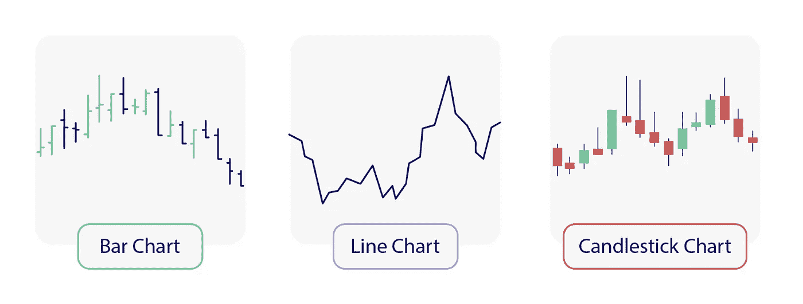
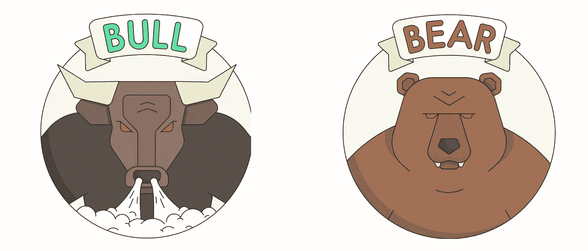
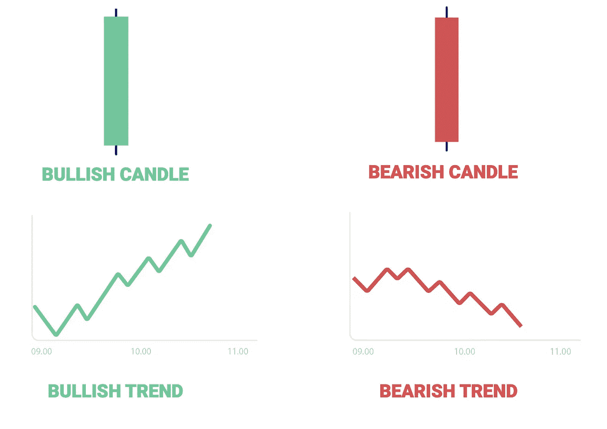
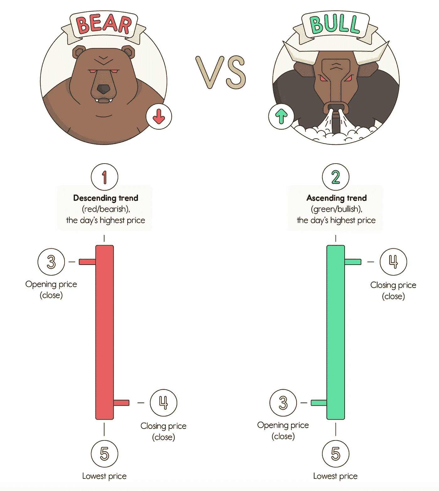

# 如何在加密中使用图表

> 原文：<https://medium.com/coinmonks/how-to-use-charts-in-crypto-7b10ad423ee0?source=collection_archive---------62----------------------->

在我们的 YouTube 上观看视频的同时，享受这个流的资源！

YouTube:[https://youtu.be/I9HJ-YrvPLo](https://youtu.be/I9HJ-YrvPLo)

不和:【https://discord.gg/J73qhkj7kr】T2

推特:【https://twitter.com/CryptoverseDAO】

linktree:[https://linktr.ee/cryptoversedao](https://linktr.ee/cryptoversedao)

-

阅读图表

识别趋势，不管它们是上涨、下跌还是交叉，并且知道它们何时会反转，这是你秘密交易的关键。
无论你交易的是什么资产，你都需要知道如何跟踪图表。

柱形图
柱形图帮助你识别主要趋势，确定交易的进场时间和出场时间
。

折线图
折线图是最简单和最基本的股票图表类型，用于分析
加密市场。折线图显示了加密货币收盘
价格的方向。这很快就能让图表读者看到价格趋势。识别趋势，不管它们是上涨、下跌还是交叉，并且知道它们何时会反转，这是你秘密交易的关键。无论你交易的是什么资产，你都需要知道如何跟踪图表。

蜡烛图
蜡烛图被交易者用来根据过去的模式确定可能的价格变动
。蜡烛图在交易时很有用，因为它们在交易者指定的时间内显示四个价格点(开盘价、收盘价、最高价和最低价)。

牛市和熊市

牛市描述了加密市场的持续上涨。根据定义，市场通常至少增长 20%。

当你开仓买入时，你被认为是看涨。

熊市描述了加密市场的持续下跌。根据定义，市场通常会下降至少 20%。

当你开仓卖出时，你被认为是看跌。

如何阅读蜡烛图

在深入研究加密货币交易世界之前，你需要学习的最重要的事情之一是如何阅读蜡烛图。与折线图或类似的东西相比，蜡烛图能让你更清楚地了解市场的表现，是任何交易者的重要工具。如果你看看下面的图片，我们可以看到
强调了看跌和看涨蜡烛之间的区别，并向你展示了
如何成功解读烛台运动。

> 加入 Coinmonks [电报频道](https://t.me/coincodecap)和 [Youtube 频道](https://www.youtube.com/c/coinmonks/videos)来了解加密交易和投资

# 另外，阅读

*   [如何在 Uniswap 上交换加密？](https://coincodecap.com/swap-crypto-on-uniswap) | [A-Ads 审核](https://coincodecap.com/a-ads-review)
*   [WazirX vs coin dcx vs bit bns](/coinmonks/wazirx-vs-coindcx-vs-bitbns-149f4f19a2f1)|[block fi vs coin loan vs Nexo](/coinmonks/blockfi-vs-coinloan-vs-nexo-cb624635230d)
*   [本地比特币审核](/coinmonks/localbitcoins-review-6cc001c6ed56) | [加密货币储蓄账户](https://coincodecap.com/cryptocurrency-savings-accounts)
*   [什么是保证金交易](https://coincodecap.com/margin-trading) | [美元成本平均法](https://coincodecap.com/dca)
*   [支持卡审核](https://coincodecap.com/uphold-card-review) | [信任钱包 vs MetaMask](https://coincodecap.com/trust-wallet-vs-metamask)
*   [Exness 回顾](https://coincodecap.com/exness-review)|[moon xbt Vs bit get Vs Bingbon](https://coincodecap.com/bingbon-vs-bitget-vs-moonxbt)