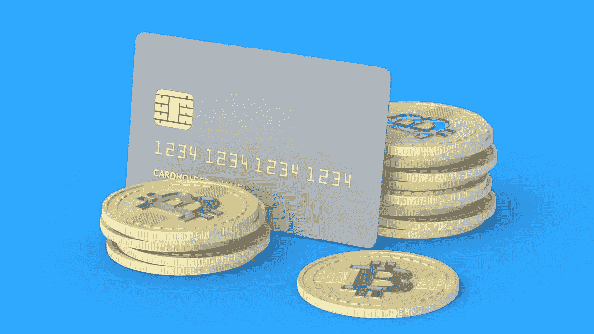

# 如何使用加密进行借记卡购物？

> 原文：<https://medium.com/coinmonks/how-to-use-crypto-to-make-debit-card-purchases-f602005c7be0?source=collection_archive---------59----------------------->

加密借记卡让你在现实世界中使用加密货币。它们在加油站、杂货店和其他零售店很受欢迎。你可以用它购买 NFTs(或其他可以通过加密购买的商品)或将其兑换成政府发行的货币。

如果你拥有比特币或任何其他加密货币，并希望在现实世界中使用，下面是你需要知道的关于获得加密货币借记卡的一切。

How to Use Crypto to Make Debit Card Purchases.

## 什么是加密货币借记卡？

加密借记卡的功能类似于任何普通的银行发行的借记卡，只是它不是与您的银行账户关联，而是与包含您的加密货币的数字钱包关联。

当你每次刷卡时，你持有的加密货币被兑换成你当地的货币，比如美元，来完成你的购买或交易。

## 我如何得到一张加密卡？

你必须首先在加密货币交易所或数字钱包开设一个账户，然后通过[crypto.com](https://crypto.com/cards)等网站向你的账户转账或购买加密货币。

有一个巨大的等待获得卡，这可能需要几个星期或几个月，即使你已经完成了所有的资格标准和设置程序。

## 我可以使用加密的银行借记卡吗？

美国银行、花旗银行或任何其他主要银行的借记卡，这些银行目前在其银行系统中不支持加密货币。但是，你可以在他们的自动取款机上使用你的加密借记卡来兑换现金，但是你的每一笔交易都要收费。

由于对加密货币的兴趣不断上升，数以亿计的个人拥有加密货币，他们愿意消费，但不知道如何消费。这就是加密货币借记卡的用武之地。他们让你在杂货店和其他零售商店消费你的数字钱包里的密码。

> 加入 Coinmonks [电报频道](https://t.me/coincodecap)和 [Youtube 频道](https://www.youtube.com/c/coinmonks/videos)了解加密交易和投资

# 另外，阅读

*   [折叠 App 审核](https://coincodecap.com/fold-app-review) | [Kucoin 交易机器人](/coinmonks/kucoin-trading-bot-automate-your-trades-8cf0ca2138e0) | [Probit 审核](https://coincodecap.com/probit-review)
*   [如何匿名购买比特币](https://coincodecap.com/buy-bitcoin-anonymously) | [比特币现金钱包](https://coincodecap.com/bitcoin-cash-wallets)
*   [币安 vs FTX](https://coincodecap.com/binance-vs-ftx) | [最佳(SOL)索拉纳钱包](https://coincodecap.com/solana-wallets)
*   [比诺莫评论](https://coincodecap.com/binomo-review) | [斯多葛派 vs 3Commas vs TradeSanta](https://coincodecap.com/stoic-vs-3commas-vs-tradesanta)
*   [Capital.com 评论](https://coincodecap.com/capital-com-review) | [香港的加密借贷平台](https://coincodecap.com/crypto-lending-hong-kong)