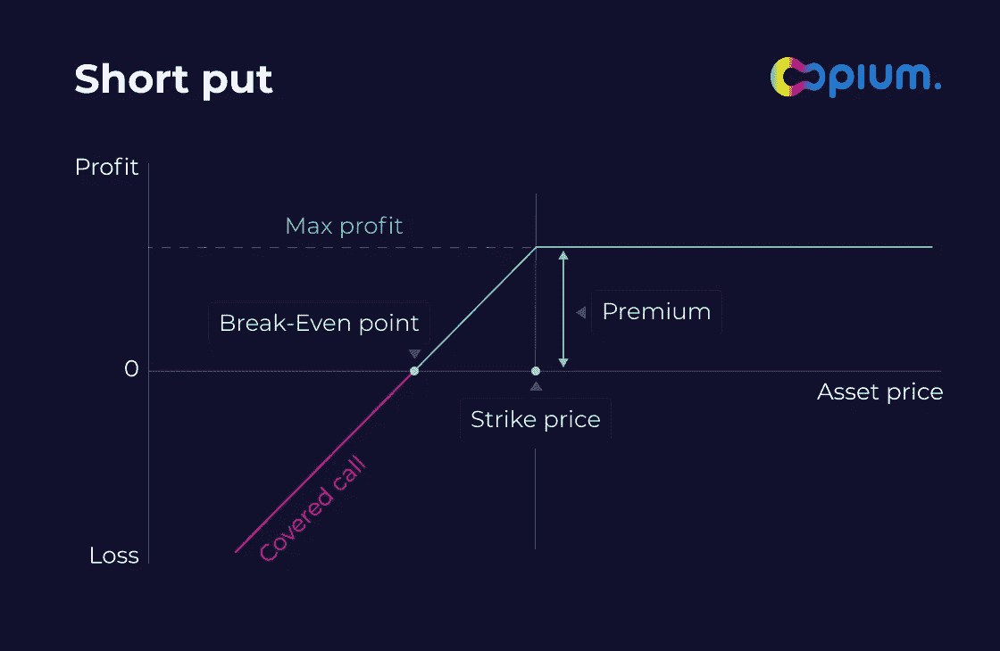
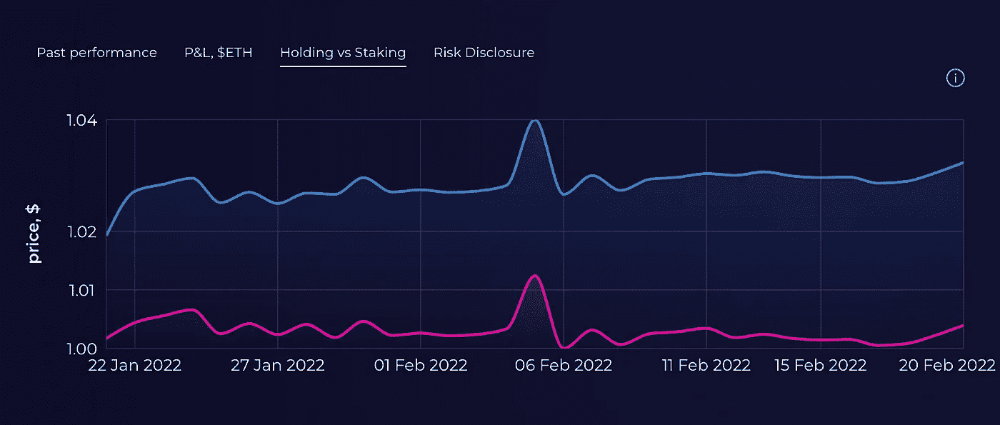
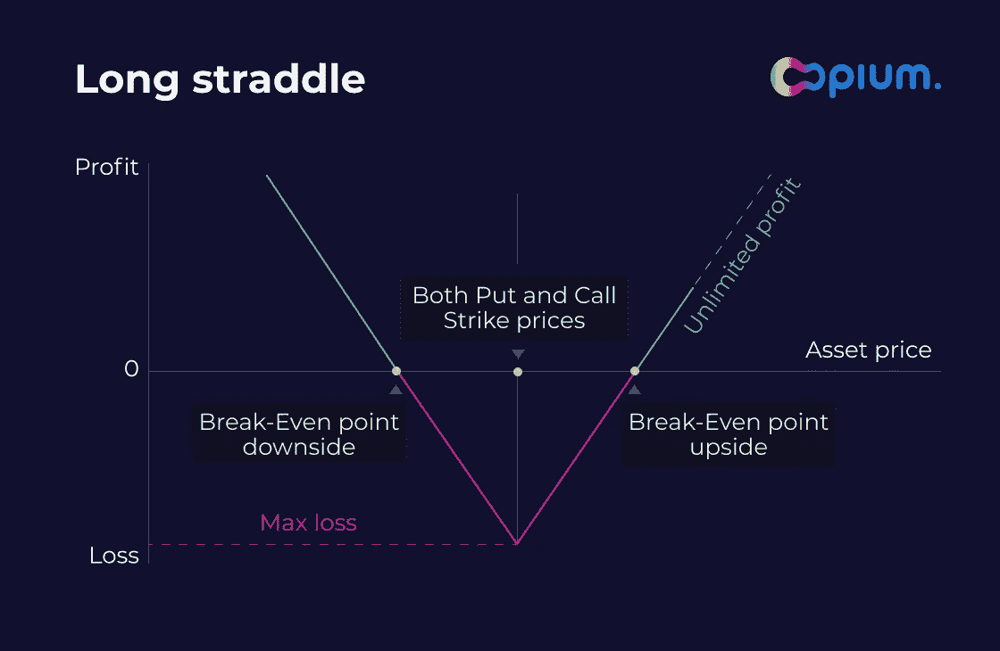

# 如何使用 DeFi 选项金库(DOV):风险和回报

> 原文：<https://medium.com/coinmonks/how-to-use-defi-option-vaults-dov-risks-and-return-c409da91e4ea?source=collection_archive---------0----------------------->

“DeFi 选项金库”可能是极其危险或极其强大的工具

This article is a personal view, not a financial advise

# 介绍

最近有很多关于 DeFi 选项金库(DOV)的讨论；一些人认为这是一种神奇的工具，而另一些人则完全害怕，认为这是一种只会让你输钱的工具。

**真相介于两者之间。让我们试着弄清楚……**

> *剧透:DeFi 期权策略是放大你的市场定位收益率的好方法，但不是被动的回报工具。*

通常，职业交易员和基金经理会将这种策略与他们的市场定位结合起来使用。期权(以及一般的衍生品)是增加或消除投资组合风险的很好的工具，但通常它们并不意味着是完全的头寸。

> ***洞察 1:将期权与你的投资组合或交易策略结合起来。***

关键是将期权策略或自动保险库与您的观点保持一致，这最终会增加您愿意承担的风险，从而提高您投资组合的风险/回报和资本效率。无风险意味着无回报，但对一个人来说被认为是风险的东西，对另一个人来说可能是机会(例如:持有加密货币；有些人会说这是极其危险的，有些人喜欢大量持有。

People have different views

*让我们考虑一个简单的例子:如果我有一个长期持有 ETH 的策略(#hodler 策略)，我也可以考虑一个“smart #hodler”策略。这个策略会考虑到我个人的信念，即在加密波动中存在机会。*

*我想 I)每次大幅下跌时买入 ETH，ii)如果 ETH 上涨过快，我想卖出。在第一种情况下，我相信 ETH 会复苏，我可以以更高的价格出售一部分，或者持有更长时间。在第二种情况下，我相信我可以回购 ETH，因为它很可能会向下修正，但即使不是这样，我也可以高价卖出一点。*

在这个例子中，选项可以很好地帮助我。每周我都可以卖出一份看涨期权，如果它在一周内上涨了 35%，我就可以卖出我的部分期权。同时，如果 ETH 在一周内下跌 35%,我可以卖出买入 ETH 的看跌期权。通过这样做，我收到了两倍的保费。即使我的期权从未被执行，我的资本也能获得 10-20%的年利率。看起来比使用限价单更好，它也能约束我遵循选择的策略(大多数人害怕在低点买入，然后后悔)。

与限价单的主要区别在于，只有当价格在周五上午(世界协调时上午 8 点是许多 CeFi 和 DeFi 市场的全球期权结算时间)保持高位/低位时，买入期权才会被执行。因此，如果价格在周三大幅下跌*，并在周四反弹，将不会发生任何事情，而限价单将被执行。这有利有弊。*

# dov 的错误用法

由于最近 Ribbon 的一些清算，人们很快就失去了金钱，因此受到了很多批评。

任何人都不应该认为期权买入策略是被动收入的来源，即你买入资产并获得免费回报。同样，你应该准备好执行期权，而不要感到难过。没有人会认为期权销售策略是被动收入的来源

> ***洞察力 2:如果你不了解所有潜在的风险和机制，千万不要交易期权。人们可能会失去所有的资金。***

我要再说一遍，使用 dov 进行被动返回是一个错误的概念。期权通常有两种结算方式——实物交割或现金结算。在第一种情况下，你将实际交易你的标的资产，但在第二种情况下(这更受欢迎)，你需要在到期日(周五上午)自己买入或卖出你的资产，届时你从 DOV 获得的资金刚好够进行此类交易。

*例:你在参与写看跌期权的金库，假设你入股 2000 戴，如果一周内 ETH 从现在的 3000 下跌，愿意买入。[目前现有保险库中的实际数字]*

*如果周五上午 ETH 值 1900 戴，你按约定以 2000“卖出”了，恭喜你。你应该得到 1 ETH 而不是你的股份，但你将戴定居。你从金库里拿了 1900 戴(按 1900 戴的市场价等于 1 ETH)，所以换算成 1 ETH 正好是这个数，但是你得在周五早上自己做。*

*部分金库【鸦片 2.0 会有实物交割的功能，但据我所知现在所有 DeFi 金库和大部分传统衍生品都有现金结算机制】。*

# 简单的策略

**不是财务顾问，也请注意，美国人或其他被禁止的司法管辖区不允许使用鸦片金融**

这些简单的策略已经被一些项目在 DeFi 中实现了，让我们仔细看看。

## 掩护性买权

将持有标的资产与在高价时卖出看涨期权相结合。如前所述，适合那些在市场上涨过多时愿意卖出的投资者。

这种策略的实施很少，例如在 Opium，它通过算法进行了微调，选择一个尽可能远离现货(但仍具有流动性)的执行价格(以最小化风险，并使用 2 倍杠杆来优化风险/回报和资本效率)。鸦片社区选择这些参数而不是较低的打击，以最大限度地降低处决的风险，并认为这符合“如果价格涨得很高，我就想卖掉”的想法。

opium.finance

opium.finance

there are risks

## 完全卖空

如果市场下跌太快，每周都有额外收益，直接下单购买资产。

Opium community implementation 也有类似的想法——通过算法选择一个尽可能远离现货的执行价格(以最小化风险，并使用 2 倍杠杆来优化风险/回报和资本效率)。鸦片社区选择这些参数而不是较低的打击，以最大限度地降低处决的风险，并认为这符合“如果价格走低，我就想买”的想法。

opium.finance

opium.finance

there are risks

# 剧透:一些高级策略

选项允许根据您的风险状况微调您的风险敞口。人们在金融市场上使用一些典型的策略，让我们来看几个。我们的社区将它们构建为鸦片 2.0 的一部分。对这些策略的全面分析将很快出现在另一篇研究文章中。

> 对这种策略的全面分析将很快出现在另一篇研究文章中

## 短暂的窒息——固定的上升空间，无限的下降空间

你从标的资产的价格变动中获利很少或没有。

## 多头——无限上涨，固定下跌

你可以从上涨和下跌中获得无限的利润(长期波动)。

## 有盖衣领——上部固定，下部固定

确保你的资产不受任何一方大幅波动的影响(下跌保险由放弃上涨赞助，即写一份看涨期权)

这相当于备兑买入策略加上保护性看跌期权(这将消耗收益率)。

# 当前 dov

目前在假设上存在一些差异，它们主要在实现上有所不同。

它们各有利弊，有些关注高 delta(履约价格接近当前现货价格)，但很少关注较低 delta(履约价格远离当前现货)。敬请期待

鸦片协议是一个通用且强大的 DeFi 协议，允许创建、结算和交易分散的衍生产品类似物。

[**探索鸦片协议**](https://docs.opium.network/) **或** [**尝试鸦片金融**](https://opium.finance/)

保持消息灵通，跟随[**鸦片。团队推特**](https://twitter.com/Opium_Network) **。**

***您知道吗，您可以通过订阅我们的*** [***新闻频道***](https://t.me/OpiumFinance) ***获取更精彩的新闻，送到您的早间咖啡里？***

*   **受条款和条件的约束***不提供财务建议，且在某些司法管辖区被禁止***

> 加入 Coinmonks [电报频道](https://t.me/coincodecap)和 [Youtube 频道](https://www.youtube.com/c/coinmonks/videos)了解密码交易和投资

# 此外，请阅读

*   [最佳密码交易信号电报](/coinmonks/best-crypto-signals-telegram-5785cdbc4b2b) | [月度报告](/coinmonks/moonxbt-review-6e4ab26d037)
*   [如何用比特币购买柴犬(SHIB)币？](https://coincodecap.com/buy-shiba-bitbns) | [购买弗洛基](https://coincodecap.com/buy-floki-inu-token)
*   [CoinFLEX 点评](https://coincodecap.com/coinflex-review) | [AEX 交易所点评](https://coincodecap.com/aex-exchange-review) | [UPbit 点评](https://coincodecap.com/upbit-review)
*   [10 大最佳密码博客](https://coincodecap.com/best-cryptocurrency-blogs) | [您的在线评论](https://coincodecap.com/youhodler-review)
*   [EndEx 融资融券](https://coincodecap.com/ascendex-margin-trading) | [Bitfinex Staking](https://coincodecap.com/bitfinex-staking)
*   [Best Cardano 钱包](https://coincodecap.com/best-cardano-wallets)|[bing bon Copy Trading](https://coincodecap.com/bingbon-copy-trading)
*   [印度最佳 P2P 加密交易所](https://coincodecap.com/p2p-crypto-exchanges-in-india) | [Shiba Inu 钱包](https://coincodecap.com/baby-shiba-inu-wallets)