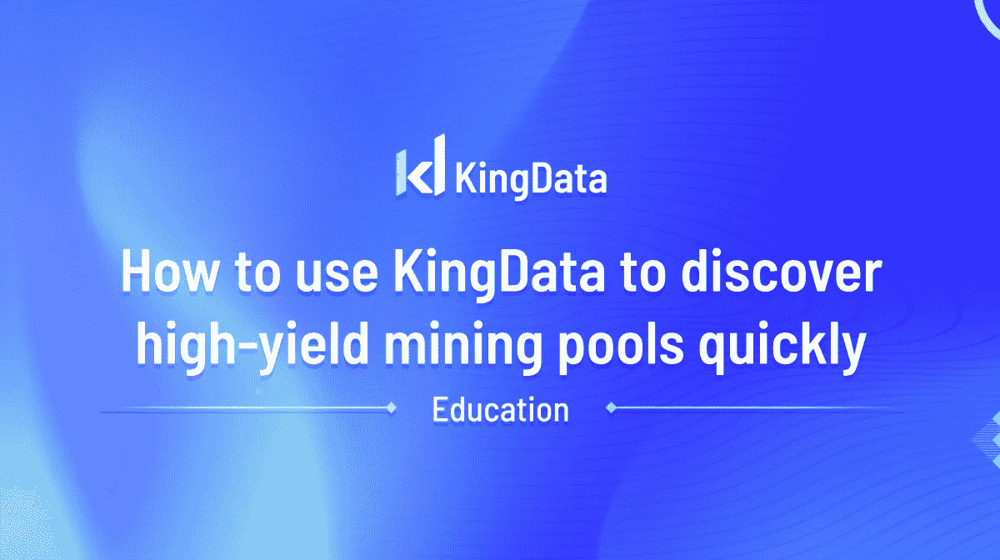
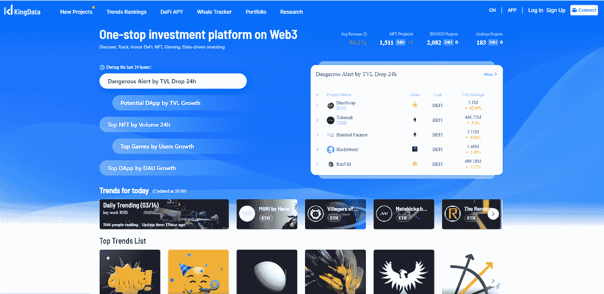
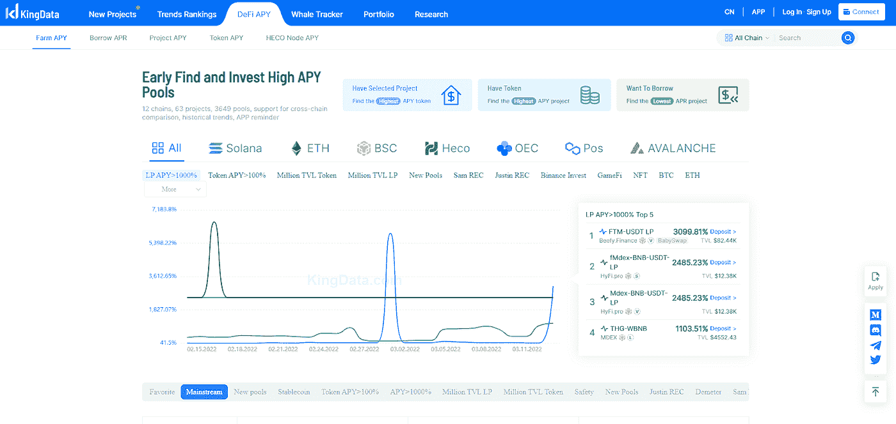
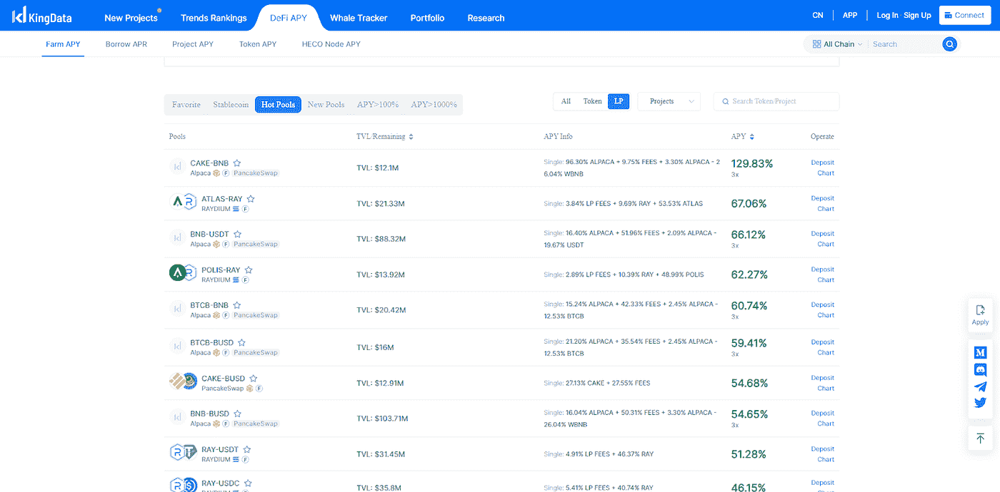

# 如何利用组态王快速发现高产矿池

> 原文：<https://medium.com/coinmonks/how-to-use-kingdata-to-discover-high-yield-mining-pools-quickly-9842a3d4a62c?source=collection_archive---------52----------------------->

加密货币矿池是赚取额外收入的好方法，但选择正确的矿池很重要。有许多因素需要考虑，如费用、支出、最低支出阈值和池难度。在本帖中，我们将看看如何在 Kingdata 上找到一些目前可用的[最佳高产矿池](https://kingdata.com/apy/mining?lang=en)。无论你是一名经验丰富的矿工还是刚刚起步，总有一个游泳池适合你。我们开始吧！

# 需要注意的两个关键问题

*   **透明度**

在研究矿池时，有许多事情需要考虑。一个重要的因素是，他们是否有一个实时仪表板，带来关于他们的总散列率的透明度和诚实性，以及其他迹象，如使用较低的支付方案可能会给你一个想法，如果这种类型的服务也值得你花时间！

*   **稳定**

在加入矿池之前，你需要做的一件事是评估它的稳定性。稳定性是指影响您利润的所有因素的总和，例如是否存在任何停机时间，在此期间，除非其他人能够访问(并控制)通过其网络的令牌流量，否则如果他们在此过程中遭到黑客攻击，可能会导致他们遭受财务损失！你还应该看看每一种都提供什么样的连接:它是否只利用不受 VPN 等特殊保护措施保护的开放互联网链接？攻击地形可能仅仅是因为更多的人使用这些类型吗？

# 如何在 Kingdata 上发现高产矿池？

1.  去 Kingdata.com 金数据网站。

2.点击页面顶部栏上的 Defi APY，然后点击 APY 农场。

3.向下滚动，并根据特定标准选择您想要的池。KingData 的算法是这样构建的，即默认列表按 APY 值排列，但您也可以检查具有不同 tvl 的挖掘池。

4.一旦你点击任何一个池，它会打开池的细节，你可以从右上角的网页存款。

或者，你可以从 DeFi APY 页面轻松查看高收益池。

有选择找到最高的 APY 令牌，最高的 APY 项目，最低的 APR 项目。

需要注意的一件事是你想要投资的资金池的 TVL。这让你对这个项目感兴趣的程度有一个概念。值得庆幸的是，你需要的所有信息都可以在 Kingdata 的页面上找到，而且你只能在各种矿池平台上降低流动性。

> 加入 Coinmonks [电报频道](https://t.me/coincodecap)和 [Youtube 频道](https://www.youtube.com/c/coinmonks/videos)了解加密交易和投资

# 另外，阅读

*   [购买 Dogecoin 的 7 种最佳方式](https://coincodecap.com/ways-to-buy-dogecoin) | [ZebPay 评论](https://coincodecap.com/zebpay-review)
*   [最佳期货交易信号](https://coincodecap.com/futures-trading-signals) | [流动性交易所评论](https://coincodecap.com/liquid-exchange-review)
*   [火币加密交易信号](https://coincodecap.com/huobi-crypto-trading-signals) | [Swapzone 审查](/coinmonks/swapzone-review-crypto-exchange-data-aggregator-e0ad78e55ed7)
*   最佳[密码交易机器人](https://coincodecap.com/best-crypto-trading-bots) | [购买索拉纳](https://coincodecap.com/buy-solana) | [矩阵导出评论](https://coincodecap.com/matrixport-review)
*   [Coldcard 评论](https://coincodecap.com/coldcard-review) | [BOXtradEX 评论](https://coincodecap.com/boxtradex-review)|[uni swap 指南](https://coincodecap.com/uniswap)
*   [比特币基地评论](/coinmonks/coinbase-review-6ef4e0f56064) | [德里比特评论](/coinmonks/deribit-review-options-fees-apis-and-testnet-2ca16c4bbdb2) | [FTX 评论](/coinmonks/ftx-crypto-exchange-review-53664ac1198f)