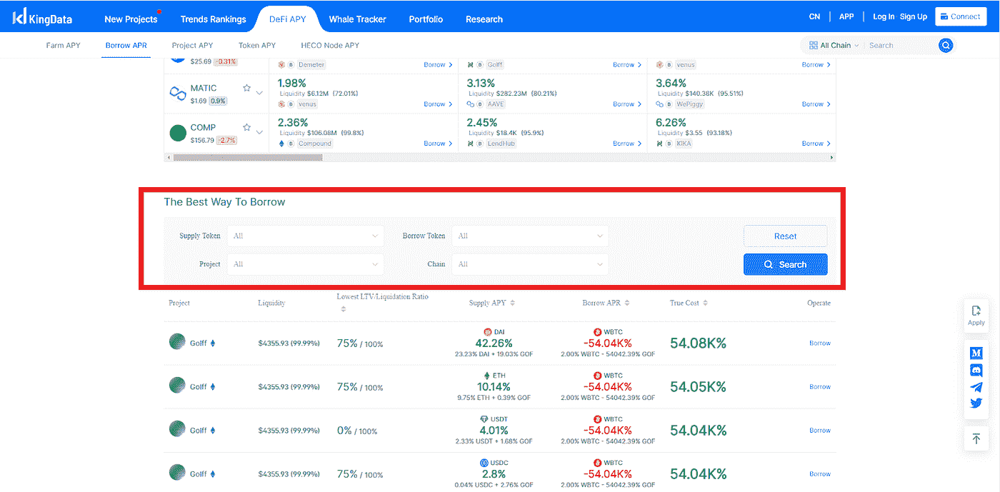

# 如何使用 Kingdata 发现最佳借贷路径

> 原文：<https://medium.com/coinmonks/how-to-use-kingdata-to-discover-the-best-lending-path-5150a2c3b5aa?source=collection_archive---------67----------------------->

# 可以借或借密码吗？

加密现在风靡一时，但它可能不是你所想的那样。关于加密有两个主要的误解——一个认为持有你的硬币是让它们随着时间推移增值的唯一方法，另一个认为贷款平台不会提供比传统银行更好的利率。真相？这取决于谁在讲述他们的故事。

在本文中，我们将重点解决第二个误解，并向您展示如何使用 [KingData](https://kingdata.com/apy/mining?lang=en) 获得最佳贷款服务。

# 什么是密码借贷平台？

最近，DeFi 运动受到了消费者和投资者前所未有的关注。这种趋势在当今社会中表现出来的一种方式是，个人转向使用加密货币作为他们与世界各地各种贷款人的贷款合同的抵押来借钱，这些贷款人根据你居住的地方或他们接受的支付货币类型提供不同的利率。在我们太超前之前，让我们用简单的话来定义加密贷款。

# 什么是加密贷款？

加密贷款是一种根据利率出借加密货币或法定货币的方法。因此，这或多或少类似于传统的银行系统，根据最适合双方的规模和期限，以不同的回报率提供贷款，这也包括风险。

加密贷款是加密货币所有者赚取被动收入的一种相对较新的创新方式。贷款人通常有更多的货币，因此他们正在寻找机会，使他们的投资能够产生收入，而无需为他们做太多工作或承担风险，如果出现问题，可能会导致资金损失。尽管这两个过程初看起来很相似，但它们之间还是有一些关键的区别。

加密贷款不同于传统贷款，因为促进这些交易的平台在这一过程中发挥着重要作用。

# 如何在 KingData 上借用 crypto？

在 Kingdata 上借款相对容易。它只需要几个步骤，包括:

1.  首先，访问 [kingdata 平台](https://kingdata.com/)、

Image from: KingData Home page

2.在显示的选项卡上，将光标移动到**定义 APY** (如果您使用的是移动设备，您必须点击它)

Image from KingData

3.一些标签会以白色弹出。点击**借四月**

Image from KingData

4.向下移动到“借款 APR”页面，在**“最佳借款方式”**中，输入您希望在贷款中看到的标准，包括您想要借款的令牌、抵押品(供应令牌)和链。

Image from KingData

5.输入您的标准后，点击**搜索**，您将看到符合您标准的项目。你可以从那里借。

Image from KingData

或者，你可以去 https://kingdata.com/apy/loan?lang=en 的[从上面的(5)继续。](https://kingdata.com/apy/loan?lang=en)

# 如何选择密码借贷平台？

当你寻找合适的加密贷款平台时，有许多因素需要考虑。其中包括他们的费用和费率，以及他们采取的保护用户免受欺诈或盗窃的安全措施。

# 利率

选择加密贷款平台的最佳方式是查看他们收取的利率。确保这些符合你想借多少钱和你什么时候还钱。

# 费用

重要的是要考虑不同的加密贷款平台的成本时，选择一个。

# 平台风险

你还应该注意你所借的加密贷款平台会带来什么样的风险。

# 贷款期限

当借用密码时，特别是在短期基础上，你承诺的时间长度是很重要的。对于可能需要快速存取或长期存储选项的贷款人来说，这是一个很好的做法，这样他们就可以相应地对冲他们的头寸。

# 担保金额

这是一个非常重要的因素来考虑选择你的加密贷款平台。你需要抵押品来借一定数量的钱，如果你没有抵押品，那么贷方就不会把钱借出去。

# 最低存款限额

在你根据自己的需要选择任何加密贷款平台之前，请确保检查他们是否对存款有任何特定的要求。

# 关于 Kingdata

[KingData](https://kingdata.com/) 平台处理来自各种来源的信息，包括公共记录和私人实体。然后，这些数据被编译成一种易于访问的格式，供企业和个人使用。KingData 就像 DeFi 的百科全书，拥有超过 3000 个池和一些最低的 APR 可供借用。

> 加入 Coinmonks [电报频道](https://t.me/coincodecap)和 [Youtube 频道](https://www.youtube.com/c/coinmonks/videos)了解加密交易和投资

# 另外，阅读

*   [3 商业评论](/coinmonks/3commas-review-an-excellent-crypto-trading-bot-2020-1313a58bec92) | [Pionex 评论](https://coincodecap.com/pionex-review-exchange-with-crypto-trading-bot) | [Coinrule 评论](/coinmonks/coinrule-review-2021-a-beginner-friendly-crypto-trading-bot-daf0504848ba)
*   [莱杰 vs Ngrave](/coinmonks/ledger-vs-ngrave-zero-7e40f0c1d694) | [莱杰 nano s vs x](/coinmonks/ledger-nano-s-vs-x-battery-hardware-price-storage-59a6663fe3b0) | [币安评论](/coinmonks/binance-review-ee10d3bf3b6e)
*   [Bybit Exchange 评论](/coinmonks/bybit-exchange-review-dbd570019b71) | [Bityard 评论](https://coincodecap.com/bityard-reivew) | [Jet-Bot 评论](https://coincodecap.com/jet-bot-review)
*   [3 commas vs crypto hopper](/coinmonks/3commas-vs-pionex-vs-cryptohopper-best-crypto-bot-6a98d2baa203)|[赚取加密利息](/coinmonks/earn-crypto-interest-b10b810fdda3)
*   最好的比特币[硬件钱包](/coinmonks/hardware-wallets-dfa1211730c6) | [BitBox02 回顾](/coinmonks/bitbox02-review-your-swiss-bitcoin-hardware-wallet-c36c88fff29)