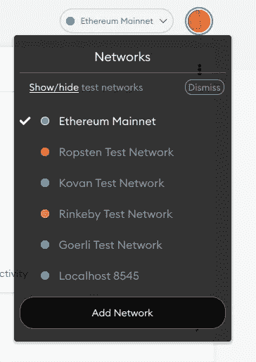
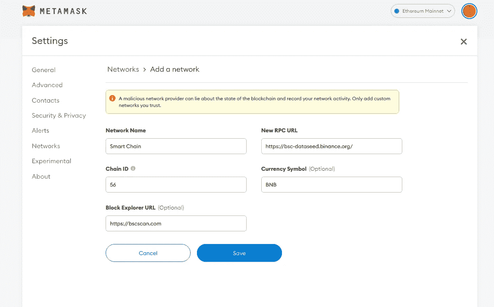
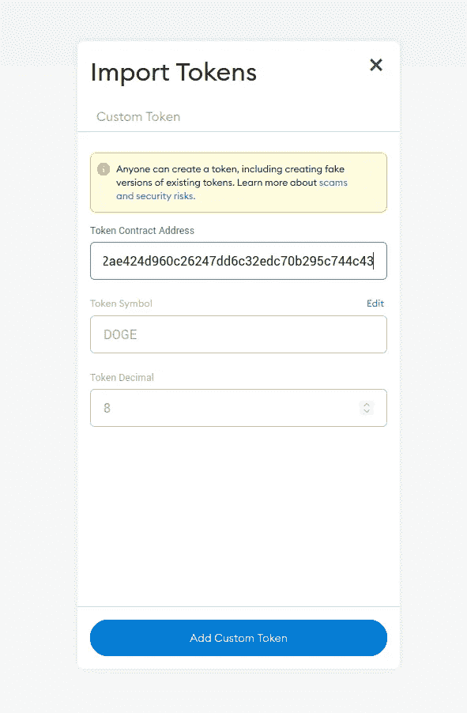

# 如何使用 MetaMask？加密钱包

> 原文：<https://medium.com/coinmonks/how-to-use-metamask-a-crypto-wallet-5d425912c86?source=collection_archive---------13----------------------->

[MetaMask](https://metamask.io/) 是一个流行且成熟的浏览器扩展，其功能相当于一个连接到[以太坊](https://coinmarketcap.com/currencies/ethereum/)区块链的[加密货币钱包](https://coinmarketcap.com/alexandria/glossary/hot-wallet)。MetaMask 允许用户与以太坊生态系统进行交互，该生态系统托管了大量的[去中心化应用(dapp)](https://coinmarketcap.com/alexandria/glossary/decentralized-applications-dapps)，而不必在他们的设备上下载整个[区块链](https://coinmarketcap.com/alexandria/glossary/blockchain)。

# **如何下载 MetaMask？**

一定要用 MetaMask 官网下载 Metamask 扩展或者 MetaMask App。[这里](https://metamask.io/)是 MetaMask 的官方网站，或者去 google 向下搜索 metamask，点击第一个结果。

Click on First result Download | MetaMask

单击为您的浏览器安装元掩码

Install and add to browser

一旦您将元掩码扩展添加到浏览器中，您将在扩展位置(浏览器的右上角)看到狐狸图标。点击那个。

您将被重定向到欢迎页面，请从这里开始。
现在，您可以选择创建一个新的钱包或导入一个带有机密短语的现有钱包。

如果您想导入钱包，您可以使用秘密恢复短语。我们将在后面讨论这个过程。因为我们是新的，我们将创建一个钱包。阅读并同意，然后继续前进。设置密码保密。

遵循给出的说明。降落到秘密恢复短语和复制和保存这个短语在多个地方像一个笔记本，word 文件和移动笔记在秘密的地方，因为你会添加真正的加密钱在这里。

Copy and save recovery phrase

在下一页写下你的秘密短语。祝贺您设置了您的第一个 MetaMask 钱包。

现在在右上方，你会看到以太坊的主网络，在这里你会发现所有的区块链网络。在下一节中，您将学习如何添加新网络和令牌。

# 添加网络和令牌

单击添加网络以添加新网络。你将登陆这一页。

Add network page

您需要添加这些字段。你需要去网络的官方网站。比如我正在增加一个 BNB 网络。搜索 BNB 网络和谷歌，找到网络细节。[这个](https://academy.binance.com/en/articles/connecting-metamask-to-binance-smart-chain)是 BNB 的网页。

您可以在“添加网络”页面上输入这些详细信息并保存。

您将看到此网络已添加到“network”部分，现在您可以在此添加 BNB 供电令牌。您可以在合同地址部分检查[https://coinmarketcap.com/](https://coinmarketcap.com/)哪些令牌正在使用 BNB 智能链。

## 向网络添加令牌

您可以通过单击 BNB 页面上的导入令牌按钮来导入选定网络中的令牌。

从现有代币的 coin market cap 网站获取您的合同地址，或者您可以在此处使用您的合同地址来获取新代币。

您可以在这里查看部署在 BNB 智能链上的 DOGE coin 合同地址。

添加此令牌这将被添加到您的 BNB 网络部分。

现在，您可以从帐户 1 地址发送或接收总督和 BNB 令牌。点击复制按钮，您可以使用此地址进行交易。

希望这篇文章能帮助你在元掩码设置，添加网络，添加令牌，发送和接收令牌。

感谢您阅读本文。你可以在回复区分享你的想法给喜欢。

快乐阅读。

> 加入 Coinmonks [电报频道](https://t.me/coincodecap)和 [Youtube 频道](https://www.youtube.com/c/coinmonks/videos)了解加密交易和投资

# 另外，阅读

*   [OKEx vs KuCoin](https://coincodecap.com/okex-kucoin) | [摄氏替代品](https://coincodecap.com/celsius-alternatives) | [如何购买 VeChain](https://coincodecap.com/buy-vechain)
*   [ProfitFarmers 回顾](https://coincodecap.com/profitfarmers-review) | [如何使用 Cornix Trading Bot](https://coincodecap.com/cornix-trading-bot)
*   [如何匿名购买比特币](https://coincodecap.com/buy-bitcoin-anonymously) | [比特币现金钱包](https://coincodecap.com/bitcoin-cash-wallets)
*   [瓦济里克斯 NFT 评论](https://coincodecap.com/wazirx-nft-review) | [比茨盖普 vs 皮奥克斯](https://coincodecap.com/bitsgap-vs-pionex) | [坦吉姆评论](https://coincodecap.com/tangem-wallet-review)
*   [如何使用 Solidity 在以太坊上创建 DApp？](https://coincodecap.com/create-a-dapp-on-ethereum-using-solidity)
*   [币安 vs FTX](https://coincodecap.com/binance-vs-ftx) | [最佳(SOL)索拉纳钱包](https://coincodecap.com/solana-wallets)
*   [如何在 Uniswap 上交换加密？](https://coincodecap.com/swap-crypto-on-uniswap) | [A-Ads 审核](https://coincodecap.com/a-ads-review)
*   [加密货币储蓄账户](/coinmonks/cryptocurrency-savings-accounts-be3bc0feffbf) | [YoBit 评论](/coinmonks/yobit-review-175464162c62)