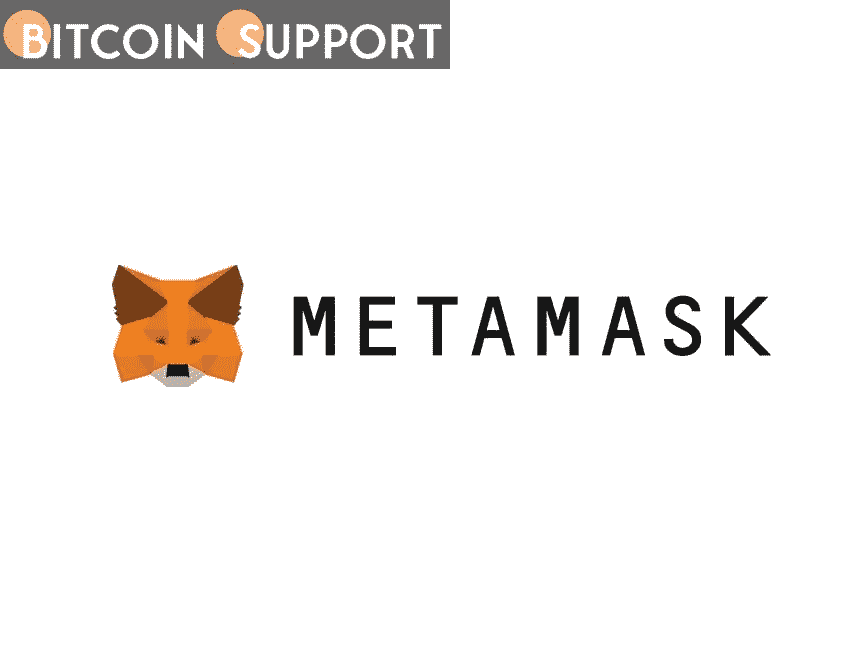

# 如何使用 MetaMask 存储比特币？

> 原文：<https://medium.com/coinmonks/how-to-use-metamask-to-store-bitcoin-8ffab1e7e5e1?source=collection_archive---------44----------------------->

**Visit our website for full blog:-**[**https://bitcoinsupports.com/how-to-use-metamask-to-store-bitcoin/**](https://bitcoinsupports.com/how-to-use-metamask-to-store-bitcoin/)

On MetaMask, only Wrapped Bitcoin (wBTC) can be kept, as this wallet is optimised for Ethereum-enabled distributed applications.

MetaMask is a well-known Ethereum wallet for decentralised applications (dApps). However, can MetaMask store Bitcoin (BTC), the world’s largest cryptocurrency?

Bitcoin is a significant portion of the portfolios of many cryptocurrency investors. Apart from being an investment vehicle, Bitcoin can also be used as a means of payment. Paying with blockchain technology has gotten considerably easier thanks to wallets like as MetaMask. This Ethereum cryptocurrency wallet enables millions of investors to access the whole cryptocurrency market. Even though Ether (ETH) is a fairly popular payment method, the majority of consumers purchase Bitcoin.

However, when it comes to purchasing a non-fungible token (NFT) or investing in decentralised finance, Bitcoin is not the cryptocurrency that comes to mind (DeFi). Nonetheless, there may be instances in which you wish to do these transactions using Bitcoin. As a result, this post will teach you how to store Bitcoin using the MetaMask!

**Cryptocurrency wallet MetaMask**

MetaMask is an Ethereum wallet that is available as a mobile application and as a browser extension. MetaMask, in other terms, enables users to safely store their private keys and subsequently access apps and websites that incorporate Ethereum-based DApps and smart contracts. MetaMask, one of the most popular cryptocurrency wallets, just reached the 30 million user milestone in March 2022\. This is partly because decentralised finance (DeFi) and nonfungible coins have grown in popularity (NFTs).

**Is MetaMask only compatible with Ethereum?**

MetaMask is exclusively compatible with Ethereum-based coins, referred to as ERC-20 tokens. If you wish to use another type of token (i.e., one that is not an ERC-20 token), you must swap it for an ERC-20 token. Then, these tokens could be stored in your MetaMask.

Zcash is an example of this, as it is a cryptocurrency designed for anonymous transactions. Due to the fact that this cryptocurrency is not based on the Ethereum network, it is not an ERC-20 token. However, you can continue to utilise Zcash by wrapping Zcash tokens.

**Hardware wallet MetaMask**

Protecting cryptocurrencies is frequently mentioned when people begin their cryptocurrency investigation. It is critical, which is why a nice wallet is necessary. A hardware wallet is frequently recommended since it enables offline storage of your cryptocurrency. However, is MetaMask a hardware wallet as well?

MetaMask is a software wallet, not a hardware wallet. It is a digital wallet that runs on a computer. These wallets, sometimes known as hot wallets, are internet-connected. Nonetheless, MetaMask may be connected to a hardware wallet. This manner, you can also use MetaMask with the most popular hardware wallet, the Ledger.

To do so, launch the ETH app and choose “Connect Hardware Wallet” to sync your Ledger hardware wallet with MetaMask. A pop-up window will then appear, requesting that you select your device and click “Connect.”

When a Ledger is used in conjunction with the MetaMask browser plugin, the software wallet acts as a portal rather than a wallet. Due to the fact that your private keys never leave the Ledger, they are not saved on MetaMask.

**Is MetaMask compatible with Bitcoin?**

MetaMask supports Bitcoin, although not in the same way that an exchange wallet does. Because Bitcoin is not an ERC-20 token, it is not directly accepted by MetaMask. However, there is a backdoor way to add BTC to your MetaMask.

Having stated that, avoid sending Bitcoin directly to your MetaMask. If you attempt this, MetaMask will be unable to accept the token, perhaps resulting in undesirable effects. You risk losing all of the Bitcoin you’ve transferred all at once, which would be a nightmare scenario!

**What is the best way to send Bitcoin to MetaMask?**

As previously stated, BTC cannot be sent directly to MetaMask. However, this does not mean that Bitcoin cannot be added to your MetaMask wallet. BTC is decentralised and operates on its own blockchain. Transactions on the Bitcoin blockchain can only be transmitted to Bitcoin addresses. This is true not just for Bitcoin, but for other blockchains as well, including Ethereum.

On the Ethereum blockchain, only Ethereum-related tokens can be sent. Bitcoin is equal to paying with the euro in the United States when sent over the Ethereum network. Although the euro is not acknowledged as a money in the United States, you can use it in a circumstantial manner. By exchanging these euros, you can obtain the equivalent amount in US dollars and utilise them as payment.

Nonetheless, if you’re not interested in exchanging your Bitcoin for Ethereum, there are alternative methods. This means that you must first secure your BTC and then transfer it to the Ethereum blockchain in the form of a new token that reflects the Bitcoin securely stored on the Bitcoin blockchain. Additionally, this is referred to as Wrapped Bitcoin (wBTC), which refers to Bitcoin as an ERC-20 token.

**How should Bitcoin be wrapped?**

There are numerous methods for wrapping your Bitcoin. Consider the case of Binance. BTC and wBTC are two distinct tokens on Binance, and so can be traded. By selecting “Classic” from the Binance Trade section, you will be directed to the exchange’s trading site. This is the trading pair for both Bitcoin tokens. Here, you can input the amount of WBTC you wish to purchase and confirm your selection by clicking on Buy WBTC.

**What if your wBTC is not shown in your MetaMask? This can be easily changed by following the procedures below:**

**Address of the MetaMask wallet**

To put your wBTC to work, the wallet address associated with your MetaMask is critical and easily accessible. After launching the application and logging in, you will be taken to the MetaMask home screen. Your unique code, which serves as your address, is located beneath your user name. This address is suitable for receiving crypto.

You may share this code with others, but you must never disclose any of the other codes. Your login and recovery information are intended to safeguard your valuables. If others obtain these codes, they may abuse them, resulting in the loss of your crypto assets.

**Alternatives to MetaMask**

While MetaMask is a well-known software wallet, there are numerous alternatives. Due to the diversity of blockchains, numerous wallets are optimised for a single blockchain. Cardano’s Yoroi wallet and Solana’s Phantom wallet are two examples.

Numerous software wallets are compatible with the Ethereum blockchain’s ERC-20 tokens. The advantage of MetaMask is that it can be used on both websites and mobile applications. This is the point at which MetaMask differentiates itself from its competitors.

For example, the Trust Wallet is a well-respected software wallet that may be used as a mobile application in place of MetaMask. MetaMask alternatives include MyEtherWallet and Mist Wallet, two internet wallets that accept ERC-20 tokens.

Although MetaMask is the most popular all-purpose software wallet, using different wallets is never a bad idea. Using multiple wallets is a risk management technique. By utilising numerous wallets, you will avoid losing all of your crypto assets if a single wallet is compromised.

**Visit our website for full blog:-**[**https://bitcoinsupports.com/how-to-use-metamask-to-store-bitcoin/**](https://bitcoinsupports.com/how-to-use-metamask-to-store-bitcoin/)

**Disclaimer: These are the writer’s opinions and should not be considered investment advice. Readers should do their own research.**

> 加入 Coinmonks [电报频道](https://t.me/coincodecap)和 [Youtube 频道](https://www.youtube.com/c/coinmonks/videos)了解加密交易和投资

# 另外，阅读

*   [霍比评论](https://coincodecap.com/huobi-review) | [OKEx 保证金交易](https://coincodecap.com/okex-margin-trading) | [期货交易](https://coincodecap.com/futures-trading)
*   [网格交易机器人](https://coincodecap.com/grid-trading) | [Cryptohopper 审查](/coinmonks/cryptohopper-review-a388ff5bae88) | [Bexplus 审查](https://coincodecap.com/bexplus-review)
*   [7 个最佳零费用加密交易平台](https://coincodecap.com/zero-fee-crypto-exchanges)
*   [氹欞侊贸易评论](https://coincodecap.com/anny-trade-review) | [火币保证金交易](/coinmonks/huobi-margin-trading-b3b06cdc1519)
*   [分散交易所](https://coincodecap.com/what-are-decentralized-exchanges) | [比特 FIP](https://coincodecap.com/bitbns-fip) | [Pionex 评论](https://coincodecap.com/pionex-review-exchange-with-crypto-trading-bot)