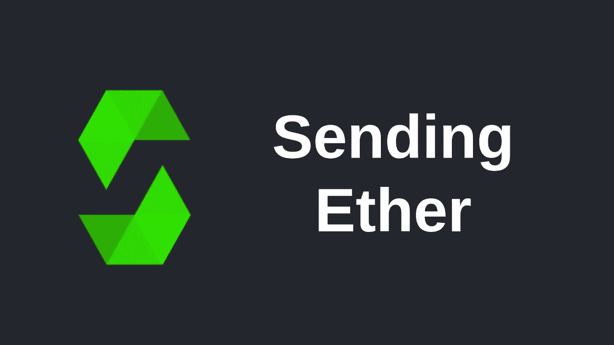
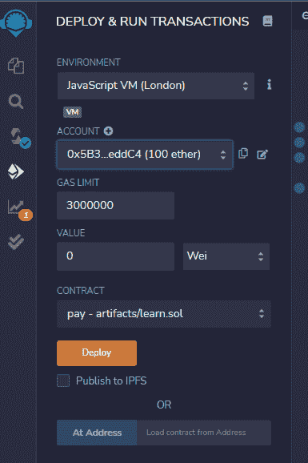
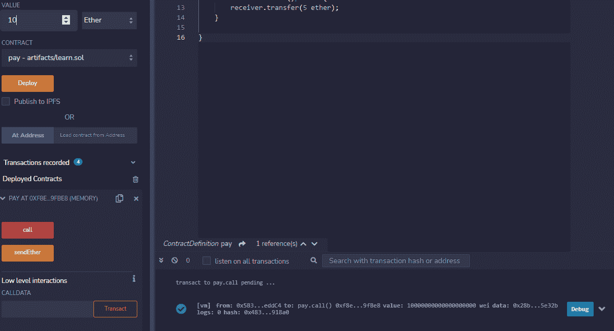
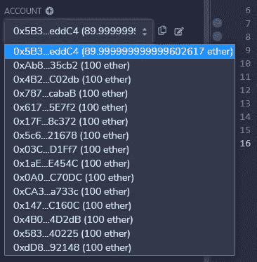
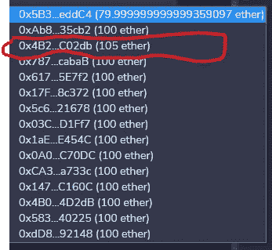

# 如何在 SOLIDITY 中使用 PAYABLE 函数

> 原文：<https://medium.com/coinmonks/how-to-use-payable-function-in-solidity-fa871e79b167?source=collection_archive---------9----------------------->

在这篇文章中，我将分解传递函数，并向您展示它是如何工作的，以及如何在 solidity 中最好地使用它。

我也将向你展示如何把乙醚从一个地址送到另一个地址

# 传递函数是什么？

转账功能允许您从智能合约中发送资金，因此每当您使用转账功能时，solidity 都会知道即将发生转账。

让我们使用下面我创建的合同来更好地解释这次转让。

`// SPDX-License-Identifier: MIT`

`pragma solidity >=0.8.0;`

`contract pay{`

`//2nd stage`

`//the account of the user we want to send ether to`

`address payable receiver = payable(0x4B20993Bc481177ec7E8f571ceCaE8A9e22C02db);`

我用这个 0x4b 20993 BC 481177 EC 7e 8 f 571 ecae 8 a9 e 22 c 02 db 创建了一个契约支付并添加了一个名为 receiver 的地址

从 remix 我选择了一个不同的地址，因为我们想支付一些乙醚到这个地址。

`//we are creating a function that allows for user to send money from`

`//our smart contract`

`//notice if we deploy this contract and transfer 1 ether it will work but where`

`//did our money go.`

`function cell() public payable returns (uint){`

`//we gave the returns (uint) keyword to give us the balance`

`return address(this).balance;`

`//give us the balance of the address of our smart contract`

`}`

我创建了一个函数，允许我们调用交易的余额，注意我调用了(uint ),它告诉函数参数是一个无符号变量。

我调用了返回地址，这是我们的地址，因为这是我们引用内部变量时调用的，所以我们的地址会在发送资金后给我们余额

`//this function sends 5 ether to the receiver address above`

`function sendEther()public {`

`receiver.transfer(5 ether);`

`}`

`}`

这是将以太网发送到我们上面创建的地址接收器的逻辑。

让我们测试一下，看看应付款是如何工作的。

我将部署合同，并确保没有错误，如果有错误，合同将不会部署。

我选择了不同的帐户，然后部署了合同。

部署后，注意到我们有两个称为 Cell 和 sendEther 的函数，这是我们在此合约中的函数。

接下来，我必须将资金发送到合同中，我将发送 10 个以太到合同中，确保将值从 Wei 更改为 Ether

点击呼叫功能，如果有绿色勾号，表示资金已成功发送到区块链。

我们在区块链(当地)有资金，检查账目，你会注意到 10 Ether 遗漏了主要地址，但它没有反映在任何地址中。

让我们把 5 以太网发送到我们在接收者帐户中设置的地址。点击发送以太网，10 以太网被添加到帐户。

哇哦。

令人兴奋的是，下周我们将看看如何使用修饰符和构造函数。

> 加入 Coinmonks [电报频道](https://t.me/coincodecap)和 [Youtube 频道](https://www.youtube.com/c/coinmonks/videos)了解加密交易和投资

# 另外，阅读

*   [如何购买 Monero](https://coincodecap.com/buy-monero) | [IDEX 评论](https://coincodecap.com/idex-review) | [BitKan 交易机器人](https://coincodecap.com/bitkan-trading-bot)
*   [CoinDCX 评论](/coinmonks/coindcx-review-8444db3621a2) | [加密保证金交易交易所](https://coincodecap.com/crypto-margin-trading-exchanges)
*   [红狗赌场评论](https://coincodecap.com/red-dog-casino-review) | [Swyftx 评论](https://coincodecap.com/swyftx-review) | [CoinGate 评论](https://coincodecap.com/coingate-review)
*   [Bookmap 点评](https://coincodecap.com/bookmap-review-2021-best-trading-software) | [美国 5 大最佳加密交易所](https://coincodecap.com/crypto-exchange-usa)
*   [如何在 FTX 交易所交易期货](https://coincodecap.com/ftx-futures-trading) | [OKEx vs 币安](https://coincodecap.com/okex-vs-binance)
*   [CoinLoan 审查](https://coincodecap.com/coinloan-review) | [YouHodler 审查](/coinmonks/youhodler-4-easy-ways-to-make-money-98969b9689f2) | [BlockFi 审查](https://coincodecap.com/blockfi-review)