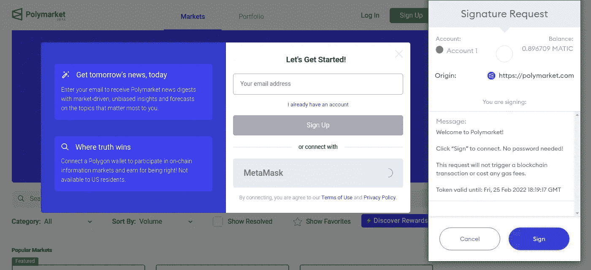
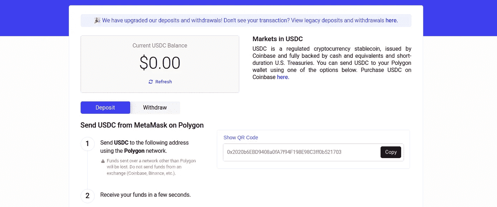
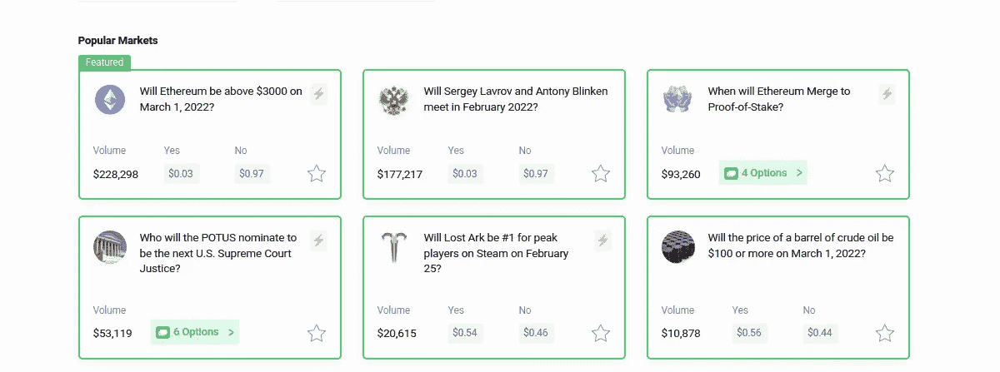
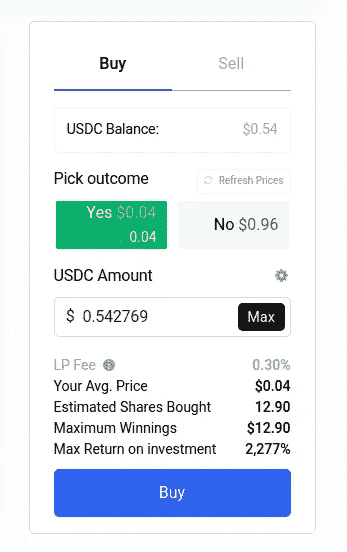

# 如何使用 Polymarket

> 原文：<https://medium.com/coinmonks/how-to-use-polymarket-9ee1577fd671?source=collection_archive---------10----------------------->

一个初学者友好的入门指南

Image by [Markus Winkler](https://unsplash.com/@markuswinkler) from [Unsplash](https://unsplash.com/)

# 预测市场

预测市场，也称为博彩市场，是人们可以对事件的**结果打赌，并跟随赔率**获得对未来**的洞察力的市场。随着越来越多的人参与，市场往往会对结果做出更准确的预测。他们习惯于在各种情况下下注，从资产价格到体育赛事的结果。**

# 多元市场

多市场是一个预测市场，人们可以用密码进行投机。用户可以买卖**结果股**，如果结果是正确的，可以兑换 1 美元，如果结果是错误的，就变得一文不值。你可以随时出售你的成果股。

Polymarket Logo. Source: [Polymarket Facebook](https://www.facebook.com/PolymarketHQ/)

> 免责声明:美国居民由于监管原因只能查看市场上的信息。点击阅读更多

# 如何使用 Polymarket

本文的其余部分将关注如何使用 [Polymarket](https://polymarket.com/) 。

## 注册并存入资金

**1。报名吧。**你可以用电子邮件和密码注册，但是我建议你用最流行的加密钱包之一 [Metamask](https://metamask.io/) 注册。(对于初学者:[如何设置元掩码](https://www.youtube.com/watch?v=Af_lQ1zUnoM))。点击连接[元掩码](https://metamask.io/)后，在钱包中确认注册。

Sign up Process. Source: me

**2。将资金转入您的 Metamask 帐户。**你将需要在[多边形](https://polygon.technology/)上同时使用[自动](https://coinmarketcap.com/hu/currencies/polygon/)和 [USDC](https://www.circle.com/en/usdc) 来为你的钱包充值。([在 Metamask](/stakingbits/setting-up-metamask-for-polygon-matic-network-838058f6d844) 中设置 Polygon)[poly market](https://polymarket.com/)使用 [USDC](https://www.circle.com/en/usdc) 买卖成果股，需要 [MATIC](https://coinmarketcap.com/hu/currencies/polygon/) 来支付 [Polygon](https://polygon.technology/) 网络上的天然气费用。你不需要太多的 MATIC，大概 0.1 英镑(0.15 美元)就足够了。(2022/02/25)

Send funds to Polygon. Source: me

**3。将资金存入 Polymarket。**最后一步是将资金存入您的 [Polymarket](https://polymarket.com/) 账户。前往您帐户地址旁边的存款按钮，复制 [Polymarket](https://polymarket.com/) 存款钱包地址。将您的 [USDC](https://www.circle.com/en/usdc) 发送到[元掩码](https://metamask.io/)中的复制地址。

## 在市场上下注

恭喜你，现在你可以在 Polymarket 提供的各种市场上下注了。

Popular Markets. Source: me

1.  点击页面顶部导航中的**市场**。
2.  **在市场间浏览**和**选择你感兴趣的**。
3.  **选择你认为会解决的结果**并**输入你想购买的 [**USDC**](https://www.circle.com/en/usdc) 价值多少的股票。购买模式的小指南:**

Buy modal. Source: me

*   平均价格是你支付的每股价格。您的订单规模越大，流动性越低，您的平均价格就越高。
*   **预估股份**是你将要购买的股份数量。如果你的预测是正确的，你可以用 1 美元( [USDC](https://www.circle.com/en/usdc) )兑换 1 份结果份额，这就是为什么**最大赢款**用美元显示同样的数字。
*   **投资回报**显示如果你的预测成为现实，你将获得的百分比收益。

4.**点击购买并确认您的交易。您的交易将在 20 秒内处理完毕。**

## **出售你的股票**

你可以在市场结束前卖出你的股票。

1.  转到“个人市场”页面，点击“销售”选项卡。
2.  输入您想要出售的股份数量，或单击“最大”。
3.  点击出售并确认。

## 赎回股份

一旦市场稳定下来，你就可以赎回你赢得的股票。

1.  点击投资组合查看您的头寸
2.  在您的市场头寸上，如果市场已经平仓，操作按钮将从交易变为赎回。
3.  单击兑换并兑换奖品

# 多市场鲸

[Polymarket Whales](https://polymarketwhales.info/) 是一个独立网站，跟踪平台上的交易，并通过 [Twitter](https://twitter.com/polymarktwhales) 进行广播。如果你想在 [Polymarket](https://polymarket.com/) 上开始定期交易，这可能是一个有用的资源。

# 分散投注

基于区块链的预测市场仍然是加密领域的一个细分市场。他们提供每个人都可以获得的信息，不像在集中式市场中，平台可以决定保留信息，以使他们比市场参与者更有优势。 [Polymarket](https://polymarket.com/) 和[August](https://augur.net/)是分散式博彩市场的两个最大平台。

> 加入 Coinmonks [电报频道](https://t.me/coincodecap)和 [Youtube 频道](https://www.youtube.com/c/coinmonks/videos)了解加密交易和投资

## 也阅读

 [## 杠杆代币[多头代币]终极指南

### 杠杆化令牌是具有杠杆化风险敞口的 ERC20 令牌，不考虑保证金、要求、管理…

medium.com](/coinmonks/leveraged-token-3f5257808b22)  [## 最佳加密交易所| 2022 年十大加密货币交易所| CoinCodeCap

### 加密货币交易所的加密交易需要了解市场，这可以帮助你获得利润。之前…

coincodecap.com](https://coincodecap.com/crypto-exchange)  [## 2022 年最佳加密交换平台| CoinCodeCap

### 如果我们看看今天的场景，许多加密货币交换平台提供了广泛的功能和深度…

coincodecap.com](https://coincodecap.com/best-swap-platforms)  [## 2022 年最佳加密和比特币赌场(美国批准，存款奖励)

### 接收、支付和赚取加密货币| |有各种各样的最佳在线赌场可供选择，有可能…

coincodecap.com](https://coincodecap.com/best-online-casinos)  [## 2021 年最佳加密借贷平台| 6 大比特币借贷平台

### 获得比特币和其他加密货币的最佳贷款利率

medium.com](/coinmonks/top-5-crypto-lending-platforms-in-2020-that-you-need-to-know-a1b675cec3fa)  [## 2021 年 6 大最佳硬件钱包|顶级加密硬件钱包[更新]

### 最好的加密货币硬件钱包是绝对必要的。我们将在 NGRAVE、Ledger Nano X 和…

medium.com](/coinmonks/the-best-cryptocurrency-hardware-wallets-of-2020-e28b1c124069)  [## 加密交易机器人——21 款最佳免费加密交易机器人

### 2022 年币安、比特币基地、库币和其他密码交易所的最佳密码交易机器人。Pionex，Bitsgap…

medium.com](/coinmonks/crypto-trading-bot-c2ffce8acb2a)