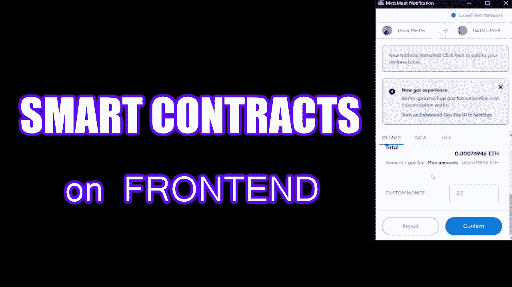

# 如何在前端应用程序上使用智能合同

> 原文：<https://medium.com/coinmonks/how-to-use-smart-contracts-on-frontend-app-e3052943cec1?source=collection_archive---------11----------------------->

嘿，你好，在这个教程中，我将向你展示如何在你的前端应用程序中使用智能合同。

在开始之前，您需要了解如何将用户的钱包连接到您的应用程序，以及如何在您的前端实施一个区块链网络。我将在以后需要的时候详细讨论这个问题。