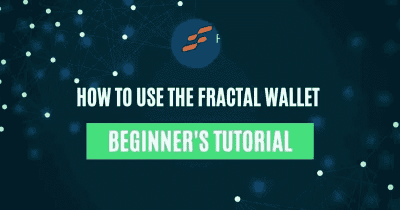
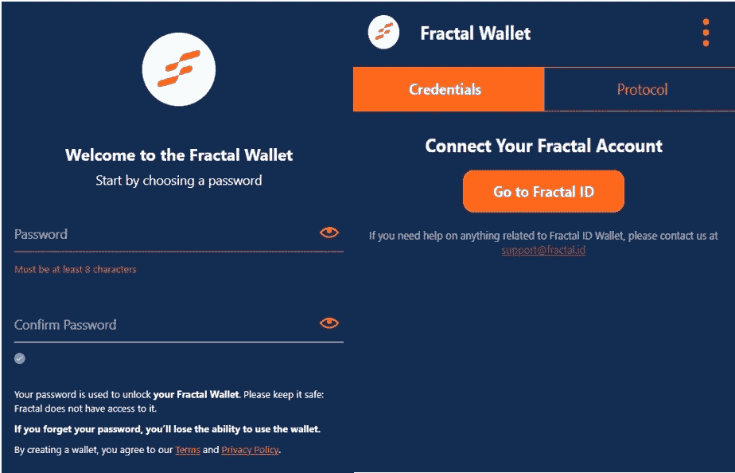
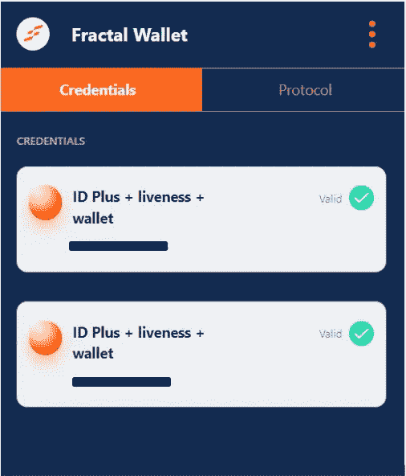
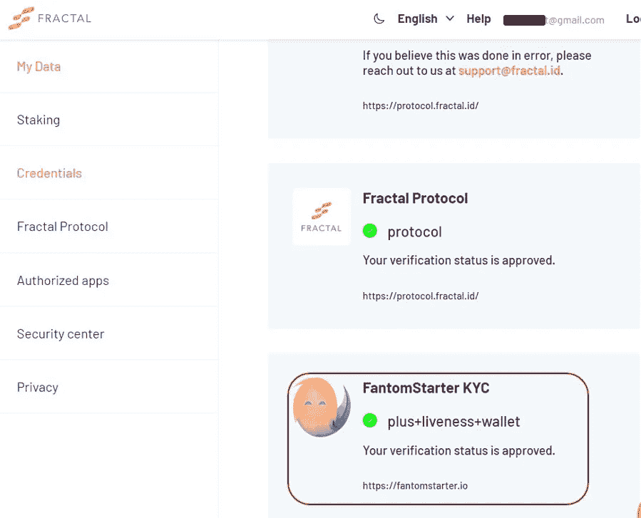
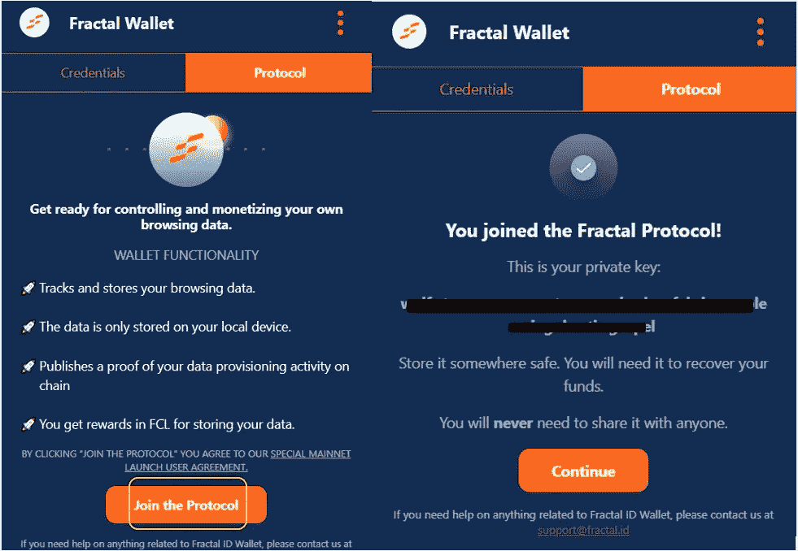
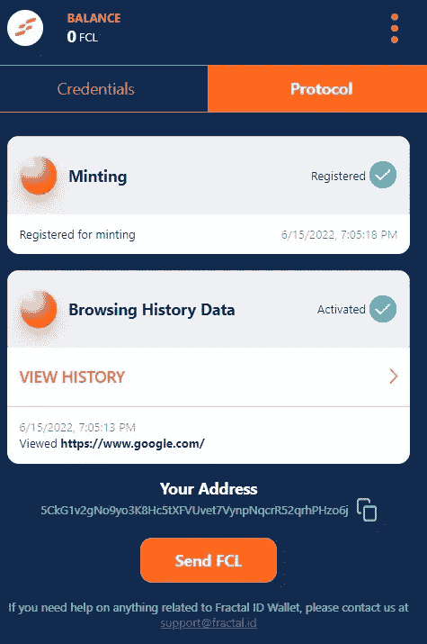
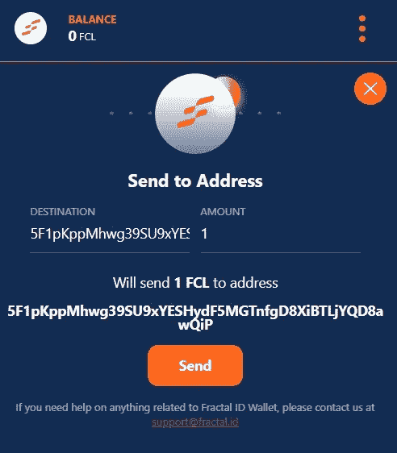

# 如何使用分形钱包

> 原文：<https://medium.com/coinmonks/how-to-use-the-fractal-wallet-23c0475c96e8?source=collection_archive---------10----------------------->

本指南详细解释了如何安装和使用分形钱包。

## 分形钱包是分形协议的本地钱包。它目前作为谷歌 Chrome 浏览器扩展应用程序提供，允许用户存储他们的分散式数字身份(DID)证书。用户需要首先完成分形协议中的 KYC。之后，他们可以将钱包与分形账户联系起来。因此，您经过验证的 KYC 数据将存储在一个分散的浏览器扩展中。用户可以控制如何以及与谁共享他们的验证详细信息。分形钱包可以让你证明你的身份，而不透露任何个人信息。

如前所述，在开始使用钱包之前，用户需要首先从分形平台完成他们的 KYC 验证。如果你还没有这样做，你可以阅读我们之前的指南，如何使用分形协议提交你的 KYC 细节[这里](https://www.altcoinbuzz.io/bitcoin-and-crypto-guide/fractal-protocol-everything-you-need-to-know/)。

**走向去中心化身份的旅程**

身份是定义实体、对象或人(主要是)的东西。它基本上由一些唯一标识一个对象的属性列表组成。这些属性定义得非常好，世界上没有两个对象会有相同的一组值。这些属性的例子有年龄、性别、护照、身份证、地址等。

**传统方法**

在互联网出现之前，这些属性主要以纸质格式保存，每当任何人需要向任何组织提供这些详细信息时(假设您计划买房或买车、大学入学等)，他们通常会通过邮件发送支持文档的副本。这整个过程相当繁琐，耗费大量的时间和精力。有时，该人需要发送多轮文件来证明这种可信度。

互联网出现后，这个过程变得稍微顺畅了一些。人们已经开始保留这些属性。jpg，。png 格式，他们可以很容易地附加并通过邮件发送。虽然这个时代在一定程度上减少了开销，但并不完全。用户需要向他们想要使用其服务的所有组织提供他们的详细信息。

甚至在分形出现之前，大多数区块链平台都要求用户提交一张现场自拍(除了必要的文件)来进行 KYC 验证。

**分形方法**

DID 表示一个分散的标识符，包含存储在区块链中的用户属性。借助 DID，分形旨在加速 KYC 进程。该过程不仅维护数据隐私和法规，还允许用户控制他们的数据共享活动，并提供奖励以交换他们的数据。

Fractal 团队作为一个可信的验证者，通过检查一个人的地址、年龄、身份证号、护照、活跃度等进行身份验证。这些数据将储存在区块链，因此拥有技术的固有特征，即分散和抗审查。

如果你有一个数据经过验证的分形钱包，那么你不需要重复验证你的细节。分形会作为那些验证过的数据的一个中心点，支持分形的平台会接受你的身份。

**安装分形钱包**

要安装分形钱包，请访问[链接](https://chrome.google.com/webstore/detail/fractal-wallet/agechnindjilpccclelhlbjphbgnobpf/related)

你可以找到**添加到 Chrome** 按钮。点击此按钮，应用程序将要求您批准将扩展添加到您的浏览器。

提供您的批准，应用程序将安装在您的扩展。你可以在谷歌 Chrome 浏览器中看到下面突出显示的图标。

**分形钱包设置**

点击应用程序图标设置您的钱包。它会要求你首先设置你的钱包的密码。

完成后，您可以看到钱包的登录页面(见下面的截图)。

**用分形账户/ID** 连接你的分形钱包

从上面的截图可以看出，我们已经设置好了钱包。接下来你要做的就是在你的分形钱包和你的分形账户之间建立联系。

因此，要做到这一点， **c** 点击出现在你的分形钱包上的**转到分形 ID** 按钮。

它会引导你找到你的分形账户。一旦建立连接，您的凭证详细信息将从您的分形帐户中提取，并显示在您的分形钱包中(凭证选项卡)。

这个过程的优点是，你可以很容易地将你的分形账户(现在也是分形钱包)与允许你使用分形做 KYC 的平台连接起来。一旦您签署交易，您的验证数据将与连接平台共享。例如，你可以从下面的截图中看到，我们已经使用分形账户为 Fantomstarter Launchpad 做了 KYC。

**协议**

您可以通过进入钱包的协议选项卡**加入协议**。一旦加入，您就可以看到您的私钥。如你所知，在你丢失设备的情况下，私人密钥是恢复你的帐户所必需的，所以要保管好你的密钥。

一旦用户加入该协议，他们将获得以下好处:

*   在 FCL 储存数据获得奖励
*   存储在本地设备上的数据
*   追踪并检查你的浏览历史

点击**继续**，将激活**造币**和**浏览历史数据**功能。

您现在可以查看您的钱包地址和浏览历史记录。

**送 FCL**

用户可以将他们从分形钱包中获得的 FCL 发送到其他一些基底账户。

虽然**我们还没有测试发送功能**，因为我们的钱包里没有 FCL。但是，我们希望它像任何令牌传输过程一样简单。

**结论**

Fractal 通过激励和授权用户控制他们的数据共享过程，为数据隐私和安全提供了一个强大而独特的解决方案。它还旨在通过将用户数据存储在区块链中，结束冗长和重复的 KYC 过程(文件验证和活性检查)。随着越来越多的项目开始接受分形分散身份，新用户加入平台的过程将变得更加顺利。

***注:*** *本帖首发* [*此处*](https://www.altcoinbuzz.io/bitcoin-and-crypto-guide/how-to-use-the-fractal-wallet/) *同* [*一个* ltcoinbuzz.io](https://www.altcoinbuzz.io/) *。*

**跟着我**

**👉** [推特](https://twitter.com/rumadas123)

**👉** [领英](https://www.linkedin.com/in/ruma-das-a1439320/)

> *加入 Coinmonks* [*电报频道*](https://t.me/coincodecap) *和* [*Youtube 频道*](https://www.youtube.com/c/coinmonks/videos) *了解加密交易和投资*

# 另外，阅读

*   [3 商业评论](/coinmonks/3commas-review-an-excellent-crypto-trading-bot-2020-1313a58bec92) | [Pionex 评论](https://coincodecap.com/pionex-review-exchange-with-crypto-trading-bot) | [Coinrule 评论](/coinmonks/coinrule-review-2021-a-beginner-friendly-crypto-trading-bot-daf0504848ba)
*   [莱杰 vs n rave](/coinmonks/ledger-vs-ngrave-zero-7e40f0c1d694)|[莱杰 nano s vs x](/coinmonks/ledger-nano-s-vs-x-battery-hardware-price-storage-59a6663fe3b0) | [币安评论](/coinmonks/binance-review-ee10d3bf3b6e)
*   [Bybit Exchange 审查](/coinmonks/bybit-exchange-review-dbd570019b71) | [Bityard 审查](https://coincodecap.com/bityard-reivew) | [Jet-Bot 审查](https://coincodecap.com/jet-bot-review)
*   [3 commas vs crypto hopper](/coinmonks/3commas-vs-pionex-vs-cryptohopper-best-crypto-bot-6a98d2baa203)|[赚取加密利息](/coinmonks/earn-crypto-interest-b10b810fdda3)
*   最好的比特币[硬件钱包](/coinmonks/hardware-wallets-dfa1211730c6) | [BitBox02 回顾](/coinmonks/bitbox02-review-your-swiss-bitcoin-hardware-wallet-c36c88fff29)