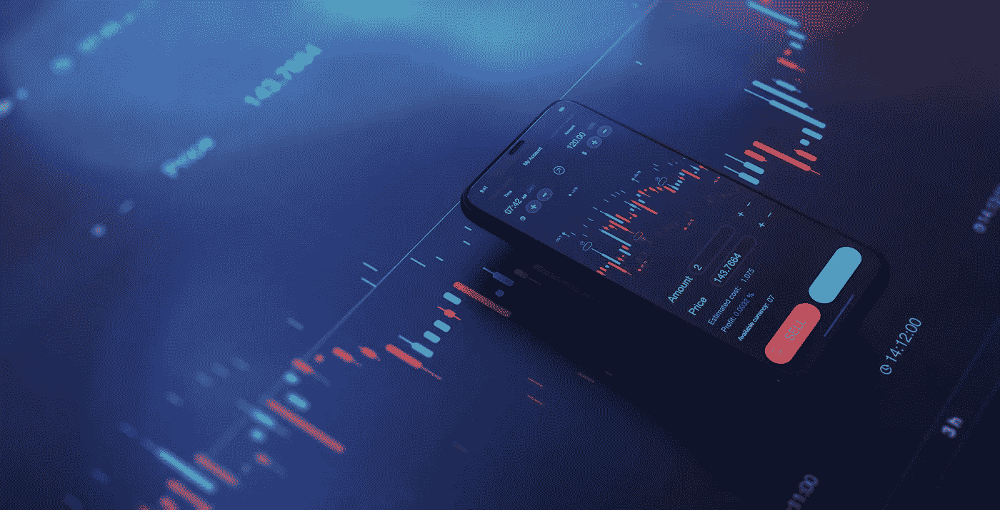

# 如何使用白标软件和建立自己的加密交换

> 原文：<https://medium.com/coinmonks/how-to-use-white-label-software-and-set-up-your-own-crypto-exchange-34b83775f9de?source=collection_archive---------40----------------------->

White Label Crypto Exchange Software for Business Enterprises

中本聪提出的菲亚特替代方案的影响每天都可以感受到。我们正在见证主流加密技术在全球范围内的采用和认知。全球报告证实了这种影响——cryptos 的市值超过 1.6 万亿美元，日交易量超过 1090 亿美元。加密交易所是这一不断增长的现象的主要贡献者，为加密爱好者和投资者提供了动力。白标加密交易软件平台建立在区块链架构之上，对于希望将加密交易添加到他们的商业服务列表中的企业来说是很容易获得的。

# 为什么选择白标加密交换平台？

尽管区块链是现代技术的主要颠覆者之一，但它相对较新。因此，创建一个高效的团队来开发一个安全的本地加密交换平台并不容易。交易所必须能够抵御试图窃取加密资产的网络罪犯的频繁攻击。其他挑战可能包括易读性、功能性、用户体验、令牌流动性。即使忽略反复试验，整个过程也是高度资源密集型的，并且会成倍增加运营成本。合理的解决方案是使用白标加密交换软件提供商的服务。

# 开始密码交易前需要知道的事情

目前合法的密码交易所不到 500 家。这是建立秘密交易的好时机。起飞前的市场调查是必不可少的，有几件事需要考虑。

# 启动加密交易交易所

如上所述，确保引导加密交换走向成功的多个方面至关重要。其中突出的包括:

*   **遵守法律法规** 法规和法律文书工作对企业来说是不可或缺的，但对所有加密业务来说更为重要。尽管加密货币已经大幅减少，但仍有几个国家的加密货币是非法的。开始加密交易的企业必须考虑和选择适当的管辖区，遵守地区或国家法律，并拥有加密交易的官方许可证。
*   **公用事业** 交易交易所为客户提供多种选择、利益和功能。选项包括保证金交易、衍生品、场外交易、期货、ico、IEOs、综合加密外汇服务等。突出首选要求的详细列表有助于选择正确的白标加密交换软件供应商。
*   **上市代币流动性** 有超过 17，000 个加密代币选项。不做任何背景调查就把他们都列出来是一大罪过。不仅最终用户的资本投资面临风险，交易所的声誉也面临风险。保护客户的资金免受欺诈和诈骗是至关重要的。
*   专门的客户服务和支持
    加密交易所保持全年 365 天、每天 24 小时开放。越来越多的密码交易员需要专门的客户服务来处理和解决客户的疑问和问题。多语言全天候协助大大增强了客户服务体验。

还有几个额外的话题。因此，更好的选择是从在建设加密货币交易所方面表现出熟练程度的区块链开发公司那里收购白标架构。

# 前三大白标加密货币交易所

白标产品开发人员利用经过试验和测试的产品，帮助组织快速跟踪加密交换基础设施。白标加密货币交易所中的一些顶级公司包括:

## [HashCash 顾问公司](https://www.hashcashconsultants.com)

HashCash 总部位于加利福尼亚州的帕洛阿尔托，在加密交换开发、银行和金融科技产品方面拥有全球业务。这家区块链开发公司提供跨多个领域的产品，但其[白标加密交换软件](https://www.hashcashconsultants.com/white-label-bitcoin-cryptocurrency-exchange-software)被广泛视为行业标准。

***特性***

HashCash 的加密交换白标产品拥有无与伦比的客户销售和支持，以及以下特性:

*   支持多种加密资产和法定货币。
*   与 BIP-32、Firebase、优先匹配引擎和 ERC 20 进行无缝交易。
*   最新的安全更新包括数据库加密、三点架构、KYC 和 AML。
*   多签名冷热钱包，兼容多种设备。

HashCash 已经发展成为全球最大的白标加密交换服务提供商，同时保持着无与伦比的服务体验。这家总部位于美国的公司被一家全球研究公司授予区块链发展公司的最高荣誉。HashCash 还升级了交易平台的安全功能，并欢迎金融机构在最终确定之前进行试用。

多年来，HashCash 的产品已经在五大洲使用，包括迪拜、新加坡、澳大利亚、美国、欧洲等地区。该团队由银行、金融和技术领域的专家组成，并始终如一地追求卓越。感兴趣的企业也可以提前体验一下交易所的功能。

## [PayBito](https://www.paybito.com)

PayBito 是一家总部位于美国的国际加密货币交易所。该组织坚信合作而非竞争是全球加密发展的关键，并为希望涉足加密交易的商业组织提供了其本地加密交换架构的白标变体。PayBito 是集成加密外汇架构的先驱，让客户和最终用户有机会利用加密货币和外汇的最佳交易，通过高效的可扩展解决方案增强订单流。

***特征***

PayBito 的[白标加密交易软件提供了加密和外汇的最佳组合，包括以下功能:](https://www.paybito.com/white-label-cryptocurrency-exchange/)

*   使用加密/菲亚特或加密/加密进行配对交易。
*   为客户和管理员提供带有实时参数显示的独立控制面板。
*   流动性选项、支付网关集成和云托管。
*   高级安全功能- DDoS 缓解、2FA、地理定位等。
*   具有订单预订功能的高性能匹配引擎。

PayBito 的加密解决方案被世界各地的多个组织使用，包括加拿大、菲律宾、新加坡、美国和中东。加密交易所在客户购买之前向其提供解决方案的试运行。

PayBito 最近在其最新的交易所清单中增加了 23 个新的加密令牌。3 款 DeFi 新产品将于 2022 年在 Q1 举行的 IEO 发布会上首次亮相。PayBito 还提供加密抵押贷款、支付处理、游戏交换架构、房地产等选项。

## 纳斯达克指数

纳斯达克公司(Nasdaq Inc .)已经是全球最大的股票交易公司之一，它将其业务扩展到了加密货币领域。金融机构可以利用纳斯达克最先进的[加密交易白标解决方案](https://www.nasdaq.com/solutions/cryptocurrency-exchange-software)将加密交易集成到他们现有的服务列表中，该解决方案提供了大量的功能和设施。此外，客户还可以利用纳斯达克市场监督工具包的诚信方面，增强投资者的信心，维护企业声誉。

***特性***

纳斯达克白标-加密交易所解决方案包含多种功能，帮助机构直接进入加密交易领域，包括:

*   与 FIX 和 REST 等最新 API 无缝连接。
*   交易前风险管理和数据可视化的附加升级。
*   SaaS 减少交换设置时间。
*   能够承受体积膨胀的可扩展解决方案。

纳斯达克的交易解决方案已经在全球 6 大洲的 70 个地方使用。实施纳斯达克加密交换架构的企业除了功能覆盖、高性能匹配引擎等之外，还可以利用多资产选项。

# 最后的话

在接下来的几年里，全球对区块链的采用将会成倍增长。随之而来的结果将是加密货币的相关性增加。元宇宙、DeFi、Web 3.0 等即将推出的功能将使加密货币变得司空见惯。此外，法定估值的波动将很快把焦点转向加密货币，将其作为合法的交易工具。白标加密交换软件可以帮助企业在快速增长的加密交易市场上获得最佳投资回报。

> 加入 Coinmonks [电报频道](https://t.me/coincodecap)和 [Youtube 频道](https://www.youtube.com/c/coinmonks/videos)了解加密交易和投资

# 另外，阅读

*   [币安 vs FTX](https://coincodecap.com/binance-vs-ftx) | [最佳(SOL)索拉纳钱包](https://coincodecap.com/solana-wallets)
*   [比诺莫评论](https://coincodecap.com/binomo-review) | [斯多葛派 vs 3Commas vs TradeSanta](https://coincodecap.com/stoic-vs-3commas-vs-tradesanta)
*   [Capital.com 评论](https://coincodecap.com/capital-com-review) | [香港的加密借贷平台](https://coincodecap.com/crypto-lending-hong-kong)
*   [如何在 Uniswap 上交换加密？](https://coincodecap.com/swap-crypto-on-uniswap) | [A-Ads 审查](https://coincodecap.com/a-ads-review)
*   [WazirX vs coin dcx vs bit bns](/coinmonks/wazirx-vs-coindcx-vs-bitbns-149f4f19a2f1)|[block fi vs coin loan vs Nexo](/coinmonks/blockfi-vs-coinloan-vs-nexo-cb624635230d)