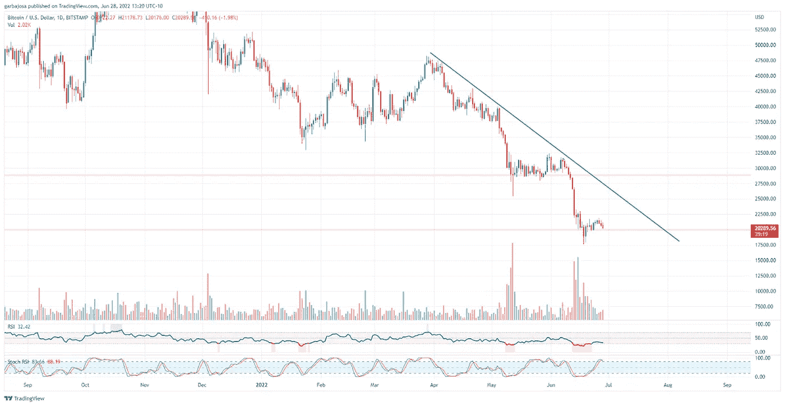
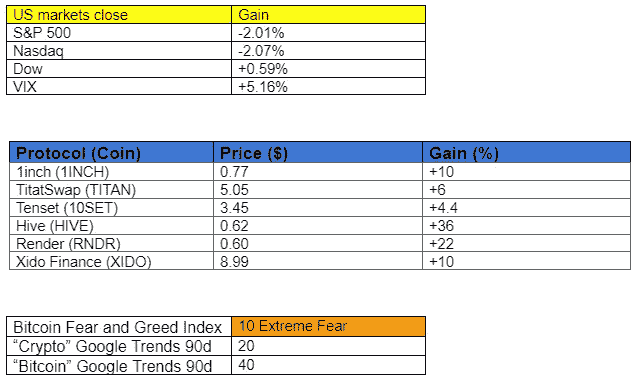

# 如何评估一个加密项目并找到下一个周期的 100 倍宝石？

> 原文：<https://medium.com/coinmonks/how-to-value-a-crypto-project-and-find-next-cycles-100x-gems-6378093d5aa9?source=collection_archive---------13----------------------->

## 加密每日混合器#027

加密市场、新闻、指标和协议更新的每日摘要。

Photo by [Dani Costelo](https://unsplash.com/@danicostelo?utm_source=medium&utm_medium=referral) on [Unsplash](https://unsplash.com?utm_source=medium&utm_medium=referral)

**概述**

*   **代币估价小丛书#01**
*   **BTC:走向主要支持。**
*   **机构用乙醚(ETH)桩**

早上好，家人，

当我们在冰雪覆盖的严冬中艰难前行时，是时候开始为下一个主要周期做准备了。随着许多代币跌至全年低点，出现了一些令人尖叫的交易。但是你怎么能把好的从坏的中剔除呢？

我的最佳答案是象征性估值。

# 如何对代币进行估价(代币估价迷你系列#01)

由于 crypto 在未来很可能是一种破坏性力量，一些创新项目拥有不可思议的潜力，但是对于每个伟大的项目，都有十个可怕的项目。

因此，为了帮助发现优质项目，我设计了一个系统(有各种灵感)来帮助评估数字资产。该系统由以下十个方面组成。

**评估项目令牌的十大方面。**

1.  **用例(目的)**
2.  **团队和技术**
3.  **记号组学**
4.  **生态系统**
5.  **重大风险**
6.  **增长潜力**
7.  **唯一性**
8.  **价格上行**
9.  **竞赛**
10.  **中断**

这些因素中的每一个都在一个项目的长期成功和它的令牌的价格升值中扮演着重要的角色。分析师的角色是定位所有信息，分析信息，然后做出最终决策。当然，没有一个项目是完美的，有取舍要权衡。例如，一个项目可能在九个方面得分很高，但如果令牌经济学很糟糕，那么从长远来看，代价可能会很大..

今天的部分更多的是作为一个介绍；在接下来的几周内，新闻简报将涵盖每个方面。就当是正在进行的迷你系列吧！到本系列的结尾，读者应该离拥有超自然能力更近了一步，能够识别值得德根式投资的伟大项目(以及应该避免的项目)。

# 市场更新🌍

传统市场和加密市场都继续受到冲击。纳斯达克 100 指数和标准普尔 500 今天分别下跌了 3.09%和 2.01%，而 BTC 下跌了 1.95%。此外，所有三种资产都处于较低的高点，表明持续下降趋势。纳斯达克 100 指数(NDQ)如下图。

*高分辨率* [*图表*](https://www.tradingview.com/x/4jpW3GDE/)

比特币(BTC)价格从近期高点的移动受到不断增加的交易量的支持，这支持了进一步下跌的概念。BTC 价格可能会重新测试 20k 支撑位，这标志着 2017 年的高点。许多替代币显示出与比特币相似的价格模式。

*高清*[图表 ](https://www.tradingview.com/chart/v7j9tiND/?symbol=NYMEX%3ACL1!)

***通过订阅*** [***子栈***](https://tradergabi.substack.com/subscribe?) ***成为第一个收到这份免费每日简讯的人。***

***如果你喜欢这份报告，并且认为它值 20 分(0.01 美分)，请点击下面的按钮来支持我的写作。(最多 50 次！)谢谢！***

# 新闻观察📰

**以太打桩为机构。**机构加密托管公司 Anchorage Digital [推出](https://www.coindesk.com/business/2022/06/28/anchorage-digital-to-introduce-ether-staking-for-institutions-as-move-to-pos-approaches/?utm_source=Sailthru&utm_medium=email&utm_campaign=NODE%20JUNE%2028%202022&utm_term=The%20Node)ETH(ETH)staking 作为机构的新选择。随着以太坊最早于 8 月份的“合并”，机构将有一个安全的途径来获得帮助保护网络的 ETH yield 奖励。分析师预测，合并后的 ETH 收益率将在 8-12%之间，较当前水平大幅上升，这可能为机构兴趣的涌入打开大门。此外，该产品可能引发“以太坊作为债券”的叙事。

**CoinFlex 推出恢复令牌。**实物期货加密交易所 CoinFLEX 被设置为[推出](https://twitter.com/cryptorebel_SV/status/1541916837541281792?s=20&t=dJnXVTOtOtTXvErnVlmYmg)一种恢复价值美元(rvUSD)令牌，原因是[一个高价值个人(Roger Ver)的未偿债务](https://twitter.com/MarkDavidLamb/status/1541831697787928576?s=20&t=dJnXVTOtOtTXvErnVlmYmg)导致客户暂停提款。尽管个人声称，他不欠交易所任何东西。该公司计划发行价值 4700 万美元的 rvUSD。一些人称之为“罗杰·弗·美元”巧合吗？

新闻花絮:

*   叙事播客[主持人](https://twitter.com/larsiusprime/status/1541418200398798850?s=20&t=u7i21C9f_QdBf61Cn8Y74A)维塔利克·布特林。
*   Harmony hacker 无视赏金，开始为偷来的资金洗钱。

**在协议层⛓**

**最后一吨硬币(吨)已被开采。**工作证明(PoW)区块链 Toncoin 已开采出其最后一吨硬币，并已过渡到利益证明(PoS)共识机制。消息应用 Telegram 背后的公司创建了 Toncoin 区块链，但它在 2020 年因 SEC 诉讼而被迫退出该项目。

**协议级花絮:**

*   Terra 2.0 现在在虫洞上[直播](https://twitter.com/wormholecrypto/status/1541433215436603393?s=20&t=b78_CtEP-tiXMI1ghfomxQ)。
*   [强化](https://twitter.com/LidoFinance/status/1541692637060685826?s=20&t=AQ34SlFSilTQWV9T36IkGw)只有异议期的丽都岛投票流程。
*   StarkNet [综述#22](https://twitter.com/Swagtimus/status/1541427215153463297?s=20&t=o0LBkxjnPyln2XU-2xki8g) 。
*   火箭池红石[升级](/rocket-pool/rocket-pool-the-merge-redstone-601d9efd6b4)。
*   Ronin hard-fork [完成](https://twitter.com/Ronin_Network/status/1541683426151075840?s=20&t=cEKgVQnJLiKG7SiG2Ejz6w)。大桥重新开放。

**NFT &元宇宙更新🐵**

宏达电推出兼容元宇宙的手机。即将发布的[HTC Desire 22 pro 将搭载 HTC 的“Viverse”平台，允许用户浏览“Viverse”元宇宙、托管加密和交易 NFT。看来索拉纳有竞争对手了！](https://twitter.com/htc/status/1539095785429671937?s=20&t=cEKgVQnJLiKG7SiG2Ejz6w)

**NFT 花絮:**

*   [介绍](https://twitter.com/josephdelong/status/1541518881449299971?s=20&t=-gkpsJO0xJXpbg7j3z9tBQ)NFT 阿斯塔纳贷款协议。
*   加泰罗尼亚正在建设自己的元宇宙。

**我的五分钱……**

加密的冬天并没有那么糟糕！这是为下一轮大赛准备、建设和节省资金的绝佳时机。以下是 Messari 公司首席执行官瑞安·塞尔基斯(Ryan Selkis)在谈到比特币时的一点启发。

这些类比总是有助于从更大的角度看问题。市场下跌，但会及时恢复。在此期间，最好为下一个大周期做好准备。一个比以前更大的。

感谢阅读！

# 加布里

*关注我的* [*Twitter*](https://twitter.com/web3_gabri) *和*[*Medium*](/@TraderGabi)*或在*[*Substack*](https://tradergabi.substack.com/subscribe?)*订阅此免费每日快讯。谢谢！*

***在***[***Substack***](https://tradergabi.substack.com/subscribe?)***订阅，率先获得这份免费的每日简讯。***

如果你喜欢这份报告，并且认为它值 20 分(0.01 美分)，请点击下面的按钮来支持我的写作。(最多 50 次！)谢谢！

> 加入 Coinmonks [电报频道](https://t.me/coincodecap)和 [Youtube 频道](https://www.youtube.com/c/coinmonks/videos)了解加密交易和投资

# 另外，阅读

*   [Bookmap 评论](https://coincodecap.com/bookmap-review-2021-best-trading-software) | [美国 5 大最佳加密交易所](https://coincodecap.com/crypto-exchange-usa)
*   [密码交易机器人](/coinmonks/crypto-trading-bot-c2ffce8acb2a) | [硬币门评论](https://coincodecap.com/coingate-review)
*   最佳加密[硬件钱包](/coinmonks/hardware-wallets-dfa1211730c6) | [Bitbns 评论](/coinmonks/bitbns-review-38256a07e161)
*   [新加坡十大最佳加密交易所](https://coincodecap.com/crypto-exchange-in-singapore) | [购买 AXS](https://coincodecap.com/buy-axs-token)
*   [红狗赌场评论](https://coincodecap.com/red-dog-casino-review) | [Swyftx 评论](https://coincodecap.com/swyftx-review)
*   [投资印度的最佳密码](https://coincodecap.com/best-crypto-to-invest-in-india-in-2021)|[WazirX P2P](https://coincodecap.com/wazirx-p2p)|[Hi Dollar Review](https://coincodecap.com/hi-dollar-review)