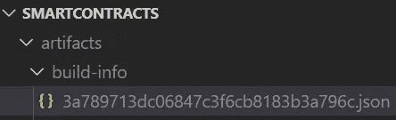
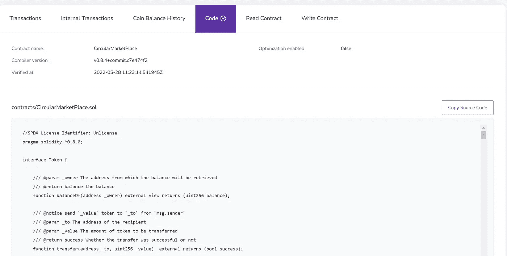

# 如何通过标准输入 JSON 验证您的 KCC 智能合同？

> 原文：<https://medium.com/coinmonks/how-to-verify-your-kcc-smart-contract-via-standard-input-json-db712176dbc4?source=collection_archive---------2----------------------->

在 KCC 浏览器上有三种验证智能合约的方法，在本文中，我们将学习使用标准 JSON 输入来验证智能合约，这无疑是验证智能合约最简单的方法。我们开始吧！

**先决条件:**

*   一份未经证实的部署在 KCC 的智能合同

**#1:在 KCC 浏览器上输入您的部署合同地址**

输入部署的合同地址后，您需要单击上图所示的代码部分。然后，您需要单击验证并发布。

**#2:通过标准输入 JSON 选择验证**

**#3:选择您的智能合约编译器版本**

**#4:创建标准输入 JSON 文件**

这是本教程最棘手的部分。首先您需要创建一个空的 JSON 文件，然后从那里您需要转到下面的文件(在 hardhat 项目中)artifacts->build-info-> JSON 文件对应于您的智能契约。

找到 JSON 文件后，复制输入值并粘贴到您创建的空 JSON 文件中。

You should copy and paste the following into the empty JSON file

**#5:上传标准输入 JSON 文件**

**#6:点击验证发布**

如果一切顺利，您应该看到您的智能合同得到验证。

**事后想法**

在这篇短文中，您了解了如何通过标准的 JSON 输入来验证您的智能契约，使用扁平化的智能契约方法更容易验证。使用这种方法将会节省您很多时间，但是使用这种方法验证的源代码在 KCC 浏览器上不是格式化的，可能会降低源代码的可读性。

不要忘记检查 KCC 更多可怕的加密项目。

社交网络
不和:[https://discord.gg/H5ucJydSyd](https://discord.gg/NhpWu5tqzc)推特:[https://twitter.com/KCCOfficialTW](https://twitter.com/KCCOfficialTW)电报:[https://t.me/KCCOfficialEnglishCommunity](https://t.me/KCCOfficialEnglishCommunity)电报频道:[https://t.me/KCCOfficialChannel](https://t.me/KCCOfficialChannel)

> 加入 Coinmonks [电报频道](https://t.me/coincodecap)和 [Youtube 频道](https://www.youtube.com/c/coinmonks/videos)了解加密交易和投资

# 另外，阅读

*   [3 商业评论](/coinmonks/3commas-review-an-excellent-crypto-trading-bot-2020-1313a58bec92) | [Pionex 评论](https://coincodecap.com/pionex-review-exchange-with-crypto-trading-bot) | [Coinrule 评论](/coinmonks/coinrule-review-2021-a-beginner-friendly-crypto-trading-bot-daf0504848ba)
*   [莱杰 vs n rave](/coinmonks/ledger-vs-ngrave-zero-7e40f0c1d694)|[莱杰 nano s vs x](/coinmonks/ledger-nano-s-vs-x-battery-hardware-price-storage-59a6663fe3b0) | [币安评论](/coinmonks/binance-review-ee10d3bf3b6e)
*   [Bybit Exchange 审查](/coinmonks/bybit-exchange-review-dbd570019b71) | [Bityard 审查](https://coincodecap.com/bityard-reivew) | [Jet-Bot 审查](https://coincodecap.com/jet-bot-review)
*   [3 commas vs crypto hopper](/coinmonks/3commas-vs-pionex-vs-cryptohopper-best-crypto-bot-6a98d2baa203)|[赚取加密利息](/coinmonks/earn-crypto-interest-b10b810fdda3)
*   最好的比特币[硬件钱包](/coinmonks/hardware-wallets-dfa1211730c6) | [BitBox02 回顾](/coinmonks/bitbox02-review-your-swiss-bitcoin-hardware-wallet-c36c88fff29)
*   [BlockFi vs 摄氏度](/coinmonks/blockfi-vs-celsius-vs-hodlnaut-8a1cc8c26630) | [Hodlnaut 审核](/coinmonks/hodlnaut-review-best-way-to-hodl-is-to-earn-interest-on-your-bitcoin-6658a8c19edf) | [KuCoin 审核](https://coincodecap.com/kucoin-review)