# 如何赢得价值 5500 美元比特币的一年免费披萨！

> 原文：<https://medium.com/coinmonks/how-to-win-a-years-supply-of-free-pizza-worth-5500-of-bitcoins-eefadd50d1ef?source=collection_archive---------17----------------------->

# 比特币披萨日

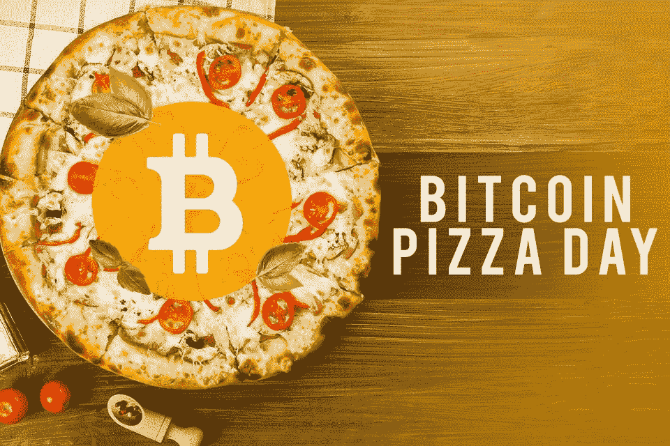

Image Taken From opensea.io

不管是时尚还是潮流，不可否认的是，加密货币已经风靡全球，甚至成为了一个家喻户晓的名字！比特币白皮书由一个化名为中本聪的匿名实体撰写，其起源可追溯到 2008 年，为一种名为区块链的新型分布式账本技术的发展铺平了道路。然而，为了找到大规模采用，比特币当时的交易价格仅略高于 0 美元——与当前的固定价格相去甚远，这在当时是不可想象的。

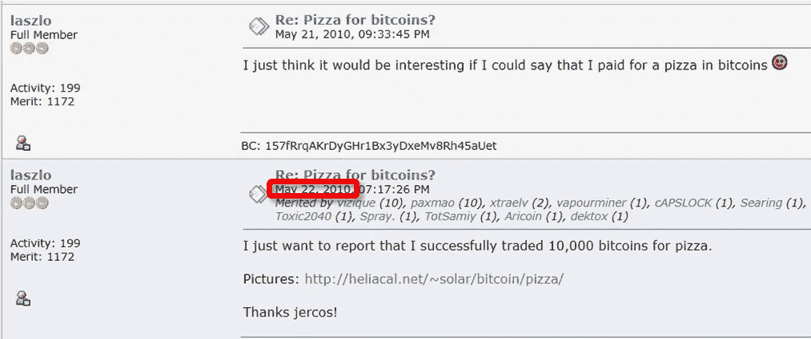

Snapshot of the legendary post in the bitcointalk forum

2010 年 5 月 22 日，历史性的一天，佛罗里达州的 Laszlo Hanyecz 交易了 10000 个比特币，从当地一家披萨店买到了两个售价 41 美元的披萨。他一点也不知道，这笔交易将成为历史上最重要的交易之一——标志着比特币首次正式用于商业交易，按目前的标准，这笔交易将高达 4 亿美元！

尽管比特币的价格出现了天文数字般的上涨，但拉兹洛·汉耶茨似乎对自己的交易并不后悔！Hanyecz 告诉《纽约时报》:“当时比特币没有任何价值，所以用比特币换披萨的想法非常酷。”

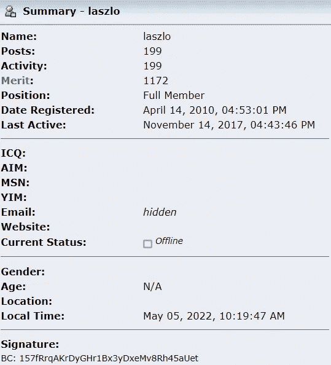

Hanyecz 自 2017 年以来一直活跃在 Bitcointalk 论坛上，离开这个空间时似乎平静地接受了他启发的流行城市传说。

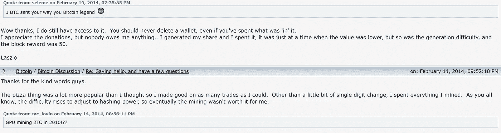

# 赢取 365 天的免费披萨！

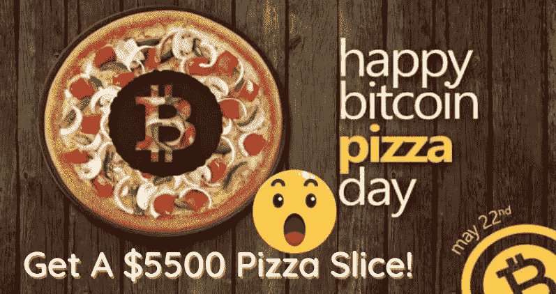

或者真的，**5500 美元的比特币**真的！为了配合即将到来的 2022 年 5 月 22 日比特币披萨日， [**Cake DeFi**](https://cakedefi.com/?ref=677920) 正在举办一场比赛——在 2022 年 5 月 20 日之前猜对 2022 年 5 月 22 日比特币价格的人将赢得 5500 美元的比特币，直接支付到参与者的 Cake DeFi 账户！

# 参与步骤

*   [**注册**](https://cakedefi.com/?ref=677920)Cake DeFi 账户，如果你还没有的话！在此期间，当您通过我的会员链接[在此](https://cakedefi.com/?ref=677920)注册，通过 KYC 验证，并在一批贷款/冻结 1 个月的股份/冻结 1 个月的流动性矿业股份中投资至少 50 美元时，您将获得 40 美元注册奖金+learn&中的 10 美元奖金。要了解更多关于获得注册奖金的细则，请点击这里查看我之前的文章。
*   点击进入**比赛**页面[。](https://pieceof.cakedefi.com/pizza-day)
*   **做出您的预测**参加竞赛，有望在 BTC 赢得 5500 美元。参赛作品将于 2022 年 5 月 20 日 23:59 UTC 时截止。

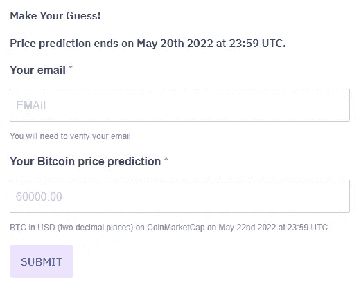

*   收到确认参赛的电子邮件。

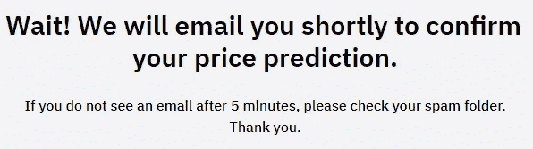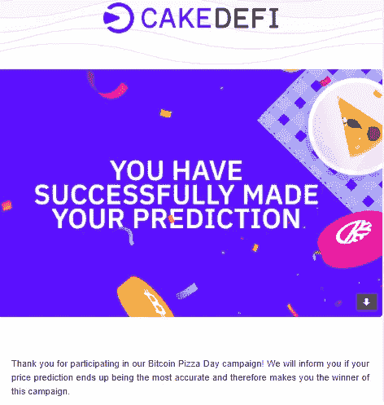

*   祈祷好运降临到你身上，2022 年 5 月 22 日！向你的朋友传播这个消息——如果你的推荐人猜对了比特币的价格，你将获得 1000 美元的奖金！

# 一些竞赛常见问题

*   **BTC 的价格将从何谈起？**比特币价格将于比特币披萨日(2022 年 5 月 22 日)23:59 UTC 从 CoinMarketCap 获取。最接近的猜测获胜！
*   **如果我还没有帐户，可以参加吗？**你需要先在[注册](https://cakedefi.com/?ref=677920)一个蛋糕 DeFi 账号，并在 2022 年 5 月 22 日前通过 KYC 验证，才有资格参赛。
*   **如果我还没有在蛋糕定义中存款，我可以参加比赛吗？**可以，只要你在 2022 年 5 月 22 日前通过 KYC 认证。
*   **我可以在参加比赛后更改我的答案吗？是的，你可以，但是只有你最新的猜测会被考虑。**

# 简单地说，蛋糕很难吃

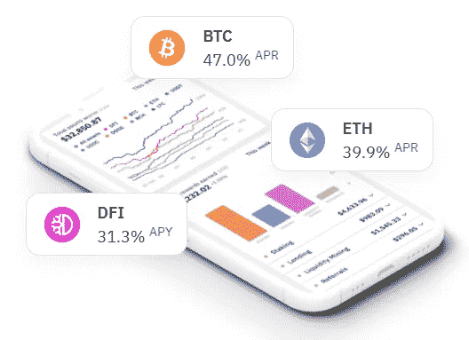

如果你还没有听说过蛋糕定义，不要担心，因为你还不算太晚参加派对！ [**Cake DeFi**](https://cakedefi.com/?ref=677920) 是一家总部位于新加坡的快速发展的金融科技平台，它从你闲置的加密货币中产生被动现金流，通过 DeFiChain 网络运行，DFI 是该网络的原生令牌，因此是支付其大部分奖励的主要货币。在一个有抱负和敬业的团队的带领下，Cake DeFi 在数字资产行业为自己建立了稳固的声誉，赢得了像我一样的许多快乐用户的信任。

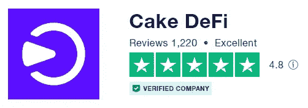

实际上，Cake DeFi 提供以下服务:

*   **跑马圈地**:配置 DFI 进入跑马圈地，赚取 30-40%不等的回报。入股/分拆资产不收取任何费用。桩是在一个灵活的条款，没有最短的合同期限。在 DFI，奖金每天发放两次，并与资本相结合。
*   **流动性挖掘**:将价值相等的 2 项资产分配到流动性挖掘池中，如比特币-DFI、以太坊-DFI、USDT-DFI 等，产生高达 100% APR 的回报(视市场情况而定)。奖励主要在 DFI 每天发放两次，并且可以自动下注以产生更多的复利。最近推出的[分散资产](/coinmonks/invest-in-tesla-google-apple-easily-with-decentralized-assets-cdfe4e58330b)代表了分散金融的一场革命，使投资者能够在投资股票/ETF/贵金属的两个世界中获得最佳收益，同时获得加密货币的高收益！
*   **贷款**:通过贷款，资产(比特币/以太坊/ USDT/ USDC)被锁定 1 个月的期限，有保证的基础年利率和潜在回报，如果资产价格超过某个目标，在期限到期时。
*   **冻结**:冻结可以比作忠诚计划，投资者将他们的资金锁定在流动性挖掘/投资中，期限从每月到 10 年不等，以换取更高的回报。
*   **借入**:用 DFI 作为抵押，以可承受的年利率 5%借入资产。将你借来的资金投资到 Cake DeFi 提供的任何高收益产品中，轻松抵消贷款利息！

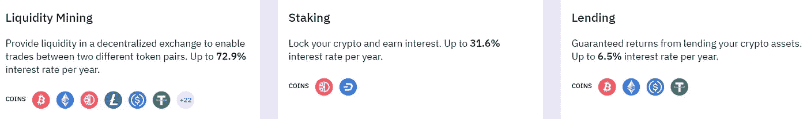

Cake DeFi’s services at a glance.

# 最后的想法

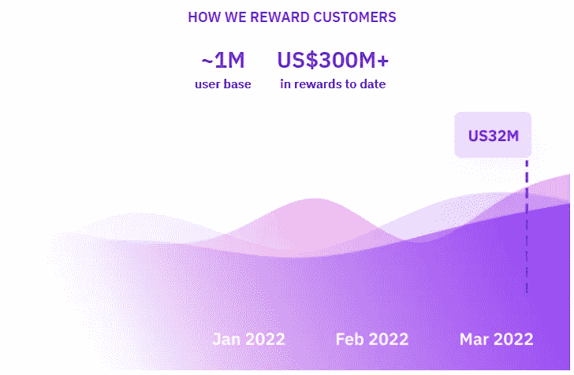

过去两年来，我一直是 Cake DeFi 的忠实客户，我很高兴地告诉大家，随着 DFI 的爆炸性增长，Cake 已经使我的投资组合增加了两倍多，而且它的许多产品提供了美味的 APYs 和 APRs！我唯一的遗憾是没有早点加入。如果你还没有加入 Cake，现在是最好的时机！此外，在 2022 年 5 月 22 日猜比特币的价格，有望赢得 5500 美元的比特币！

想了解更多关于蛋糕定义的令人兴奋的产品的信息，请随时查看我下面的文章！

 [## 用蛋糕 DeFi 赚取美味的被动现金流！

### 沃伦·巴菲特曾经说过‘如果你在睡觉的时候没有找到赚钱的方法，你会一直工作到死。“的确……

medium.com](/coinmonks/earn-delicious-passive-cash-flow-with-cake-defi-f01fce47e4c6)  [## 如何赚取蛋糕 DeFi 被动收入:教程

### 沃伦·巴菲特曾经说过“如果你在睡觉的时候没有找到赚钱的方法，你会一直工作到死。”这是…

medium.com](/coinmonks/how-to-earn-passive-income-with-cake-defi-a-tutorial-64abe4a01bec)  [## 我喜欢用蛋糕 DeFi 的 8 个理由！

### Cake DeFi 是一个加密货币投资平台，从您的数字资产中产生被动收入。立即注册…

medium.com](/coinmonks/8-reasons-why-i-love-using-cake-defi-f6547b9dfc4c)  [## 用分散的资产轻松投资特斯拉、谷歌和苹果！

### 概述

medium.com](/coinmonks/invest-in-tesla-google-apple-easily-with-decentralized-assets-cdfe4e58330b)  [## DFI，一枚被低估的硬币？

### 经过几天的绿色交易后，加密货币市场今天正在经历一些修正，也许…

medium.com](/coinmonks/dfi-an-underrated-coin-7effca02ed3f) 

*参考文献:*

[*比特币披萨日:庆祝 8000 万美元披萨订单(investopedia.com)*](https://www.investopedia.com/news/bitcoin-pizza-day-celebrating-20-million-pizza-order/)

 [## 比特币的披萨？

### 比特币的披萨？

比特币的披萨？bitcointalk.org](https://bitcointalk.org/index.php?topic=137.0) 

*本文所用的部分材料摘自 Cake DeFi 官方网站和博客。*

*一如既往，这不是财务建议！而只是我投资过的，觉得值得分享的投资平台。在投资前做好自己的研究，不要存你输不起的钱。下面有什么问题可以随时问我。*

*如果你喜欢这篇文章，* [*关注&订阅*](/@cybery) *！*

*查看以下值得信赖的平台！*

*🎁*[*honey gain*](https://r.honeygain.me/CYBER577DD)*一款被动收入应用，从你未使用的互联网带宽中赚钱。* [*免费获得 5 美元*](https://r.honeygain.me/CYBER577DD) *，无需投资。*

*🎁* [*蛋糕 Defi*](https://cakedefi.com/?ref=677920) *一站式投资平台，以高达 200%的年利率烘焙被动现金流！* [*拿 30 美元*](https://cakedefi.com/?ref=677920) *在 DFI 拿 50 美元存款。*

*🎁*[*Nexo*](https://nexo.io/ref/hce5cfdt5o?src=web-link)*全球最先进、受监管的数字资产机构，在 200 多个司法管辖区提供 40 多种法定货币的即时加密贷款、每日资产收益、交换和服务。* [*用 100 美元存款获得 25 美元*](https://nexo.io/ref/hce5cfdt5o?src=web-link) *。*

*🎁* [*摄氏度*](https://celsiusnetwork.app.link/174094633e) *一个金融科技平台，提供带息储蓄账户、借贷以及用数字和法定资产进行支付。* [*在 BTC 获得 50 美元*](https://celsiusnetwork.app.link/174094633e) *与 400 美元存款。*

*🎁*[*Hodlnaut*](https://www.hodlnaut.com/join/RTbHxuJMX)*一个稳健的新加坡加密借贷平台，成立于 2019 年，从你闲置的加密货币中产生被动现金流。* [*得到 30 美元*](https://www.hodlnaut.com/join/RTbHxuJMX) *在 USDC 有 1000 美元存款。*

*🎁*[*cabial*](https://invite.cabital.com/7P3UFW)*赚取高达 12%的加密利率，无需疯狂。*

*🎁*[*BlockFi*](https://blockfi.com/?ref=a16e37fd)*一种加密货币交易所和钱包。* [*用 100 美元存款获得 10 美元*](https://blockfi.com/?ref=a16e37fd) *。*

*🎁*[*Kucoin*](https://www.kucoin.com/r/af/rJH29LZ)*一个庞大的加密货币交易所，提供有趣的产品，如赌注、自由交易机器人和比特币云挖掘。*

*🎁*[*huo bi*](https://www.huobi.com/en-us/topic/double-invite/register/?invite_code=5t5jb)*总部位于塞舌尔的加密货币交易所，提供多样化的产品。*

*🎁*[*MEXC*](https://m.mexc.com/auth/signup?inviteCode=1NAJC)*一个加密货币交易所，有有趣的列表和频繁从 MX token 空投。*

*🎁*[*Crypto.com*](https://read.cash/@TraderFX/10-tips-to-maximize-earnings-on-honeygain-an-effortless-free-passive-income-app-68535728#bad-link)*一家位于新加坡的加密货币交易所。* [*获得 25 美元*](https://crypto.com/app/fcbsjmf5pb) *在 CRO 赌一张红宝石牌。*

*针对马来西亚投资者*

*🎁* [*斯塔沙威*](https://www.stashaway.my/referrals/kenleel9jx) *免费投资 6 个月！*

*🎁Wahed code 'KENLIE1' RM10 注册奖金*

*🎁Capbay P2P 代码' 8879c6' RM100 注册奖金*

*接我* [*中*](https://cybery.medium.com/)*|*[*read . cash*](https://read.cash/r/TraderFX)*|*[*Youtube*](https://www.youtube.com/c/SmartInvestingChannel)*|*[*推特*](https://twitter.com/cybertraderfx)*|*[*Linktree*](https://linktr.ee/trader.fx)

> 加入 Coinmonks [电报频道](https://t.me/coincodecap)和 [Youtube 频道](https://www.youtube.com/c/coinmonks/videos)了解加密交易和投资

# 另外，阅读

*   [5 款最佳加密交易终端](https://coincodecap.com/crypto-trading-terminals) | [最佳 DeFi 应用](https://coincodecap.com/best-defi-apps)
*   [比特币基地 vs 瓦济克斯](https://coincodecap.com/coinbase-vs-wazirx) | [比特鲁点评](https://coincodecap.com/bitrue-review) | [波洛涅克斯 vs 比特鲁](https://coincodecap.com/poloniex-vs-bittrex)
*   [德国最佳加密交易所](https://coincodecap.com/crypto-exchanges-in-germany) | [Arbitrum:第二层解决方案](https://coincodecap.com/arbitrum)
*   [币安交易机器人](/coinmonks/binance-trading-bots-d0d57bb62c4c) | [OKEx 评论](/coinmonks/okex-review-6b369304110f) | [阿塔尼评论](https://coincodecap.com/atani-review)
*   [最佳加密交易信号电报](/coinmonks/best-crypto-signals-telegram-5785cdbc4b2b) | [MoonXBT 评论](/coinmonks/moonxbt-review-6e4ab26d037)
*   [如何在 Bitbns 上购买柴犬(SHIB)币？](https://coincodecap.com/buy-shiba-bitbns) | [买弗洛基](https://coincodecap.com/buy-floki-inu-token)