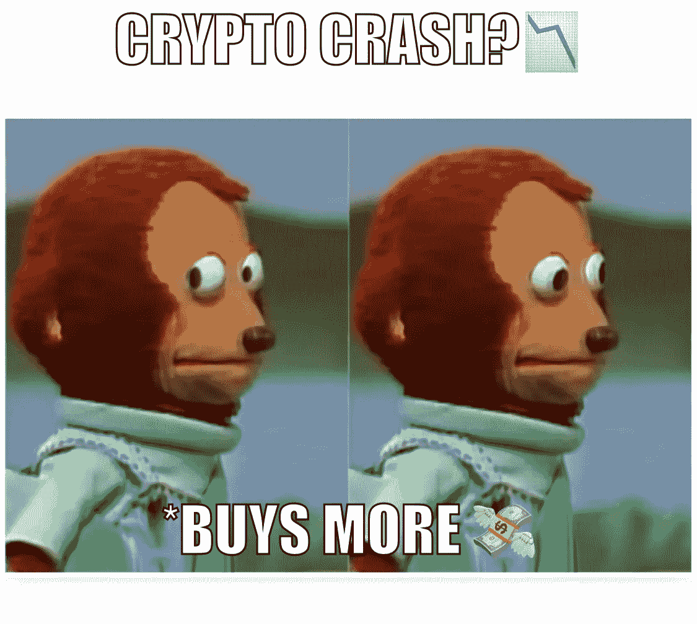
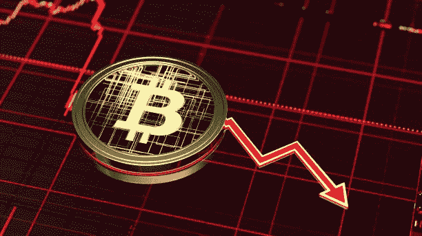
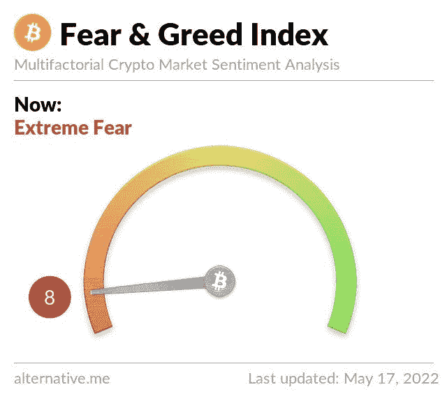
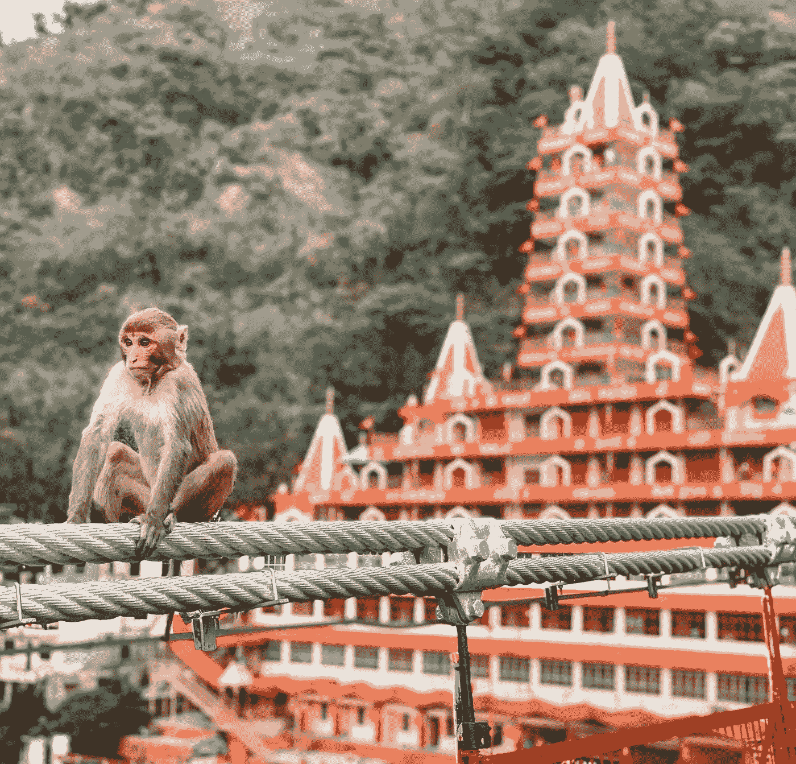

# 如何在熊市中获胜:加密/NFT 版(5 个技巧)🐻

> 原文：<https://medium.com/coinmonks/how-to-win-during-a-bear-market-crypto-nft-edition-5-tips-45cbf2af08e7?source=collection_archive---------16----------------------->

截至目前，2022 年 6 月 14 日，我们看到 BTC 和其他加密货币从 ATH 大幅下跌约 75%。

自 10 月底或 11 月初的大崩盘以来，加密市场一直相当低迷，但现在它看起来只会更糟。(这可能是有史以来最严重的大萧条的预测吗？？)

在这篇简短的博客中，你会发现在市场其他部分一片火红的时候保持绿色的技巧、策略和指导方针。

_______________________________________________________________

> **跟随我们的加密/NFT/区块链/元宇宙之旅，我们努力开放地球上第一个 NFT/以加密为中心的酿酒厂和离网社区🌱**
> 
> [*推特*](https://www.twitter.com/metadadsxyz)[*不和*](https://discord.gg/Cv8v2Ert8m)[*YouTube*](https://www.youtube.com/channel/UC7pbtSBs9nRJHK6coMhCR8g)[*抖音*](https://www.tiktok.com/@thedudescrypto)[*insta gram*](https://www.instagram.com/metadadsxyz)[*Spotify 播客*](https://open.spotify.com/episode/5U8vXE9HDAsGbSbebw9p62?si=2rZIigw-Tw2pCxjxmkbYzQ)

__________________________________________________________________

随着加密变得如此不稳定，如果你担心丢失/获得加密，那么保持对你的资产的密切监视是非常重要的。根据 Elon Musk 在 Twitter 上的说法，在几分钟内，BTC(所有其他加密令牌都围绕它旋转)可能会下跌 5-10%

如果你还不知道，如果 BTC 下跌 5%，其他大多数“替代币”和“迷/屎币”很可能会下跌超过 5%……在 crypto now 的早期阶段，BTC 是“黄金标准”，所有其他加密货币都围绕着它。虽然不会永远这样。

正因为如此，最好把比特币(BTC)像黄金一样堆积起来，像一种价值储存手段。其他的硬币或多或少都是用来随意摆弄和投资各个项目的。

____________________________

在投资任何东西时，尤其是在我们目前所处的熊市中，以下是一些需要确保的要点。

1.  **DYOR** - *自己做研究*
    在投资自己的钱时，永远不要完全依赖别人的话。他们很少把你的最佳利益放在心上。
2.  **当有疑问时，缩小** 如果你只是看到价格持续下降，请“缩小”并开始查看 4 小时、1 天、甚至 1 个月的图表，以便更好地了解我们现在和过去的情况。
3.  **DCA** - *美元平均成本* 美元平均成本指的是系统地投资相等的金额，间隔固定的时间，不考虑价格。它降低了一些波动性，并确保你不会因为一笔大的一次性投资而损失所有资产。
4.  **观察恐惧/贪婪指数**

这基本上是警告你什么时候是卖出和买入的好时机…如果是红色，那意味着大多数投资者担心市场即将崩溃，价格会更低。这通常是购买的好时机，因为价格更便宜。如果指数是绿色的，这通常意味着价格更高，正在获利，但是当人们变得太贪婪(绿色)时，如果你不够小心，那就是大多数亏损可能发生的时候。

5.**长期愿景** 当你开始看到市场像过去几天那样崩溃时，你很容易感到害怕和悲伤……
你必须永远记住的一件事是，投资克罗/NFT 或多或少是投资克罗/NFT 背后的技术，即区块链技术。如果你可以把你的资产看作是一种先进技术(确实如此)，那么你也应该知道技术永远不会倒退，未来它唯一的发展方向是上升……就像标准普尔 500 指数(股票市场)自推出以来一样……它只会上升，当然会有几次大的崩盘，但总的来说，长期持有的轨迹看起来不错。

____________________________

尽管我们看到 ETH 沿着 1200 美元的关口反弹，但我们可以看到它真正的祝福！这是买入的好时机，甚至可能买下你一直关注的蓝筹股 NFT！

> 有一件事是你在大多数经济书籍中找不到的，那就是在熊市期间，这实际上是开始和/或继续建立你的下一个项目/净值/社区的最佳时机，因为一旦牛市回来，而且总是如此，你就准备好启动并驾驭繁荣的浪潮。

*灾难总会带来祝福，你只需要用正确的眼光看待它们。*

______________________________

永远要小心！！！⚠️

我怎么强调都不为过！保持高度警惕，注意你点击的每一个链接，你做的每一笔交易，和你交往的每一个人，因为骗子在这个领域是大量的，最好的项目也会被取消。

*在点击所有链接之前，要再三检查，确保它们是你要找的官方链接。在给自己或他人发送任何有价值的东西之前，也要仔细检查所有的钱包地址。*

> ***跟随我们的加密/NFT/区块链/元宇宙之旅，努力开启地球上第一个 NFT/以加密为中心的酿酒厂和离网社区🌱***
> 
> [*推特*](https://www.twitter.com/metadadsxyz)[*不和*](https://discord.gg/Cv8v2Ert8m)[*YouTube*](https://www.youtube.com/channel/UC7pbtSBs9nRJHK6coMhCR8g)*[*抖音*](https://www.tiktok.com/@thedudescrypto)[*insta gram*](https://www.instagram.com/metadadsxyz)[*Spotify 播客*](https://open.spotify.com/episode/5U8vXE9HDAsGbSbebw9p62?si=2rZIigw-Tw2pCxjxmkbYzQ)*
> 
> **请发送 Polygon Matic 到这个 Eth 地址或 Eth Tokens 来支持我和我的新生儿🙏🏼
> 0xb 53 b 3978333 e 11 c 382 ab 619 f 02 f 469 A8 c 70750 af**

**___________________________________________________________________**

****

**感谢阅读:]**

**干杯，
***Ty 又名【纨绔子弟】*****

****我们其他的一些博文:**
[5 个没落的 Web3](/coinmonks/5-downfalls-of-web3-cd5dc8ade4fd)
[5 + 5 个不和谐的战术](/coinmonks/5-tips-for-a-better-discord-nft-crypto-edition-ff9b039d0359)
[Crypto 101: A 初学者指南](/coinmonks/crypto-101-a-beginners-guide-345d440bd163)
[NFT 最佳实践(营销&社区成长)](/coinmonks/top-5-nft-best-practices-marketing-and-community-growth-7025e26eb50c)
[Web3 基础知识](/coinmonks/web3-basics-252121357f33)
[NFT 的替代实用案例](/coinmonks/alternative-nft-crypto-real-life-use-cases-b7c0b08d99ef)**

> **加入 Coinmonks [电报频道](https://t.me/coincodecap)和 [Youtube 频道](https://www.youtube.com/c/coinmonks/videos)了解加密交易和投资**

# **另外，阅读**

*   **[分散交易所](https://coincodecap.com/what-are-decentralized-exchanges) | [比特 FIP](https://coincodecap.com/bitbns-fip) | [宾邦评论](https://coincodecap.com/bingbon-review)**
*   **[用信用卡购买密码的 10 个最佳地点](https://coincodecap.com/buy-crypto-with-credit-card)**
*   **[加拿大最佳加密交易机器人](https://coincodecap.com/5-best-crypto-trading-bots-in-canada) | [Bybit vs 币安](https://coincodecap.com/bybit-binance-moonxbt)**
*   **[阿联酋 5 大最佳加密交易所](https://coincodecap.com/best-crypto-exchanges-in-uae) | [SimpleSwap 评论](https://coincodecap.com/simpleswap-review)**
*   **购买 Dogecoin 的 7 种最佳方式 | [ZebPay 评论](https://coincodecap.com/zebpay-review)**
*   **[最佳期货交易信号](https://coincodecap.com/futures-trading-signals) | [流动性交易所评论](https://coincodecap.com/liquid-exchange-review)**