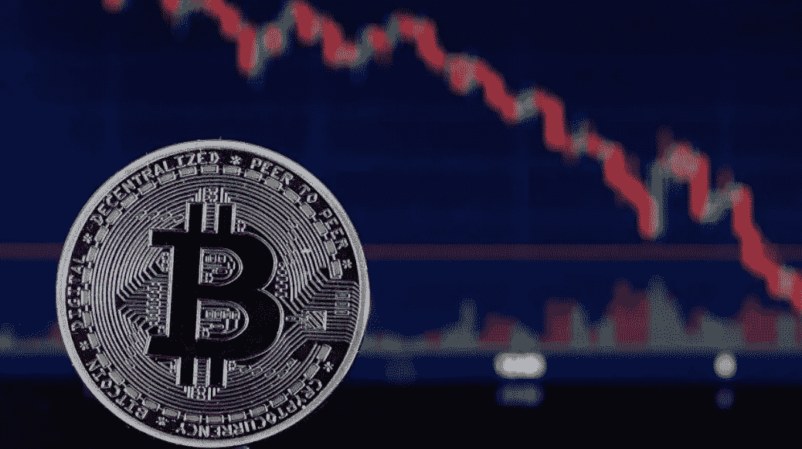

# 如何赢得带给我们高买低卖的力量？

> 原文：<https://medium.com/coinmonks/how-to-win-the-force-that-brings-us-to-buy-high-and-sell-low-daca078c935c?source=collection_archive---------48----------------------->

在任何类型的投资中，正确的心态都至关重要，尤其是在加密货币的蛮荒西部。我在 2021 年初进入这个世界，我研究过，经历过几次崩盘，现在过着我的第一次熊市，希望它很快会切换到另一个上涨趋势。

我买卖过很多硬币，在 2021 年上半年，我看到价格图表只朝一个方向走，只有上涨。我跳上这些马，在某些情况下购买已经接近其顶部的硬币。我在 2021 年 3 月和 4 月的上升曲线上购买了我的第一批比特币，当价格在 5 月暴跌时，有一股力量拉着我卖掉(“卖掉，卖掉，我的朋友！”).好恐慌！但是我反对一个大小相等方向相反的力。幸运的是，我没有这么做，我现在没有，我也不会这么做，如果现在的价格在 30k 左右。如果你不卖出，你就不会失去，因为 1 个比特币就是 1 个比特币，比特币很有可能会升值(如果我们不能完全确定这种情况会发生，事实上这就是投资的风险)。但是诱惑很大，很大。许多散户都会遇到这种情况，他们在高位买入比特币，然后以更低的价格卖出，以限制他们的损失，让钻石手有机会以有利的价格积累。

**怎么做才能避免比特币高买低卖？为了避免这种情况，我试着遵循以下四条指令。**

**首先**，我投资我能承受的损失，这将防止我在比特币崩盘时卖出

**第二个**，有时候我会用一种美元平均成本来计算一个长期的平均价格，避免在最高价或我认为太高的价格买入所有东西。

第三，我必须获得部分利润，尤其是当价格趋势呈抛物线时，最终当价格下跌时，我会尝试重新投资。

**第四个**，我也不是在交易，而是计划用几个月或几年的时间买入硬币，我研究价格图表、资产或硬币的历史，我跟踪市场的每日更新，我试图了解价格是否会上下波动。例如，在过去的几个月里，我避免在 50-60k 美元购买比特币，但我等待低于 40k 美元的价值，现在我们在 30k 美元或更低的价格，我认为这些是购买更多的公平价格。

这些建议也可以作为一些替代硬币的参考，如果它们风险更大的话。

这些是给我的建议！

Credits: Chesnot/Getty Images

> *加入 Coinmonks* [*电报频道*](https://t.me/coincodecap) *和* [*Youtube 频道*](https://www.youtube.com/c/coinmonks/videos) *了解加密交易和投资*

# 另外，阅读

*   [3 商业评论](/coinmonks/3commas-review-an-excellent-crypto-trading-bot-2020-1313a58bec92) | [Pionex 评论](https://coincodecap.com/pionex-review-exchange-with-crypto-trading-bot) | [Coinrule 评论](/coinmonks/coinrule-review-2021-a-beginner-friendly-crypto-trading-bot-daf0504848ba)
*   [莱杰 vs n 格拉夫](/coinmonks/ledger-vs-ngrave-zero-7e40f0c1d694) | [莱杰纳诺 s vs x](/coinmonks/ledger-nano-s-vs-x-battery-hardware-price-storage-59a6663fe3b0) | [币安评论](/coinmonks/binance-review-ee10d3bf3b6e)
*   [Bybit Exchange 审查](/coinmonks/bybit-exchange-review-dbd570019b71) | [Bityard 审查](https://coincodecap.com/bityard-reivew) | [Jet-Bot 审查](https://coincodecap.com/jet-bot-review)
*   [3 commas vs crypto hopper](/coinmonks/3commas-vs-pionex-vs-cryptohopper-best-crypto-bot-6a98d2baa203)|[赚取加密利息](/coinmonks/earn-crypto-interest-b10b810fdda3)
*   最好的比特币[硬件钱包](/coinmonks/hardware-wallets-dfa1211730c6) | [BitBox02 回顾](/coinmonks/bitbox02-review-your-swiss-bitcoin-hardware-wallet-c36c88fff29)
*   [BlockFi vs Celsius](/coinmonks/blockfi-vs-celsius-vs-hodlnaut-8a1cc8c26630)|[Hodlnaut 点评](/coinmonks/hodlnaut-review-best-way-to-hodl-is-to-earn-interest-on-your-bitcoin-6658a8c19edf) | [KuCoin 点评](https://coincodecap.com/kucoin-review)
*   [Bitsgap 审查](/coinmonks/bitsgap-review-a-crypto-trading-bot-that-makes-easy-money-a5d88a336df2) | [Quadency 审查](/coinmonks/quadency-review-a-crypto-trading-automation-platform-3068eaa374e1) | [Bitbns 审查](/coinmonks/bitbns-review-38256a07e161)