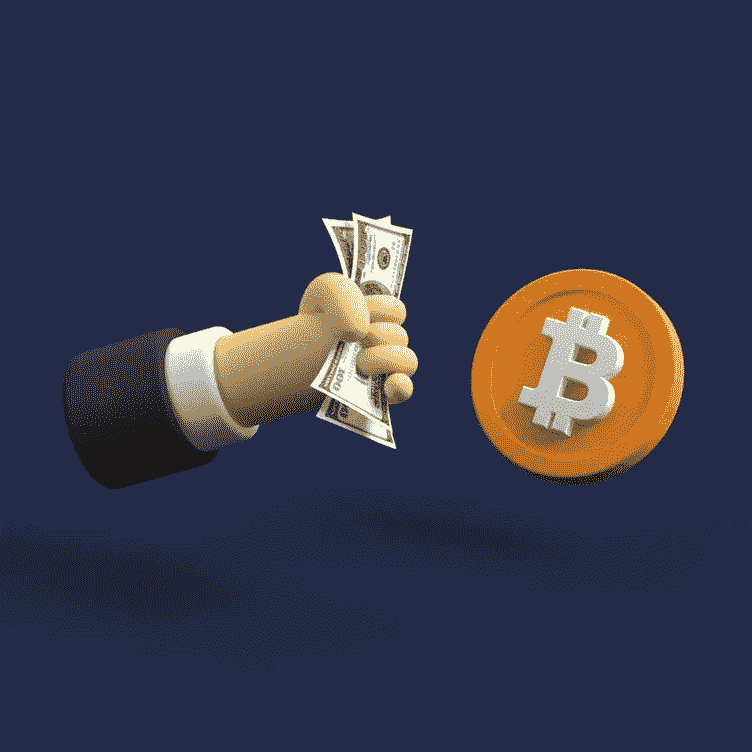

# 如何将比特币提取到尼日利亚的银行

> 原文：<https://medium.com/coinmonks/how-to-withdraw-bitcoin-to-bank-in-nigeria-7e4b3f30eb53?source=collection_archive---------54----------------------->

比特币是创造虚拟货币的首次成功尝试。2009 年由一个化名为中本聪的人发起。整个比特币机制是作为现金的替代品而存在的，它不需要像菲亚特拥有的银行和政府那样的中央控制机构。相反，比特币使用一个点对点的互联网网络，在用户之间直接确认购买。

比特币的市值为 612，415，160，112 美元，是现有的数千种加密令牌中最有价值的加密货币。

**比特币是如何运作的？**

比特币只是一个存储的文件，表明你在区块链拥有特定数量的比特币，没有实物资产支持比特币。要了解加密货币的工作原理，理解以下术语会有所帮助:

**区块链:**比特币由被称为区块链的开源代码驱动，它创建了一个共享的公共账本，以“区块”的形式记录交易，这些“区块”被“链接”在一起，以防止篡改。这项技术为每一笔交易创建了永久记录，它为所有比特币用户提供了一种方式，让他们可以根据共同的知识来操作谁拥有什么。

**私钥和公钥:**一个比特币钱包包含一个公钥和一个私钥(加密密钥)，它们一起工作，允许所有者发起和数字授权交易。这提供了比特币的核心功能——安全地拥有令牌并将其所有权从一种用途转移到另一种用途，就像我们对法定货币所做的那样。

**比特币挖掘:**比特币网络上的用户通过一个被称为挖掘的过程来验证交易，该过程旨在确认新交易与过去进行的其他交易一致。这就保证了你不能双花比特币，或者花一个你没有的比特币。

# **如何将比特币提取到尼日利亚的银行**

Withdraw Bitcoin to Bank

提取的方法取决于你在哪里，你是否在一个国家有有利的加密资产法规或没有。假设你在一个对加密货币活动有限制的国家，在这种情况下，你可以将你的银行账户详细信息添加到币安、比特币基地等国际交换平台，你将能够将你的比特币兑换成你的当地货币并发送到你的银行账户——所有这些都在平台内进行。

然而，如果你在一个有加密限制或禁令的国家，你当地的银行在法律上不能与国际加密货币交易平台进行交易，因为政府限制银行与加密货币组织和实体进行交易。因此，当你在这种类型的国家时，你需要付出额外的努力来出售你的比特币。在这些地区，出售比特币主要有两种方式；

1.  **点对点交换系统:**

点对点交换是一种常见的将加密货币兑换成法定货币的方式。顾名思义，点对点交流也叫 P2P 交流，涉及 2 个人；卖方和买方。卖家用他们的比特币或其他加密币换取买家以约定汇率支付的当地货币。交易发生在提供 P2P 服务的交易所。

提供 P2P 服务的加密交易所已经建立了机制来保护买方和卖方免受任何形式的不当行为。热门 P2P 平台包括；

–**Remitano**:Babylon Solutions Limited 的产品，是尼日利亚最常用的点对点交流平台。它提供了一个托管的 P2P 平台，将买家和卖家联系起来，这样他们就可以协商汇率并交易他们的加密硬币。

**–币安 P2P:** 就流动性而言，币安是世界顶级交易所。它由赵昌鹏于 2017 年推出，作为约 500 种加密货币对的交易平台。币安 P2P 于 2019 年首次在移动应用程序上推出，并于 2020 年初在网络平台上推出。币安 P2P 提供银行转账、PayPal 和 100 多种支付方式。

支持的货币有、、、、ETH 和 DAI。

## **本地加密交换平台:**

工作就像一个柜台交易平台或 P2P 交易系统，但你是出售给一个组织，而不是个人。

如果你是加密货币的新手，最好使用本地交换平台，因为 P2P 交换平台带来的学习曲线和使用前必须熟悉的安全威胁。

你应该把你的比特币卖给[达特非洲](https://dartafrica.io/)，在那里你可以很容易地把你的比特币兑换成现金。与 P2P 交换平台不同，出售你的比特币不需要任何形式的技术细节，你只需要知道当前的汇率，这样你就知道你的比特币会得到什么，平台会提供比特币的钱包地址，在他们确认比特币交易后，你会收到比特币的现金。

使用 Dart Africa 的平台上的[汇率计算器检查汇率。](https://dartafrica.io/coincalculator)

# **如何在 Dart Africa 上用比特币兑换现金**

Trade Bitcoin for Cedis

–要在 Dart Africa 上进行交易，您必须在他们那里有一个账户。使用您的正确凭证在他们那里创建一个帐户,或者如果您已经在他们那里有帐户，只需[登录](https://dartafrica.io/login)。如果您只是创建一个帐户，验证邮件将发送到您提供的电子邮件，请确保验证您的帐户。

–首次登录您的帐户时，系统会要求您创建一个 PIN，请确保您选择了一个您能记住的 PIN。当你想从你的账户中提款时，这个密码将会被使用。

–将您的银行帐户详细信息添加到 Dart Africa 帐户的帐户列表中。

–您会在屏幕左侧看到一个 nav 菜单，点击 sell coin 并选择比特币作为交换的首选硬币，naira 值就会显示出来。

–点击开始交易，他们的系统将自动创建一个带有条形码的钱包地址，将密码发送到该地址，资金将在 2 次批量确认后发送到 Dart Africa 帐户。请注意，您可以向提供的钱包地址发送任何金额，他们的系统将根据收到的金额为您存款。

–在付款支付到您的 Dart Africa 帐户后，点击取款，将资金发送到您的银行帐户。您可以查看您的交易历史，以检查资金是否已发送到您的银行账户。

> 加入 Coinmonks [电报频道](https://t.me/coincodecap)和 [Youtube 频道](https://www.youtube.com/c/coinmonks/videos)了解加密交易和投资

# 另外，阅读

*   [从 WazirX 切换到 CoinDCX 的 5 个理由](https://coincodecap.com/reasons-to-switch-from-wazirx-to-coindcx)
*   [联合国硬币评论](https://coincodecap.com/unocoin-review) | [最佳加密赌注硬币](https://coincodecap.com/best-crypto-staking-coins)
*   [如何使用 MetaMask Wallet 获得 KCC 地址？](https://coincodecap.com/kcc-address-metamask)
*   [如何获得自己的。XYZ 领域？](https://coincodecap.com/xyz-domain)
*   [最佳加密交换平台](https://coincodecap.com/best-crypto-swap-platforms) | [最佳加密交易所](https://coincodecap.com/crypto-exchange)
*   [购买比特币印度](/coinmonks/buy-bitcoin-in-india-feb50ddfef94) | [Pionex 审查](/coinmonks/pionex-review-exchange-with-crypto-trading-bot-1e459d0191ea) | [加密交易机器人](/coinmonks/crypto-trading-bot-c2ffce8acb2a)