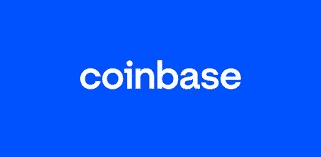

# 如何从比特币基地提取以太坊到银行账户

> 原文：<https://medium.com/coinmonks/how-to-withdraw-ethereum-from-coinbase-to-bank-account-6c0c8a96b14a?source=collection_archive---------44----------------------->

以太坊被普遍称为仅次于比特币的第二好的加密货币。然而，与比特币和大多数其他数字货币不同，以太坊不仅仅是一种交换媒介或现金替代品。相反，以太坊将自己呈现为一个基于区块链技术的分散式计算机网络。

**以太坊是如何运作的？**

以太坊和其他加密货币一样，都是在区块链网络的基础上运作的。区块链是一个公开分发的分类帐，其中存储并验证所有加密交易。区块链技术最大的优点是能够保护和验证存储在其上的数据，而无需第三方验证。

区块链的分布式本质来自以太坊网络上的每个人都可以访问账本，这促进了所有参与者之间的透明性。它是分散的，因为网络不受任何监管机构或中央实体的管理或控制，而是由网络上的所有参与者监管。

区块链上的交易使用加密技术来保证网络安全和交易验证。矿工使用计算机来解决复杂的数学问题，验证网络上的每个加密交易，并将信息存储在一个块中，当填充该块时，该块将链接到先前填充的块。参与者将获得以太币作为奖励。

如果您的以太坊存储在我们的比特币基地钱包中，并且您想将其兑换成当地货币。如果您所在的国家政府普遍禁止加密活动，银行不允许与加密货币交易所进行交易，因此您不能将您的银行信息添加到比特币基地，以便直接向您的银行汇款。你必须使用像 Dart Africa 这样的本地加密交易所，或者使用具有 P2P 交换服务的交换平台。

# **本地加密交换使用；非洲飞镖**

Withdraw Ethereum from Coinbase

如果你在尼日利亚或加纳，Dart Africa 无疑是出售以太坊现金的最佳地点。Dart Africa 是一个最先进的加密货币交易平台，以优惠的汇率购买各种加密货币，如比特币、以太坊、莱特币、USDT、USDC 等。

有了 Dart Africa，您的以太坊将以加密兑换市场上最优惠的价格进行兑换。在其平台上有一个[自动比率计算器](https://dartafrica.io/coincalculator)，可以给出你想要出售的任何数量的密码的 Naira 和 Cedis 等价物，所有这些都是由 Dart Africa 提供的，以帮助客户的销售体验。

Dart Africa 拥有快速支付系统，这得益于其自动化支付的全自动销售平台。您的以太坊付款将在确认交易后立即支付。将你的以太币转换成现金的过程已经被简化，以适应专业人士和新手。

# **如何在 Dart Africa 上用您的以太坊兑换现金**

Withdraw Ethereum from Bank Account

–要在 Dart Africa 上进行交易，您必须在他们那里有一个账户。[使用您的正确凭证在他们那里创建一个账户](https://dartafrica.io/register)，或者如果您已经在他们那里有了账户，只需[登录](https://dartafrica.io/login)。如果您只是创建一个帐户，验证邮件将发送到您提供的电子邮件，请确保验证您的帐户。

–首次登录您的帐户时，系统会要求您创建一个 PIN，请确保您选择了一个您能记住的 PIN。当你想从你的帐户中提款时，这个密码将会被使用。

–将您的银行帐户详细信息添加到 Dart Africa 帐户的帐户列表中。

–您将在屏幕左侧看到一个导航菜单，点击“出售硬币”并选择以太坊作为兑换的首选硬币，然后将显示奈拉值。

–点击开始交易，他们的系统将自动创建一个带有条形码的钱包地址，将密码发送到该地址，资金将在 2 次批量确认后发送到 Dart Africa 帐户。请注意，您可以向提供的钱包地址发送任何金额，他们的系统将根据收到的金额为您存款。

–在付款支付到您的 Dart Africa 帐户后，点击取款，将资金发送到您的银行帐户。您可以查看您的交易历史，以检查资金是否已发送到您的银行账户。

> 加入 Coinmonks [电报频道](https://t.me/coincodecap)和 [Youtube 频道](https://www.youtube.com/c/coinmonks/videos)了解加密交易和投资

# 另外，阅读

*   [5 款最佳加密交易终端](https://coincodecap.com/crypto-trading-terminals) | [最佳 DeFi 应用](https://coincodecap.com/best-defi-apps)
*   [比特币基地 vs 瓦济克斯](https://coincodecap.com/coinbase-vs-wazirx) | [比特鲁点评](https://coincodecap.com/bitrue-review) | [波洛涅克斯 vs 比特鲁](https://coincodecap.com/poloniex-vs-bittrex)
*   [德国最佳加密交易所](https://coincodecap.com/crypto-exchanges-in-germany) | [Arbitrum:第二层解决方案](https://coincodecap.com/arbitrum)
*   [币安交易机器人](/coinmonks/binance-trading-bots-d0d57bb62c4c) | [OKEx 评论](/coinmonks/okex-review-6b369304110f) | [阿塔尼评论](https://coincodecap.com/atani-review)
*   [最佳加密交易信号电报](/coinmonks/best-crypto-signals-telegram-5785cdbc4b2b) | [MoonXBT 评论](/coinmonks/moonxbt-review-6e4ab26d037)
*   [如何在 Bitbns 上购买柴犬(SHIB)币？](https://coincodecap.com/buy-shiba-bitbns) | [购买弗洛基](https://coincodecap.com/buy-floki-inu-token)
*   [CoinFLEX 评论](https://coincodecap.com/coinflex-review) | [AEX 交易所评论](https://coincodecap.com/aex-exchange-review) | [UPbit 评论](https://coincodecap.com/upbit-review)