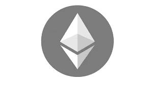

# 如何在 Cedis 中提取以太坊

> 原文：<https://medium.com/coinmonks/how-to-withdraw-ethereum-in-cedis-5bb77ad5413b?source=collection_archive---------57----------------------->

以太是以太坊网络的加密货币；由流行的区块链技术支持的分散式全球软件平台。与比特币不同，以太坊是一种可编程、可扩展、安全和分散的加密技术，它有时被称为 web3 开发者的加密货币，这些开发者利用区块链的分散特性来创建应用和技术。以太坊网络被设计成支持智能合约；各种区块链技术的基础，如不可替代代币(NFT)、去中心化金融、Web3 游戏和其他使用区块链和智能合约的技术。

您可以使用各种技术将您的以太坊转换为 Cedis 中的现金，如点对点加密货币兑换和本地加密货币兑换。我们稍后将讨论如何使用这两个平台，但首先，您必须知道我们所说的对等或 P2P 交换系统和本地加密交换。

点对点交易，通常被称为 P2P 交易，需要两个人之间的加密货币交易，一个是卖方，另一个是买方。P2P 加密交易是在点对点市场或交易所进行的，如币安 P2P 和 Remitano，加密货币卖家发布广告，以汇率和首选支付方式出售或购买加密货币。

## **如何在 Remitano 上出售以太坊**

首先要做的是用你正确的凭证在 Remitano 上注册一个帐户，使用正确的凭证很重要，因为这将帮助你在平台上轻松地进行和接收加密货币支付。创建帐户后，请按照以下步骤操作；

**第一步:**从主页向下滚动，在“买家列表”中找到买家，点击“出售”

**第二步:**输入你要出售的以太坊数量，点击*出售*。请注意，“金额限制”是买方指定的他们想要交易的最小和最大限制。只能在买家指定的以太坊限额内交易。

**第三步:**输入您首选的以太坊收款方式，如果是您的银行账户，请指定买家收款的银行名称、账号和账户名称，点击*继续*。

**第四步:**如果你的 Remitao 钱包里已经有以太坊，交易会自动切换到等待买家付款。

如果您的 Remitano 钱包中没有 ETH，将在交易中提供一个 ETH 地址，发送给 ETH，交易将开始。

**第 5 步:**收到 ETH 付款后，点击“*我已收到付款*”将 ETH 发放给买家。

确保你已经收到付款后才释放资金。

币安 P2P 是另一个流行的交换平台，用你的以太坊交换 Cedis，在币安 P2P 上出售你的以太坊的步骤与上面测量的相似。

# **本地加密交换平台**

Sell Ethereum For Cedis

本地加密交换平台的工作方式类似于 P2P 交换，但不是看着不同的买家购买你的以太坊，你只是在和交换实体打交道。有一个约定的汇率提供，就像 P2P 交易所一样，你把你的以太坊发送到交易所以太坊地址，平台把约定的费用支付到提供的银行账户。

本地加密交换平台的缺点是获得一个拥有顶级交换服务的真正平台。在互联网上寻找一个好的本地交流平台可能会很繁琐，这就是为什么我们建议您使用[Dart Africa](http://dartafrica.io)；被认为是非洲最好的加密货币交易平台之一。向 Dart Africa 出售以太坊不需要任何技术，他们的平台旨在让人们轻松导航和出售他们的加密货币。

# **如何在 Dart Africa 上用 Cedis 卖掉你的以太坊**

–您需要做的第一件事是[创建一个帐户](https://dartafrica.io/register)，或者[登录](https://dartafrica.io/login)，如果您已经有一个帐户的话。

–如果您刚刚注册，在您第一次登录时，您将被要求创建一个 4 位数的 PIN，以保护您的 Dart Africa 帐户免受未经授权的进入。

–在您的帐户仪表板上，您的帐户余额、未决交易、最近交易和出售硬币界面都将显示出来。在出售硬币界面选择以太坊作为您的首选加密选项，然后点击“*出售硬币*”。

–您要将以太坊发送到的钱包地址将显示在下一页，您可以复制并粘贴该地址，或者只需扫描加密钱包上的条形码。

> 加入 coin monks[Telegram group](https://t.me/joinchat/Trz8jaxd6xEsBI4p)并了解加密交易和投资

–在对以太坊交易进行交易验证后，他们的系统会自动向您的账户汇款。请注意，您可以向电子钱包地址发送任意数量的 ETH，因为系统将根据发送的密码数量进行存款。