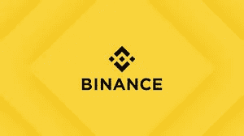
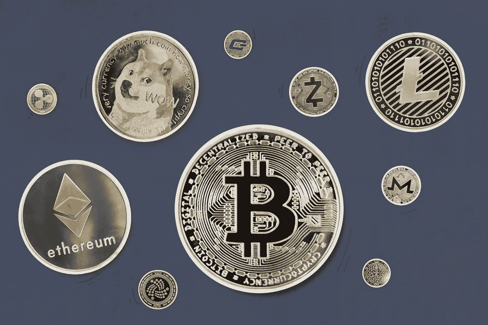

# 如何从币安提取法定货币到银行账户

> 原文：<https://medium.com/coinmonks/how-to-withdraw-fiat-currency-from-binance-to-bank-account-3ef67447cb37?source=collection_archive---------17----------------------->

币安交易所成立于 2017 年，是交易量最大的加密交易所，也是世界上最快的交易所之一。它的特点是高度重视替代硬币交易。币安提供 500 多种加密货币和虚拟代币的加密到加密交易，包括比特币(BTC)、以太币(ETH)、莱特币(LTC)、Dogecoin (DOGE)和自己的代币币安币(BNB)。2018 年，它将公司总部从香港迁至欧盟马耳他，以应对中国对加密交易所的严格限制。

对大多数国家来说，从币安取钱到你的银行账户很容易。

付款方式取决于您所在的国家或地区。在大多数国家，您可以使用“*即时卡提款*支付方式。“*即时提现*”方法允许您从您的菲亚特钱包中即时提现到您的借记卡或信用卡中

# **如何从币安银行账户取钱**

*   要从币安向你的银行账户取钱，你需要导航到你的菲亚特和现货钱包部分。
*   然后你点击取款，选择你喜欢的货币，支付方式和取款细节。
*   最后，添加一张卡，完成安全验证，然后等待取款完成。

对于即时卡提款，提款将在 5 分钟内处理。另一方面，SWIFT 支付方式可能需要 1 到 4 个工作日。如果网络拥塞，可能需要更多时间。

请注意，如果 exchange 平台上正在进行系统升级，您将无法退出。币安在进行系统升级时暂停取款。

总之，下面是如何从币安取钱到你的银行账户:

1.  去你的菲亚特和现货钱包
2.  点击“撤回
3.  选择货币、支付方式和取款信息
4.  输入您的卡信息
5.  完成安全验证
6.  等待撤回完成

如果你在尼日利亚和加纳境内，你可以在 [Dart Africa](http://dartafrica.io) 上出售你的加密货币；非洲最好的本地加密交换平台。

# **飞镖非洲；Naira 和 Cedis 的最佳加密交易平台**

Sell Crypto Currency For Cash

当您向 Dart Africa 出售加密货币时，您可以在外汇市场上以最优惠的价格出售您的加密货币；非洲最好的加密交换平台之一。您可以在他们的网站上使用[硬币计算器](https://dartafrica.io/coincalculator)功能查看当前汇率。Dart Africa 通过网络和移动应用程序提供服务。他们的应用可以在谷歌 Play 商店和应用商店下载。

交易应该在几分钟内处理完毕，一旦您将约定的加密货币发送到他们平台上提供的地址，相应的 Naira 或 Cedis 值将在确认加密交易后的几分钟内立即发送到您的 Dart Africa 帐户。Dart Africa 快速可靠。

**支持的加密硬币**

*   比特币
*   莱特币
*   以太坊
*   泰达币
*   BUSD
*   Dogecoin
*   USDC

# **如何在 Dart Africa 上用密码换取现金**

–要在 Dart Africa 上进行交易，您必须在他们那里有一个账户。[用你的正确凭证在他们那里创建一个账户](https://dartafrica.io/register)，或者如果你已经在他们那里有了账户，只需[登录](https://dartafrica.io/login)。如果您只是创建一个帐户，验证邮件将发送到您提供的电子邮件，请确保验证您的帐户。

–首次登录您的帐户时，系统会要求您创建一个 PIN，请确保您选择了一个您能记住的 PIN。当你想从你的账户中提款时，这个密码将会被使用。

–将您的银行帐户详细信息添加到 Dart Africa 帐户的帐户列表中。

–您会在屏幕左侧看到一个 nav 菜单，点击 sell coin 并选择比特币作为交换的首选硬币，naira 值就会显示出来。

–点击开始交易，他们的系统将自动创建一个带有条形码的钱包地址，将密码发送到该地址，资金将在 2 次批量确认后发送到 Dart Africa 帐户。请注意，您可以向提供的钱包地址发送任何金额，他们的系统将根据收到的金额为您存款。

–在付款支付到您的 Dart Africa 账户后，点击取款。之后，您可以将资金发送到您的银行账户。您可以查看您的交易历史，以检查资金是否已发送到您的银行账户。

> 加入 Coinmonks [电报频道](https://t.me/coincodecap)和 [Youtube 频道](https://www.youtube.com/c/coinmonks/videos)了解加密交易和投资

# 另外，阅读

*   [OKEx 评论](/coinmonks/okex-review-6b369304110f) | [Coinswitch 俱吠罗评论](/coinmonks/coinswitch-kuber-review-1a8dc5c7a739) | [比特币基地收费](/coinmonks/coinbase-fees-831e77d4f2c5)
*   [AscendEX 审查](/coinmonks/ascendex-review-53e829cf75fa) | [OKEx 交易机器人](/coinmonks/okex-trading-bots-234920f61e60) | [OKEx 交易机器人](/coinmonks/okex-trading-bots-234920f61e60)
*   [火币交易机器人](https://coincodecap.com/huobi-trading-bot) | [如何购买 ADA](https://coincodecap.com/buy-ada-cardano) | [Geco。一次复习](https://coincodecap.com/geco-one-review)
*   [币安 vs 比特邮票](https://coincodecap.com/binance-vs-bitstamp) | [比特熊猫 vs 比特币基地 vs Coinsbit](https://coincodecap.com/bitpanda-coinbase-coinsbit)
*   [如何购买 Ripple (XRP)](https://coincodecap.com/buy-ripple-india) | [非洲最好的加密交易所](https://coincodecap.com/crypto-exchange-africa)
*   [非洲最佳加密交易所](https://coincodecap.com/crypto-exchange-africa) | [胡交易所评论](https://coincodecap.com/hoo-exchange-review)