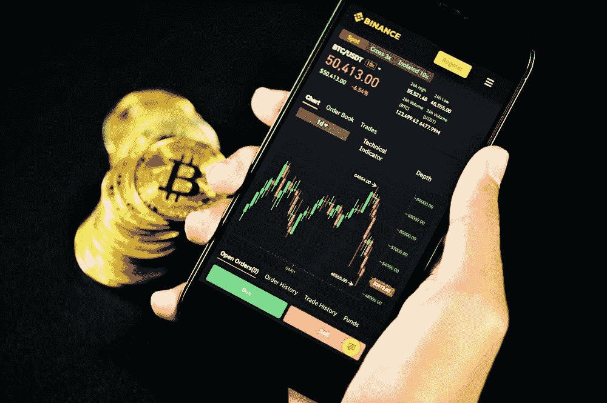

# 如何从币安提取菲亚特到银行账户

> 原文：<https://medium.com/coinmonks/how-to-withdraw-fiat-from-binance-to-bank-account-9d2483aaa44?source=collection_archive---------46----------------------->

由于币安交易所的众多服务和选项，人们发现使用交易所非常复杂。在这篇文章中，我们将考虑如何从你的币安钱包中直接提款到你的银行账户。首先让我们谈谈币安。币安是世界上最受欢迎的加密货币交易所之一。它提供广泛的服务，包括数字资产交易、保证金交易和点对点交易。它提供了相对较低的交易费用和强大的加密资产选择。这个交易所配备了令人印象深刻的图表选择，以清晰详细的视角研究市场。用户还可以访问各种交易选项，包括期货以及其他类型的交易。

**如何从币安**撤回菲亚特
有了正确的知识，从你的币安撤回资金相对于没有事先了解的情况下尝试这个过程要容易得多。要从你的币安钱包里取出菲亚特，你必须经历取款过程。首先，你需要在交易所有一个账户。这个过程取决于你想撤回的法令。此外，你应该小心，以确保你不犯错误退出，所以你不会失去你的资金。总的来说，这个过程相对简单，但是如果你不熟悉交易所的工作方式，可能会有点混乱。
让我们带你走一遍这个过程；
1。[登录您的币安账户](https://accounts.binance.com/en/register?ref=37685987)。点击钱包，然后点击现货。
2。选择撤销选项。
3。选择您想要提取的法定货币和付款方式。
4。填写所需的详细信息，并按照显示的说明进行操作。
5。输入您的验证码以确认取款。

> 交易新手？尝试[加密交易机器人](/coinmonks/crypto-trading-bot-c2ffce8acb2a)或[复制交易](/coinmonks/top-10-crypto-copy-trading-platforms-for-beginners-d0c37c7d698c)

网络交易费是一个重要的因素考虑时，撤回您的资金，你的一部分撤回将用于支付交易费。每个区块链都有自己的手续费，所以你的取款费会根据你兑换现金的硬币而不同。换句话说，费用取决于你想用来交易法定货币的加密货币。访问取款页面本身进行确认是确定您的交易费用的最佳方式。

由于像币安这样的交易所需要交易费，用户更喜欢像 Dart Africa 这样的平台来将他们的加密资产兑换成现金；尤其是奈拉和加纳塞迪斯。这个平台相对简单明了。您可以直接在 Dart Africa 上以零交易费的方式将您的加密资产兑换成现金。Dart Africa 目前支持七种加密货币；比特币、、、戴、以太坊、和莱特币。

想开始吗？以下是方法:
1。[在 Play store](https://play.google.com/store/apps/details?id=com.dartafrica&gl=US) /App Store 获取应用或访问[dart Africa . io](http://dartafrica.io)2。创建一个帐户，并填写您的银行信息。
3。创建一个交易 pin，该 pin 将用于您随后的所有取款。
4。选择您要出售的加密货币。输入您希望出售的数量，然后单击“立即出售硬币”继续。
5。向系统生成的钱包地址付款。
6。确认后，您的现金将被支付到您的钱包，然后您可以提取到您的银行账户。

> 加入 Coinmonks [电报频道](https://t.me/coincodecap)和 [Youtube 频道](https://www.youtube.com/c/coinmonks/videos)了解加密交易和投资

# 另外，阅读

*   [十大最佳加密货币博客](https://coincodecap.com/best-cryptocurrency-blogs) | [YouHodler 评论](https://coincodecap.com/youhodler-review)
*   [my constant Review](https://coincodecap.com/myconstant-review)|[8 款最佳摇摆交易机器人](https://coincodecap.com/best-swing-trading-bots)
*   [MXC 交易所评论](/coinmonks/mxc-exchange-review-3af0ec1cba8c) | [Pionex vs 币安](https://coincodecap.com/pionex-vs-binance) | [Pionex 套利机器人](https://coincodecap.com/pionex-arbitrage-bot)
*   [我的密码交易经验](/coinmonks/my-experience-with-crypto-copy-trading-d6feb2ce3ac5) | [《比特币基地评论》](/coinmonks/coinbase-review-6ef4e0f56064)
*   [CoinFLEX 评论](https://coincodecap.com/coinflex-review) | [AEX 交易所评论](https://coincodecap.com/aex-exchange-review) | [UPbit 评论](https://coincodecap.com/upbit-review)