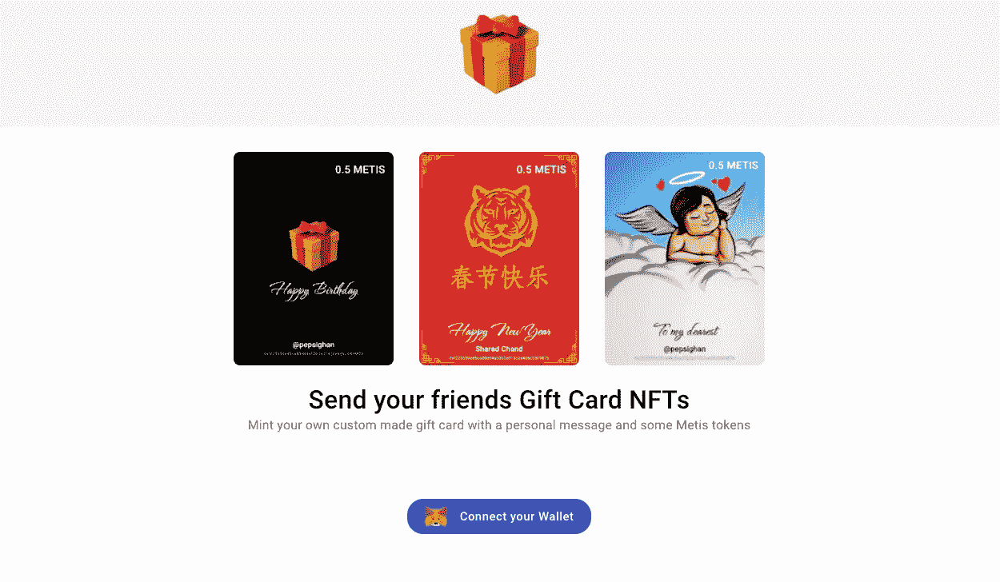

# 如何使用 Solidity 将可替换的代币包装成 NFT(又名铸造礼品卡)？

> 原文：<https://medium.com/coinmonks/how-to-wrap-fungible-tokens-into-nft-aka-minting-gift-cards-using-solidity-8c9b48b91769?source=collection_archive---------10----------------------->

*这是一个简单的指南，帮助你了解如何制作包裹有可替换代币的 NFT(也称为 NFT 礼品卡)。这也让您对创建包装令牌有了基本的了解。*

Mint Gift Cards as NFTs on giftnft.cards

目前非功能性测试非常流行。人们从他们的艺术作品、迷因以及诸如此类的东西中赚取了数百万美元。我想跳上这辆炒作列车，看看它到底是什么，以及它拥有什么样的可能性。

作为一名程序员，我一直在寻找简单的教程来从头构建一个 NFT 项目，并试图理解它是如何工作的。我发现了这篇很棒的教程，归功于 [mbvissers.eth](https://medium.com/u/d1acc8dc981d?source=post_page-----8c9b48b91769--------------------------------) 👏。

 [## 如何在多边形区块链上以编程方式部署和创建一个简单的 NFT

### 在没有 NFT 市场的情况下部署您的第一个 NFT，同时仍然能够在 OpenSea 上交易它的快速指南。

medium.com](/geekculture/how-to-programmatically-deploy-and-mint-a-simple-nft-on-the-polygon-blockchain-88e1beede15d) 

在阅读本教程之前，我想让你浏览一下上面的文章来设置工具链、项目并构建一个简单的 NFT 项目，因为这篇文章是它的精神续篇。

# 那么我们在建造什么？

我们正试图将连锁礼品卡打造为 NFT。这些类似于我们在亚马逊上得到的，但不受任何中央权力机构控制。它们也类似于通常的 NFT，但它有一个固有的价值，这是通过在 NFT 中包装可替换的令牌而实现的。

在我们开始构建之前，我想澄清一下为什么礼品卡容易被铸造成 NFT。

1.  礼品卡在送礼者和接受者之间具有情感价值&这样的东西接受者会永远保留。
2.  礼品卡是送礼者在特定场合通过艺术和愿望表达给接受者的个人信息。
3.  礼品卡具有货币价值，接收者可以兑换。

因此，在本教程中，我们希望构建一个 NFT，它有一个相关的插图，其中还嵌入了一些令牌(如果部署在以太坊上，则为 ETH 如果部署在 METIS 上，则为 METIS；如果部署在多边形上，则为 MATIC)。

通过上面的链接教程，你可能已经知道了一件事，那就是**简单 NFT** 是区块链上一个简单明了的散列。它没有附加任何元数据(如照片/艺术品/GIF/等)。为了创建 NFT 礼品卡，我们将向它添加两种元数据:艺术品&货币价值。

## 如何将艺术品添加到 NFT？

要将艺术品添加到 NFT，我们需要添加一个将令牌映射到艺术品的数据结构。为此，将下面的代码粘贴到`contract`主体中。

该结构将 NFT 的`imageUrl`存储到其各自的`tokenId`中。为什么我们创建了一个`struct`，而不是使用一个从`uint256`到`string`的简单映射？因为我们稍后将在该结构中添加其他元数据。

现在已经完成了，我们需要更新`safeMint`方法来接受图像 URL 以铸造 NFT。

Tada，NFT 礼品卡现在有了一个图像，让用户可以看到并珍惜。该合同的前端可以发送任何类型的图像 URL，以便永久存储。它可以是一个普通的老 S3 网址或 IPFS 网址。如何上传任一选项由您决定。

接下来，我们需要在礼品卡中添加和包装一些代币。

## 如何在礼品卡中添加代币？

在向礼品卡添加代币之前，我们需要了解 NFT 本身不能包含可替换代币。我们可以做的是将所有可替换的令牌存储在智能合约本身中，因为它是一种钱包，并存储根据 NFT 存储的令牌数量的记录。这类似于如何创建包装令牌(WBTC/ WETH/etc)。

我们可以通过将函数标记为 payable 来实现向智能合约发送令牌。智能合约现在拥有令牌，只要它没有被撤销。这可以通过以下方式实现:

既然智能合约收到了令牌，我们需要一种方法来记住 NFT 包含的令牌数量。以便可以兑现，否则发送的金额可能会丢失。

为了记住金额，我们在 GiftCard 结构中添加了一个字段 amount，并在创建 NFT 时添加了礼品值。

现在，NFT 购物卡已经成型，还有最后一件事要做。

## 如何从礼品卡中取出代币？

当礼品卡被打开时，该礼品卡的所有存储的代币需要被发送给 NFT 的所有者。这可以通过以下方式实现:

让我们解开密码。我们首先检查令牌的所有者是否与函数的调用者/发送者相同。只有所有者可以从他们的钱包中提取代币金额。我们不希望人们窃取他人的礼品卡金额。

然后，我们获得相关 NFT 的礼品卡，并将礼品卡中包装的等量代币发送给所有者。

代码还有一个问题。同一张礼品卡可以反复多次提取金额，直到智能合约余额耗尽。我们也不希望这样。为了防止这种情况发生，我们可以做一个检查:

礼品卡 NFT 智能合同现已完成。它有一个礼品卡图像以及一些代币嵌入其中。我们现在需要的是部署智能合约(参考上面的链接文章[)并为它构建一个好的前端，我认为你完全有能力自己构建它😉。](/geekculture/how-to-programmatically-deploy-and-mint-a-simple-nft-on-the-polygon-blockchain-88e1beede15d)

如果你想看完整的项目，加上额外的功能和工作界面，请访问 [GitHub](https://github.com/pepsighan/giftnft.cards) 。

此外，如果你想看它的实际应用，一个名为**礼品卡 NFT** 的 dapp 可以在[Gift . cards](https://giftnft.cards)买到。

感谢您的阅读，并希望这篇文章是有用的🎁敬你。

> 加入 Coinmonks [电报频道](https://t.me/coincodecap)和 [Youtube 频道](https://www.youtube.com/c/coinmonks/videos)了解加密交易和投资

# 另外，阅读

*   [加密货币储蓄账户](/coinmonks/cryptocurrency-savings-accounts-be3bc0feffbf) | [YoBit 审核](/coinmonks/yobit-review-175464162c62)
*   [Botsfolio vs nap bots vs Mudrex](/coinmonks/botsfolio-vs-napbots-vs-mudrex-c81344970c02)|[gate . io 交流回顾](/coinmonks/gate-io-exchange-review-61bf87b7078f)
*   [CoinFLEX 评论](https://coincodecap.com/coinflex-review) | [AEX 交易所评论](https://coincodecap.com/aex-exchange-review) | [UPbit 评论](https://coincodecap.com/upbit-review)
*   [AscendEx 保证金交易](https://coincodecap.com/ascendex-margin-trading) | [Bitfinex 赌注](https://coincodecap.com/bitfinex-staking) | [bitFlyer 审核](https://coincodecap.com/bitflyer-review)
*   [Bitget 回顾](https://coincodecap.com/bitget-review)|[Gemini vs block fi](https://coincodecap.com/gemini-vs-blockfi)cmd |[OKEx 期货交易](https://coincodecap.com/okex-futures-trading)