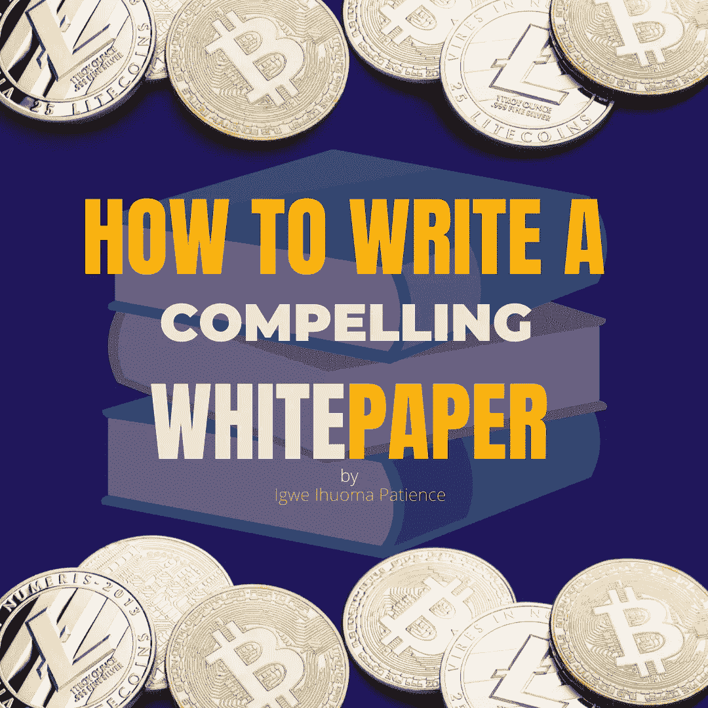

# 如何撰写引人注目的加密白皮书

> 原文：<https://medium.com/coinmonks/how-to-write-a-compelling-crypto-whitepaper-2c9d1c4cbe5d?source=collection_archive---------28----------------------->

# 介绍

成为一名技术型或创意型作家是一回事，而成为一名精通白皮书的作家则是另一回事。这是因为，并不是所有的作者都有能力写出令人信服的白皮书，因此，这些类别的作者存在缺陷。因此，我将指导你如何写一个坚实的和令人信服的白皮书。但在此之前，让我们考虑一下制作一份好白皮书的因素

## 构成优秀白皮书的因素

正如我在上一篇文章中解释白皮书的必要性一样，白皮书是一种营销工具，可以向目标受众推广和定位您的项目。点击[此处](https://www.linkedin.com/in/patienceigwe-/recent-activity/)了解更多。

因此，这里有几个因素可以构成一份好的白皮书:

*   一份好的白皮书必须有目录
*   一份好的白皮书必须非常详细:不一定含糊不清
*   白皮书不能太激动人心，但是，它应该能够抓住你的潜在客户的注意力，这就是为什么作家必须有文案技巧。
*   它必须足够专业和令人信服，以表明你知道你在说什么。

现在让我们考虑一下白皮书的结构

## 白皮书的结构

这里的结构是指呈现的模式。白皮书可以有不同的格式，这取决于你想先看哪一种。白皮书有许多不同的结构，包括:

*   首先展示解决方案
*   首先提出问题，或者
*   首先展示策略

无论你在撰写白皮书的过程中采用什么样的结构，都要确保在你介绍的前三行就能引起读者的注意。

## 白皮书的组成部分

就像推介提案一样，白皮书有 5 个主要组成部分，它们包括:

*   介绍
*   摘要
*   问题
*   解决办法
*   结论

1.**简介**

这是白皮书最重要的一个方面，因为它让你有机会在几秒钟内说服你的潜在投资者。在这一段，你要介绍这个项目，强调你要谈论的一些事情，以及为什么读者会对这个项目感兴趣。

**2。摘要**

摘要是对项目所能提供的一切的简要总结。有些人发现很难通读白皮书的每一章，因此，阅读摘要可以让他们大致了解项目的内容，甚至可以让他们浏览白皮书的其余部分，而不必逐字阅读。

同样值得注意的是，并不是所有的白皮书都使用摘要，因为其中一些确实希望读者浏览所有内容，但是你需要一个非常吸引人的介绍

**3。问题**

有时候，一个问题可能看起来并不像一个真正的问题，尤其是当人们已经习惯了它。这是你向读者提出问题的地方，明确而详细地陈述这是一个怎样的问题，以及为什么它应该被认为是一个问题。

**4。解决方案**

已经向读者提出了问题以及为什么需要研究它，现在是提供解决方案的时候了，明确地描述解决方案，项目将如何实现它，需要多长时间，以及实现它所涉及的策略。这是你详细解释你的项目的全部内容的地方，包括如何做、何时做、机制等等。

**5。结论**

不管一个项目是否能提供解决方案，每个投资者都会考虑自己资产的安全性以及在全球市场上竞争和发展的能力..在这里，你要向投资者保证你的交付能力、所涉及的团队以及为什么这个解决方案是必要的。

# 如何撰写白皮书

根据上面概述的不同结构模板，有很多方法可以编写白皮书。但是，这里有一些指南可以帮助你开始编写白皮书。

*   理解项目:首先要做的是理解项目。为了做到这一点，你需要让项目的所有者和开发者给你一个详细的项目简介。这将有助于你了解你的目标受众
*   确定目标受众并为项目创建角色:几乎每个加密项目都以全球市场为目标，这些市场由可能想要购买或投资该技术的加密投资者、开发人员或业务影响者等组成。确定项目的目标人群有助于定义品牌基调，建立他们的角色使白皮书的撰写更加具体和直接。例如，为开发者使用技术术语，为企业实施良好的营销策略，为普通投资者或外行简化技术术语。
*   理解解决方案:这将使你的写作令人信服，你知道你在说什么
*   去做市场调查:你的项目需要获得大量的信息、图表和证据。因此，寻找提供类似解决方案的其他项目，并确定是什么让你的项目与众不同。例如，为什么你选择在区块链以太坊而不是币安智能链上启动你的项目。
*   开始写作:从你的摘要开始，然后是引言。这将使你清楚地了解你想要使用的结构。

以下是如何轻松撰写引人注目的白皮书的几个步骤。

## 结论

他们说，不断的练习可以使事情变得完美，为了掌握写一份加密白皮书的技巧，经常查阅不同项目的白皮书，理解他们的写作模式，模板，内容计划等等。只有这样，你才能掌握撰写引人注目的白皮书的艺术。

# 关于作者

Igwe Ihuoma Patience 是一名自学成才的创意和特定行业内容作家，也是一名加密货币爱好者，拥有 2 年多的经验和不断发展的区块链空间的知识。

我擅长内容创作、文案撰写、字幕管理、视频编辑和手机图形设计，我教其他人如何在加密货币和区块链领域起步，我的目标是让区块链的学习和更新易于任何人理解。

> 加入 Coinmonks [电报频道](https://t.me/coincodecap)和 [Youtube 频道](https://www.youtube.com/c/coinmonks/videos)了解加密交易和投资

# 另外，阅读

*   [分散交易所](https://coincodecap.com/what-are-decentralized-exchanges) | [比特恩斯 FIP](https://coincodecap.com/bitbns-fip) | [宾邦评论](https://coincodecap.com/bingbon-review)
*   [用信用卡购买密码的 10 个最佳地点](https://coincodecap.com/buy-crypto-with-credit-card)
*   [加拿大最佳加密交易机器人](https://coincodecap.com/5-best-crypto-trading-bots-in-canada) | [Bybit vs 币安](https://coincodecap.com/bybit-binance-moonxbt)
*   [阿联酋 5 大最佳加密交易所](https://coincodecap.com/best-crypto-exchanges-in-uae) | [SimpleSwap 评论](https://coincodecap.com/simpleswap-review)
*   购买 Dogecoin 的 7 种最佳方式 | [ZebPay 评论](https://coincodecap.com/zebpay-review)
*   [最佳期货交易信号](https://coincodecap.com/futures-trading-signals) | [流动性交易所评论](https://coincodecap.com/liquid-exchange-review)
*   [火币的加密交易信号](https://coincodecap.com/huobi-crypto-trading-signals) | [Swapzone 审查](/coinmonks/swapzone-review-crypto-exchange-data-aggregator-e0ad78e55ed7)