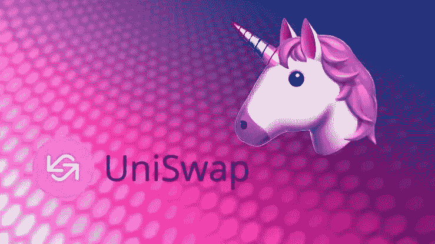
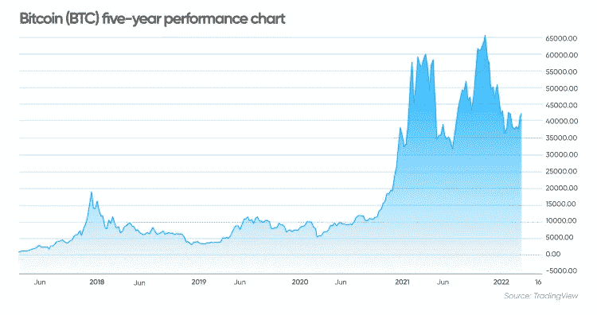
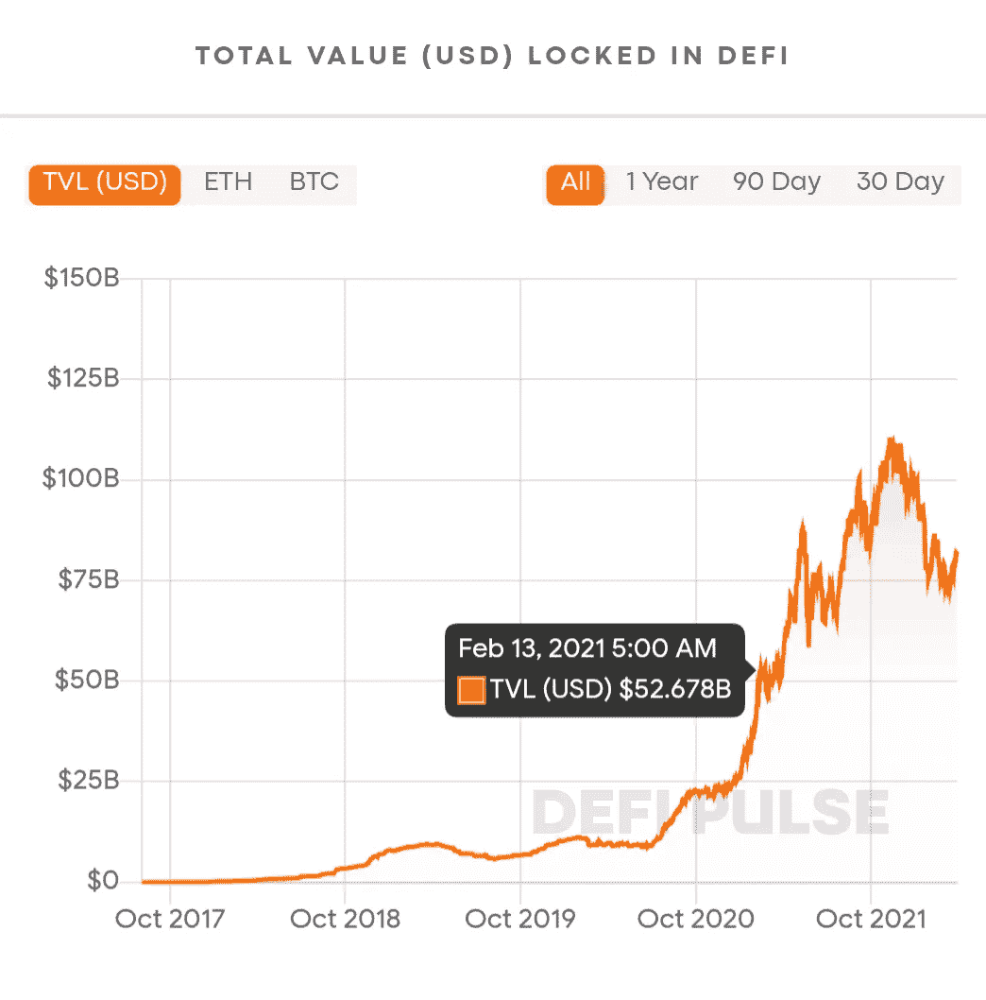
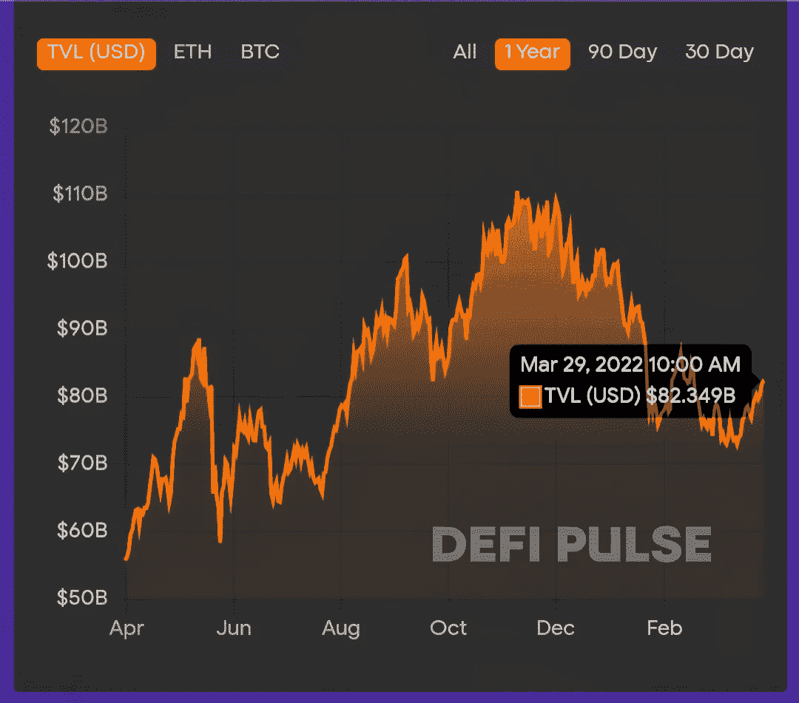
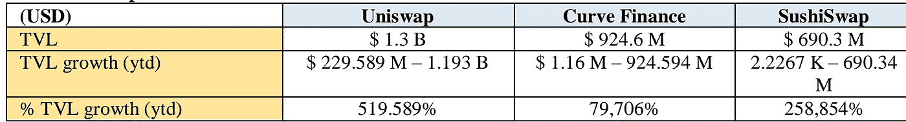
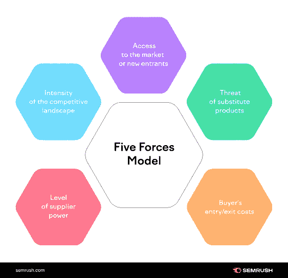
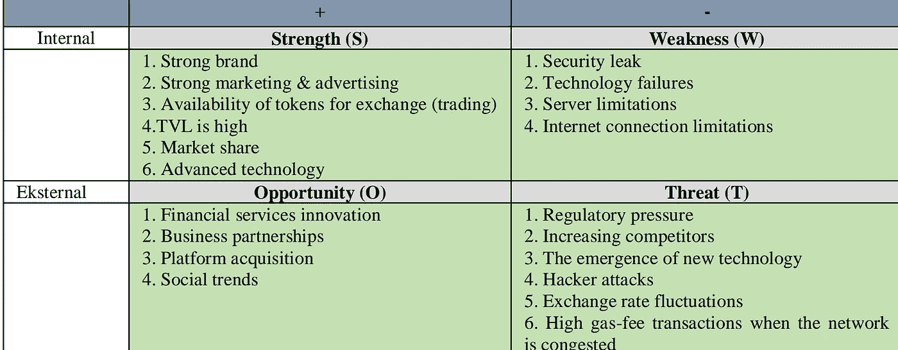
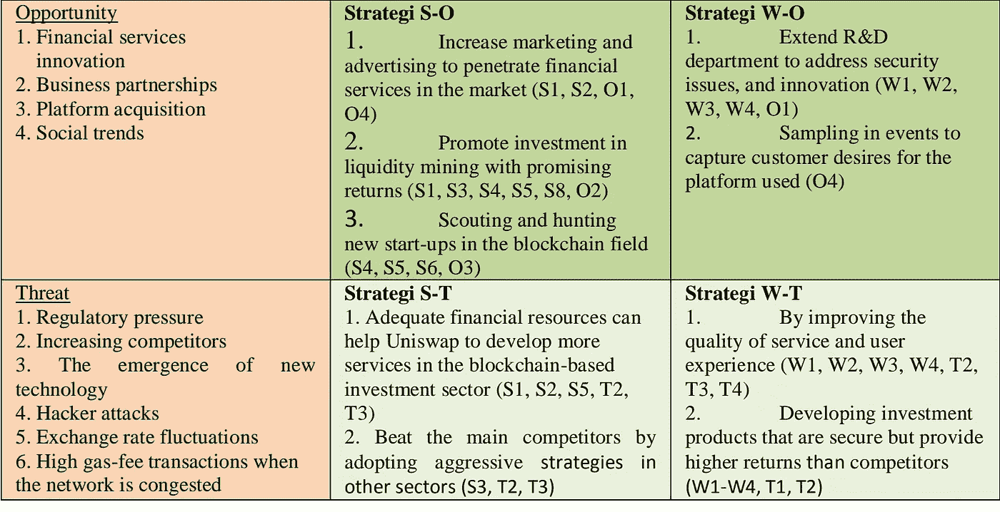
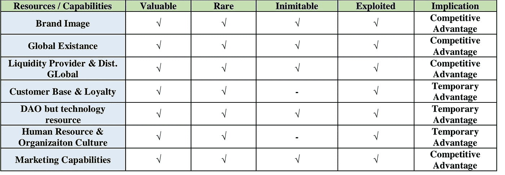

# Uniswap 如何成为世界第一指数——战略管理分析

> 原文：<https://medium.com/coinmonks/how-uniswap-become-no-1-dex-in-the-world-a-strategic-management-analysis-61e598792f62?source=collection_archive---------37----------------------->

# 背景

原来是比特币。比特币是世界上第一种加密货币，创建于 2008 年，于 2009 年 1 月 9 日由一个自称中本聪的人或一群人推出。

比特币是由美国次贷危机引发的正在全球蔓延的全球金融危机的答案。中本聪认为，公众已经对中央金融机构以及被认为对投资风险和所采取的金融政策漠不关心和不透明的银行业失去了信心。

比特币被认为是一种解决方案，因为它在缺乏集中的

监管机构的情况下提供了更好的透明度，这种监管机构经常被滥用于某些目的，导致公众遭受金融损失，并导致全球经济危机。

这是因为比特币是一种利用人们的计算资源来管理分配机制和金融交易的去中心化货币。这种机制被置于区块链技术和 cartogrfi 技术之上，因此比特币与操纵金融数据的行为相去甚远。

随着时间的推移，比特币作为世界头号加密货币的统治地位变得越来越无可争议，其估值每年都在增加。这导致了各种具有各种独特性和名称的加密货币项目的激增。

比特币激发了许多信息技术积极分子的灵感，以区块链为基础创造了新的 cyrptocurrency 技术

，以太坊就是这样一种技术。

以太坊是区块链的一种分散形式，但也支持智能合约，以太

(ETH)作为主要令牌，在区块链的各种活动中用作货币。以太坊是由一位名为 Vitalik Buterin 的加密货币活动家和研究人员在 2013 年提出的。然后以太坊的开发在 2014 年由社区通过众筹机制融资，于 2015 年 7 月 30 日
上线。

正如 Vitalik Buterin 在他的以太坊白皮书中所说，以太坊的主要目标是构建

去中心化的应用程序，作为区块链去中心化金融的开端。

像传统的金融系统，需要一个交易所作为货币兑换的场所。所以在加密货币中也需要一个交易所，市场参与者可以在每种加密货币之间以加密货币的形式进行交换。

借助以太坊和智能合约功能以及分散化机制，现在非常有可能进行分散化的加密货币交易，其中没有单个管理实体可以控制交易。

在一个分散的

加密交易所(DEX)中，人们现在可以同时扮演交易者和流动性提供者的多重角色。当今领先的分散式交易所之一，被

加密货币爱好者广泛使用的是名为 Uniswap 的 DEX。Uniswap 可通过 http://uniswap.org

访问 Uniswap 由 Hayden Adams 于 2018 年 11 月根据以太坊创作者 Vitalik Buterin 的灵感创建。Uniswap 是一个基于以太坊的协议，用于交换 ERC20 令牌，无需买方和卖方创建需求。这是通过一种计算来实现的，这种计算会根据需求量自动设定和平衡价格。没有使用 Uniswap 进行交易的订单簿或集中实体。

现在到 2020 年 Uniswap 是全球最大的分散式交易所(排名第一)，锁定的

基金总额(TVL)为 13 亿美元，相当于 18.2 万亿印尼盾。市场份额为 34.82%。Uniswap 因参与社会而成为加密货币界的巨头也不过两年时间。

# TVL 在 DeFi

# 外部分析

外部分析(环境分析)是针对公司(组织)所处世界的变化对公司(组织)进行的客观评估，因此公司(组织)有一个“早期预警系统”来识别潜在的威胁和机会。

本分析将涉及其他几种分析方法，以便您清楚地了解在加密货币世界中影响 Uniswap 作为分散交易所的外部环境。

执行外部分析涉及的工具如下:

1.  PESTEL 分析:这是一个使用四个标题列出所有相关外部力量的工具:政治、经济、社会和
    技术。
2.  波特五力模型(Five Force Model):该工具由哈佛商学院教授迈克尔·波特(Michael Porter)创建，用于分析行业吸引力

    和可能的盈利能力。五力模型包括竞争对手、供应商

    力量、买方力量、替代威胁和新进入者的威胁。
3.  SWOT 分析:SWOT 分析(优势、劣势、机会和威胁)是一个用于评估公司竞争地位和制定战略规划的框架。

# 内部分析

内部分析是对公司内部环境(组织)的客观评估，以评估其资源、能力和竞争优势。进行内部分析可以识别公司(组织)在内部优势、竞争优势和内部劣势方面的优势和劣势。

1.  VRIO 分析:VRIO 分析是一种用于评估公司资源的分析技术，这些资源可以

    促成竞争优势。VRIO 是评估维度的初始名称:值、唯一性、
    模拟性和组织。VRIO 分析是一种分析技术，用于评估公司有助于竞争优势的资源。VRIO 是评估维度的初始名称:

    值、唯一性、可模仿性、组织。
2.  价值链分析:价值链分析是用来分析一个公司

    (组织)内部活动的战略工具。目标是识别哪些活动对公司最有价值，哪些活动可以

    改进以提供竞争优势。分析揭示了公司(组织)的竞争优势或劣势所在。通过差异化优势竞争的公司会努力比竞争对手做得更好。如果通过成本优势进行竞争，那么公司(组织)试图以比竞争对手更低的成本进行内部活动。当一家公司能够以低于市场价的成本生产商品或提供优质产品时，那么这家公司就会受益。

# 分析

*   外部分析
*   PESTEL 分析

Uniswap 是一个全球性品牌，在极具挑战性的全球环境中运营。有几个因素会阻碍增长，它们的性质会因市场而异。PESTEL 的分析有助于理解这些因素如何影响 Uniswap 等全球品牌的增长。PESTEL 是政治、经济、社会、技术、环境和法律的缩写。所有这些因素在 21 世纪都非常重要，并以多种方式影响企业及其增长和盈利能力，例如:

1.  政治和法律因素:Uniswap 在美国、欧洲、非洲和亚洲等多个国家开展业务。因此，公司还必须考虑他们经营所在国家的法律问题。许多国家还没有管理加密货币交易的法规，尤其是基于以太坊 ERC20 的加密货币。目前 Uniswap 几乎可以自由运营，没有监管机构的任何障碍，但将来该公司可能必须根据每个国家就

    公司运营制定的法规和条例进行调整。虽然 Uniswap 是一个分散的平台，优先考虑透明度和隐私方面，但应努力适应法规的发展，以便不牺牲这两个方面。Uniswap 在美国、欧洲、非洲和亚洲等多个国家开展业务。因此，公司还必须考虑他们经营所在国家的法律问题。许多国家还没有监管加密货币交易的法规，尤其是那些基于以太坊 ERC20 的加密货币。目前 Uniswap 几乎可以不受监管机构的任何阻碍自由运营，但将来该公司可能不得不根据每个国家对该公司

    运营的规定进行调整。虽然 Uniswap 是一个分散的平台，优先考虑透明度和隐私方面，但应努力适应法规的发展，以便不牺牲这两个方面。
2.  经济:经济因素在 21 世纪也越来越重要。世界已经经历了各种各样的

    衰退，新冠肺炎疫情，导致全球经济危机，在这样的困难时期，企业可能会面临销售额和利润的大幅下降。尽管从 2020 年锁定的总价值(TVL)的增加来看，Uniswap 经历了贸易交易和流动性供应的增加。但这并不意味着在未来，尤其是经济危机再次发生的地方，Uniswap 将再次经历 2020 年发生的业绩改善。
3.  社会、人口、技术、文化和环境优势:过去 5 年的加密货币繁荣，以比特币价格达到 19，000 美元为标志，以及其预计在 2021-2025 年期间达到 100，000 美元的目标价格，让国际社会看到了加密货币作为一种有前途的新投资手段的潜力。于是

    机构投资者和散户都蜂拥而至，参与投资加密货币。这对 Uniswap 来说可能是一个新的威胁，也是一个机遇。uni WAP 可以支持加密货币相关事件，向公众发送一条

    消息，表明 uni WAP 是一个可信、安全、先进的技术支持以及负责任的分散组织。

    Uniswap 的目标用户是对加密货币领域已经有了解和经验的用户。

    由于加密货币迭代在全球的高普及率，这些用户不受年龄限制。Uniswap 仍应考虑其用户的教育水平来制定其战略，因为教育对促销和营销有直接影响。所以你必须根据每个国家的教育水平，创造一个能够让人们意识到他们的品牌和产品的营销/推广活动。社会文化因素在 21 世纪也继续经历重要的增长。对一个企业来说，采用新的营销方法是非常重要的。全球人口状况的变化改变了 DEX 市场和用户从新的角度看待它的方式。千禧一代是理解并渴望得到不同服务的一代。他们正在寻求更个性化的体验、易于使用的加密货币兑换、低交易费用以及与真实世界支付系统的集成

    以购买商品和服务，并通过 ATM 使用法定货币取款。品牌也需要改变策略和营销方法。由此，社会文化因素在 21 世纪的国际商务中变得非常重要。在 21 世纪，技术因素已经成为竞争优势的来源和成功的驱动力。技术被证明是一个关键的加速器，可以帮助企业填补巨大的空白，并以新的方式获得非凡的价值。Unisap 的运营和营销完全依赖于 ICT 技术以及互联网加密货币社区在开展贸易和通信

    活动中的作用。Uniswap 版本从 1.0 升级到 2.0 是技术改进的一种形式，目的是提供更好的服务，满足用户的需求。uni WAP 的可扩展性可以得到改善，并且增加了新功能，如分析功能，用户可以看到在 uni WAP 平台内交易的各种令牌的性能。
4.  竞争的力量:在分散交易行业，Uniswap 拥有世界上最大的市场份额。下表总结了 Uniswap 相对于其在分散式交易所行业的竞争对手(即 Curve Finance 和 SushiSwap)的表现:

从上面的分析中，我们可以得出结论，Uniswap 在 TVL 方面领先 13 亿美元，控制了 DEX 37%的市场份额。这意味着 Uniswap 是最受基于 ETH ERC20 的加密货币用户信任的 DEX 平台。Uniswap 经营于快速增长的行业，不断变化的社会趋势，

和社交媒体推广机会。此外，Uniswap 还有机会与基于以太坊的领先 DeFi 项目合作，如 Compound、Synthetix 和 Balancer。Uniswap 的威胁是来自以太坊区块链内运营的类似分散交易所的竞争。还有智能合同中的

潜在缺口，黑客可以利用它来耗尽用户的加密资金。

# 波特的五力模型

1.  现有竞争者之间的竞争:低水平
    该行业的竞争水平相对较低。尽管总部位于区块链的以太坊 DEX 行业有三个重要的关键参与者，包括 Uniswap、Curve Finance 和 SushiSwap。

    三家之间对市场份额的竞争并不激烈。由于加密货币的快速发展，在全球范围内开发新用户的潜力仍然具有很高的机会，并被归类为非常年轻或仍处于早期阶段。这三个品牌都在 ICT 技术、营销和研发方面投入巨资。这三家公司都有出色的营销策略，并使用各种其他方法来吸引新用户。
2.  买家的议价能力:中等
    由于 DEX 提供的流动性开采活动，作为对流动性供应商非永久性损失的补偿，用户的议价能力提高了。当然，能够从高流动性开采活动中提供回报的 DEX 将对用户更具吸引力。此外，提供用于交换/交易的令牌对(对)的数量也影响用户数量，尤其是受欢迎的令牌对。
3.  替代品的威胁:低
    替代品对 Uniswap 的威胁仍然较低。Uniswap 和类似的 DEX 是集中交换(CEX)的替代产品。其中 DEX 在提供日常交易活动方面，尤其是在提供交易流动性方面，提供了更多社区(community)的参与。uni WAP 提供的安全、隐私(匿名)和透明度促使 CEX 用户转向 uni WAP 平台。同时，该交换机的

    替代服务目前总体上对 Uniswap 没有影响。
4.  新进入者的威胁:高
    开放(开源)的去中心化金融系统(DeFi)允许每个人参与提供类似的服务。这导致 DEX 行业新进入者的威胁很大。各种新的创新

    的到来，并非不可能导致 Uniswap 推广的技术和概念过时。在技术创新和巨额资本的支持下，新玩家可以从加密货币兑换行业的

    游戏地图中转移 Uniswap。这将新品牌进入市场的威胁
    提高到一个很高的水平。
5.  供应商的议价能力:高
    uni swap 上下文中提到的供应商是流动性提供者。流动性提供者在 Uniswap 中的议价能力很高，因为没有他们 Uniswap 就无法向

    用户提供最优的交易所服务。流动性提供商总是关注他们存入 Uniswap 的投资回报率，并将这一回报率与其他平台进行比较，如果他们提供更高的回报，他们不会不愿意迁移。

    因此 Uniswap 一直在提高其影响服务质量和保持有竞争力回报的技术能力，同时加强与各种加密货币项目的合作，以欢迎新的
    流动性进入 Uniswap 平台。

优势、劣势、机会和威胁分析突出了联合国系统和平研究所面临的优势、劣势、机会和威胁。

# 强项

*   强大的品牌形象:虽然仍然非常年轻，但 Uniswap 是分散式交易所(DEX)行业中的一个全球品牌，具有强大的品牌形象，这也是它成为分散式交易所(DEX)行业领导者的原因。Uniswap 是众所周知的，为 200 多个国家的投资者和交易者服务。这是由于对平台的信任和 Uniswap 的

    治理，Uniswap 使用了分散组织(DAO)的概念，即机构群体是 uni swap 内的最高决策者。联合国大学信息系统应用方案管理的透明度和先进信息技术的支持，使大学信息系统应用方案成为世界上第一大分散交流平台。Uniswap 有两个主要竞争对手，Curve Finance 和 SushiSwap。但不幸的是，曲线金融更关注稳定的硬币(一种稳定的加密货币，参考法定货币的价值)。与此同时，SushiSwap

    最近由于创始人通过支付所拥有的大量加密令牌而离职，出现了信任问题。当然，这两个竞争对手在市场细分和信心方面都有一定的障碍，可以承受他们的增长速度。
*   强势总价值锁定(TVL)表现:TVL 的强势表现是 Uniswap 的主要实力。2020 年，TVL Uniswap 增长如此之高，超过 500%。这一业绩得益于过去两年中开展的品牌化、社会化和市场教育工作。2020 年，TVL 增加到 12 亿美元，比 2019 年增加约 10 亿美元。发生此
    是因为:

    ✴️全球运营覆盖伴随着平台内交易的高流动性以及
    用户的增加。

    ✴️营销能力能够与 DeFi 平台、daps 和基于以太坊 ERC20 的
    加密货币领域的各种项目合作，参与使 Uniswap 成为主要令牌
    交换平台。✴️在代币兑换方面提供了多样性，并且规模较大，成为用户的主要选择。

# 机会

*   金融服务创新:Uniswap 有几个机会可以帮助它发展品牌和业务。基于数字的金融服务创新，尤其是加密货币，可以从单纯的交易所扩展为分散的加密银行和支付中介。

    由于 Uniswap 是一个 ICT 密集型组织，它当然会投资于研发和产品创新，而
    支付技术为更广泛的市场扩张提供了更快的增长机会和选择。
*   与相关业务的合作:与相关业务的合作(伙伴关系)也可以帮助品牌更快地增加增长。Uniswap 与各种基于 RealT 的创业项目建立了合作伙伴关系，这些项目
    提供了一个基于区块链的房地产投资平台，以增加用户获取和流动性提供商。
*   通过收购实现增长:Uniswap 还可以通过大量的相关品牌

    (平台)测验来帮助它进入新的领域，从而更快地实现增长。
*   不断变化的社会趋势:Uniswap 目前是加密货币交易行业的潮流引领者。

    越来越多的人从集中式 exchange (CEX)迁移到 Uniswap 等分散式 exchange (DEX)。易用性和高度隐私性使得 Uniswap 越来越受到许多加密货币用户的青睐。

# 威胁

*   法律和监管方面的威胁:政府颁布的法规可能会威胁或至少限制 Uniswap 的发展空间。一些法律专家说，这种服务有可能在该国的一些地区违反了规则。他们建议，该平台需要根据他们所提供的服务，立即寻找相关的许可证

    ，因为监管机构很可能将他们作为目标。此外，监管机构可以强制 Uniswap 为其用户运行 KYC，这当然会威胁到用户隐私。对 KYC 实施感到不舒服的用户可以从 Uniswap 迁移并选择另一个平台。
*   竞争压力:竞争压力也会导致 Uniswap 风险。虽然市场

    的机会仍然很大，但是高水平的开放导致更多的新玩家进入市场
    在这个行业试试运气。
*   技术发展:技术的快速发展，尤其是加密货币中使用的区块链
    技术，导致应用平台变得过时，并被一个新的
    更复杂的平台所取代。因此，需要新的创新，如版本更新和添加各种新功能，以便 Uniswap 能够始终处于技术实施的最前沿。
*   智能合约安全漏洞:加密货币领域的技术发展离不开不负责任的黑客的威胁，特别是那些利用智能合约编码弱点的黑客。因为智能合约是开放的，所以安全漏洞可以马上被所有人读取
    。不负责任的黑客可以利用这一弱点将资金转移到其他地方。因此，Uniswap 必须始终确保他们使用的智能合同的安全性，至少不能给不负责任的一方提供可乘之机。
*   Uniswap 发布了一个名为 UNI 的特殊令牌，这是一个来自平台的政府令牌。UNI 汇率的

    波动可能导致 Uniswap 和用户端的财务损失。如果
    UNI 值下降，可能会导致提供资金以确保 Uniswap 平台上交易流动性
    的流动性提供者减少。
*   以太坊的汽油费变化:为了确保以太坊区块链的平稳运行，需要一笔有用的
    汽油费来激励矿工继续运行他们的采矿机器，以实现以太坊环境中平稳的
    交易流量。油费根据交通密度

    交易水平而浮动。如果以太坊网络出现流量拥堵，造成高额燃气费，导致用户
    不愿意交换 crypto。因为执行 Uniswap 的智能合同需要支付汽油费。用户不愿意进行交换活动会导致交易活动减少。

# 内部分析

*   优势:强大的品牌是 Uniswap 最大的优势之一。是世界人民能够认可的
    去中心化交易所领域最大的品牌之一。世界各地的组织在世界每个国家都使用
    “unis WAP”品牌。如此强大品牌的存在使得 Uniswap
    在世界范围内销售其产品变得容易。Uniswap 品牌的流行也使得向市场推出新的
    服务变得更加容易。

    卓越的技术是 Uniswap 的一个显著优势。目前，Uniswap 是最好的 DEX 技术
    ，它经常被用作已经出现的新 DEX 的参考。Uniswap 平台提供交易和
    投资便利，功能面向全球。由于大型流动性提供商的支持，用户可以顺利交换加密令牌
    。

    Uniswap 是一个分散式交易所，与竞争对手相比，它的 TVL 水平最高，这也是一个重要优势
    。这意味着 Uniswap 可以以有竞争力的价格向交易所提供各种基于以太坊的
    加密令牌，并避免投机者因低水平的流动性而进行价格投机。TVL 的高水平是用户对 Uniswap 高度信任的一种形式。
*   竞争优势:Uniswap 是一种去中心化的加密令牌交换服务，这种服务基于信息和

    通信技术(ICT)。这导致该领域充满了技术。Uniswap 的竞争优势是它提供给用户的技术和服务特性。创新服务是 Uniswap 的标志。小而简洁的组织结构使得 Uniswap 比集中式加密交换具有更高的效率。如果决策是由机构群体
    通过投票做出的，这允许一个简洁的组织结构并且没有一个长的官僚链，但是决策是由机构群体通过用 UNI 令牌交换投票权做出的，在收集到大多数投票后，执行决策的
    任务可以由任务组直接执行。
*   内部弱点:因为 Uniswap 是一个提供基于技术的服务的组织，这使得技术成为主要的

    东西。技术上的失败会给许多人带来灾难。这将影响用户对 Uniswap
    平台的信任，并将用户转移到其他平台。此外，服务器限制(服务中心)会导致服务中断。这种限制可能是由于
    用户对平台的高访问权限导致服务器崩溃，或者全部互联网带宽
    流向服务器，导致服务遇到连接问题。
*   SWOT 矩阵:

# VRIO 分析

*   品牌形象:Uniswap 的主要资源是其品牌形象。该品牌被认为是全球加密货币积极分子

    信赖的品牌。
*   全球存在:可以通过互联网获得 Uniswap 服务，从而可以为世界各国的用户提供服务。只要一个国家有足够的互联网基础设施，就没有一个国家没有得到 Uniswap 的服务。
*   供应链由流动性供应商提供，全球分销范围

    Uniswap 拥有覆盖全球所有国家的广泛的全球供应链，分销范围通过基于互联网的 DEX 平台达到全球。
*   庞大的客户群和高度的客户忠诚度

    尽管 Uniswap 被归类为一个非常年轻的平台，但 Uniswap 拥有庞大而忠诚的客户群
    遍布全球 200 多个国家。
*   DAO dan 技术资源:Uniswap 是一个 DAO(分布式自治组织)，管理和管理 DAI(分布式

    自治机构)。这个系统需要高科技的支持，尤其是互联网和区块链。Uniswap 有非常充足的技术支持。
*   人力资源和组织文化:Uniswap 作为一家以信息和通信技术为基础的公司，无疑拥有技术领域的人力资源，并拥有一种充满活力的非正式企业文化，这种文化在区块链金融行业的快速发展中是灵活的。
*   企业资本:Uniswap 也是一个著名的营销者，他让用户(消费者)参与各种机会，包括社交(营销)和在其平台上开发新功能。

# 价值链分析

有效的价值链分析要求 Uniswap 认识到所有活动或职能不需要
相同级别的监督。因此，调整波特的价值链框架的第一步是根据活动在产品/服务交付过程中的作用来确定活动的
重要性。

*   主要活动:Uniswap 的关键价值链活动直接涉及向加密货币用户兑换以太坊 ERC20 基于区块链的令牌。
*   流动性提供者:重要的是能够根据用户的需求提供 ERC20 令牌的交换。因此，

    防止流动性提供者转移到其他平台以及吸引新的流动性
    提供者以适应不断增长的交易所交易非常重要。因此，Uniswap 必须始终确保

    投资者资金的安全，并提供有竞争力的回报。毫无疑问，所有这些都是利用先进和充分的信息和通信技术完成的。
*   运营:能够分析运营活动非常重要。所有 uniswap 运营活动都是虚拟的，因此不需要物理实体来实现。完全使用 ICT 技术进行操作。这样
    的分析和管理就可以即时完成。
    利用 https://uniswap.org 电脑系统网站开展的流动性提供、ERC20 代币兑换(交易)和流动性挖掘

    等活动，在供求发生变化的情况下能够自动做出一定的调整

    ，使代币兑换(交易)能够顺利进行，确保
    各方得到回报或良好的服务。信息和通信技术是联合国系统应用方案业务的支柱，因此，所有用户都可以从世界各地一致、公平地访问联合国系统应用方案。
*   营销:营销活动通常在各种社交媒体上使用影响者服务进行数字化。这个
    方法在今天被认为是比较合适的。此外，采用
    广告形式的促销也更有效率。此外，还通过与各种其他区块链项目建立合作伙伴关系，开展社区发展，并定期与他们交流，例如开展 AMA 活动(任何问题都可以问我)或使用视频会议平台的数字聚会。
*   支持活动:支持活动在协调和促进主要价值链活动方面发挥着重要作用。Uniswap

    也可以从对其支持活动的分析中受益，如下所述:
*   ✴️组织基础架构

    组织基础架构展示了可以在线完成的各种活动，如质量管理、处理法律问题、
    会计、财务、计划和 DAO。因为 Uniswap 的大部分业务使用
    ICT 技术，如今 ICT 技术不必独立提供，而是可以使用基于云的服务，因此在成本、空间供应和系统维护方面更高效。

    有效的基础设施管理可以使 Uniswap 优化整个价值链的价值。
    Uniswap 可以控制基础设施活动(或通常所说的间接成本),以加强
    在市场中的竞争地位。

    ✴️采购

    尽管 Uniswap 的大部分业务都是基于云的，但 Uniswap 仍然有一个采购团队
    负责软件、硬件和云设备的采购。Uniswap 应仔细
    考虑其采购活动，以优化价值链的进入、运营和退出(服务和用户

    体验)。

    如上所述，波特价值链模型的应用取决于理解所有活动(activities)的
    重要性。在了解了已确定的价值链

    活动的相对重要性后，Uniswap 应强调可增加价值、可实现成本效益、可建立
    差异化基础或可进一步优化流程的领域。

    ✴️Human 资源管理

    Uniswap 可以通过评估人力资源的各个方面来分析人力资源管理，包括招聘、
    选拔、培训、奖励、绩效管理以及其他人力资源管理活动。Uniswap 的人力资源管理是独一无二的，因为它不同于一般的组织(公司),在人力资源和一个精简和分散的组织结构方面。这非常有效，使 Uniswap 在人力资源成本方面更有效率。组织必须最大限度地降低与
    招聘、培训和员工福利相关的成本。

    ✴️科技

    Uniswap 是一家在开展顺畅、有效
    且高效的运营活动方面高度依赖 ICT 技术的组织(公司)。除了独立提供技术，不可否认的是

    提高技术的成本效率可以通过更实用的云服务器服务和低廉的
    维护成本(管理)使 Uniswap 可以专注于开发技术、服务和提高

    平台安全性。

    ✴️服务

    Uniswap 是一个基于以太坊 ERC-20 的加密货币令牌交换(交易)平台。其中
    交换活动以加密货币商品的形式由公众提供并面向
    社区。Uniswap 不是一个普通的传统组织(公司)。

    从技术出发，提供的商品和服务完全基于线上。不需要中介，因为用户直接与全球(国际)的其他用户交互。然而，Uniswap 还通过 telegram messenger 和电子邮件直接处理用户服务

    查询、投诉和与其服务相关的查询，并且不关闭脸书、推特和 Instagram 等其他社交媒体的使用。

# 结论和建议

Uniswap 是加密货币分散兑换

(DEX)领域的全球性组织(公司)，使用互联网接入在全球范围内运营。Uniswap 是全球排名第一的 DEX，拥有全球最大的 TVL(锁定总价值)值。然而，要在竞争激烈的行业环境中走向全球并取得成功，需要专注于几件事情。除了强大的商业和营销战略，它还需要几个竞争优势的来源。在 Uniswap 的情况下，通过

为其流动性提供者提供更多样化的服务功能和有竞争力的回报。Uniswap 也在广告和促销上花了很多钱。Uniswap 竞争优势的主要来源如下:

✴️强大的品牌

✴️的营销能力

✴️Availability 的代币兑换(交易)

✴️保持较高的 TVL 水平

✴️的市场份额

✴️Advanced 科技

✴️的客户忠诚度

虽然这些来源中的一些创造了具有可持续竞争优势的品牌，但其中一些
也带来了暂时的竞争优势，可以通过服务创新

和客户导向进一步加强。人力资源管理和技术管理也是重要的部分，需要在 21 世纪重点关注，以获得可持续的竞争优势。然而，正如在任何商业环境中一样，Uniswap 也有可以改进的地方。一些建议如下:

✴️加密货币交易市场(交易)是一项未来将继续增长的业务，当然，如果 Uniswap 能够在未来获得更大的市场份额，这将是非常有利可图的。

此时✴️Capture 更多的市场份额尚未达到的人群，如女性。在发展中国家，女性在经济活动和投资中发挥着足够高的作用。✴️的网站需要做一个小而重要的改变。与竞争对手相比后，我们觉得有必要增加一些更多样的服务功能。

> *加入 Coinmonks* [*电报频道*](https://t.me/coincodecap) *和* [*Youtube 频道*](https://www.youtube.com/c/coinmonks/videos) *了解加密交易和投资*

# 另外，阅读

*   [有哪些交易信号？](https://coincodecap.com/trading-signal) | [Bitstamp vs 比特币基地](https://coincodecap.com/bitstamp-coinbase) | [买索拉纳](https://coincodecap.com/buy-solana)
*   [ProfitFarmers 回顾](https://coincodecap.com/profitfarmers-review) | [如何使用 Cornix 交易机器人](https://coincodecap.com/cornix-trading-bot)
*   [十大最佳加密货币博客](https://coincodecap.com/best-cryptocurrency-blogs) | [YouHodler 评论](https://coincodecap.com/youhodler-review)
*   [my constant Review](https://coincodecap.com/myconstant-review)|[8 款最佳摇摆交易机器人](https://coincodecap.com/best-swing-trading-bots)
*   [MXC 交易所评论](/coinmonks/mxc-exchange-review-3af0ec1cba8c) | [Pionex vs 币安](https://coincodecap.com/pionex-vs-binance) | [Pionex 套利机器人](https://coincodecap.com/pionex-arbitrage-bot)