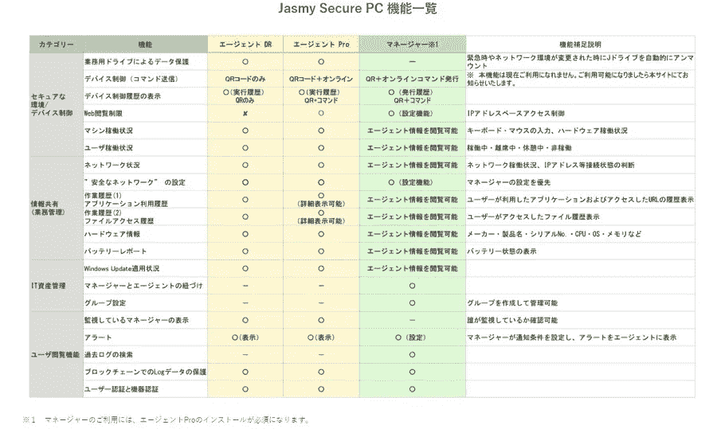
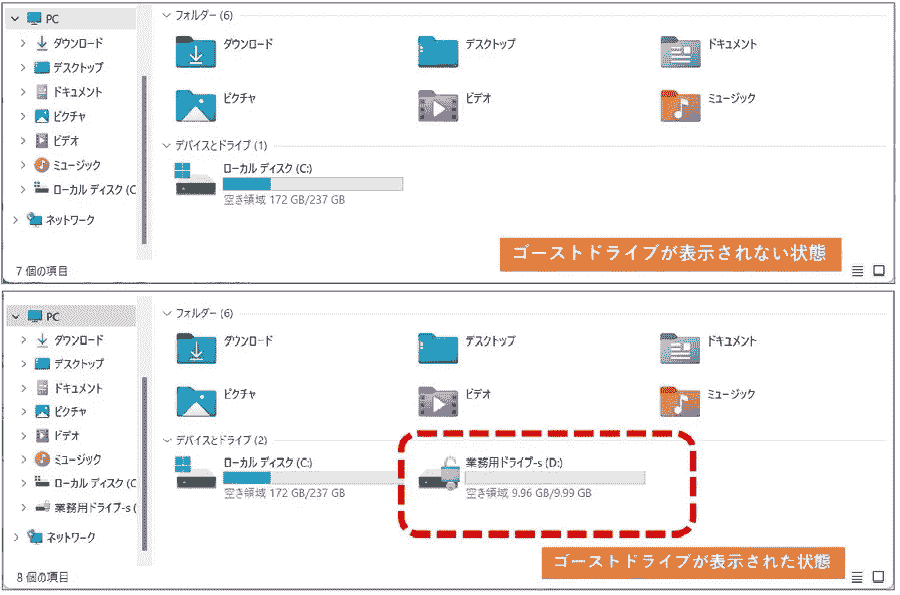
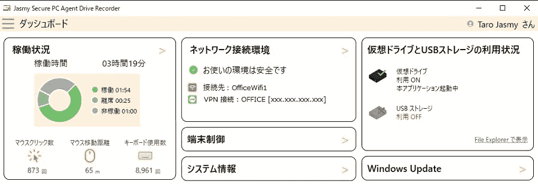
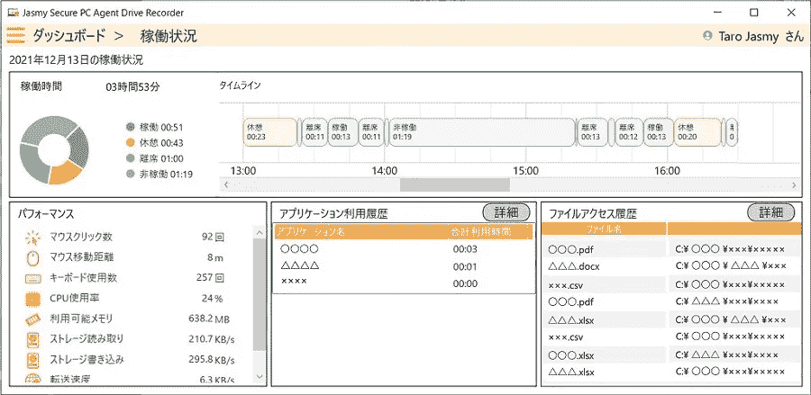
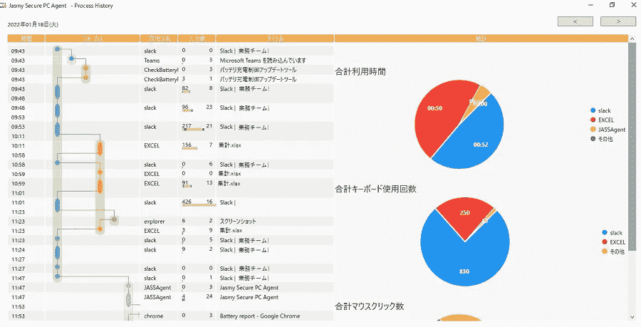
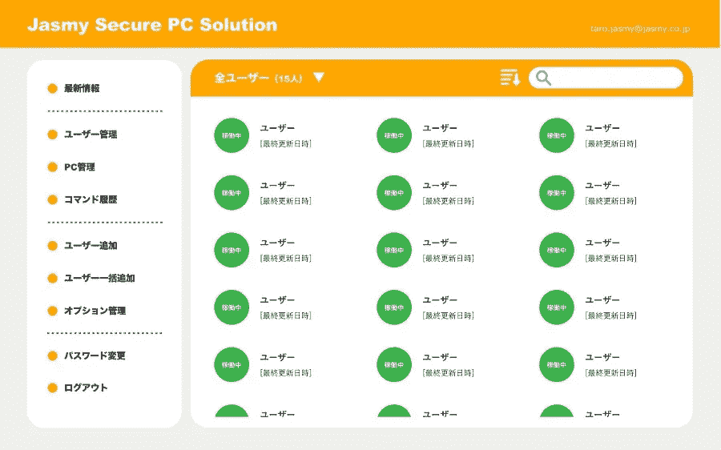
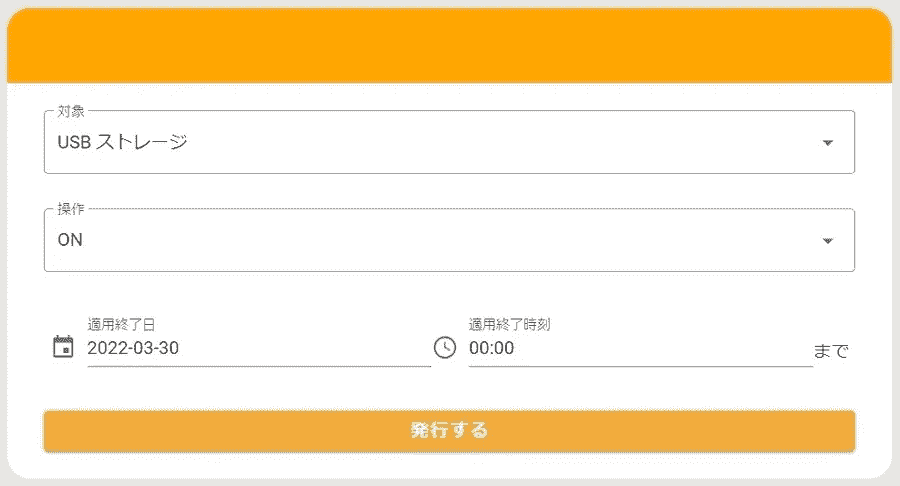

# 免费安全工具 Jasmy Secure PC 有多大用处？

> 原文：<https://medium.com/coinmonks/how-useful-are-free-security-tools-jasmy-secure-pc-210b09e57858?source=collection_archive---------1----------------------->

(译自日本采访)

不要让您的“被抛弃的 IT 员工”承担设置办公室远程环境的负担。查看 Jasmy Secure PC，它可以轻松地为员工提供数据泄露防护和工作管理。

在我们的[前一篇文章](https://jasmy-global.medium.com/relieve-your-it-from-headache-8970554c2bac)中，我们提供了 Jasmy Secure PC 的概述。它们可以从一个免费的软件包中实施，不需要像服务器这样的额外设备，使员工可以安全地在家工作，同时使用分布在各处的相同计算机。

我们将向你介绍如何使用这种产品。

**如何使用 Jasmy Secure PC 并试用免费版**

Jasmy Secure PC 是通过在计算机终端中安装代理程序来防止数据泄露和进行性能管理的解决方案。

代理版本支持日志收集、加密驱动器管理和与外部设备的连接管理。管理器将从代理获得的信息可视化，并通过代理远程控制设备。有免费的代理 DR 版本和订阅的代理 PRO 版本，后者可以与管理器结合使用。

下图是 Jasmy 官方公布的每个许可证的功能列表。目前，免费代理 DR 版本与代理 PRO 一样有用。需要使用 Agent PRO 版本才能更精确地查看详细信息和控制设备，但如果您想先试用，可以尝试使用 Agent DR 版本。但是，代理灾难恢复版本的未来可用性尚未确定。

“免费优惠”在 [Jasmy 网站发放。](https://www.jasmy.co.jp/jasmy_secure_pc/index.php)

Figure 1

**代理版本的外观**

这是一个如何使用 Jasmy 安全电脑及其主要功能的概述，由 Jasmy 的软件开发主管 Takashi Hagiwara 解释。

Hagiwara 先生解释说，“安装非常简单。”事实上，安装代理就像按照安装程序的说明操作一样简单，因此即使是不熟悉计算机操作的员工也可以自己完成。如果他们已经在使用 IT 工具，他们可以用它来远程控制计算机。

“安装过程可能是实施软件时的一个障碍。这样的例子是干扰现有的应用程序和与反病毒软件的兼容性。Hagiwara 说:“代理程序已经清除了与主要防病毒软件的干扰检查，因此不存在员工因收到警报而感到惊讶的询问负担等问题。

安装代理 DR 或代理 PRO 时，会创建一个“ghost 驱动器”,在这两种情况下，该驱动器最多可使用 10 GB。ghost drive 是一个由 Jasmy Secure PC agent 管理的加密数据区，如[上一篇文章](https://jasmy-global.medium.com/relieve-your-it-from-headache-8970554c2bac)所述。只有在特定条件下才能访问，即使电脑丢失，ghost 驱动器上的数据也受到保护。

Figure 2

安装代理后，通过链接 ghost 驱动器和允许访问的网络名称(SSID ),可以使用 ghost 驱动器。对于远程工作的员工，只有在连接到具有安全措施的家庭网络时，或者只有从家庭网络连接到 VPN 时，才允许访问。

对于拿到简单程序手册的远程工作员工来说，这应该不是一个难题。

Jasmy Secure PC 还允许代理从本地网络检查计算机操作记录。如图 1 中的仪表板所示，代理可以检查鼠标和键盘活动，并具有内置逻辑来确定计算机是否处于活动状态，这对于确定员工是否得到了足够的休息非常有用。

Figure 3

Figure 4

**如何使用管理器屏幕**

对于管理员工资源的公司，建议使用经理，经理具有管理员功能(使用经理时，管理员的计算机需要安装 Agent PRO 版本)。

与代理不同，经理不需要安装特定的软件。注册帐户后，用户可以访问 Jasmy 提供的安全 PC Web 服务。但是，这并不意味着任何拥有网络浏览器和帐户的人都可以访问该服务。Hagiwara 说:“我们增加了检查设备信息的控制，增强了安全性。服务器在日本。

代理亲可视化的细节，哪些文件和应用程序已被触动，哪些网站已被访问。此信息也可以从管理中心的管理屏幕中查看。

“该功能不是为了监控，而是作为经理和员工之间的桥梁，经理希望在远程工作时检查工作状态，员工希望清楚地表明他或她正在参与。我们认为工作表现的可视化是让双方放心的重要功能”(Hagiwara 先生)。

Figure 5

Figure 6

**控制终端的简单命令**

管理器还可以向代理计算机发送任意命令。

除了“ghost drive”，Jasmy Secure PC 还可以控制 USB 存储设备的可用性。这些命令可用于授予对通常不可访问的 USB 存储设备的访问权限，但只能根据请求在有限的时间内访问。

关键是，即使叫命令，也可以由非信息系统专业的员工操作。如图所示，只使用 GUI 操作就可以从管理器的屏幕上发出命令，而不需要“从终端点击命令”

除了通过网络直接从经理处发送命令之外，QR 码也可以通过电子邮件发送。它们可以作为替代方案执行。这样，即使计算机由于某种原因脱机，也可以通过电子邮件等其他访问方式的组合来执行命令(注 2)。

Figure 7

**只需将其添加到您当前的环境中，即可增强您的安全性**

正如我们所看到的，Jasmy 安全 PC 非常容易安装。Jasmy Secure PC 可以在不改变当前环境的情况下安装，这对于繁忙的信息系统管理员来说非常有吸引力。

“Jasmy Secure PC 不需要事先准备，例如任命管理员或设置监控项目。也不需要安装额外的服务器或设备。从代理 DR 版本开始，看看它是如何工作的，然后您可以切换到代理 PRO 版本或尝试使用管理器。Hagiwara 说:“享受自由使用它的乐趣。

您可以尝试本文中介绍的代理 DR 版本，但是如果您想要测试管理器，您也可以向 Jasmy 申请为您准备一个测试环境。

如果你在 2022 年 7 月底之前申请，Jasmy 还在进行一项交易，为订阅(专业代理和经理)提供折扣价格。你可能需要相应地安排时间。

*(注 1)软件的未来版本将支持群组管理功能。
(注 2)未来升级将支持二维码功能。*