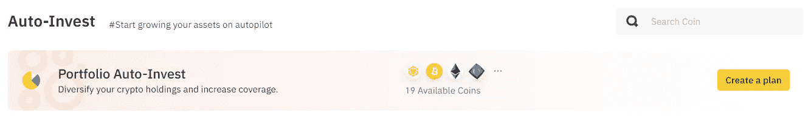
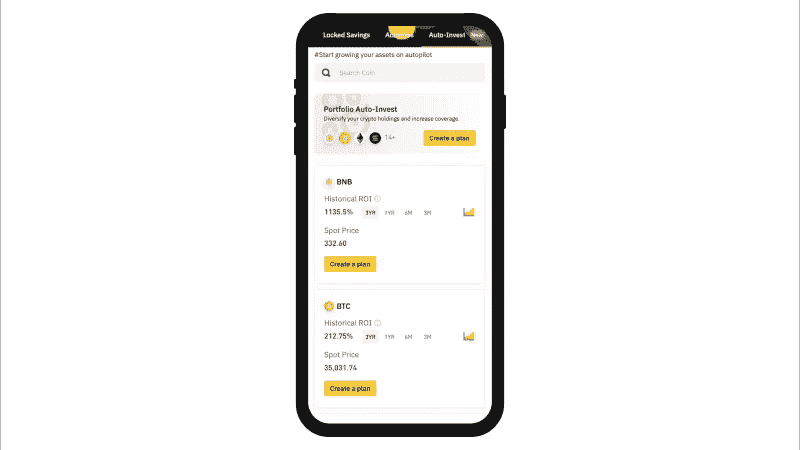

# 用户如何购买多个密码与投资组合计划

> 原文：<https://medium.com/coinmonks/how-users-can-buy-multiple-crypto-with-portfolio-plan-611a87ae4dfa?source=collection_archive---------48----------------------->

# Auto-Invest 的投资组合计划是什么？

投资组合计划是币安汽车投资公司推出的最新功能。它为所有用户提供了方便的访问，允许任何人在一个投资组合中购买、交易和组织各种加密货币，该功能可能是随着时间的推移你可以购买至少两种加密货币的最简单方式之一。对于不了解投资组合计划的用户来说，如果他们不知道这是不是适合他们的特性，他们应该先通过阅读这篇文章来理解什么是自动投资。

*Auto-Invest’s Portfolio Plan lets you customize your multi-crypto portfolio and automates recurring purchases. Diversify and build your Portfolio Plan today.*

# 自动投资

Auto-Invest 是一款币安 Earn 产品，使用户能够自动进行加密投资，并通过美元成本平均(DCA)策略购买加密来获得被动收入。Auto-Invest 的开发旨在帮助用户简单地利用[美元成本平均(DCA)策略](https://academy.binance.com/en/articles/dollar-cost-averaging-dca-explained)来自动建立和扩大他们的资产组合，无需任何手动输入，Auto-Invest 功能于 2021 年在[推出。当使用 Auto-Invest 产品时，用户可以简单地制定一个计划，并设置该计划在他们希望的时间内有效。此外，Auto-Invest 自动将购买的密码存入](https://www.binance.com/en/support/announcement/810e7a447f7a475aa519e44bd2a61f18)[灵活储蓄](https://www.binance.com/en/savings/#lending-demandDeposits?ref=VJ9G6UC4)和 [BNB](https://www.binance.com/en/bnb) 到 [BNB 金库](https://www.binance.com/en/bnbmining)，币安赚取产品，让密码持有者赚取被动收入，通过对他们的闲置资产产生额外的 APY 奖励。最近，Auto-Invest 已经升级了一些令人兴奋的新功能，允许用户通过最近引入的功能 ***投资组合计划*** 购买所有他们喜欢的密码。

# 投资组合计划

您可以选择购买的代币选项定期自动区分新的投资组合计划和当前的自动投资计划。与 Auto-Invest 当前的计划相比，Portfolio Plan 通过提供多硬币设置*(允许用户一次选择多个代币选项)*使用户能够简单地多样化他们的投资组合。用户有机会选择定制他们自己的个人投资组合计划，以满足他们的特定要求，只要你有兴趣建立你的第一个个人多加密投资组合，计划分散你的投资组合，以减少一种资产对另一种资产的波动风险，或者希望从你的投资组合中持有的闲置资产中赚取一些被动收入。用户可以从每个投资组合计划中选择至少两到十个硬币，然后根据他们想要的计划决定每种加密货币的比例分配，然后在循环周期*(每天、每周、每两周、每月)*的选项中进行选择，并选择定期执行行动的首选时间，这要归功于所提供的灵活性。Auto-Invest 投资组合计划的其他特点和优势如下。

# Auto-Invest 投资组合计划的主要特点和优势

❖ **没有限制:**你可以组织的投资组合计划数量没有限制。您可以创建任意数量的专用投资组合计划，并根据您的喜好进行定制，每个投资组合计划最多可有 10 枚硬币。

❖ **可定制:**完全按照您想要的方式自由设置您的投资组合计划，没有任何限制，您可以选择您想要 DCA 的频率，您想要在您的投资组合中使用的加密令牌的类型，以及每个选定加密的百分比分配，您可以选择最终投资组合计划的外观。

❖ **多功能性:**用户可以使用 USDT 或 BUSD 购买其投资组合计划中列出的任何密码。这使得所有用户都可以使用 USDT 或 BUSD 作为基础资产，轻松建立自己的投资组合计划，因为它们是目前市场上最受欢迎的稳定资产。

❖ **赚取被动收入:**无论您决定在您的投资组合计划中购买什么密码，都会自动注册到币安灵活储蓄中，但 BNB 除外，它将注册到 BNB Vault 中 *(BNB 收益率聚合器、BNB Vault 将结合灵活储蓄、BNB DeFi Staking 和 Launchpool，为您提供最佳 APY 回报)*。这使你能够从投资组合中的闲置资产中获得被动收入，*让你的密码为你工作，让你即使在睡觉时也能获得更多的密码。*

❖ **灵活性:**您的投资组合计划中的加密是单独注册的灵活储蓄，这意味着用户可以随时赎回他们的加密资产。没有锁定期，你可以在任何时候访问你的密码。

❖ **更好的风险管理:**使用 DCA 策略自动重复购买密码有助于保护用户免受密码市场波动的影响，尤其是在熊市期间。建立投资组合计划有助于您在投资加密货币时更好地管理风险。灵活储蓄和 BNB 金库也是无本金担保的加密货币交易的低风险替代品。

❖ **安然度过市场低迷*(在熊市期间买入下跌的股票)* :** 通过在市场下跌季节进行周期性的小额投资，使用 DCA 策略有助于安然度过市场低迷。使用 DCA 的投资组合计划可以保持健康的平衡，并留有增加投资组合长期价值的上升潜力。在价格下跌时购买加密货币可以确保投资者获得更高的回报。使用 DCA 策略可以确保您购买的密码比价格高时购买的多。

❖ **轻松的投资组合管理:**与任何其他自动投资计划类似，您可以随时随地通过您的币安应用程序或网站，在一个页面上监控和管理您的投资组合计划。您可以查看&跟踪您的投资组合计划的损益详情，随时暂停或删除投资组合计划。

# 如何建立投资组合计划

**步骤 1:** 通过网站或使用手机应用程序登录您的币安账户。然后，确保你的币安账户在你的现货钱包或灵活储蓄余额中有足够的 USDT 或 BUSD 资金。如果你没有足够的钱，你可以在币安购买。

**第 2 步:**点击网站主页顶部和应用程序主页上的“赚取”选项卡，进入自动投资页面。

**第 3 步:**点击“创建计划”选项。

Source: [Binance Auto-Invest Page](https://www.binance.com/en/savings/auto-invest?ref=38515884)

**第 4 步:**点击“添加硬币”并从列出的选项中选择您想要包含的加密。

**第五步:**给你选择的每个加密分配一个百分比。请确保百分比总和等于 100。

**步骤 6:** 输入您希望用于投资组合计划的认购金额*(最低金额为 10 USDT)* ，并选择您偏好的稳定币(USDT 或 BUSD)和循环周期。

**第 7 步:**慢慢检查您的定制计划，确保没有错误，阅读并同意币安自动投资协议，然后点击“确认”。

Source: [Binance Blog](https://www.binance.com/en/blog/earn/how-to-customize-your-crypto-portfolio-with-autoinvests-portfolio-plan-421499824684903520?ref=38515884)

**第 8 步:**使用直观的损益跟踪监控您的投资组合计划，这使您能够查看任何时间点的投资组合 PnL。概览页面显示您创建的所有投资组合计划，并允许您查看所有未实现的利润和损失、ROI 百分比和下一个购买日期，以实现高效的投资组合管理。您可以根据市场情况决定暂停积极的投资组合计划或编辑您的加密投资组合，以有效地优化您的策略。

*要使用币安自动投资并建立投资组合计划，请访问* **产品页面** **—** [**币安自动投资**](https://www.binance.com/en/savings/auto-invest?ref=38515884)

*要获得如何使用币安自动投资组合计划的详细指导，请访问* **常见问题—** [**如何使用币安自动投资组合计划**](https://www.binance.com/en/blog/earn/how-to-customize-your-crypto-portfolio-with-autoinvests-portfolio-plan-421499824684903520?ref=38515884)

*币安入门，* **注册** [**这里**](https://accounts.binance.com/en/register?ref=38515884) **。**

> 加入 Coinmonks [电报频道](https://t.me/coincodecap)和 [Youtube 频道](https://www.youtube.com/c/coinmonks/videos)了解加密交易和投资

# 另外，阅读

*   [3 商业评论](/coinmonks/3commas-review-an-excellent-crypto-trading-bot-2020-1313a58bec92) | [Pionex 评论](https://coincodecap.com/pionex-review-exchange-with-crypto-trading-bot) | [Coinrule 评论](/coinmonks/coinrule-review-2021-a-beginner-friendly-crypto-trading-bot-daf0504848ba)
*   [莱杰 vs n 格拉夫](/coinmonks/ledger-vs-ngrave-zero-7e40f0c1d694) | [莱杰纳诺 s vs x](/coinmonks/ledger-nano-s-vs-x-battery-hardware-price-storage-59a6663fe3b0) | [币安评论](/coinmonks/binance-review-ee10d3bf3b6e)
*   [Bybit 交易所评论](/coinmonks/bybit-exchange-review-dbd570019b71) | [Bityard 评论](https://coincodecap.com/bityard-reivew) | [Jet-Bot 评论](https://coincodecap.com/jet-bot-review)
*   [3 commas vs crypto hopper](/coinmonks/3commas-vs-pionex-vs-cryptohopper-best-crypto-bot-6a98d2baa203)|[赚取加密利息](/coinmonks/earn-crypto-interest-b10b810fdda3)
*   最好的比特币[硬件钱包](/coinmonks/hardware-wallets-dfa1211730c6) | [BitBox02 回顾](/coinmonks/bitbox02-review-your-swiss-bitcoin-hardware-wallet-c36c88fff29)