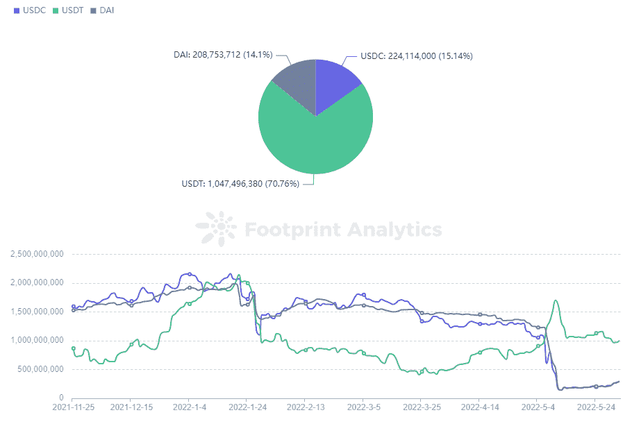
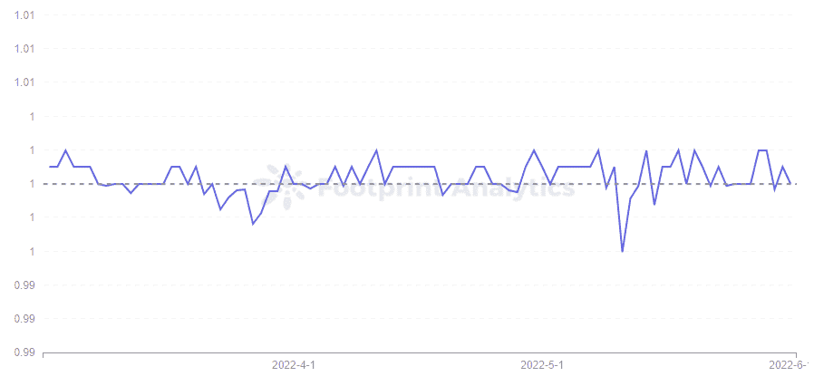
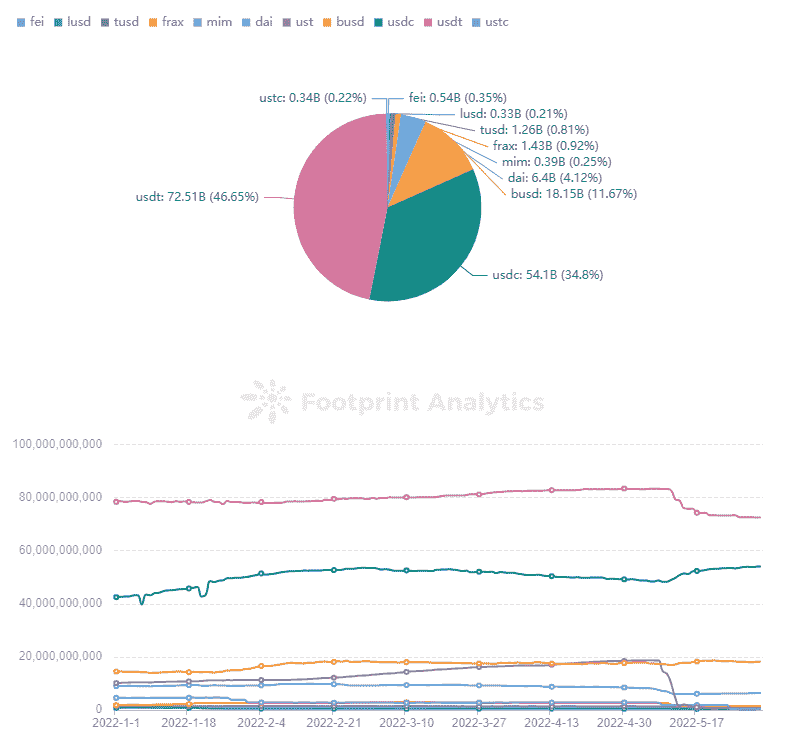
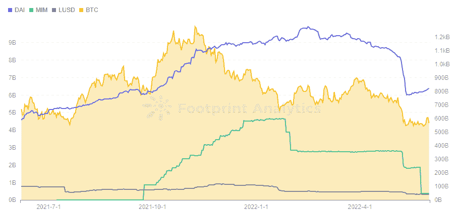
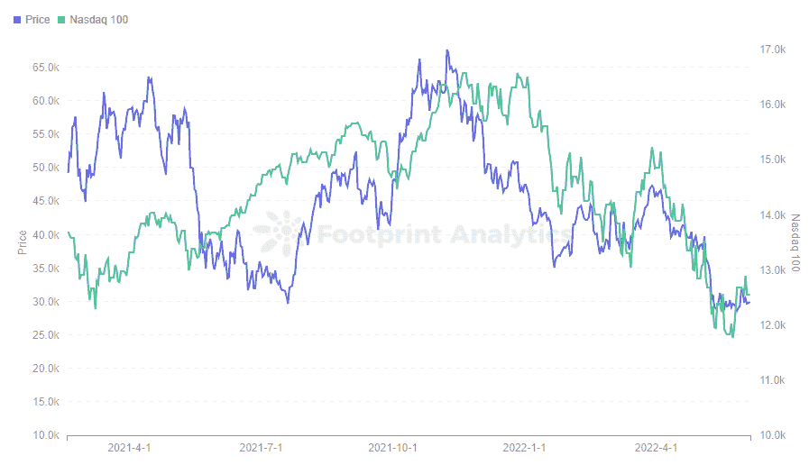
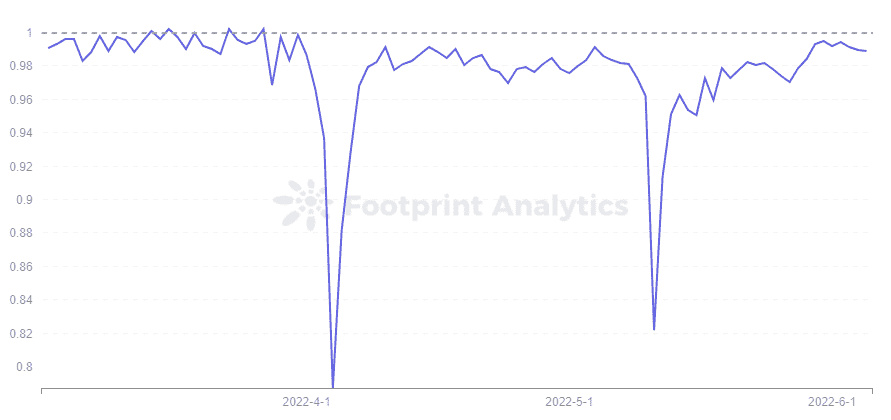
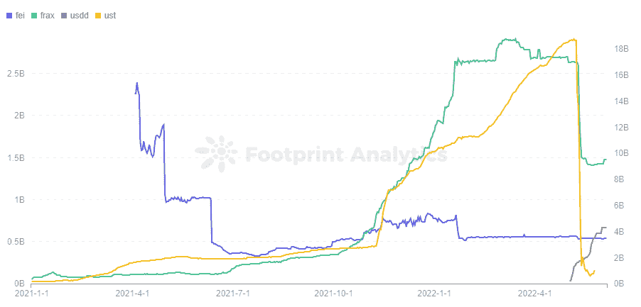

# UST 是如何改变稳定的货币格局的

> 原文：<https://medium.com/coinmonks/how-ust-changed-the-stablecoin-landscape-fb1ebf54da1a?source=collection_archive---------67----------------------->

2022 年 6 月

数据来源:[足迹分析 stable 在 UST 活动仪表板后加入](https://www.footprint.network/@DamonSalvatore/Stablecoins-after-the-UST-event?date=past360days&channel=ENG-260)

曾经的第三大稳定币， [UST](https://www.footprint.network/@DamonSalvatore/Stablecoins-after-the-UST-event?date=past360days&channel=ENG-260) 在 5 月 9 日崩盘后，震动了整个[稳定币](https://www.footprint.network/@DamonSalvatore/Stablecoin-Dashboard?channel=ENG-260)市场。它没有像成千上万人认为的那样最终找到算法稳定的解决方案，而是几乎在一夜之间变为零。

UST 失败的原因是，随着它与美元脱钩，出现了突然的大规模抛售，导致铸造了过量的卢纳货币。尽管供应量迅速扩大，但由于 UST 的价值暴跌，LUNA 未能将其重新锚定在 1 美元。

UST 的市值在 4 月份超过了 BUSD，这意味着它仅落后于 USDT 和 USDC。然而，崩盘来得如此之快，以至于许多投资者甚至来不及亏本套现。

这一事件造成了 DeFi 最大的信任危机。稳定的硬币不再稳定。

但是危机本身也带来了机遇。UST 之后稳定的硬币市场发生了怎样的变化？

# 人们对美元硬币的限制和升温感到紧张

Tether (USDT)和 USD Coin (USDC)几乎占据了 stablecoin 市场的 80%。

对于每一个发行的 USDT，Tether 的银行账户以 1:1 的比例存入美元资金。USDC 类似于 USDT，由 Circle 发行。

USDT 是两个项目中最有争议的。2021 年 10 月**，**因其涉嫌缺乏透明度以及因向公众撒谎而多次受到美国监管机构的处罚而获得大量媒体报道。

当 UST 崩溃时，人们立即想到了 USDT，其市值在半个月内下降了 100 多亿美元，至 725 亿美元。

Curve 最大的基金池(由戴、和组成)3pool 反映了围绕这些主力基金的市场情绪。

USDT 此前一直保持在资金池的 20-30%。然而，随着 Terra Luna 的倒闭，用户开始将他们的扔进游泳池，换成和戴。这种疯狂的抛售导致 USDT 达到 83%的峰值。

*Footprint Analytics — Curve 3pool in Ethereum*

在崩溃之前，USDT 的价格往往徘徊在 1 美元以上，但这一事件使其跌至近三个月的低点 **$** 0.996。Tether 的首席技术官 Paolo Ardoino 在 Twitter 上宣布，他们赎回了 70 亿美元，以帮助它重新获得美元锚，并相信如果市场需要，他可以继续这样做。

*Footprint Analytics — USDT Price Trend*

这一举动恢复了一些信心，USDT 的 3 人池百分比在 6 月 5 日下降到 61%。

USDT 的市值下降了**【100 亿美元，但是它在整个稳定的货币市场中的份额并没有下降。**

**这就引出了一个问题，UST 的市场份额流向了哪里。**

**根据[足迹分析](https://www.footprint.network/@DamonSalvatore/Stablecoins-after-the-UST-event?date=past360days&channel=ENG-260)，USDC 是最大的受益者，其市值从 483 亿美元上升到 541 亿美元，市场份额从 27%上升到 34%。**

****

***Footprint Analytics — Market Cap of Stablecoin***

# **戴找到了自己的立足点，而神奇的互联网货币跌跌撞撞**

**以戴(Dai)、神奇网络货币(MIM)和 Liquity()为首的过度抵押的稳定硬币是通过将超过 1:1 比例的非稳定硬币作为抵押**1 .**存入协议中而形成的**

**这些过度流通的硬币受到了 UST 下跌的影响，但这是间接的。戴和 MIM 的市值分别下降了 20 亿美元，但这种下降趋势始于 5 月 6 日，即 UST 崩盘之前。**

****

***Footprint Analytics — Overcollateralized Stablecoin vs BTC Market Cap***

**DAI 主要由 BTC 和 ETH 担保，而 MIM 则由 yvDA **I** 等计息资产担保。当大多数加密货币价格迅速下跌时，它们用作抵押品的过度抵押的稳定货币也随之下跌。**

**BTC 最近的下跌一直在影响加密货币的价格，这再次与美国市场有关。美联储已采取措施提高利率，以防止通货膨胀，这也导致美国股市下跌。纳斯达克 100 指数也有明显的下降趋势。**

**足迹分析公司的数据显示，直到 2021 年 7 月，BTC 的价格与纳斯达克 100 指数基本上不相关，但从那以后，两者之间的相关性变得越来越强。虽然用户曾经输入加密货币部分是为了对冲风险，但加密现在看起来像是股票市场的高杠杆版本。**

****

***Footprint Analytics — BTC Token Price vs Nasdaq 100***

**UST 股市暴跌无疑给过度抵押的稳定债券带来了又一次打击，因为 Terra founder Do Know 购买了大量 BTC 作为 UST 的保证金，给市场带来了进一步的下行压力，并导致更多人在恐惧中卖出 BTC。Do Know 拯救 UST 计划的失败也使 BTC 价格跌至近一年低点，进一步影响了过度抵押的稳定债券的清算。**

**然而，戴不仅是通过诸如 ETH 和等抵押品铸造出来的，也是通过和等大量稳定的发行物铸造出来的。因此，戴设法将影响控制在有限的范围内。相比之下，MIM 的情况就不太好了，在 1 月份市值下降 20 亿美元之后，5 月份又下降了 20 亿美元。**

# **算法稳定币市场**

**UST 的脱钩打破了人们对算法稳定指数新建立的信心，在 Waves chain 上有类似机制的 USDN 价格也在 5 月 11 日立即脱钩至 0.8 美元，然后逐渐回落。**

**但截至 6 月 5 日，价格仍未完全锚定在 0.989 美元。正如 [Footprint Analytics](https://www.footprint.network/@DamonSalvatore/Stablecoins-after-the-UST-event?date=past360days&channel=ENG-260) 所看到的，这不是 USDN 第一次如此糟糕地失去锚定。**

****

***Footprint Analytics — USDN Price Trend***

**直到 5 月 9 日，市值与 UST 持平的 FRAX 也暴跌了 10 亿美元。由于 FRAX 要求铸造 USDC 和 FXS，USDC 作为附属部分，FXS 作为算法部分，所以 FTAX 比完全算法稳定的硬币相对更稳定。虽然 FXS 的价格也下跌，但 FRAX 在市值跌至 14 亿美元后反弹。**

****

***Footprint Analytics — Algorithmic Stablecoin Market Cap***

**FEI 允许用户以 1 美元的资产创建稳定账户，目前抵押率为 168%，协议中约 70%的资产为 ETH。费的市值并不大，5 亿美元，并没有受到太大影响。**

**值得注意的是，虽然大多数稳定币的市值都有所下降，但截至 6 月 5 日，【USDD】Tron 发行的稳定币已经超过费的市值 6.7 亿美元，使 Tron 成为仅次于以太坊和 BSC 的第三大 TVL 连锁。**

**从 UST 的成功可以看出，用户选择稳定的信用卡取决于安全性和盈利能力。USDD 可以说是在 UST 上做了优化，但是 USDD 的发行、烧钱和一级市场活动都是由创道储备管理，普通用户只能在二级市场交易 USDD。因此，USDD 的稳定性主要与 TRON DAO 储备及其批准的白名单有关，与算法没有太大关系。**

**这将用户的信任级别从算法转移到 TRON DAO 保留。USDD 还有 30%的刚性利率，对用户极具吸引力。**

# **摘要**

**当 UST 崩溃时，stablecoins 的市场遭受了巨大的打击，同时也为 USDC 和 USDD 等一些协议提供了新的机会。**

**在过度竞争的稳定竞争中，戴仍然是第一名，与曾经领先的 MIM 的差距越来越大。**

**对 USDT 的担忧仍在继续，但它迄今已安然度过了这场风暴。**

**这篇文章由[足迹分析](https://www.footprint.network/?channel=ENG-260)社区提供。**

**Footprint 社区是一个世界各地的数据和加密爱好者相互帮助了解和获得关于 Web3、元宇宙、DeFi、GameFi 或区块链新兴世界任何其他领域的见解的地方。在这里，你会发现活跃的、不同的声音相互支持，推动着社区向前发展。**

> **加入 Coinmonks [电报频道](https://t.me/coincodecap)和 [Youtube 频道](https://www.youtube.com/c/coinmonks/videos)了解加密交易和投资**

# **另外，阅读**

*   **[CoinFLEX 评论](https://coincodecap.com/coinflex-review) | [AEX 交易所评论](https://coincodecap.com/aex-exchange-review) | [UPbit 评论](https://coincodecap.com/upbit-review)**
*   **[AscendEx 保证金交易](https://coincodecap.com/ascendex-margin-trading) | [Bitfinex 赌注](https://coincodecap.com/bitfinex-staking) | [bitFlyer 审核](https://coincodecap.com/bitflyer-review)**
*   **[Bitget 回顾](https://coincodecap.com/bitget-review) | [双子星 vs BlockFi](https://coincodecap.com/gemini-vs-blockfi) cmd| [OKEx 期货交易](https://coincodecap.com/okex-futures-trading)**
*   **[AscendEx Staking](https://coincodecap.com/ascendex-staking)|[Bot Ocean Review](https://coincodecap.com/bot-ocean-review)|[最佳比特币钱包](https://coincodecap.com/bitcoin-wallets-india)**
*   **[霍比评论](https://coincodecap.com/huobi-review) | [OKEx 保证金交易](https://coincodecap.com/okex-margin-trading) | [期货交易](https://coincodecap.com/futures-trading)**
*   **[网格交易机器人](https://coincodecap.com/grid-trading) | [Cryptohopper 审查](/coinmonks/cryptohopper-review-a388ff5bae88) | [Bexplus 审查](https://coincodecap.com/bexplus-review)**