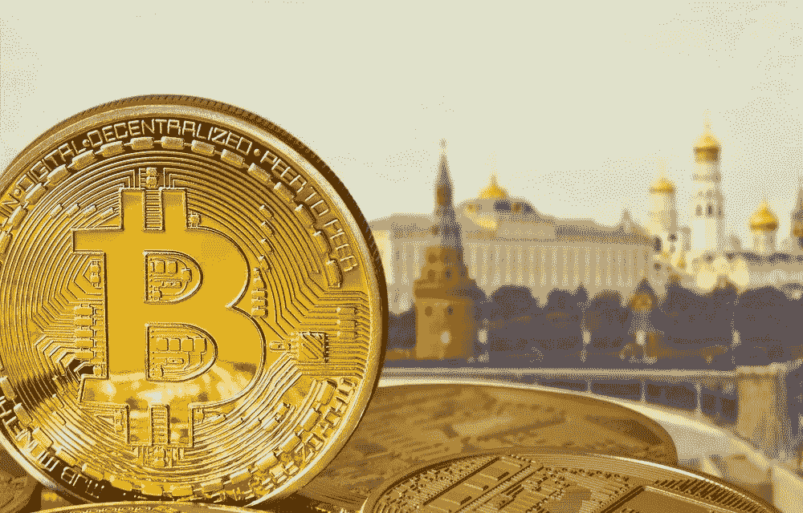

# 华尔街和俄罗斯如何破解加密货币市场？比特币和以太？

> 原文：<https://medium.com/coinmonks/how-wall-street-and-russia-cracked-the-cryptocurrency-market-bitcoin-and-ether-d30d473088e2?source=collection_archive---------4----------------------->

在莫斯科和华盛顿围绕乌克兰发生冲突的背景下，这似乎是很有趣的事情，加密货币市场受到了源于这两个国家领土的两个事件的席卷。一个让整个 cryptos 损失超过 **6%** 的抗压二人组。

How Wall Street and Russia cracked the cryptocurrency market ? Bitcoin and Ether ?