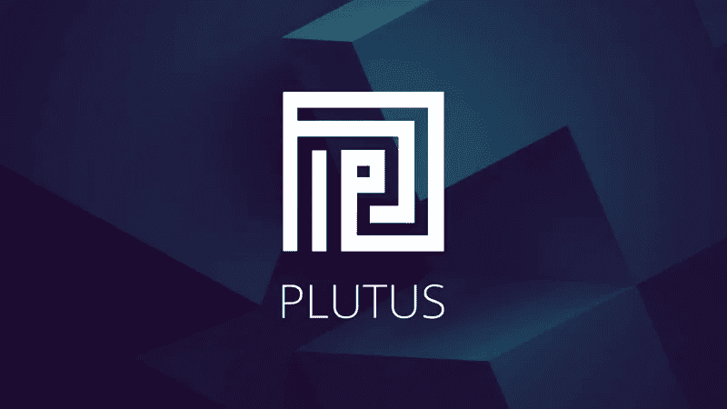
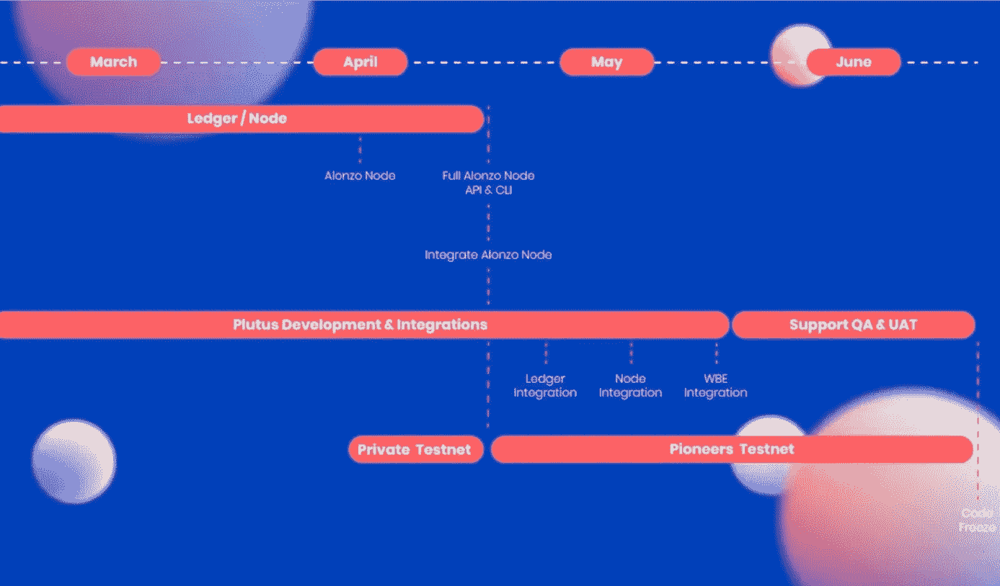
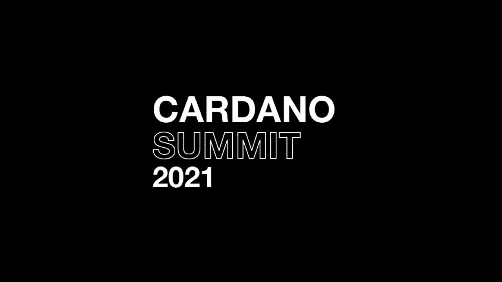

# 我们如何在 Cardano 上测试普路托斯智能合约

> 原文：<https://medium.com/coinmonks/how-we-tested-plutus-smart-contracts-on-cardano-1df7da5737eb?source=collection_archive---------21----------------------->

## [金属灯](https://www.metalamp.io/) / [卡尔达诺](https://www.metalamp.io/cardano)

## 2021 年初对我们的团队来说是具有挑战性的，正如后来的故事所显示的那样，游戏规则发生了变化。在 [MetaLamp](http://metalamp.io) ，我们开始与 [IOHK](https://iohk.io/) 合作，这家公司创立了区块链平台 Cardano。我们的团队已被邀请参加普路托斯合作伙伴计划，以帮助促进卡尔达诺生态系统的发展。

IOHK 将他们建造的未使用的基础设施与一条没有汽车的新路进行了比较。他们有兴趣在现场检查它的质量和可操作性。因此，MetaLamp 成为第一批开辟新路线的车辆之一。它的工作人员帮助道路的建设者搜索，找到并修复所有的颠簸。

为了提供高保真测试，IOHK 在全球范围内寻找合适的软件开发机构。经过谈判，最终只选出了 5 支队伍，MetaLamp 也在其中。

## 我们为什么会被邀请？

有四个因素让 MetaLamp 团队吸引了 Cardano 创始人的兴趣。

1.  **在 Haskell 的扎实经验**

因为普路托斯是用 Haskell 编写的，所以必须具备函数式编程语言的深厚知识。由于自 2014 年以来参与了使用该技术堆栈开发棘手和高负载的项目，该团队在 Haskell 中构建复杂解决方案方面获得了丰富的经验。

> 如果你以前没有使用过 Haskell 语言和 Nix 开发工具，学习普路托斯时很容易陷入语法和编译错误中
> 
> **基里尔·埃利扎罗夫，MetaLamp 的区块链开发人员**

*2。*

> 如果我们谈论 MetaLamp 的细节，我们总是试图采取一些非标准的项目，从来没有模板。每次我们只是从头开始研究一切，思考架构，大量搜索信息，与其他在这一领域有经验的专家交流。我们创建的任何项目都有与实验模式相同的细节。大部分时间花在思考解决方案上，而不是写代码。
> 
> **metal amp 项目经理 Darya Trifonova**

因此，在参与普路托斯合作伙伴计划时，MetaLamp 开发人员已经准备好面对任何挑战:他们过去常常从事非常规任务。

> 我们正在与那些真正想尝试新事物、创新和有趣的东西的公司合作
> 
> **IOHK 运营总监 Gerard Moroney**

这正是 MetaLamp 走在时代前列的愿望与普路托斯合作伙伴计划提供的尝试未知事物的机会不谋而合的地方。

*3。* **在区块链探明轨迹**

在普路托斯合作伙伴计划开始时，MetaLamp 已经与区块链的商业产品打交道五年了。该团队拥有金融技术方面的经验，并构建了涉及贷方、贷款和分类账的应用程序。MetaLamp 还执行了与其他不同领域相关的区块链项目:游戏、云服务等。

*4。* **团队中的特殊文化**

MetaLamp 为团队中高度发达的自我教育文化而自豪。该公司有自己的教育计划和开发人员发展计划，帮助员工浏览专业知识和技能系统。

> 发展地图给了我们一个非常大的自我发展的基础和传统。如果没有一种自我发展的文化，一种平衡技能的文化，实施对普路托斯的研究将需要更长的时间，对我们来说，这将是一项比最终更模糊的任务
> 
> **metal amp 首席执行官 Roman Shtykh**

克服了工作室设计的培训计划和内部考试，IT 工程师学会了自己快速填补知识空白。随着这种获得必要技能的能力得到极大的磨练，开发人员可以管理需要快速定性地学习大量新事物的任务。

## **我们解决了哪些任务，面临了哪些困难？**

LinkedIn 的创始人雷德·霍夫曼说，如果你对自己产品的第一个版本不感到尴尬，那么你推出的太晚了。Cardano 开发人员的团队追求按时交付产品的目标，但首先要确保其质量值得认可。这就是为什么他们集中了大量的精力来吸引重量级专家，以检查普路托斯的工作能力。

如果你熟悉 Cardano 的路线图，你可能知道现在这个团队正处于一个过渡阶段，正在进入智能合同应该发布的 Goguen 时代。这将使软件开发机构能够使用 Cardano 平台进行分散式应用程序开发。MetaLamp 的任务是检查普路托斯智能合同在实际项目中的表现。

> 智能合约是一个应用程序，它根据明确的规则构建交易并将其发送到区块链。任何区块链用户都不能违反这些规则，它们就像传统银行业的一份合同。普路托斯平台允许你在卡达诺区块链上写智能合同，该平台使用 UTXO 模型进行分类，这使它区别于其他具有开发智能合同功能的区块链
> 
> **Stanislav Zhdanovich，****MetaLamp 的区块链开发人员**

在 mainnet 上部署阿隆佐和 Cardano 上智能合同开始的旅程中，IOHK 工程师希望确信下一个硬分叉将符合他们的高标准。

为了在最高水平上完成质量保证任务，MetaLamp 团队成员必须深入项目，一丝不苟地学习所需信息。

“在我们开始撰写智能合同之前，我们有时间研究普路托斯先锋计划的文件和讲座，”MetaLamp 区块链开发商 Olga Klimenko 说。—有点难懂，但是讲课对“用手摸代码”帮助很大。我们可以运行它，看看结果，做一些我们自己的改变，看看会发生什么。此外，Olga 还参与了阿隆佐紫色测试。她说，这种经历确实帮助了我。这是一个硬分叉，包括 Cardano testnet 中的智能合约。通过测试可以了解 UTXOs 以什么形式存储，如何在事务中使用它们，以及如何执行验证。

> 该计划的唯一缺点是，IOG 现在正在积极推出新功能和更新，有时甚至改变一些功能的主要 API，这就是为什么讲座会很快过时。但是程序的作者正试图保持更新。目前，这些演讲的三个版本已经出版了
> 
> **基里尔·埃利扎罗夫，MetaLamp** 的区块链开发者

MetaLamp 工程师面临的第一个障碍是缺乏整理一些东西的文档。

当不断有人打电话来询问他们面临什么样的挑战时，他们以这样的方式工作，而在常规的开发过程中没有这样的事情。IOHK 内部核心团队给予了大力支持。我们直接与 IOHK 领导、他们的运营主管和教育主管沟通。太棒了！Lars 反应非常积极，乐于助人，Darya Trifonova 分享了她的印象。(Lars brünjes——IOHK 的教育主管，纯数学博士，对函数式编程充满热情，尤其是 Haskell。)

可以寻求帮助的 Discord 特别社区也非常支持智能合约的新手开发者。“但有时我们不得不查看普路托斯的源代码，自己想办法解决，”Olga Klimenko 说。她指出，基础准备在任何领域都是有益的，区块链也不例外。如果你试图马上写智能合同，这几乎是不可能的。但是，如果你从研究理论(它是什么和它是如何工作的)开始，然后转向具体的区块链(在我们的情况下，Cardano)，之后尝试进行简单的交易，最后撰写智能合同，那么它就变得更容易了。

> 在某些情况下，学习以太坊中现有的解决方案可以作为开发过程中的一个提示
> 
> **Stanislav Zhdanovich，MetaLamp 的区块链开发人员**

在 MetaLamp 参与该计划期间，IOHK 没有支持智能合同的测试网。这也给这一进程增加了一些困难。

> 我们只进行了模拟，当 testnet 出现时，它并不支持许多功能，例如，带钱包的 PAB、状态机等。我们在模拟中成功运行的代码不一定能在真实网络中运行。如果一些 bug 不允许，当我们不得不寻找变通方法使契约在 testnet 中工作时，这是很困难的。我们留下了评论，并与参与测试合同项目的普路托斯开发人员和其他团队进行了交谈，以讨论修复或解决错误的方法
> 
> **区块链 MetaLamp 公司工程师 Olga Klimenko**

正如谚语所说，失败是成功的垫脚石。在这个项目中，MetaLamp 积累了使用 Cardano 工具的丰富经验。IOHK 工程师赞赏我们团队成员深厚的专业知识，并邀请我们作为主管参加基于普路托斯语言的 Cardano hackathon。

在 Cardano 峰会上，我们的开发人员帮助与会者编写了一个 defi 应用程序。

## **我们在项目中取得了哪些成果？**

> 因此，在项目结束之前，我们设法编写了一个带有拍卖的 NFT 市场，但我们没有足够的时间将其放入测试网。用状态机重写需要很长时间，testnet 遇到了意想不到的错误
> 
> **metal amp 的区块链开发人员 Olga Klimenko**

当我们在 testnet 中推出市场时，结果是没有办法签署交易，因为没有集成钱包和 PAB。

到目前为止，程序结束时出现的大部分问题都已经解决了，所以 testnet 中的一切应该会更顺利。

MetaLamp 开发人员与 IOHK 内部团队密切合作，帮助他们找到漏洞，并参与了如何修复或改进漏洞的头脑风暴。

> 该计划非常庞大，因为它包括一系列理论讲座和每个研究主题的实际任务:从英国拍卖形式的简单合同到 Uniswap 协议的实施。由于在程序中有如此大量的信息，开发人员可以获得必要的知识和经验，从而有可能完成真正的任务
> 
> **项目参与者基里尔·埃利扎罗夫**

从更广的角度来看，这次经历让开发团队大大扩展了他们的知识，不仅在 Cardano 上，而且在以太坊上也开始创作产品。

## **这一经历对 MetaLamp 专业知识有何影响？**

参与合作伙伴计划是该公司工作的一个转折点:IT 工程师们在区块链平台上钻研软件开发的特定领域，获得了关于 Cardano 和以太坊的深刻知识，尤其是成为第一批设法在普路托斯编写智能合同的开发人员。

> 我们在加密社区变得更加知名，我们的团队加入了新区块链项目。我们开始扩大技术列表，现在我们不仅与 Cardano 合作，还与以太坊合作。我们更经常地被邀请作为媒体和各种个人活动的专家
> 
> **metal amp**销售主管 Rostislava Glebovich

所有这些活动增加了对区块链技术感兴趣的客户数量。

> 目前，我们参与了几个与 DeFi 有关的雄心勃勃的区块链项目。但是因为他们在 NDA 手下，我们不能分享细节。由于我们是第一批在区块链开发复杂产品的公司之一，我们在该领域拥有更好的经验和成熟的专业知识。这不禁影响了社区对我们专家的需求以及对他们技能的认可
> 
> **罗曼·施泰克，MetaLamp** 的首席执行官

MetaLamp 团队对 Cardano 的机会感到兴奋。与提供 8 倍或 35 倍比特币的以太坊相比，每秒 257 笔交易的吞吐量是一个突破。交易成本低于其他区块链，这也增加了该平台的吸引力。由于共识协议，即利害关系证明，能耗得到了优化，这显然比工作证明更环保。鉴于安全智能合同的发展，交易的高速度和低成本以及扩展能力使 Cardano 成为创新项目的一项有前途的技术。

例如，MetaLamp 团队一直在与 Iagon 工程师合作开发分散式云服务。MetaLamp 在背景和与 IOHK 的战略合作伙伴关系方面获得了众多奖项，成为一个雄心勃勃的项目的完美匹配。Haskell 开发人员很难找到，他们就像钻石，但价值更高，客户在评估与我们的专家合作的经验时说。

现在智能合约是卡尔达诺的一个痛点。但是开发人员正在快速解决这些问题。当智能合同出现在 mainnet 中时，可以预见该技术的受欢迎程度将会飙升。许多 DeFi 产品将获得资助，因此，对该行业专家的需求将会增加。

> DeFi 应用正在飞速发展，市场每年都在增长，并将进一步增长，经济学家和分析师的任何共识都表明，这个市场将在未来 5-10-15 年内增长。DeFi 产品潜力巨大，它们正在从传统金融中拿走很大份额，并将继续拿走。我们不知道它们会扩展到什么程度，但是市场的潜力是巨大的
> 
> **metal amp 首席执行官 Roman Shtykh**

该公司很高兴成为重要区块链产品的创始者，并为生态系统的发展做出了很大贡献。目前，该团队参与了许多基于区块链的重大项目的开发过程，从 NFT 市场到重量级基础设施项目，包括桥梁、L2 等。我们感到自豪的是，我们已经设法克服了与掌握新技术相关的所有困难，并且在新的水平上，我们已经具备足够的知识和技能来应对市场可能提供的任何挑战。

> *加入 Coinmonks* [*电报频道*](https://t.me/coincodecap) *和* [*Youtube 频道*](https://www.youtube.com/c/coinmonks/videos) *了解加密交易和投资*

# 另外，阅读

*   [3 商业评论](/coinmonks/3commas-review-an-excellent-crypto-trading-bot-2020-1313a58bec92) | [Pionex 评论](https://coincodecap.com/pionex-review-exchange-with-crypto-trading-bot) | [Coinrule 评论](/coinmonks/coinrule-review-2021-a-beginner-friendly-crypto-trading-bot-daf0504848ba)
*   [莱杰 vs n rave](/coinmonks/ledger-vs-ngrave-zero-7e40f0c1d694)|[莱杰 nano s vs x](/coinmonks/ledger-nano-s-vs-x-battery-hardware-price-storage-59a6663fe3b0) | [币安评论](/coinmonks/binance-review-ee10d3bf3b6e)
*   [Bybit Exchange 审查](/coinmonks/bybit-exchange-review-dbd570019b71) | [Bityard 审查](https://coincodecap.com/bityard-reivew) | [Jet-Bot 审查](https://coincodecap.com/jet-bot-review)
*   [3 commas vs crypto hopper](/coinmonks/3commas-vs-pionex-vs-cryptohopper-best-crypto-bot-6a98d2baa203)|[赚取加密利息](/coinmonks/earn-crypto-interest-b10b810fdda3)
*   最好的比特币[硬件钱包](/coinmonks/hardware-wallets-dfa1211730c6) | [BitBox02 回顾](/coinmonks/bitbox02-review-your-swiss-bitcoin-hardware-wallet-c36c88fff29)
*   [BlockFi vs 摄氏](/coinmonks/blockfi-vs-celsius-vs-hodlnaut-8a1cc8c26630) | [Hodlnaut 点评](/coinmonks/hodlnaut-review-best-way-to-hodl-is-to-earn-interest-on-your-bitcoin-6658a8c19edf) | [KuCoin 点评](https://coincodecap.com/kucoin-review)