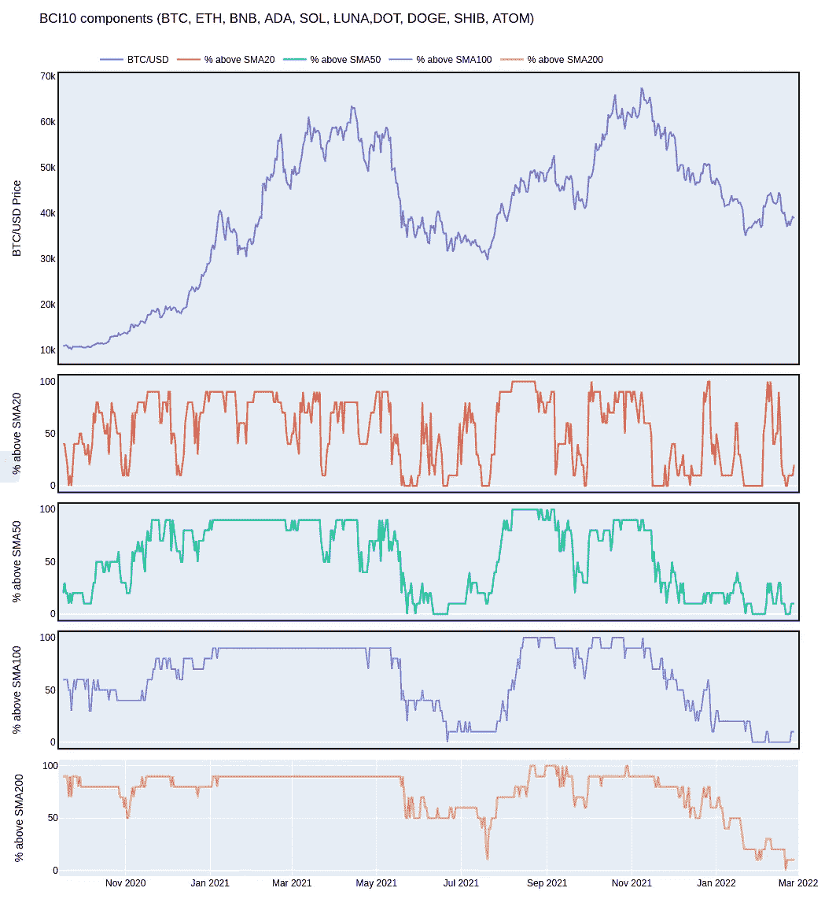
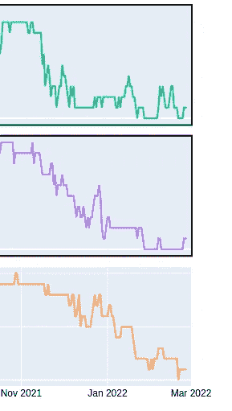

# 最大的加密货币有多弱？

> 原文：<https://medium.com/coinmonks/how-weak-are-the-biggest-crypto-currencies-49193095b555?source=collection_archive---------26----------------------->

自从许多硬币在 11 月达到最高点以来，加密市场一直在强劲下滑。自 1 月底以来，许多人希望我们现在看到底部正在形成，新的反弹可以开始。但是，目前的形势已经足够好了吗？或者说，我们只是看到了当前调整的一个突破口？

# SMAs 讲述了一个有趣的故事

如果你想知道一个市场有多强大或健康，看看所谓的市场宽度数据是有意义的。市场广度数据通常包括一组重要资产(例如，按市值或交易量或您想到的任何标准计算的最大 10 项加密资产)，然后查看以下内容:

*   有多少资产上升或下降？
*   有多少资产的买入量大于卖出量？
*   有多少资产在重要的 SMA 之上交易？

如果您长时间收集此类数据，然后将其可视化，您应该能够确定这些资产的当前健康状态。

让我们今天为 crypto 做那件事。

# BitPanda 的加密索引 BCI10 和 SMAs

如果您想要对加密资产进行分组，您可以自己进行分组(定义一个标准，然后为符合该标准的资产收集数据),也可以寻找现有的加密索引。

在我的研究中，我发现了一些加密篮子和指数，但 BitPanda 的 [BCI10](https://www.bitpanda.com/de/preise/crypto-index/bci10#) 是我喜欢的东西，因为你可以直接投资它，从而遵循你自己的数据分析。

[目前，BCI10 有以下组件](https://www.bitpanda.com/de/bci-bitpanda-crypto-index#):

*   比特币
*   以太坊
*   BNB
*   卡尔达诺
*   索拉纳
*   土地
*   波尔卡多特
*   总督
*   芝 INU
*   宇宙

对于我自己的市场广度分析，我将下载这些资产的历史价格数据，然后确定其中有多少资产的交易价格高于其重要的 SMAs，因为 SMAs 通常用于确定长期、中期和短期趋势。

我将尝试可视化上面提到的加密资产的 SMA 数据。因为这些加密资产应该反映当前加密硬币中 70–75%的资本，所以结果可能在某种程度上代表整个加密市场。我知道你们中的一些人不同意我的观点。获得 100 个或更多加密资产的数据会更好，但这将更加耗时，我不确定结果是否会有很大不同，因为人们必须根据一些标准对资产进行加权，大型加密资产将对结果产生很大影响，对吗？

# 结果是 crypto 做得怎么样？

我将尝试绘制以下内容:

*   用于对比的比特币价格图(找不到方便的方法下载 BCI10 历史指数数据)
*   某一天交易价格高于 SMA20 的成分百分比(BCI10)
*   某一天交易价格高于 SMA50 的成分百分比(BCI10)
*   某一天交易价格高于其 SMA100 的(BCI10 的)成分百分比
*   某一天交易价格高于其 SMA200 的(BCI10 的)成分百分比

*历史价格数据来源:cryptocompare API*

*对于柴田 INU，我只有 2021 年 6 月 22 日以来的数据。*

结果如下:

Crypto market breadth / current health state

该图包含 BTC/美元价格图进行比较，只是为了看看 BTC 的高点和低点是否与 SMA 图的高点和低点相关。

如你所见，当 BTC 达到显著高点时，交易价格高于 SMA 20、50、100 和 200 的前 10 大加密资产的数量很高。

当 BTC 达到显著低点时，低于其重要 SMA 交易的加密资产数量下降。

在 2 月份的最后几天，高于 SMA50、100 和 200 的 BCI10 成分数量处于历史低点:

SMAs for BCI10 components

当在如此重要的 SMA 之上几乎没有大型加密货币交易时，市场能有多强？

通常，当看到这样的数据时，当大约 50%的成分(这里是 5 种加密资产)的交易价格高于其重要的 SMA 时，人们就会说看涨。SMA20 通常被排除在这一计算之外，因为它只反映短期趋势。

因为我们在这里的份额远低于 50%,所以我认为加密市场是疲软的。

不过，仍有好的一面:这种极端水平通常不会持续很久，通常被视为交易员和投资者的买入机会。

但如果你想保护你的菲亚特，并进行顺周期投资/交易，这种情况对你不合适。

> 加入 Coinmonks [电报频道](https://t.me/coincodecap)和 [Youtube 频道](https://www.youtube.com/c/coinmonks/videos)了解加密交易和投资

# 另外，阅读

*   [Exness 评测](https://coincodecap.com/exness-review)|[moon xbt Vs bit get Vs Bingbon](https://coincodecap.com/bingbon-vs-bitget-vs-moonxbt)
*   [如何开始通过加密贷款赚取被动收入](https://coincodecap.com/passive-income-crypto-lending)
*   [BigONE 交易所评论](/coinmonks/bigone-exchange-review-64705d85a1d4) | [电网交易机器人](https://coincodecap.com/grid-trading)
*   [氹欞侊贸易评论](https://coincodecap.com/anny-trade-review) | [CoinSpot 评论](https://coincodecap.com/coinspot-review)
*   [新加坡十大最佳加密交易所](https://coincodecap.com/crypto-exchange-in-singapore) | [收购 AXS](https://coincodecap.com/buy-axs-token)
*   [投资印度的最佳加密软件](https://coincodecap.com/best-crypto-to-invest-in-india-in-2021) | [WazirX P2P](https://coincodecap.com/wazirx-p2p)
*   [7 个最佳零费用加密交换平台](https://coincodecap.com/zero-fee-crypto-exchanges)
*   [最佳网上赌场](https://coincodecap.com/best-online-casinos) | [期货交易机器人](/coinmonks/futures-trading-bots-5a282ccee3f5)
*   [分散交易所](https://coincodecap.com/what-are-decentralized-exchanges) | [比特 FIP](https://coincodecap.com/bitbns-fip) | [宾邦评论](https://coincodecap.com/bingbon-review)