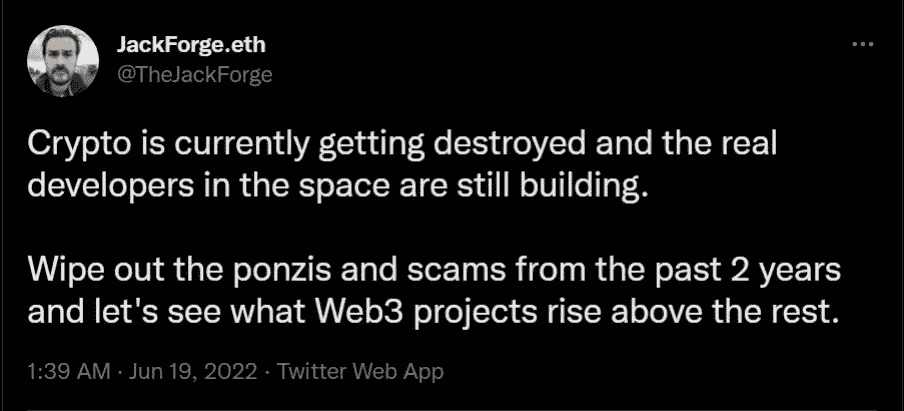
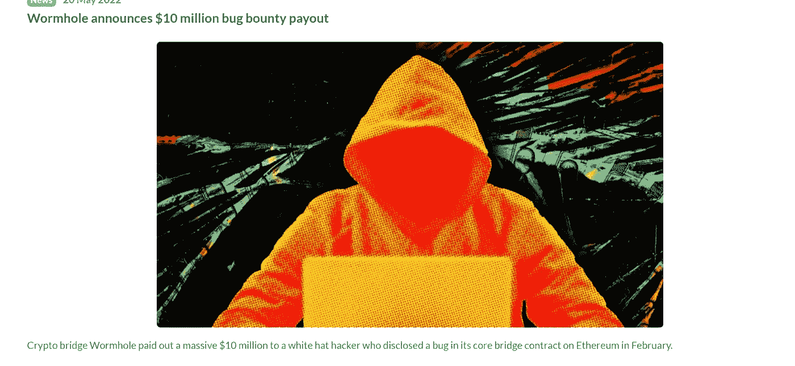

# Web3.0 开发者如何轻松实现六位数

> 原文：<https://medium.com/coinmonks/how-web3-0-developers-make-six-figures-easy-ac493cece115?source=collection_archive---------54----------------------->

*   这些年来，互联网呈指数级增长，产生了不同的版本。
*   Web 1.0 是三者中的第一个，从 1989 年到 2005 年使用。
*   Web 2.0 是在 1.0 之后出现的，它是当前的版本。
*   未来是 Web 3.0，它甚至在 2.0 中也有很多应用。

毫无疑问，正如我们所说，Web3.0 是互联网的未来。互联网从 Web1 开始，然后过渡到 Web2，现在 Web3 开始接管。众所周知，互联网正在发生变化，而 Web3.0 就是这种变化。数以百万计的互联网用户从 web2 上赚了数百万，对你来说还不算太晚，web3 提供了更多的钱，你越早加入，你可能赚的钱就越多。

现在让我们尽可能简单地理解什么是 web3。互联网从 Web1 开始，Web1 只是提供信息，然后人们在互联网上摄取信息，没有办法分享或检索这些信息，你看到的就是你得到的，你看不到的东西，决定“与朋友分享这篇文章”，web 1 不是为此而生的，我知道这很无聊。然后 Web2 诞生了，现在 web2.0 使分享成为可能，社交媒体使这变得非常有效，现在你可以看到你喜欢的东西并与朋友分享，与人交谈，与人互动，这就是 web2 的工作方式，人们找到了通过社交媒体赚钱的方法，广告，有影响力的人，创造者，品牌大使，所有这些都成为了 Web2 用户的赚钱机会，轻松赚钱，我知道对不对， 但所有这些都必须通过平台来完成，你只需要在社交媒体平台上与你的观众互动并赚钱，我们不拥有这些平台，但我们只是必须使用它们，当这些平台不复存在时会发生什么，所以没有平台没有观众没有钱，真是个废物！ 现在不再是了，随着 Web3.0 的出现，现在你可以做你在 web1 和 web2 上做的一切，而不依赖于一个主要的平台，你可以创建你的平台，处于控制之中，自己建立你的受众，现在你可以建立自己的在线社区，有了 web 1 和 web2，你可以租房，有了 Web3，你可以建房，你可以全权负责，一切都在你的控制之中。

# 什么是 Web 1.0？

在互联网爆发的早期，有第一个版本叫做 Web 1.0。1.0 是为公司而非个人使用而创建的。当时只有少数人知道如何操作和使用互联网。大多数大公司雇佣计算机专家来操作互联网，并在全公司范围内实施供员工使用。

在第一个版本中，内容创建者很少，而内容查看者很多。这个版本可能会被新一代人认为是野蛮的，他们现在熟悉我们今天所知道的广泛和易于使用的互联网。当时，网站上的广告是被禁止的，大多数页面是通过 HTML 创建的，只有信息可以被编码。

# 什么是 Web 2.0？

Web 2.0 是在 1.0 基础上的重大进步，改变了世界对互联网的看法。它变得更加广泛，因为它提供了各种信息、用户对用户的交互、内容创建和博客。蒂姆·伯纳斯·李创造了作为网站的万维网，社交媒体应用变得广泛。

随着互联网变得越来越便宜和普遍，你最喜欢的社交媒体网站，如脸书、Youtube、Twitter 等，都是在这个时期推出的。富裕的家庭会投资一根互联网电缆，由于 2.0 新的内容创建能力，内容创建者在娱乐和工作中变得更加普遍。最终，2.0 扩展了，下一个版本变得触手可及。

# 什么是 Web 3.0？

万维网的未来是 Web 3.0。在 2.0 之后，第三个版本将进入战斗机圈，基于智能计算机应用程序，如人工智能。它努力创建一个尽职尽责的数据驱动的界面，并迎合每个使用该平台的个人。这意味着使用区块链，三维图形，元宇宙和语义网。

然而，如果你特别精通技术，你可能知道这样的事情已经存在于当前版本的互联网中，你是对的。正如我们所说的，3.0 的一些特性已经被实现了。随着区块链技术在 Paypal、微软、亚马逊等不同应用和网站上的传播。，我们看到了 3.0 工具包的实现。去中心化是 3.0 的基础，在 3.0 中，每个人都可以以他们认为合适的任何方式利用互联网。

随着 Web3.0 而来的是区块链技术，区块链是 web3.0 的基础，web3.0 中所做的一切都是在区块链上完成的，区块链是支持 web3.0 并使其独一无二的。

# 什么是区块链？

区块链是在计算机网络的节点之间共享的分布式数据库。作为一个数据库，区块链以数字格式存储电子信息。区块链最为人所知的是其在比特币等加密货币系统中的关键作用，即维护安全和分散的交易记录。区块链的创新之处在于，它保证了数据记录的保真度和安全性，并在不需要可信第三方的情况下产生信任。

在冒险进入 Web3.0 之前，你必须有一个可靠且值得信赖的区块链来构建，你需要一个高效的区块链来构建你的 Web3.0 项目。寻找一个好的区块链不是一件容易的事情，所以我冒昧地为你做了所有的艰苦工作，我为你带来了 **CoinEx 智能链**

# 什么是 CoinEx 智能链？

[**CoinEx 智能链(CSC)是一种高效的区块链，为开发者提供了一个高效、低成本的链上环境来运行去中心化的智能合约应用(DApps)和存储数字资产。**](https://www.coinex.org/)

CoinEx 智能链是去中心化和节能的。CSC 使构建您自己的分散式应用程序变得容易。CSC 效率极高，交易费用低。通过 POS consensus 协议，CSC 在几秒钟内生成一个块，支持极高的 TPS，同时将交易费用保持在较低的水平。CSC 还完全兼容以太坊虚拟机(EVM)和协议，同时支持高性能事务。

## CSC 功能

*   去中心化:无需许可，任何人都可以通过 CET 成为验证者。
*   EVM 兼容性:完全兼容以太坊虚拟机(EVM)，这意味着以太坊上几乎所有的 DApps、生态系统组件和工具都可以直接迁移到 CSC 上，或者只需做很小的改动。
*   高性能:600+ TPS，3s 块时间。

## 用 Web3.0 赚钱

作为一名 web3 和区块链开发者的最大优势之一是，你可以随时将你的技能货币化，web3 空间带来了许多巨大的货币优势，这不仅仅是加密货币和 NFT 的优势。我将讨论你在 web3 中赚钱的不同方法，但首先是大人物。这还不是很常见，但只要你有良好的区块链开发技能，那么这是给你的。

*   **区块链开发/ DApp 开发**

Web3 开发/区块链开发本身是目前世界上薪酬最高、最受欢迎的技能之一，只要你有这项技能，你的服务就会一直受欢迎。建立 DeFi/dapp 在经济上总是很有回报的，因为这些应用总是被货币化，你总是有机会轻松赚到数百万。你可以很容易地铸造自己的个人货币与良好的区块链开发技能。言归正传， **CoinEx Smart Chain 为在区块链生态系统中成功构建和部署 DApps 的区块链开发者提供了 100 万美元的支持计划**，他们致力于奖励区块链开发者的技能和出色工作。

[你可以在这里了解更多关于这个项目的信息](/coinmonks/a-blockchain-career-with-csc-multi-million-dollar-supportive-plan-5ddca4516fb1)

*   **区块链安全审计**

**漏洞奖金**基本上是这样一种情况，一家公司或个人付钱给你，让你在他们的智能合同中找到一个安全漏洞，他们为破解智能合同并找到其中的漏洞支付数百万美元，这种特殊技能的报酬范围在 100 万美元到 1000 万美元之间，甚至更多，听起来很疯狂，但从这个角度看，智能合同基本上拥有数百万美元， 从代币到 nft 和其他基于区块链的应用程序，这些都是由智能合约驱动的，如果你可以“黑”这些智能合约，那么你就有机会逃脱数百万的惩罚，所以这些公司有机会失去他们所有的数百万，他们基本上支付给任何可以在他们的智能合约中找到漏洞的人数百万，这几乎是不可能的， 但是，为了使这些智能合同更加安全，他们与随机的区块链开发人员签订合同，试图在他们的系统中找到漏洞，这几乎就像是一场最熟练的区块链开发人员的公开竞赛，“愿最好的开发人员获胜”

到现在为止，我相信你一定想知道他是如何做到的，这很简单**安全审计，**这是区块链开发中最赚钱的技能之一。

*   **加密货币开采**

虽然 web3.0 有许多不同的赚钱方式，但最常见的方式之一是通过挖掘加密货币。加密货币挖掘是在区块链上验证交易并获得数字硬币或代币形式的奖励的过程。毫无疑问，这是现在赚取被动收入最简单的方法之一。我不会深入讨论这个问题，因为我已经写了一篇关于这个问题的文章。

*   **用 Web 3.0 控制你的数据并从中赚钱**

我们日常使用的在线服务积累了大量的个人数据。平均而言，人们每天花近 6 小时 42 分钟上网。然而，如果我们在花费大量时间上网的同时，从自己创造的数据中赚钱，这并不完全是坏事，但不幸的是，今天的情况并非如此。据说，普通用户每年可以从他们的个人数据中获得大约 444 美元，但由于 Web 2.0 的建立，这一现实是遥不可及的。网络巨头已经表明，脸书、谷歌、亚马逊将你的数据视为己有，他们从你的数据中赚取了数十亿(也许数万亿)的利润。

你从你的数据中得到什么？$0.

我们使用这些产品是因为它们是免费的。正如网飞最近的纪录片《社会困境》所阐明的，如果你不为产品付费，你就是产品。大型科技公司，如脸书和谷歌，拥有你在他们平台上创造、浏览和分享的东西。那就是 Web 2.0 的体现。这也是这些公司永远不会改弦更张的核心原因。他们永远不会把数据的所有权归还给合法的所有者，因为他们欠那些要求逐年增长的股东的。这些公司为股东实现这些增长目标的唯一方法就是将你的数据视为自己的数据。

在《社会困境》中，杰伦·拉尼尔指出，在未来，这种趋势可以通过改变财政激励来逆转。Web 3.0 正是这样做的。由于 Web 3.0 建立在区块链之上，其平台由人民管理，因此像 PRIVI 这样的 Web 3.0 协议旨在将数据所有权归还给合法所有者，并使任何人都有可能每天捕获他们的数据并将其货币化。

*   **交易加密货币和代币**

当你是一名熟练的区块链开发者时，你可以用你的技能做任何事情。对某些人来说，交易不是最好的选择，但对你我来说，这可能是我们最好的选择之一

*   交易机器人:自动买卖使用策略来增加利润，你可以简单地使用一个智能合同来创建一个交易机器人，永远不会失去你的钱，它只是一天接一天的支付。
*   套利:利用在多个交易所上市的硬币之间的价格差异。当谈到定价时，加密交易所总是有轻微的 1 美元或几美元的差异，你的交易机器人可以通过在不同的交易所之间进行交易来利用这一点，当在更大的规模上实施时，1 美元的价格差异真的意味着什么。

通过在像 PRIVI 这样的分散式协议上创建一个通用的数字身份，我们的目标是让世界上的任何人都能获得 Web 3.0 带来的财务收益，并利用它们来改善他们的财务状况，并拥有他们的数字身份。Web 3.0 不会到来，它已经到来。

**今天就加入** [**CoinEx 智能链**](https://www.coinex.org/) **，探索 Web3.o 的无限可能，享受高效区块链的优势。**

> [Learn 分发的内容。Block6.tech](https://learn.block6.tech)
> 
> 👉[电报](https://t.me/block6_tech) —新鲜想法
> 
> 👉[推特](https://twitter.com/block6_tech) —最新文章
> 
> 👉 [LinkTr.ee](https://linktr.ee/block6)
> 
> 加入 Coinmonks [电报频道](https://t.me/coincodecap)和 [Youtube 频道](https://www.youtube.com/c/coinmonks/videos)了解加密交易和投资

# 另外，阅读

*   [密码交易机器人](/coinmonks/crypto-trading-bot-c2ffce8acb2a) | [OKEx vs 币安](https://coincodecap.com/okex-vs-binance)
*   [币安 vs FTX](https://coincodecap.com/binance-vs-ftx) | [最佳(SOL)索拉纳钱包](https://coincodecap.com/solana-wallets)
*   [如何在 Uniswap 上交换加密？](https://coincodecap.com/swap-crypto-on-uniswap) | [A-Ads 审查](https://coincodecap.com/a-ads-review)
*   [加密货币储蓄账户](/coinmonks/cryptocurrency-savings-accounts-be3bc0feffbf) | [YoBit 审核](/coinmonks/yobit-review-175464162c62)
*   [Botsfolio vs nap bots vs Mudrex](/coinmonks/botsfolio-vs-napbots-vs-mudrex-c81344970c02)|[gate . io 交流回顾](/coinmonks/gate-io-exchange-review-61bf87b7078f)
*   [CoinFLEX 评论](https://coincodecap.com/coinflex-review) | [AEX 交易所评论](https://coincodecap.com/aex-exchange-review) | [UPbit 评论](https://coincodecap.com/upbit-review)