# 网络 3 媒体是如何接管网飞的？

> 原文：<https://medium.com/coinmonks/how-web3-media-is-taking-over-netflix-1ac352b4e64b?source=collection_archive---------5----------------------->

## 和其他 Web2 媒体公司

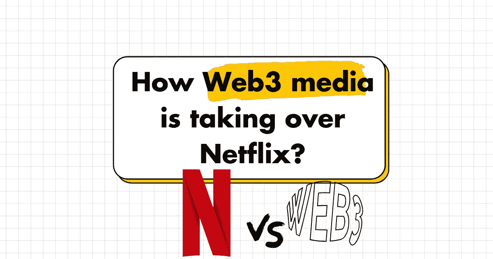

网络 3 媒体——这是不可避免的，它今天就在这里，它改变了游戏规则。

# 1)必然性

我们正处于文化生产的高峰期。2021 年，Spotify 每天发布大约 6 万首新歌，高于前一年的 4 万首。

> 该平台目前有超过 8200 万首歌曲，年底有 360 万个播客。

仅在蒸汽上，2021 年就有 11，773 款游戏发布(每天大约 32 款新游戏)，高于 2017 年的 6，463 款。该平台现在的图书馆里有超过 69，000 个游戏。

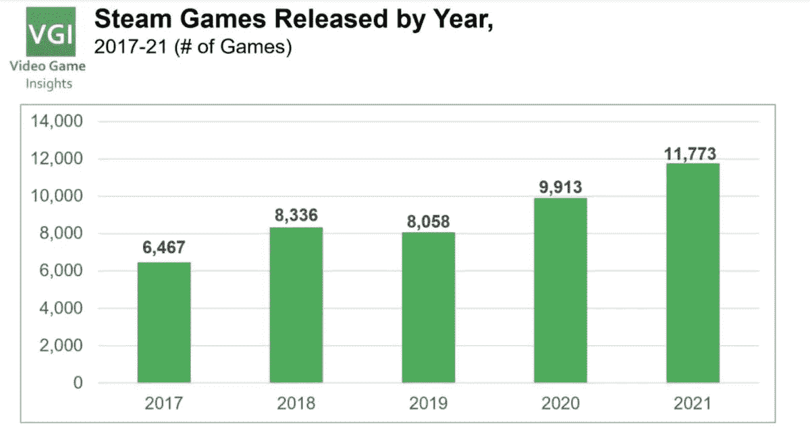

在美国中，2021 年有 559 部新的原创剧本系列在广播和流媒体平台上发布，是 2012 年的两倍多。

在流媒体目录中，您可以找到来自世界各地的近 16 万部电影和 3 万部电视节目

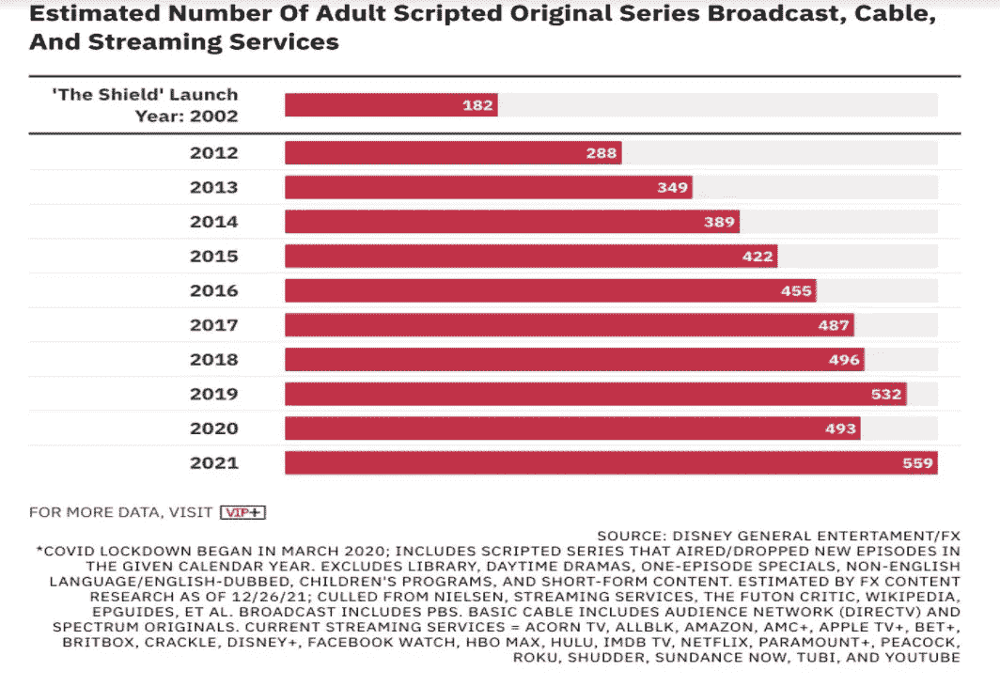

**在如此众多的艺术家中，有 800 万艺术家高度集中在 Spotify 平台上，但 0.7%的艺术家占到该平台上艺术家收入的 90%**

98%的蒸汽游戏来自独立的工作室，而 78%的销量超过 500 部的游戏来自顶级的主要出版商

网飞发布了前 10 名的收视指标(其他彩带则完全没有)，但即便是在榜首，也出现了幂律。最受关注的节目可能比 10 号节目受欢迎 5 到 63 倍。

*排名越靠后，差距可能越大*

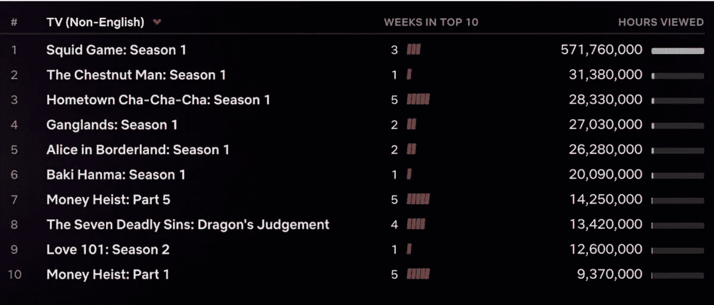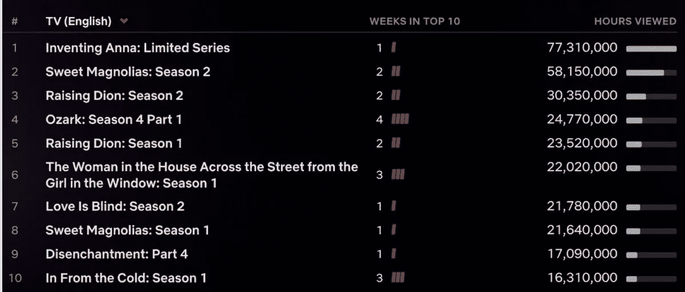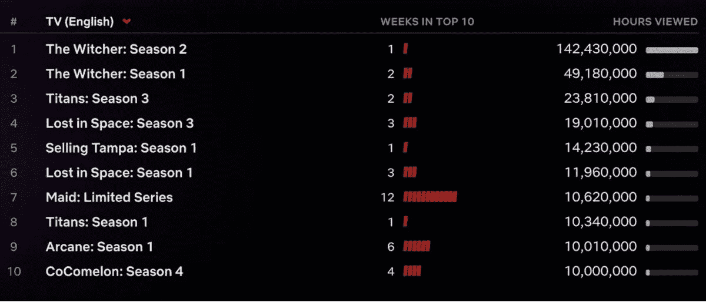

**Web2 颠覆了统治了几十年的商业模式:** 专辑&游戏销售，电影票(这使得电影公司可以制作风险更高的电影，具有上升的潜力)以及

通过线性广告和订阅赚钱的网络和有线电视都被无限的数字接入所取代。

从长远来看，这对创意人才不利。

## 在游戏方面

这让争夺印度变得很困难。

就音乐和视频而言，流媒体给即使是最有才华的艺术家也能赚的钱设置了一个人工上限。

尽管彩带公司为顶级人才支付了巨额美元(如 Spotify 网站上的 JJ·艾布拉姆斯、珊达·瑞姆斯、乔·罗根)，但新兴人才很难从他们创造的价值中获得提升。

> 鱿鱼游戏，网飞历史上最受关注的节目，仅花了 2140 万美元就被超过 1 . 42 亿个家庭购买了

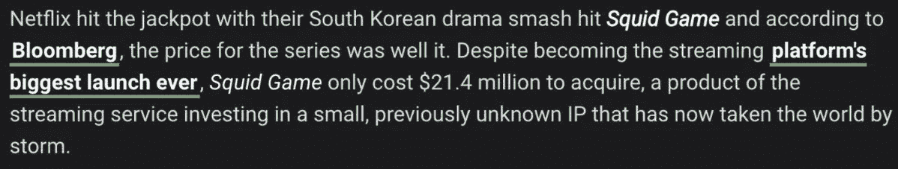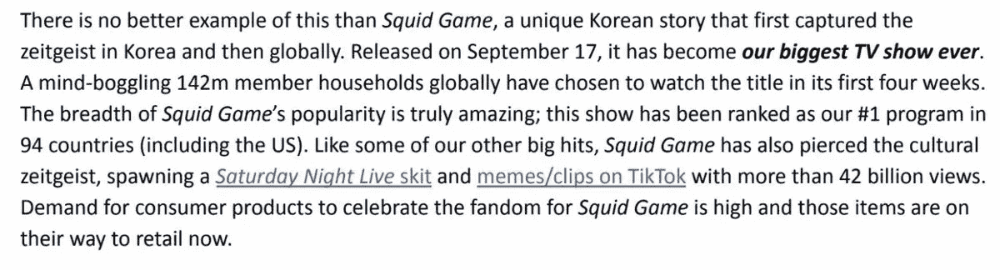

> 在网络 2 中没有机制允许艺术家捕捉他们为平台创造的优势。

Web3 正在改变这种情况——主要是通过完全消除平台的概念&围绕邀请社区进行交叉组合的媒体原子单元重组互联网。

# 2)今天有什么:资助、分享和分发创造性工作的新模式:

音乐 NFTs 允许粉丝资助和分享艺术家成功的好处
NFTs 作为游戏和 IP 工作室 DAOs
艺术家探索社区建设新模式的基石

**在音乐 NFT 空间，许多市场正在发展:** ——音乐版税投资(例如 [@join_royal](https://twitter.com/join_royal) )

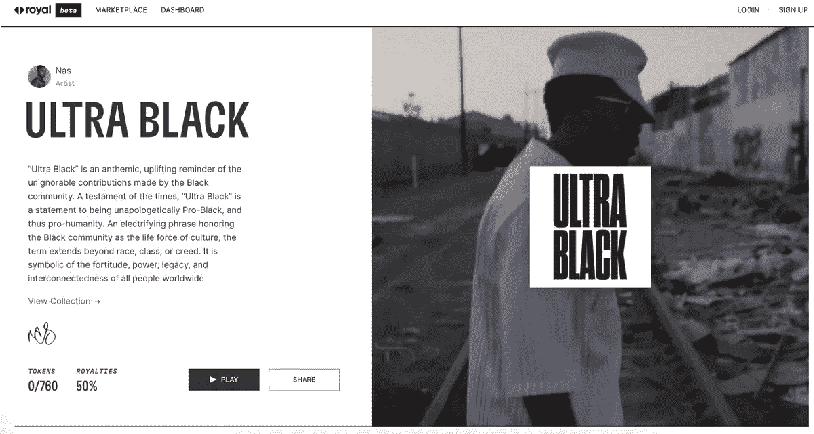

*   带有 NFTs 的歌曲和专辑所有权(例如 [@soundxy](https://twitter.com/soundxyz_) z [_](https://twitter.com/soundxyz_) )

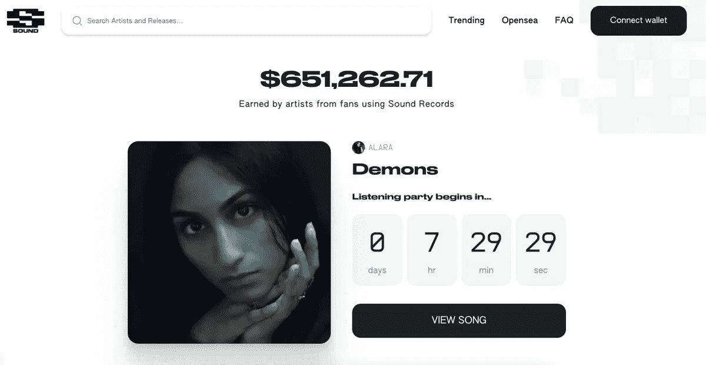

*   -链上音乐创作(例如 [@arpeggi_labs](https://twitter.com/arpeggi_labs) )

*   -音乐众筹(例如， [@viamirror](https://twitter.com/viamirror) 上的项目，如 [@goodkarmadao](https://twitter.com/goodkarmadao) 唱片公司)

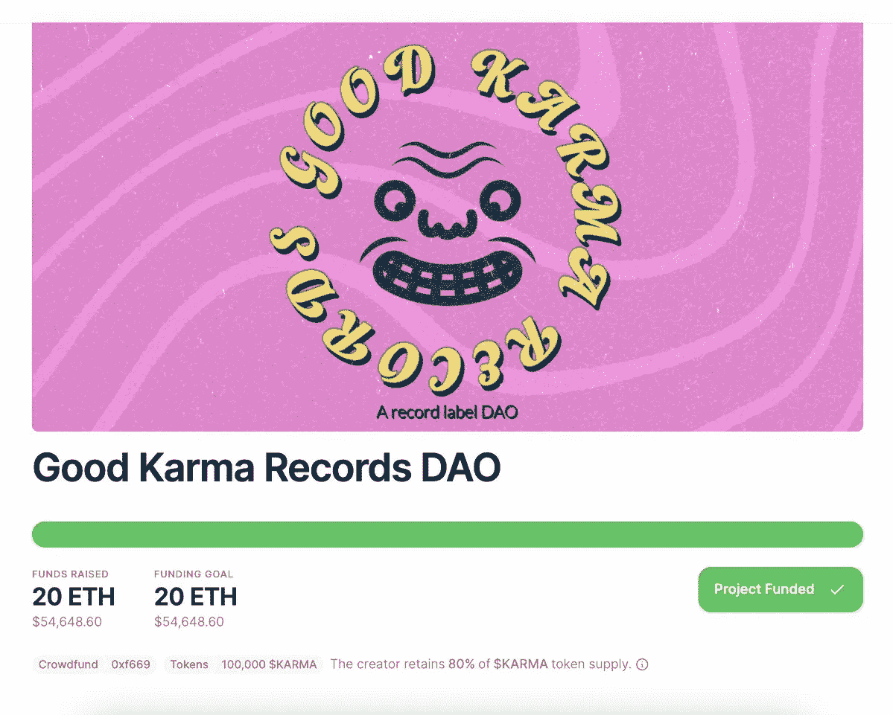

*自 2020 年以来，近 170 万音乐 NFT 的总销售额超过 1.46 亿美元*(h/t[@ water _ and _ music](https://twitter.com/water_and_music)获取数据)。甚至这个截图也代表了艺术家的方方面面:像 [@CallMeLatasha](https://twitter.com/CallMeLatasha) 和 [@Verite](https://twitter.com/Verite) 这样的独立艺术家，到像 [@SnoopDogg](https://twitter.com/SnoopDogg) 这样的传奇人物，他们正在建立一个分散的唱片公司。

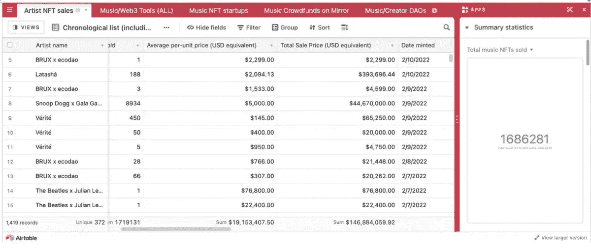

我们也开始看到视觉 NFT 项目尝试创造全新的媒体形式。许多最令人兴奋的例子是团队利用现有的 NFT 项目并产生&鼓励扩大整个生态系统的衍生作品。

**一些例子:**

*   @jenkinsthevalet 正在创作一部小说&分散的好莱坞工作室，源自一只无聊的猿猴 NFT

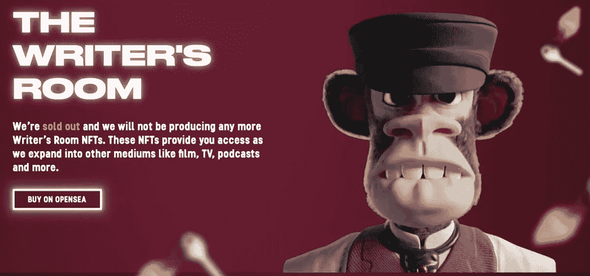

- [@nounsdao](https://twitter.com/nounsdao) 正在使用治理来扩散超级碗广告中的名词& IRL

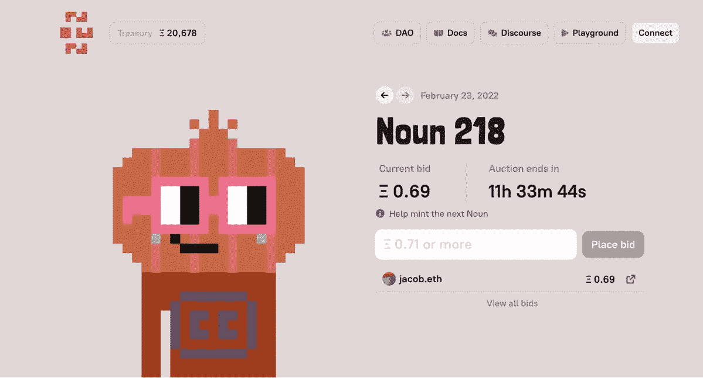

*   像[@ Treasure _ DAO](https://twitter.com/Treasure_DAO)&[@ hyperloot _](https://twitter.com/hyperloot_)这样的团队正在使用 [@dhof](https://twitter.com/dhof) 的战利品**NFT 作为游戏**的积木

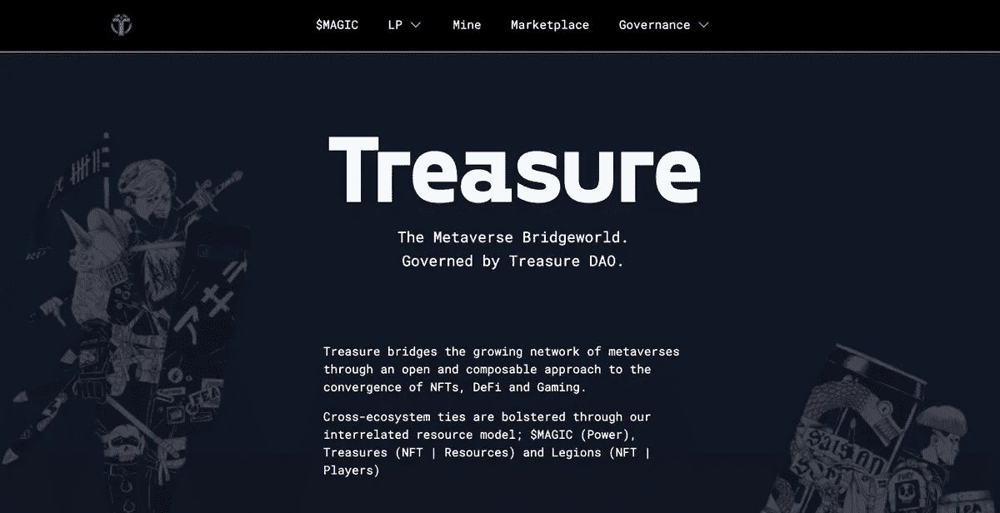

正如克里斯·迪克森指出的，这些项目带来的不仅仅是创作自由；他们使艺术家们从传统的公司结构中完全解放出来。

> 代币是自我营销；股东，而不是公司，与项目的成功有利害关系。

## 传统媒体在兜圈子

在传统媒体领域，大型公司投资游戏和电影项目，但这些项目只占公司收入的很小一部分。

《大侦探皮卡丘》也许是票房上的成功——但是它只占时代华纳总收入的 1%

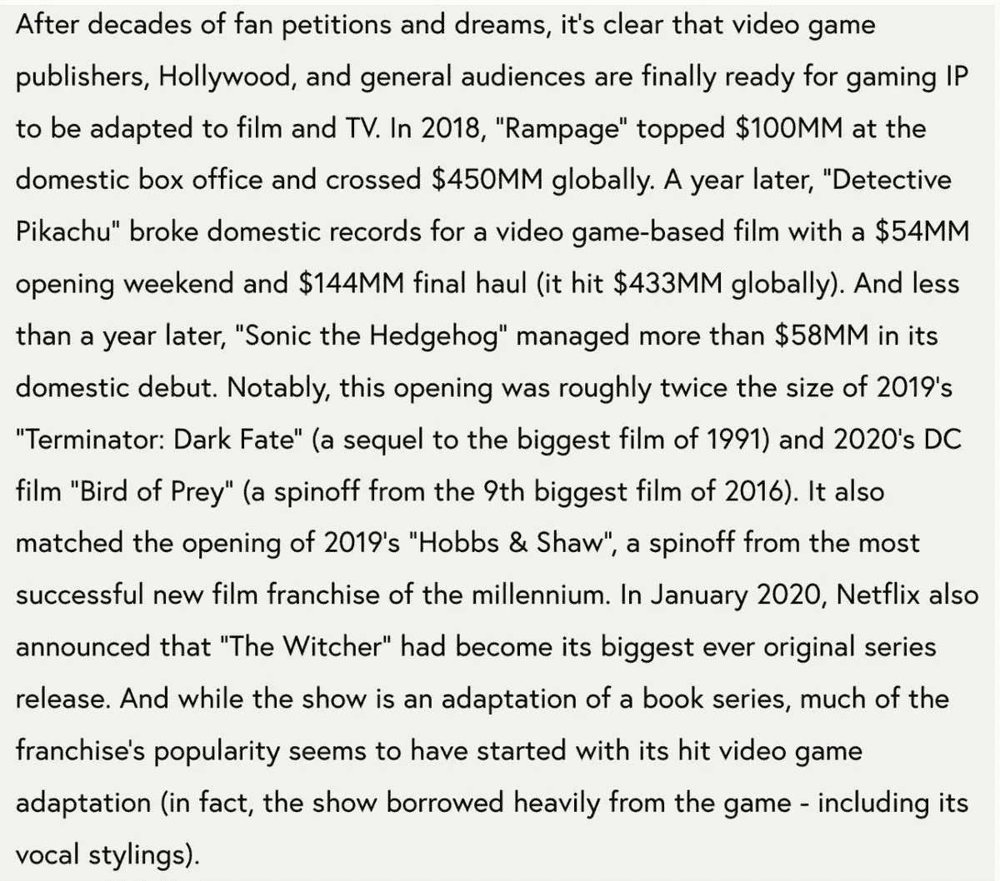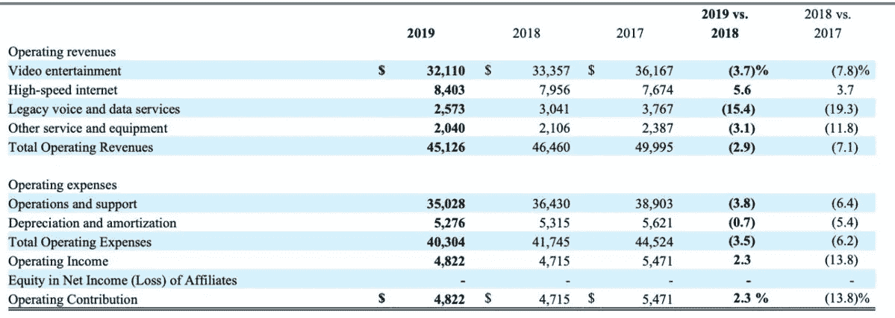

> 传统媒体陷入了死气沉沉的续集怪圈，因为作品本身对他们的公司底线根本没有意义。
> 
> web3 的无许可和可组合的特性承诺释放一波在 Web2 中不可能的创造自由和经济上升。

# 3)我们要去哪里

我们正处于媒体创作、发行和拥有方式的彻底转变的开端。

值得指出的是，音乐 NFTs &更多可组合的视觉 NFT 正处于它们发展的不同阶段，在这两个领域都需要做一些事情。

推出音乐 NFT 的艺术家通常要么是未签约的独立艺人(&管理他们的职业生涯)，要么是拥有自己主人的明星(例如 Nas，他非常有名，可以保证接触和发行)。他们的成功将是鼓励更多艺术家在 web3 中创作音乐的一个重要因素。

**音乐中的一些必备功能:** -更多的唱片公司以 DAOs
的形式构建-音乐发现的非 web2 渠道
-标准化音乐元数据以获得版税&NFT 之间的互操作性/可组合性([@ _ Garrett Hughes](https://twitter.com/_garretthughes)[@ JZ stern](https://twitter.com/jzstern)&更多正在做伟大工作的人[这里](https://mintsongs.notion.site/mintsongs/A-better-music-token-metadata-standard-260506f3a5b342c6b0c893892f37e711)通过建立音乐元数据标准

在游戏和娱乐方面，团队应该更加努力地坚持进入物理世界。@nounsdao 已经在这方面做得很好了——不过，通过利用可比较性的力量，我们可以变得更奇怪。

几个月前， [@FEhrsam](https://twitter.com/FEhrsam) 发表了 Virgil Abloh 组织一个 web3 艺术家集体的早期计划。这张照片给我留下了深刻的印象。
可以说，迄今为止在体现这一观察方面做得最好的团队是迪士尼——但这很快就会改变

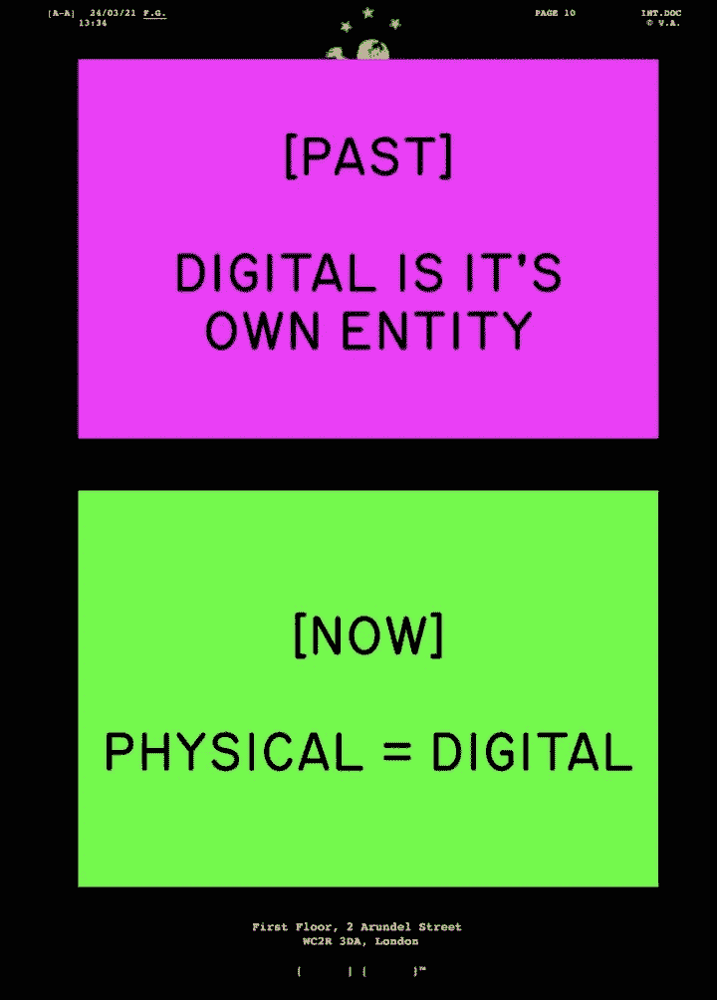

迪士尼之所以成为一个标志性品牌，是因为他们认识到(自 20 世纪 50 年代迪士尼乐园开业以来)，人们有亲身体验事物的天然倾向。

> 但是我们已经超越了迪士尼，因为我们有技术来创造分散的品牌&知识产权。

# 结论

未来将是 web 3-native collections，它鼓励衍生品和跨项目组合，并允许艺术家、收藏家和策展人共享所有权。IRL 也将是其中的一个重要组成部分。

# 👇Web3 是如何颠覆媒体行业的？

> 👋**在[媒体](/@pooriaarab)—[LinkedIn](https://www.instagram.com/pooria.arab/)—[Twitter](https://twitter.com/pooria_arab)—[insta gram](https://www.instagram.com/pooria.arab/)—[抖音](https://www.tiktok.com/@pooria.arab)**
> 
> 更多关于 Web3，Crypto，NFTs，DeFi 等的好东西…
> 
> 点击获取 NFT 发布战略

**参考文献**

*   @Virtualelena 来自 Twitter 的帖子
*   WTF 是 Web3？来自 Digiday
*   从 TechCrunch 手中拯救独立新闻业