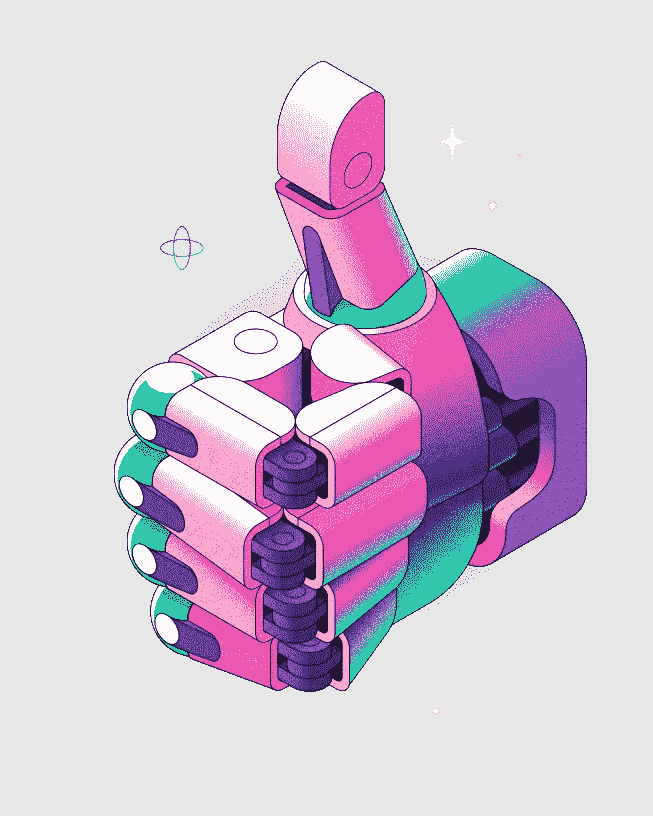

# 你应该如何&何时拿出你的秘密利润？

> 原文：<https://medium.com/coinmonks/how-when-should-you-take-out-your-crypto-profit-cc1bb82eab96?source=collection_archive---------24----------------------->

要点:
-也许没有把握市场时机的神奇方法，但在你拿出秘密利润之前，你可以用一些技巧来最大化你的收益。
-就长期投资而言，HODLing 和 DCA 融资方法是一种安全的投资方式。
——找到适合你投资组合梦想的投资策略，无论是一次提升一小部分，还是将你的收入保持在稳定的收益中。不要让 FOMO 或 FUD 抓住你。
-在本新闻简报中，我们深入探讨了在销售您的密码时不要忘记的各种因素，以及您可以在销售后最大化您的密码收益的独特方法。
考虑删除你的加密收入，但不确定何时或如何做到这一点？不想害怕。我们已经给你准备好了。

随着加密市场的成熟，即使是有经验的买家也希望有一种方法来识别最佳购买时间和最佳促销时间。

虽然没有把握市场时机的最佳方法和系统，但在你的投资冒险中，你可以记住并采纳各种建议和策略。坚持学习，更近似地分析你在推销你的密码时必须记住的不同因素，以及你可以在销售后获得最大收益的方法。

# 你应该什么时候取出你的秘密利润？

首先最重要的是，没有一定会赢的公式来把握市场时机，这就是为什么我们会不断建议 HODL 用 DCA 投资方法进行长期投资。如果你试图提升你的密码锁定收入，做你自己的尽职调查，理解硬币的长期成本。有时，主要是如果你相信一枚硬币，你可能会想起霍德林。

此外，我们支持关注主要收益。尽管如此，完美地把握市场时机是不可能的，我们也不希望每次都遭遇国内抛售，从而大幅增加我们的投资组合。

相反，开始在 30%的增量品种中拿一部分你的收益。与预期 50%或 100%的增量收益相反，专注于较小的增长将确保您不会陷入令人沮丧的 20%至 40%的调整，这可能会打击意想不到的移动加密市场。

专注于最有效收益的任何其他优势是，你可以通过将这些利润转移到不同的硬币来复合这些收益，这可能只是开始利率运行。通过遵循这种训练有素的方法，坚实的收益将会给你的投资组合带来巨大的标准收益。

最后，我们建议，当你有其他投资机会，你已经 DYOR，真的想定位你的现金，最有效的推广。现在重要的是不要成为 FOMO(担心错过)或 FUD(担心、不确定和怀疑)的牺牲品。

# 如何取出并最大化您的加密利润？

现在你有了一个基本的理解，而你应该拿出你的秘密利润。让我们直接讨论如何最大化您的加密收益。下面，我们讲 4 个你可以记住的策略。

1 .一次卖出一小部分
为了取出并最大化你的收益，一次卖出 5-10 %,这取决于你在那个精确的密码中持有多少。如果密码获得了超过 30%的收益，记得每周提升一小部分。

因为加密市场是不稳定的，所以根据市场天气来定位你的促销订单是非常有用的。我们不建议在一次交易中推广您的所有股份(除非它达到了您的目标费用，并且您对推广所有股份感到满意)，因为您可能会遗漏未来的能力利润，或者您可能仍然希望将您的一部分股份保留给 HODL。

**2。把你的利润保持在稳定的状态**
不再积极取出你的秘密收入后做什么？或者密码已经达到你的目标费用，而你正在寻求把钱花在别的东西上？别忘了把它们放在马厩里。通过这种方式，你可以利用它们在 DeFi 任务中提供流动性。此外，你可以通过将你的收益分配给稳定的收入来留在加密市场，这在不断变化的市场环境中可能是不被鼓励的。

除此之外，你可以毫不费力地购买不同的稳定硬币，因为你不应该再等待几天来转移菲亚特。

你也可以在这里搜索更多关于 stablecoins 的信息，他们的祝福以及如何购买最受欢迎的 stablecoins。

**3。买卖 dip**
你也可以不要忘记战略交易技术，以了解和最大限度地提高你看到的长期费用的加密利润。举个例子，当一个特定的密码正在上升时，你可以回忆起卖掉它的一部分，当价格下降时，用利润去购买更多的。

**4。下注并赚取利息**
您还可以通过在币安赚上下注或选择币安上的其他基金产品(包括下注)来最大化您的收益。为了更好地研究普通加密投资，请在这里学习我们的文章。

# 通过投资新硬币获利

一些经验丰富的投资者使用的一种策略是投资新硬币或现代 ico(初始硬币服务)，以获得更高的好评率。买家将首先以最重要的现金持有他们投资组合的很大一部分，包括比特币(BTC)、以太币(ETH)或莱特币(LTC)。当他们利用最重要的硬币中的初步资金时，他们就用一部分收入来购买更具革命性的硬币。

例如，交易商可能以 1.5 BTC 的价格出售 1 BTC，并将一小部分利润用于投资，其中包括在新硬币或 ICO 中投资 0.2 BTC，他们已经研究并同意这可能提供出色的回报。

这种方法可能适合那些试图用基本硬币建立投资组合的人，但他们希望将投资组合中的一小部分投资于他们认为具有不可思议能力的新硬币和累进硬币。

# 立即开始您的加密投资之旅:

[edc.edcorp.finance/pre-sale](https://l.facebook.com/l.php?u=http%3A%2F%2Fedc.edcorp.finance%2Fpre-sale%3Ffbclid%3DIwAR3RkoKrqdVqC-vfWK7kggqbvIV8F12BTP7uSklsuf4so2sbmSuoALlNamw&h=AT3weDSBhrQyxZWOX4XV6RJTdcKV3pE9lf1Rwu_KYPeb6q3BpoNFZED5Ss1C8svM3FuQb1hXYLquJa8vwtCskTemyz93ouuZndwax9WbObQ8MP33LxiVe5vgDwmWhZnOD_WE4w)

不久，EDCoin 将推出从加密货币中赚取利润的赌注。您可以通过以下方式关注新闻:

网址:[https://EDC . ed corp . finance](https://edc.edcorp.finance/?fbclid=IwAR0gElR13rWFrkk5sTv5jCmeiFczkHw18we8wF8h2hCFhvY5Ct5qGryg8Xc)

推特:【https://twitter.com/edcorp_finance 

https://www.facebook.com/edcorp.finance:[脸书](https://www.facebook.com/edcorp.finance/?__cft__[0]=AZVBmlZxXD9ugrrKbzarnxEpD-1d4L33v5iKdvYjlBgqoAwAkgRKtoTURsyiz605xngyCvxSiccQ-Eb4X45UbtEzoO-x2v_NJMhiW52SPzY4wv_xHfikuTmqFwLB48XgSPM293DFg3NmCr4eHNSQMMaDQyTE9IvT1cZ1uf2lMUFOlw&__tn__=kK-R)

电报:[https://t.me/edcoinofficials](https://t.me/edcoinofficials?fbclid=IwAR0STQHO46T442dY5u5VCRTPdAl2tN9nwvFkdG13Qb0pC1ZlIdIni7y9xlc)

insta gram:[https://www.instagram.com/edcoin.finance](https://www.instagram.com/edcoin.finance?fbclid=IwAR10cFxl9ZMvEVew0W1b7c0DUyPEdhSf5dEdCNCmAXRJNQwvcxJ_MBnBn34)

还有我们的新方式 block dit:[https://bit.ly/Blockdit_EDCoin](https://bit.ly/Blockdit_EDCoin?fbclid=IwAR0STQHO46T442dY5u5VCRTPdAl2tN9nwvFkdG13Qb0pC1ZlIdIni7y9xlc)

*本文仅为教育目的而写。这不是以任何方式邀请投资。*

> *加入 Coinmonks* [*电报频道*](https://t.me/coincodecap) *和* [*Youtube 频道*](https://www.youtube.com/c/coinmonks/videos) *了解加密交易和投资*

# 另外，阅读

*   [Bookmap 评论](https://coincodecap.com/bookmap-review-2021-best-trading-software) | [美国 5 大最佳加密交易所](https://coincodecap.com/crypto-exchange-usa)
*   最佳加密[硬件钱包](/coinmonks/hardware-wallets-dfa1211730c6) | [Bitbns 评论](/coinmonks/bitbns-review-38256a07e161)
*   [新加坡十大最佳加密交易所](https://coincodecap.com/crypto-exchange-in-singapore) | [购买 AXS](https://coincodecap.com/buy-axs-token)
*   [红狗赌场评论](https://coincodecap.com/red-dog-casino-review) | [Swyftx 评论](https://coincodecap.com/swyftx-review) | [CoinGate 评论](https://coincodecap.com/coingate-review)
*   [投资印度的最佳密码](https://coincodecap.com/best-crypto-to-invest-in-india-in-2021)|[WazirX P2P](https://coincodecap.com/wazirx-p2p)|[Hi Dollar Review](https://coincodecap.com/hi-dollar-review)