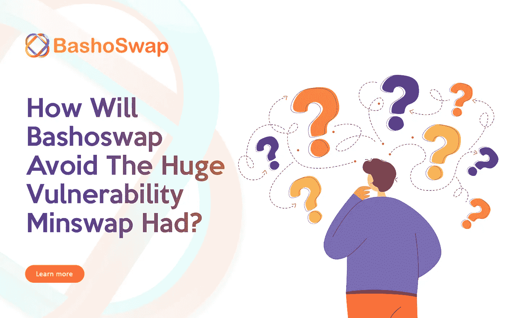
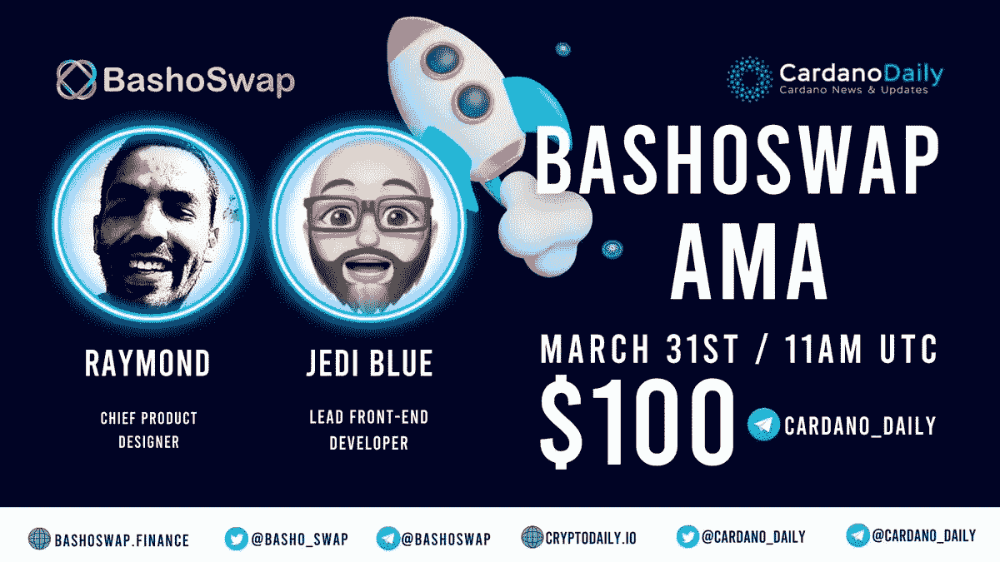

# Bashoswap 将如何避免 Minswap 曾有的巨大漏洞？

> 原文：<https://medium.com/coinmonks/how-will-bashoswap-avoid-the-huge-vulnerability-minswap-had-2555c330aecb?source=collection_archive---------13----------------------->

在检查几天前开源的 [Minswap 智能合约](https://twitter.com/MinswapDEX/status/1506260223572549633?ref_src=twsrc%5Etfw%7Ctwcamp%5Etweetembed%7Ctwterm%5E1506260223572549633%7Ctwgr%5E%7Ctwcon%5Es1_c10&ref_url=https%3A%2F%2Fbeincrypto.com%2Fcardano-based-minswap-dex-exits-maintenance-mode-patching-critical-vulnerability%2F)时，WingRiders 团队注意到了一些 bug。

多个 bug 很关键。WingRiders 团队在 UTC 时间 3 月 21 日晚上与 MinSwap 团队取得了联系，并向他们通报了关键漏洞。

根据这份报告，这个漏洞可能是流动性池令牌的一个缺陷，攻击者可以破坏它并带走资金。

Bashoswap 开发团队一直在密切关注这一情况，下面是我们对这个 bug 的看法以及我们已经采取的预防措施。

**核心问题**

让我们先来看看问题的根源是什么**[**[**source**](https://www.tweag.io/blog/2022-03-25-minswap-lp-vulnerability/)**】**具体来说，他们有一个铸造策略，允许在铸造该铸造策略中具有特定令牌名称的一个令牌时进行验证，*** *忽略**** 可以铸造其他令牌。

当你忽略脚本不是***做*** 的事情，而是***验证*** 的动作时，这是一个容易犯的错误。

我们如何抓住它？

这包括两个部分。

第一部分是 Bashoswap 开发团队如何使用 Cardano 设计协议，我们本质上将协议定义为一组可能被允许的事务/案例，这样，与所讨论的协议相关的要验证的事务子集与案例完全匹配。

这将防止上述问题，因为允许创建特定的 *`AssetClass`* 不允许创建具有相同 *`CurrencySymbol`* 的***和*** 另一个 *`AssetClass`* 。

有了这样的规范，我们很容易进行测试，以确保我们的具体实现符合规范。

第二部分是我们可以自由地使用 Plutarch 进行高级抽象。几乎所有现在使用的脚本都有一个问题，那就是很难进行抽象来防止上述的错误。核心原因是 *`plutus-tx`* 、Haskell 到非类型化普路托斯核心(UPLC)编译器，必须逐字翻译代码，这意味着抽象是*** *而不是零成本**** 。

以状态机 API 为例。不管它是否是一个 ***good*** 抽象，没有人可以使用它，因为使用它制作的脚本太大了，甚至无法在一个事务中 ***fit*** 。

然后是可读性和抽象性与实际效率之间的权衡。

但是，使用 Plutarch，我们可以设计*** *零成本**** 抽象(或者在某些情况下几乎零成本)。

其原因更加复杂，尽管它源于这样一个事实，即 Plutarch 实际上是嵌入在 Haskell 中的领域特定语言。

关注 Bashoswap medium 博客，了解最新的开发进展。

[巴肖斯华普第二届 AMA 将于世界协调时明天上午 11 点在卡尔达诺日报](https://twitter.com/cardano_daily/status/1508823545672966144?s=20&t=-rqfYi3kD6BRUaL0oE1hkg)举行。

私人销售白名单明天结束，钱包预订将于 2022 年 4 月 1 日开始([加入白名单](https://whitelist.bashoswap.finance/))。

# 📍跟上 Bashoswap💥🚀

- [网站](https://bashoswap.finance/)

- [电报社区](https://t.me/bashoswap)

- [推特](https://twitter.com/basho_swap)

——[不和](https://discord.gg/FRKD9V8MBa)

- [培养基](https://bashoswap.medium.com/)

- [Reddit](https://www.reddit.com/r/bashoswap/)

*   [白皮书](https://docs.bashoswap.finance/whitepaper)

> 加入 Coinmonks [电报频道](https://t.me/coincodecap)和 [Youtube 频道](https://www.youtube.com/c/coinmonks/videos)了解加密交易和投资

# 另外，阅读

*   [如何在印度购买比特币？](/coinmonks/buy-bitcoin-in-india-feb50ddfef94) | [瓦济克斯审查](/coinmonks/wazirx-review-5c811b074f5b)
*   [隐翅虫替代品](/coinmonks/cryptohopper-alternatives-d67287b16d27) | [HitBTC 审查](/coinmonks/hitbtc-review-c5143c5d53c2)
*   [CBET 点评](https://coincodecap.com/cbet-casino-review) | [库币 vs 比特币基地](https://coincodecap.com/kucoin-vs-coinbase)
*   [折叠 App 审核](https://coincodecap.com/fold-app-review) | [Kucoin 交易机器人](/coinmonks/kucoin-trading-bot-automate-your-trades-8cf0ca2138e0) | [Probit 审核](https://coincodecap.com/probit-review)
*   [如何匿名购买比特币](https://coincodecap.com/buy-bitcoin-anonymously) | [比特币现金钱包](https://coincodecap.com/bitcoin-cash-wallets)