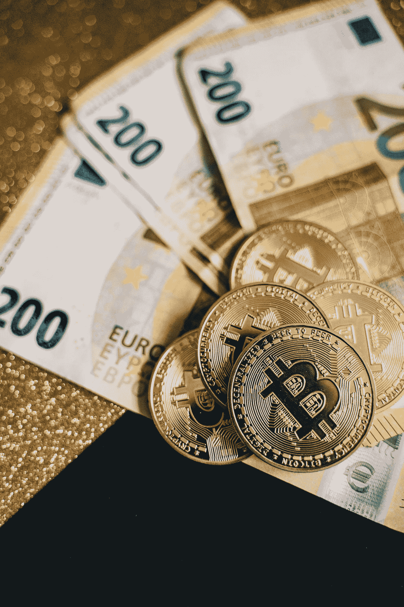

# 未来几年，加密货币将如何影响我们的世界？

> 原文：<https://medium.com/coinmonks/how-will-cryptocurrency-affect-our-world-in-the-coming-years-58b9762ed514?source=collection_archive---------23----------------------->

2009 年，我在耶稣基督后期圣徒教会的 IT 部门工作。除了帮助组成官僚机构的团队建立网站、进行营销、试图阻止黑客以及其他企业技术事务，我们还花了大量时间谈论技术领域的新内容。在某个时候，经过几个月的时间，我注意到我们的水冷却器聊天开始严重倾向于一些新的和革命性的东西，一些对这些主要以技术为导向的游戏类型有更高层次吸引力的东西。这个突破是一个叫做比特币的东西。

# 比特币:技术还是投资机会？

比特币这一新事物的奇怪之处在于，它具有很高的技术性，但也与金融和投资高度重叠。你会听到关于对等网络概念、如何编程编码区块链的讨论，以及关于法定货币和市场资本化的讨论。

在技术方面，与比特币相关的概念甚至很难被那些自诩为极客的人下载。我记得听到一个 devops 的家伙，一个早期采用者和加密的大力倡导者，从我们的一个堆栈团队试图解释为什么比特币对开发者有价值。谈话很快就没了结果。

# 也许我应该跳进去

我一直认为自己有点冒险。事实上，在比特币出现的几年前，我曾听我的一位开发伙伴吹嘘他如何在 JDS 的 Uniphase(我仍然不知道他们做了什么)股票上大获成功。在经历了几周对错失良机的恐惧后，我开了一个电子交易账户，存了 1000 美元，买了一堆那种股票。

第二天上班的时候，我告诉这个家伙我最后是如何进电梯和他一起乘电梯上去的。他告诉我，在看到一些对该公司不利的消息后，他在前一天卖掉了他在 JDS 的股票。果然，在接下来的几个月里，我忍无可忍，最终不仅损失了我投资的 1000 美元，还不得不向 eTrade 支付了大约 50 美元的管理费，因为我的投资组合太小了。

尽管我之前投资失误，但我认为我可以购买价值 1000 美元的比特币，当时每枚价值约 1/10 美分。如果我那样做了，我的投资现在已经变成数亿美元了。

但是我没买。不过，这并不是因为损失区区 1000 美元的风险。

我的第一个犹豫是，这种新形式的货币，一种数字，网络货币，似乎很有可能成为庞氏骗局，类似连锁信计划，或者更糟的是，尤其是困扰犹他州的数百种欺诈性传销之一。我无法想象如果我“购买”比特币，我实际上会“购买”什么。

整个想法让人觉得有点可疑。这不仅仅是一个心怀恶意的潜在客户错过了许多其他人受益的机会的借口。

投资比特币的另一个障碍是设立钱包。我问一位同事购买比特币的流程是什么，事情立刻变得复杂起来。

“所以，有个东西叫钱包。这是一个你购买的设备，允许你存储你的加密私钥。如果你丢失了你的私人钥匙，你所有的钱都会随之丢失……”

对我来说这就够了。这听起来太复杂了，对于一个不是死硬加密的人来说，他致力于保护一系列秘密数字，一个我肯定会丢失的密码。几乎所有我写在便利贴上的东西都在一天之内消失了。快速浏览一下私钥的样子，让我确信我也不会记住这种“密码”。

我进去之前就出来了。

但在那次经历后的十几年里，我的想法正式改变了。事实上，我非常确定加密货币将在未来几年的全球经济以及使用软件和编程来创建商店和价值交换中发挥重要作用，以至于我在我的[技术网站](https://thetechnologyvault.com)上专门开辟了一整块区域来解释与加密货币相关的[话题。](https://thetechnologyvault.com/cryptocurrency/)

这一次，我相信世界上很大一部分地区将采用加密货币来取代现有的大多数支付和财富保存系统。这次我不打算被排除在外。

# 重新审视加密货币

任何对世界上正在发生的事情稍加关注的人都不得不承认，我们的社会已经不是十年前的样子了。我们中的许多人已经学会睁开眼睛，因为我们的政府已经放弃了自由、自由企业和个人良知的原则，转而支持虚伪的封锁、腐败的挥霍以及我们这些普通人中的精英阶层的其他形式的滥用。

对于那些足够了解阴谋实际上正在社会中发生的人来说，我们清楚地看到，银行和金融机构与渴望权力的政府官员合作，对我们的所作所为有太多的控制。我想到的一个快速的例子是加拿大卡车运输队，那里的银行账户(保存着这些人自己挣来的和存下来的钱)[被冻结](https://www.bloomberg.com/news/articles/2022-02-17/truckers-defy-trudeau-crackdown-as-canada-looks-to-freeze-assets)，几乎瘫痪了那些合法行使他们确信拥有的权利的人。

政府和银行不应该这么做。

他们也不应该能够通过印更多的钱，任意改变“利率”，或做我们看到的来自美联储、美国决策者和全球同谋的许多其他滥用权力的行为，来吸走普通人积累的财富。

加密货币的出现让世界各国政府感到了威胁，加密货币瞄准了他们的权威，剥夺了他们的很多权力，包括他们操纵货币及其价值和任何给定点的权力。

# 法定货币注定会失败

我在其他地方写过一个大多数人在考虑他们的钱如何运作(或不运作)时容易忽视的话题。[金钱和货币并不完全等同](https://prosperopedia.com/money-versus-currency/)。在过去的几十年里，我们在美国使用的货币，因为它已经完全脱离了金本位，正在失去它的价值。正如所有其他只是印刷纸张的货币一样，与任何具有真实内在价值的东西无关，美元最终将变得一文不值。见鬼，如果通货膨胀、战争、供应链中断和其他灾难的速度保持不变，这甚至可能在今年发生。

# 普通人的加密货币

普通人在理解密码如何工作时面临着所有的挑战，更不用说有足够的知识来选择“正确的”一个(或多个)，密码承诺的自由将如何到达大众手中。

我相信，在未来的几个月和几年里，这个问题会迎刃而解。事情将会到位，让人们交易密码就像我们支付食品杂货一样方便。

# 投资者的加密货币

另一方面，对于那些希望通过对加密有所了解而获得成功的人来说，根据我一年左右学习加密的经验，我有以下建议。

成功的加密货币(从而增值)将在全球经济中有特定的有用用途。例如，金融机构之间支付通信的 ISO 20022 标准将于 2022 年 11 月开始推出。符合该标准的加密货币(包括 XRP、XLM、XDC、Algo、IOTA 和 USDC)将基于该标准的推出而升值。

由内在有价值的资产(黄金、白银和其他贵金属)支持的加密货币比那些没有有价值的东西支持的加密货币更有价值。美元及其消亡的案例是货币及其独立于实际、有形、真实世界价值之外的能力的一个例证。

# 比特币呢？

回到比特币(这是目前流行的做法)，我个人认为，在未来几年，比特币将失去大部分或全部价值，变得一文不值，因为有比这种祖父级加密货币更有效、更有用的加密货币。

> 加入 Coinmonks [电报频道](https://t.me/coincodecap)和 [Youtube 频道](https://www.youtube.com/c/coinmonks/videos)了解加密交易和投资

# 另外，阅读

*   [3 商业评论](/coinmonks/3commas-review-an-excellent-crypto-trading-bot-2020-1313a58bec92) | [Pionex 评论](https://coincodecap.com/pionex-review-exchange-with-crypto-trading-bot) | [Coinrule 评论](/coinmonks/coinrule-review-2021-a-beginner-friendly-crypto-trading-bot-daf0504848ba)
*   [莱杰 vs n rave](/coinmonks/ledger-vs-ngrave-zero-7e40f0c1d694)|[莱杰 nano s vs x](/coinmonks/ledger-nano-s-vs-x-battery-hardware-price-storage-59a6663fe3b0) | [币安评论](/coinmonks/binance-review-ee10d3bf3b6e)
*   [Bybit Exchange 审查](/coinmonks/bybit-exchange-review-dbd570019b71) | [Bityard 审查](https://coincodecap.com/bityard-reivew) | [Jet-Bot 审查](https://coincodecap.com/jet-bot-review)
*   [3 commas vs crypto hopper](/coinmonks/3commas-vs-pionex-vs-cryptohopper-best-crypto-bot-6a98d2baa203)|[赚取加密利息](/coinmonks/earn-crypto-interest-b10b810fdda3)
*   最好的比特币[硬件钱包](/coinmonks/hardware-wallets-dfa1211730c6) | [BitBox02 回顾](/coinmonks/bitbox02-review-your-swiss-bitcoin-hardware-wallet-c36c88fff29)