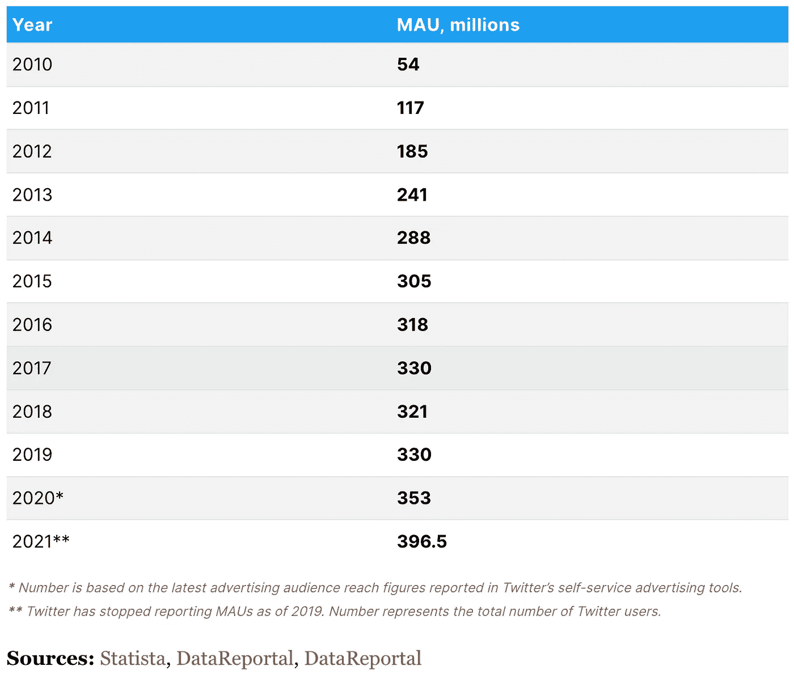
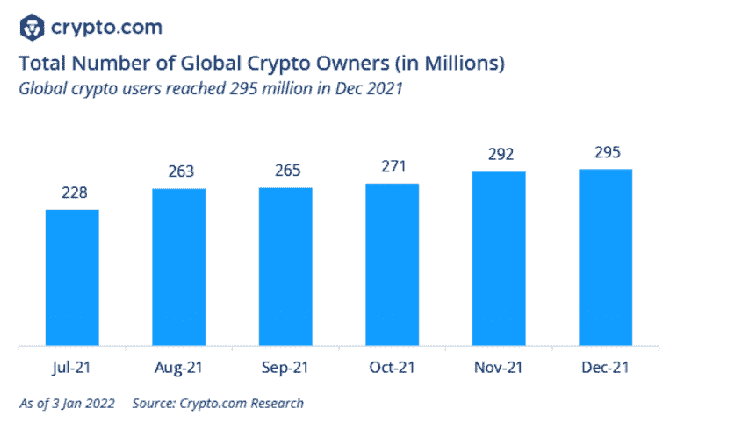

# 埃隆·马斯克收购 Twitter 会对 Twitter 和 Crypto 产生怎样的影响？

> 原文：<https://medium.com/coinmonks/how-will-elon-musk-buying-twitter-affect-twitter-and-crypto-ea1d6a59a2e1?source=collection_archive---------25----------------------->

埃隆·马斯克(Elon Musk)成为 Twitter 的最大股东，斥资 29 亿美元收购了这家社交媒体公司 9.2%的股份。然后，他向美国证券交易委员会提交了一份正式报价，以 430 亿美元收购 Twitter，溢价 38%(Twitter 目前的市值约为 340 亿美元)。作为一名支持加密的企业家和梦想家，这对加密货币整体而言具有潜在的深远影响。请注意，所有这些都是假设的情况，只不过是可疑的推测。

重要的是要认识到，埃隆·马斯克这么做可能不是出于商业决策。Twitter 没有盈利，这可以从他们提交给 SEC 的文件中看出。因此，埃隆·马斯克有许多更好的金融投资可以做，他溢价收购 Twitter 的提议可能是一种更受意识形态驱动的行为。

许多加密迷认为，埃隆·马斯克可能会将分散到 Twitter 集中平台的加密货币元素带入其中。Twitter 主要用作传播信息和观点的平台。然而，由于 Twitter 是由政府控制下的中央公司运营的，Twitter 上的帖子受到少数人的监管。因此，Twitter 上的信息类型和信息发布方式由公司控制。Twitter 的结构将主要以盈利为目的。然而，这些都可以改变，无论是好是坏。

通过将加密货币集成到 Twitter 这样一个受欢迎的平台上，这将使 Twitter 和加密货币普遍受益。

不可否认的是，随着加密货币被整合到 Twitter 中(也许是作为一种支付方式或用加密支付小费)，加密行业将会有很大的增长。请注意，Twitter 拥有 3.3 亿月活跃用户，这比估计的 crypto 用户总数(根据 Crypto.com 的数据，约为 2.95 亿)还要多。因此，如果比特币、以太坊甚至 Dogecoin(埃隆的最爱)等加密货币越来越多地融入该平台，那么新用户的数量将是巨大的。

Twitter’s Total Users

Total Number of Global Crypto Owners

此外，Twitter 是最受欢迎的社交媒体平台之一，也是分享新闻和观点的最大平台之一。如果 Twitter 成为开源，任何人都可以对算法提出修改，如果得到社区的批准，就可以实施。这使得 Twitter 变得更加以用户为中心，社区可以控制新闻如何分发给用户。它可能会加速 Twitter 生态系统的发展，因为全世界聪明的头脑现在可以对 Twitter 做出积极的改变。

对言论自由的影响是一个争论更激烈的问题。一些人认为，如果 Twitter 不受利益驱动的公司和有政治议程的政府机构的影响，Twitter 上发布的信息将再次受到社区的驱动。新闻和观点变得不偏不倚，不受 Twitter 公司政治议程的影响，并允许用户表达自己的个人观点和意见。这种对加密货币至关重要的抗审查性质可能会吸引不同信仰和议程的人，给 Twitter 带来更多的言论自由。

这确实有一些优点。目前，信息监管由 Twitter 的董事会和员工决定。一小群人决定哪些信息应该被记录下来，哪些信息应该在 Twitter 上传播。正如保守派政治评论员本·夏皮罗(Ben Shapiro)指出的那样，这些不为社区所知的幕后决定允许对信息进行审查，并可能导致阴谋。相反，社区应该有权看到这些行动，并参与决定哪些信息应该允许存在，哪些信息应该删除。

此外，一些形式的信息需要读者掌握文化的细微差别和影射才能完全理解。这些形式的信息可能很容易被 Twitter 的监管机构或检测潜在违反 Twitter 行为准则的计算机算法误解。例如，如果有人用“杀死”这个词开玩笑，这条推文可能会被 Twitter 的算法标记出来，因为 Twitter 的算法没有经过检测细微差别和文化接触的训练。乍看起来似乎没有违反 Twitter 行为准则，但实际上具有针对和伤害不同人群的内涵的信息怎么办？如果这些信息被 Twitter 忽略，这将使 Twitter 成为危险信息传播的温床。

另一方面，由于 Twitter 的用户群来自各行各业，因此 Twitter 中的每个独特社区在处理关于该社区的信息方面都更有优势。对传统背景和细微差别的认识和理解需要多年的文化沉浸，而这对 Twitter 的监管机构来说可能并非如此。因此，机构群体参与监管 Twitter 上的信息是有好处的。

值得注意的推特暂停包括暂停妮琪·米娜的推特账户，因为其传播关于新冠肺炎疫苗的错误信息(暂停是否太严厉？).当然，许多人同意，许多人不同意这些暂停。但是谁有权利做出这个决定呢？一小群人谁可能是偏见和利润驱动，或社区谁正在使用该平台？因此，马斯克收购推特后，推特现有基础设施中缺乏透明度和社区控制的状况可以得到改变。

然而，重要的是不要过于乐观，要有一个更微妙的观点。在许多情况下，对内容进行高质量的监管不仅有益，而且对有效的言论自由也是必要的，推特可以说已经有了一支训练有素的专业团队来做到这一点。本质上，监管可能不会直接阻碍言论自由，而是在防止种族主义、骚扰、极端主义观点等“危险”言论的长期存在方面发挥着不可替代的作用。

此外，这些规定允许用户在发表意见时感到安全和受到保护。截至目前，推特已经允许了相当多的言论自由。那么，一个由社区决定什么是“安全”和什么是“不安全”的权力下放的推特，能在多大程度上继续为一个安全健康的言论自由环境提供基础设施呢？

不可否认，埃隆·马斯克(Elon Musk)试图将推特(Twitter)私有化，这是全球最大的新闻和观点平台之一，可能会对推特和密码货币产生巨大的后遗症。其中一些无疑将对加密和推特都有好处，而一些可能不像许多人希望的那样积极。无论如何，这一事件仍然表明了密码货币行业的快速增长，以及密码已经变得太大而不容忽视的事实。希望本文已经打破了关于这个事件与加密相关的一些争论点。请在下面分享您对此次活动的想法和看法。

> 加入 Coinmonks [电报频道](https://t.me/coincodecap)和 [Youtube 频道](https://www.youtube.com/c/coinmonks/videos)了解密码交易和投资

# 此外，请阅读

*   [如何在 FTX 交易所交易期货](https://coincodecap.com/ftx-futures-trading) | [OKEx vs 币安](https://coincodecap.com/okex-vs-binance)
*   [CoinLoan 评论](https://coincodecap.com/coinloan-review) | [YouHodler 评论](/coinmonks/youhodler-4-easy-ways-to-make-money-98969b9689f2) | [BlockFi 评论](https://coincodecap.com/blockfi-review)
*   [XT.COM 评论](https://coincodecap.com/profittradingapp-for-binance) | [币安评论](https://coincodecap.com/xt-com-review)
*   [SmithBot 评论](https://coincodecap.com/smithbot-review) | [4 款最佳免费开源交易机器人](https://coincodecap.com/free-open-source-trading-bots)
*   [比特币基地僵尸工具](/coinmonks/coinbase-bots-ac6359e897f3) | [AscendEX 审查](/coinmonks/ascendex-review-53e829cf75fa) | [OKEx 交易僵尸工具](/coinmonks/okex-trading-bots-234920f61e60)