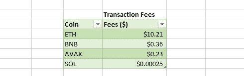
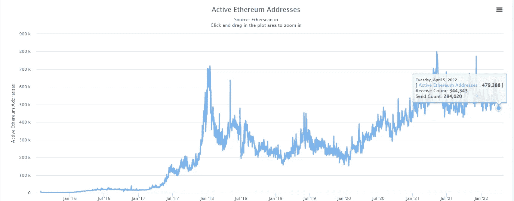
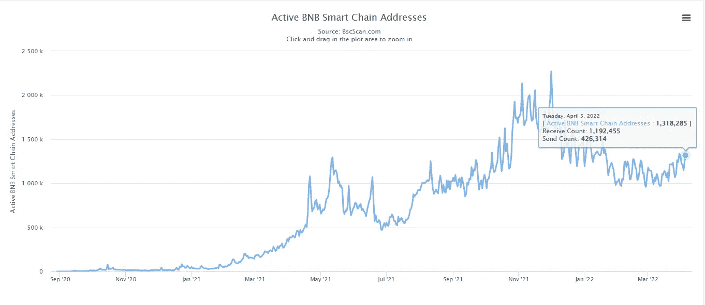

# L1 战争将如何收场？

> 原文：<https://medium.com/coinmonks/how-will-the-l1-wars-play-out-ca71c964f2de?source=collection_archive---------32----------------------->

自 2015 年推出以来，以太坊已经巩固了其作为智能合约平台创新的明确领导者的地位。以太坊的推出永远改变了加密领域。crypto 的早期主要是支付机制和货币。早期区块链技术和加密货币提供的关键价值主张是去中心化、自治的电子支付。早期的加密社区释放了区块链的惊人力量，但他们知道这一点没有得到充分利用。以太坊的创新，一个去中心化的智能合约平台永远改变了加密。

使用区块链技术，开发人员能够在以太坊区块链之上使用智能合约构建分散式应用程序(DAPPs)。Dapps 为以太坊用户提供了一个他们无法想象的全新实用世界。最终，以太坊为我们今天的密码世界铺平了道路。快进到现在，以太坊仍然是占主导地位的第一层智能合约平台。然而，它不是唯一的。有 10 多个备选智能合约平台在争夺以太坊的市场份额。未来 5 到 10 年，未来的智能合约格局是什么样的？让我们来看看现在发生了什么。

*免责声明:这是一篇观点文章*

**以太坊正在输掉 L1 战争？**

在未来的 5 到 10 年里，我认为我们将会看到以太坊的效用趋势更多地朝着价值储存的方向发展，而不仅仅是一个 L1。

从我的角度来看，我看到 ETH 社区重复这一协议最大化，就像比特币最大化主义者对 ETH 社区所做的一样。比特币马克西的以太坊立即名誉扫地。他们说，比特币显然是占主导地位的加密技术。看看发生了什么。

ETH 社区正在重复同样的群体偏见，除了它是针对任何 L1。在 alt L1 叙事开始起飞之前，以太坊是明确的头号。以太坊上发生了创新。最好的建造者建造了以太坊。如果你想成为新互联网的先驱，以太坊就能做到。

“创新只存在于以太坊”的说法如今已经不真实了。我认为公平的说法是，在 alt L1 上有更多的创新，然后是以太坊。

**新用户不再选择以太坊**

以太坊正在输掉增加新加密用户的战争。你主宰了过去，并不意味着你拥有未来。创新总是赢家。新用户正在选择 alt L1 的像币安智能链，露娜，雪崩，索拉纳，Fantom 等。这是为什么呢？高进入壁垒和低 Dapp 创新。

让我们从一个拥有 1000 美元的新加密用户的角度来看。如果他们想加入一个生态系统，他们会选择哪一个？市值更小、交易更快、费用更低的区块链？还是选择收费贵，交易慢的 OG 区块链？让我们看看每个区块链的平均交易费用:

拥有 1000 美元的新用户不会使用以太坊。除了交易费用之外，crypto 中一个常见的说法是“要早”。在新用户看来，以太坊已经取得了显著的收益。他们也想这样。他们被更小、更便宜、更创新的区块链所吸引。

人类倾向于两个方向之一:向前或向后。逆向思维倾向于选择“旧”的方式，因为它是经过验证的、安全的或者因为“每个人都已经在使用它”。前瞻性思维倾向于选择创新的、未知的、被认为比旧方式风险更大的未来。前瞻性的思考者、创新者和冒险者会得到回报。

**开发者跟随用户**

在 2019-2020 年末，以太坊是 Dapp 创新的枢纽。如果你没有建造以太坊，你就不会成功。所有 Dapp 的创新都发生在以太坊。所有最好的建造者都是在以太坊建造的。最重要的是，所有的用户都涌向以太坊。2021 年，我们看到了趋势的转变。

2021 年是 SolLunVax 年，也就是第一层季节。这些硬币以天文数字的速度膨胀，为这些用户带来了巨大的收益。这个时候以太坊非常拥挤。平均交易价格在 40-80 美元左右。对于小的新用户来说，这是不可持续的。他们开始涌向 alt L1 的。开发者需要用户使用他们的产品。他们也离开了。

饥饿的开发者涌向其他连锁店，想要证明些什么。他们需要的只是用户来使用他们的产品。有史以来第一次，创新发生在另类 L1，而不是以太坊。

露娜正在重写剧本。BSC 正在主导游戏领域。雪崩和索拉纳也在做他们的事情。

本(男子名)

***推特:*** *@ben_kaplan23*

**Tiktok:***@ crypto _ Kaplan*

***信标:****[beacons.ai/cryptokaplan](https://www.tiktok.com/link/v2?aid=1988&lang=en&scene=bio_url&target=http%3A%2F%2Fbeacons.ai%2Fcryptokaplan)*

> *加入 Coinmonks [电报频道](https://t.me/coincodecap)和 [Youtube 频道](https://www.youtube.com/c/coinmonks/videos)了解加密交易和投资*

# *另外，阅读*

*   *[密码本交易平台](/coinmonks/top-10-crypto-copy-trading-platforms-for-beginners-d0c37c7d698c) | [Coinmama 审核](/coinmonks/coinmama-review-ace5641bde6e)*
*   *[印度加密交易所](/coinmonks/bitcoin-exchange-in-india-7f1fe79715c9) | [比特币储蓄账户](/coinmonks/bitcoin-savings-account-e65b13f92451)*
*   *[OKEx vs KuCoin](https://coincodecap.com/okex-kucoin) | [摄氏替代品](https://coincodecap.com/celsius-alternatives) | [如何购买 VeChain](https://coincodecap.com/buy-vechain)*
*   *[币安期货交易](https://coincodecap.com/binance-futures-trading)|[3 comas vs Mudrex vs eToro](https://coincodecap.com/mudrex-3commas-etoro)*
*   *[如何购买 Monero](https://coincodecap.com/buy-monero) | [IDEX 评论](https://coincodecap.com/idex-review) | [BitKan 交易机器人](https://coincodecap.com/bitkan-trading-bot)*