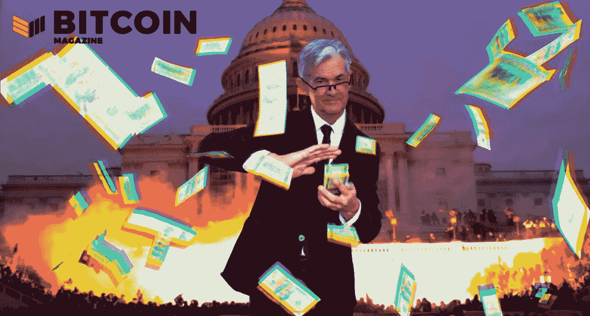

# 最新的鲍威尔支点将如何影响比特币？

> 原文：<https://medium.com/coinmonks/how-will-the-latest-powell-pivot-impact-bitcoin-4302020241d3?source=collection_archive---------15----------------------->

讨论宏观经济趋势及其对比特币的影响，包括杰罗姆·鲍威尔的最新支点、美国的紧缩政策和哈萨克斯坦的冲突。

**听这一集:**

*   [苹果](https://podcasts.apple.com/de/podcast/the-powell-pivot-ft-dylan-leclair-fed-77/id1543640492?i=1000548375330)
*   [Spotify](https://open.spotify.com/episode/7JSYduSIGR7r3ji6bYWVI1?si=4271451ef783459d)
*   [谷歌](https://podcasts.google.com/feed/aHR0cHM6Ly9mZWR3YXRjaC5saWJzeW4uY29tL3Jzcw/episode/YmEwYjgzYWUtYzE3NS00YjNlLTlkOWQtNTFhOWY5NzQ0YjMy?sa=X&ved=0CAgQuIEEahcKEwjYxcqm_7_1AhUAAAAAHQAAAAAQLA)
*   [Libsyn](https://fedwatch.libsyn.com/the-powell-pivot-ft-dylan-leclair-fed-77)
*   [阴天](https://overcast.fm/+m2acPUM10)

在这一集的*比特币杂志*的“美联储观察”播客中，我和 Christian Keroles 与 Dylan LeClair 坐下来谈论所有美联储新闻、加息、资产负债表正常化(QT)、美国政府紧缩和世界新闻。勒克莱尔是《比特币》杂志的市场研究负责人，并制作了《深度潜水》,这是一系列每日、每月和每年更新的比特币市场时事通讯。我们喜欢听他讲述我们在节目中谈论的许多央行话题。

# 12 月 FOMC 会议纪要和鲍威尔支点

我们从 12 月开始直接进入联邦公开市场委员会(FOMC)，我们想在上周的节目中报道，但 YouTube 有其他计划。分析师预计将会看到加速缩减甚至 2022 年开始加息的消息。他们得到的是一个巨大的鹰派惊喜。

不仅美联储董事会谈到了这些事情，其成员还表示，可能有必要加速加息，并开始资产负债表正常化。这是央行对量化紧缩(QT)的说法，与量化宽松(QE)相反。这出乎市场意料，引发了风险资产的温和抛售，甚至导致美国国债利率小幅飙升。

从 [FOMC 会议纪要](https://www.federalreserve.gov/monetarypolicy/fomcminutes20211215.htm):

> *“参与者普遍指出，鉴于他们对经济、劳动力市场和通胀的个人展望，可能有理由比参与者此前预期的更快或更快地提高联邦基金利率。*
> 
> “一些与会者还指出，在开始上调联邦基金利率后，相对较快地开始缩减美联储的资产负债表规模可能是合适的。”

2018 年至 2019 年，美联储主席杰罗姆·鲍威尔(Jerome Powell)也主持了货币政策的重大转折，当时是从紧缩到宽松。现在，在鲍威尔支点二中，他正在迅速从宽松的货币政策转向紧缩，甚至比 2019 年更快。

# 拜登将美联储描绘成鹰派，将政府描绘成鸽派

在 T2 的一次演讲中，拜登总统谈到了汽车价格上涨的解决方案。

他说:“要么通过制造更多的这种产品来增加供应，要么通过让美国人变得更穷来减少需求。”

政府试图做前者，他们的大规模支出法案没有通过国会。另一方面，美联储在过去四个月里完全改变了方向，可以被解释为追求后者，实行紧缩。

在播客中，我们讨论了这是政治定位的可能性，特别是它与鲍威尔的连任有多接近。几乎与此同时，当他获得连任后，他转变成了一名超级鹰派。

勒克莱尔问为什么鲍威尔甚至想要连任，毕竟这是一个可怕的工作。我的回答不会受到讨厌美联储的健全货币倡导者的欢迎，但我说这可能是因为他实际上是爱国的。他避开了任何 CBDC 和 ESG 倡议，与以欧洲央行(ECB)、国际货币基金组织(IMF)和欧盟为代表的达沃斯全球主义集团决裂。他为美国银行业利益服务，可能会认为另一个选择莱尔·布雷纳德会把美国出卖给全球主义者(他可能是对的)。

# 中国共产党意外降息和碧桂园

周一，CCP 人民银行[将其目标利率](https://www.cnbc.com/2022/01/17/china-cuts-rates-on-policy-loans-for-first-time-since-april-2020.html)下调 0.1%，从 2.95%降至 2.85%。就在几天前，中国最大的房地产开发商[碧桂园](https://www.taipeitimes.com/News/biz/archives/2022/01/17/2003771499)因缺乏买家而未能完成 3 亿美元的债券发行。

这是中国经济疲软的一个主要迹象，尽管 2021 年对美国的出口将增长 28%。中国经济仍在崩溃的房地产市场中挣扎，我们都知道你也许能够推迟崩溃，但你永远无法避免它。

几年来，碧桂园一直是中国最大的房地产开发商，为了应对房地产崩盘，让人们看到它的健康状况非常重要。现在，碧桂园可能被视为压垮骆驼的最后一根稻草。

没有中国，全球经济将被迫紧缩和调整。一些新兴市场将受益，而另一些将被彻底摧毁。这将引导我们进入最后的主题。

# IMF 对新兴市场、哈萨克斯坦和汤加的警告

在节目的最后，随着我们在直播中的时间越来越少，我们很快报道了哈萨克斯坦的事件。当然，在 2021 年的镇压后，许多人逃离中国后，那里有很多比特币矿。他们出人意料地走进了一个可能继续被战争撕裂的地区棋盘。

从宏观角度来看，石油生产可能是这场短暂冲突的最大后果。哈萨克斯坦的大部分石油和天然气被雪佛龙和壳牌等西方公司控制。如果名义上受俄罗斯控制，俄罗斯会对其实施制裁吗？如果是这样，每天 100 万桶的石油可能不再进入市场，导致价格上涨加剧。

在国际货币基金组织的一篇[博客文章](https://www.reuters.com/markets/us/imf-says-emerging-economies-must-prepare-fed-policy-tightening-2022-01-10/)中，它警告新兴市场，美联储转向紧缩政策可能会极大地影响新兴市场及其货币。我们在节目中多次谈到这一点，随着美元走强，这些新兴市场将陷入困境，尤其是它们在地理上离美国越远。

最后，坏消息是，汤加周末受到火山爆发的严重影响。我们在节目中谈到了这一点，并从[那里得到了一个链接，我们相信这个来源可以让人们捐款](https://twitter.com/LordFusitua/status/1483220081375002624)。在上一集里，我们谈到汤加今年可能会采用比特币，本周我们又有了新的消息。

我们祝愿汤加人民一切顺利，早日康复。

*原载于 2022 年 1 月 20 日*[*【https://bitcoinmagazine.com】*](https://bitcoinmagazine.com/markets/how-will-the-latest-powell-pivot-impact-bitcoin)*。*

> *加入 Coinmonks* [*电报频道*](https://t.me/coincodecap) *和* [*Youtube 频道*](https://www.youtube.com/c/coinmonks/videos) *了解加密交易和投资*

# 另外，阅读

*   [Bookmap 评论](https://coincodecap.com/bookmap-review-2021-best-trading-software) | [美国 5 大最佳加密交易所](https://coincodecap.com/crypto-exchange-usa)
*   最佳加密[硬件钱包](/coinmonks/hardware-wallets-dfa1211730c6) | [Bitbns 评论](/coinmonks/bitbns-review-38256a07e161)
*   [新加坡十大最佳加密交易所](https://coincodecap.com/crypto-exchange-in-singapore) | [购买 AXS](https://coincodecap.com/buy-axs-token)
*   [红狗赌场评论](https://coincodecap.com/red-dog-casino-review) | [Swyftx 评论](https://coincodecap.com/swyftx-review) | [CoinGate 评论](https://coincodecap.com/coingate-review)
*   [投资印度的最佳密码](https://coincodecap.com/best-crypto-to-invest-in-india-in-2021)|[WazirX P2P](https://coincodecap.com/wazirx-p2p)|[Hi Dollar Review](https://coincodecap.com/hi-dollar-review)